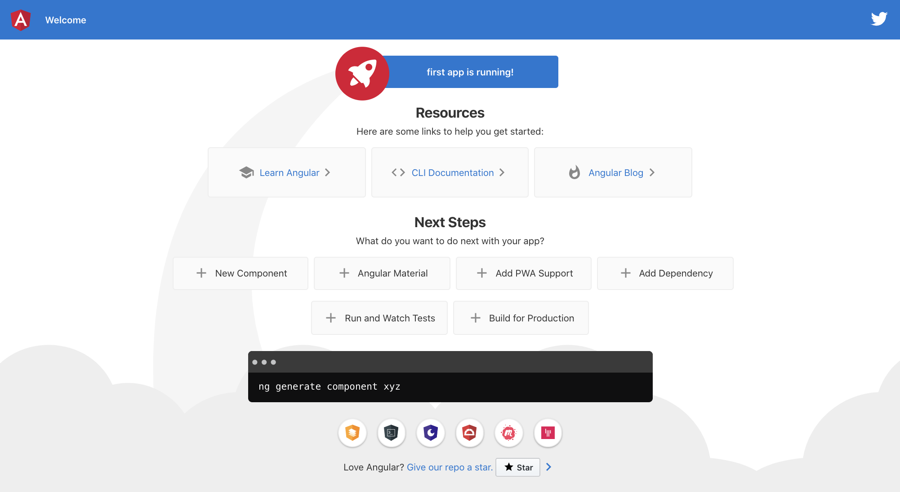
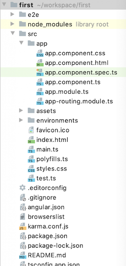
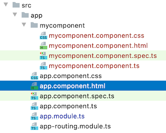
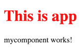
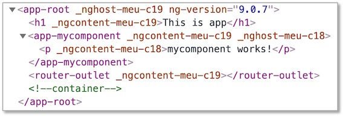

# Angular

[Angular](https://angular.io/) gehört neben [React.js](https://reactjs.org/) und [Vue.js](https://vuejs.org/) zu den meisteverwendeten Frameworks für die Entwicklung sogenannter *Single-Page-Applikationen*. In einer Single-Page-Applikation wird eine Seite vom Webserver geladen und diese Seite durch unterschiedliche Inhalte befüllt, je nach Nutzerinteraktion. Diese Inhalte werden in Angular durch sogenannte *Komponenten* bereitsgestellt. Komponenten sind die Grundbausteine einer Angular-Anwendung. 

Das erste Release von Angular erschien 2010 (damals noch unter dem Namen AngularJS, ab Version 2 nur noch Angular). React und Vue kamen 2013 bzw. 2014 erstmalig heraus. Angular wird hauptsächlich von Google, React hauptsächlich von Facebook und Vue als Community-Version entwickelt. Alle drei Frameworks stehen unter [MIT-Lizent](https://opensource.org/licenses/MIT).

Neben HTML und CSS verwendet Angular [TypeScript](https://www.typescriptlang.org/). TypeScript ist eine Obermenge von JavaScript. Das bedeutet, dass jeder JavaScript-Code auch TypeScript ist, aber nicht umgekehrt. TypeScript-Code wird compiliert und erzeugt JavaScript-Code, der vom Browser ausgeführt werden kann. Im Gegensatz zu JavaScript ist TypeScript typsicher und klar objektorientiert.  

## Erstes Projekt erstellen

Eine Angularanwendung besteht hauptsächlich aus Komponenten und
Services. Um die Anwendung selbst sowie Komponenten und Services
zu erstellen, wird am besten das [Command Line Interface for
Angular (Angular CLI)](https://cli.angular.io/) verwendet.
Öffnen Sie ein Terminal (Windows-Nutzerinnen sollten die
[Git-Bash](https://gitforwindows.org/) verwenden, die Sie
bereits mit Git installiert haben). Wechseln Sie im Terminal
in das Verzeichnis, das Ihre Projekte enthalten soll. Für das
Wechseln in andere Verzeichnisse nutzen Sie den
``cd`` Befehl (change directory). Um die Anwendung
**"first"** zu erzeugen, geben Sie folgenden Befehl in das
Terminal ein:

```
ng new first
```

``ng`` steht für Angular. Mit dem Attribut ``new`` geben Sie an,
dass Sie ein neues Projekt erzeugen wollen. ``first`` ist der
Name des Projektes. Wenn Sie gefragt werden, ob Sie **Angular routing**
verwenden möchten, geben Sie ein `y` ein. Wenn Sie nach dem **stylesheet
format** gefragt werden, können Sie `CSS` einfach mit `Enter` bestätigen.

Wenn alles geklappt hat, erhalten Sie im Terminal eine Ausgabe in der Form:


Es entsteht ein Ordner `first` in Ihrem Projekte-Verzeichnis. Wechseln Sie
in dieses Verzeichnis:

```
cd first
```

Führen Sie darin den Befehl:

```
npm install
```

aus. Damit werden alle Abhängigkeiten, die in der Datei **package.json**
definiert sind, geladen und das **node_modules**-Verzeichnis erstellt.
Siehe z.B. [hier](https://www.stackchief.com/tutorials/npm%20install%20%7C%20how%20it%20works).
Danach geben Sie

```
ng serve
```

ein. Es werden die entsprechenden TypeScript-Dateien compiliert und es
erscheint am Ende eine Ausgabe, wie z.B.

```
** Angular Live Development Server is listening on localhost:4200, open your browser on http://localhost:4200/ **
:Compiled successfully.
```

Öffnen Sie Ihren Browser und geben Sie als URL

```
http://localhost:4200
```

ein. Folgende Seite sollte erscheinen:</p>



!!! success
    Fertig! Sie haben Ihr erstes Angular-Projekt erstellt.


## Angular-Projektstruktur

Öffnen Sie die IDE Ihrer Wahl (Screenshots hier mit [PhpStorm]
(https://www.jetbrains.com/de-de/phpstorm/). Wählen Sie unter
`Open Project` den Projektordner `first`. Klappen Sie das Projekt
`first` auf, klappen Sie den Ordner `src` und dann den Ordner
`app` auf. Der Projektexplorer zeigt folgendes Bild:



- Die meiste Arbeit wird im `src`-Ordner erledigt. Darin befindet sich (wird sich befinden) der Code unserer Anwendung.
- Darin der wichtigste Ordner ist der `app`-Ordner.
Hier werden wir unsere Module, Komponenten und Services hinzufügen.  
- In dem `assets`-Ordner werden Bilder, Icons und Daten abgelegt.
- Der `node_modules`-Ordner enthält alle benötigten
3rd-party-libraries. Welche das sind, wird in der Datei
`package.json` als *dependencies* definiert.
Mithilfe des Befehls `npm install `werden alle benötigten
Module dem Ordner `node_modules` hinzugefügt.
- Der Ordner `environments` enthält die notwendigen
Konfigurationsinformationen für den *development*- und den
*production*-Modus. Wir entwickeln zunächst im
*development*-Modus.
- `favicon.ico`ist das Favicon - ein kleines Icon, das im
Reiter erscheint. Wählen Sie am besten ein eigenes.
- `index.html` ist die Hauptseite. Mithilfe von Angular
entwickeln wir eine *Single Page Application*, d.h. es wird
eine einzige HTML-Seite geladen (index.html) und jeder weitere Inhalt
wird asynchron hinzugefügt.
- `styles.css` enthält die globalen Stylesheets, d.h.
die CSS-Eigenschaften, die für das gesamte Projekt gelten sollen.
- Die `app.component.\*`-Dateien beschreiben die
app-Komponente. Eine Komponente besteht aus einer *HTML*-, einer
*CSS*- und einer *TypeScript*-Datei (auch noch
eine \*.`spec.ts`, aber die interessiert zunächst nicht).

Öffnen Sie in Ihrer IDE die Datei `app.component.html`. Löschen
Sie den kompletten Inhalt und lassen nur noch
**`<router-outlet></router-outlet>`**.
Fügen Sie oberhalb von **`<router-outlet></router-outlet>`**
die Zeile **`<h1>This is app</h1>`** ein. Gehen Sie wieder zum
Browser und schauen sich den geöffneten Tab mit der URL `localhost:4200` an.
Es erscheint der folgende Inhalt:


Öffnen Sie die `app.component.css`-Datei und geben Sie dort

```CSS
h1 {
  color: red;
}
```

Nach den Änderungen in `app.component.css` erscheint der Text der Überschrift in rot:


!!! success "Zusammenfassung"
    Wir haben die die `app.component.html` geändert, um den
    Inhalt der dargestellten Seite anzupassen und die
    `app.component.css`, um Änderungen an der Darstellung
    (dem Stil) des Inhalts durchzuführen.</p>

## Komponenten

Eine Angular-Anwendung besteht hauptsächlich aus *Komponenten*. Jede Anwendung hat eine Hauptkomponente - die sogenannte Root Component. Diese Hauptkomponente ist meistens die **AppComponent**. Eine Komponente hat eine in sich geschlossene Bedeutung, z.B. ein Formular für Dateneingabe, eine Liste aller Daten oder auch nur ein bestimmtes Element.

Eine Komponente besteht aus einer *View* (*Template*) und einer TypeScript-Klasse. Die AppComponent besteht z.B. aus der **app.component.html** (der View) und der **app.component.ts** (der TypeScript-Klasse). Die TypeScript-Klasse kümmert sich um die Verwaltung der Daten, die in der View dargestellt und/oder durch Eingaben erzeugt werden. Die TypeScript-Klasse beschreibt die *Logik* der Komponente. Die View ist der dargestellte Bereich der Komponente, also das, was man im Browser von der Komponente sieht.

Neben der <strong>\*.html</strong>- und der <strong>\*.ts</strong>-Datei einer Komponente gibt es auch noch die <strong>\*.css</strong>-Datei (also z.B. **app.component.css**). Diese enthält CSS-Eigenschaften, die speziell für die Komponente gelten sollen.

Um eine Komponente der gesamten Anwendung als Komponente bekannt zu machen, wird der *Decorator* `@Component`verwendet. Decoratoren erkennt man am führenden `@`-Zeichen. Sie werden verwendet, um Metadaten der Anwendung zu verwalten. Der typische Aufbau einer Komponente (hier `AppComponent` - `app.component.ts`):

```javascript
@Component({
  selector: 'app-root',
  templateUrl: './app.component.html',
  styleUrls: ['./app.component.css']
})
export class AppComponent {
  title = 'book-app';
}
```

Der Selektor gibt an, dass überall dort, wo `app-root` als Elementselektor `<app-root> </app-root>` verwendet wird, das in `app.component.html` definerte Template eingesetzt wird. Angenommen, in `app.component.html` ist der HTML-Code:

```html
<h1>This is app</h1>
```

definiert. Dann wird dieser Code als Inhalt in das HTML-Element `<app-root> </app-root>` eingesetzt:

```html
<app-root>
  <h1>This is app</h1>
</app-root>
```

Wir schauen uns ein ausführlicheres Beispiel im folgenden an, in dem wir eine neue Komponente erzeugen.


## Eine neue Komponente erzeugen 

Mithilfe von [Angular-CLI](https://cli.angular.io/) erzeugen wir in unserer App `first` eine neue Komponente. Wir wechseln dazu im Terminal in den Ordner von `first` und geben dann

```
ng generate component mycomponent
```

ein. Später kürzen wir solche Eingaben ab. Anstelle von `generate` brauchen wir auch nur `g` zu schreiben. Und anstelle von `component` genügt `c`. Das heißt, wir hätten stattdessen auch 

```
ng g c mycomponent
```

schreiben können. In unserer `first` App gibt es nun die Komponente `mycomponent`:

 

Doppelklicken Sie im Projektexplorer Ihrer IDE auf die Datei `mycomponent.component.ts`, um sie zu öffnen. Sie enthält den folgenden Quelltext:

```javascript
import { Component, OnInit } from '@angular/core';

@Component({
  selector: 'app-mycomponent',
  templateUrl: './mycomponent.component.html',
  styleUrls: ['./mycomponent.component.css']
})
export class MycomponentComponent implements OnInit {

  constructor() { }

  ngOnInit(): void {
  }

}
```

Wir ändern diese Datei zunächst nicht und öffnen auch noch die `mycomponent.component.html`. Diese enthält nur ein HTML-Element, einen Absatz:

```html
<p>mycomponent works!</p>
```

Wir ändern auch diese Datei zunächst nicht und öffnen die `app.component.html` - die HTML-Datei unserer Root-Komponente. Diese sieht derzeit so aus:

```html
<h1>This is app</h1>
<router-outlet></router-outlet>
```

Wir fügen in die Datei den Selektor `app-mycomponent` unserer neuen `Mycomponent`-Komponente als HTML-Element ein:

```html
<h1>This is app</h1>
<app-mycomponent></app-mycomponent> <!-- eingefuegt -->
<router-outlet></router-outlet>
```

Dieses Element dient als "Platzhalter" für das Template unserer neuen Komponente. Das bedeutet, dass in dieses Element der HTML-Code aus `mycomponent.component.html` eingefügt wird. Wechseln Sie in den Browser auf den Tab mit Ihrer Anwendung (http://localhost:4200/). Sie sehen folgendes Bild:



Unterhalb der Überschrift (`<h1>This is app</h1>`) wurde also der Absatz `<p>mycomponent works!</p>` eingefügt. Wenn Sie sich den Quelltext Ihrer Seite anschauen, z.B. über die Entwicklertools Ihres Browsers ([z.B. für Chrome](https://blog.kulturbanause.de/2018/03/die-chrome-entwicklertools-devtools-fuer-designer-und-einsteiger/)), dann wird folgender Code sichtbar:



Wir können hier die Attribute der HTML-Elemente vernachlässigen (also z.B. `_nghost-menu-c19` oder `ng-version=\"9.0.7"`). Aber es wird folgende HTML-Struktur sichtbar:

```html
<app-root>
  <h1>This is app</h1>
  <app-mycomponent>
    <p>mycomponent works!</p>
  </app-mycomponent>
  <router-outlet></router-outlet>
</app-root>
```

  


