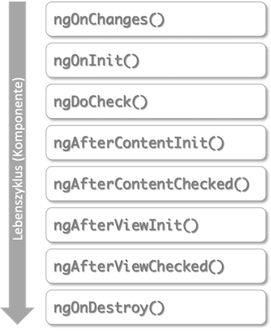

# Angular

[Angular](https://angular.io/) gehört neben [React.js](https://reactjs.org/) und [Vue.js](https://vuejs.org/) zu den meisteverwendeten Frameworks für die Entwicklung sogenannter *Single-Page-Applikationen*. In einer Single-Page-Applikation wird eine Seite vom Webserver geladen und diese Seite durch unterschiedliche Inhalte befüllt, je nach Nutzerinteraktion. Diese Inhalte werden in Angular durch sogenannte *Komponenten* bereitsgestellt. Komponenten sind die Grundbausteine einer Angular-Anwendung. 

Das erste Release von Angular erschien 2010 (damals noch unter dem Namen AngularJS, ab Version 2 nur noch Angular). React und Vue kamen 2013 bzw. 2014 erstmalig heraus. Angular wird hauptsächlich von Google, React hauptsächlich von Facebook und Vue als Community-Version entwickelt. Alle drei Frameworks stehen unter [MIT-Lizent](https://opensource.org/licenses/MIT).

Neben HTML und CSS verwendet Angular [TypeScript](https://www.typescriptlang.org/). TypeScript ist eine Obermenge von JavaScript. Das bedeutet, dass jeder JavaScript-Code auch TypeScript ist, aber nicht umgekehrt. TypeScript-Code wird compiliert und erzeugt JavaScript-Code, der vom Browser ausgeführt werden kann. Im Gegensatz zu JavaScript ist TypeScript typsicher und klar objektorientiert.  

## Erstes Projekt erstellen

Eine Angularanwendung besteht hauptsächlich aus Komponenten und
Services. Um die Anwendung selbst sowie Komponenten und Services
zu erstellen, wird am besten das [Command Line Interface for
Angular (Angular CLI)](https://cli.angular.io/) verwendet.
Öffnen Sie ein Terminal (Windows-Nutzerinnen sollten die
[Git-Bash](https://gitforwindows.org/) verwenden, die Sie
bereits mit Git installiert haben). Wechseln Sie im Terminal
in das Verzeichnis, das Ihre Projekte enthalten soll. Für das
Wechseln in andere Verzeichnisse nutzen Sie den
``cd`` Befehl (change directory). Um die Anwendung
**"first"** zu erzeugen, geben Sie folgenden Befehl in das
Terminal ein:

```
ng new first
```

``ng`` steht für Angular. Mit dem Attribut ``new`` geben Sie an,
dass Sie ein neues Projekt erzeugen wollen. ``first`` ist der
Name des Projektes. Wenn Sie gefragt werden, ob Sie **Angular routing**
verwenden möchten, geben Sie ein `y` ein. Wenn Sie nach dem **stylesheet
format** gefragt werden, können Sie `CSS` einfach mit `Enter` bestätigen.

Wenn alles geklappt hat, erhalten Sie im Terminal eine Ausgabe in der Form:


Es entsteht ein Ordner `first` in Ihrem Projekte-Verzeichnis. Wechseln Sie
in dieses Verzeichnis:

```
cd first
```

Führen Sie darin den Befehl:

```
npm install
```

aus. Damit werden alle Abhängigkeiten, die in der Datei **package.json**
definiert sind, geladen und das **node_modules**-Verzeichnis erstellt.
Siehe z.B. [hier](https://www.stackchief.com/tutorials/npm%20install%20%7C%20how%20it%20works).
Danach geben Sie

```
ng serve
```

ein. Es werden die entsprechenden TypeScript-Dateien compiliert und es
erscheint am Ende eine Ausgabe, wie z.B.

```
** Angular Live Development Server is listening on localhost:4200, open your browser on http://localhost:4200/ **
:Compiled successfully.
```

Öffnen Sie Ihren Browser und geben Sie als URL

```
http://localhost:4200
```

ein. Folgende Seite sollte erscheinen:


!!! success
    Fertig! Sie haben Ihr erstes Angular-Projekt erstellt.


## Angular-Projektstruktur

Öffnen Sie die IDE Ihrer Wahl (Screenshots hier mit [PhpStorm]
(https://www.jetbrains.com/de-de/phpstorm/). Wählen Sie unter
`Open Project` den Projektordner `first`. Klappen Sie das Projekt
`first` auf, klappen Sie den Ordner `src` und dann den Ordner
`app` auf. Der Projektexplorer zeigt folgendes Bild:


- Die meiste Arbeit wird im `src`-Ordner erledigt. Darin befindet sich (wird sich befinden) der Code unserer Anwendung.
- Darin der wichtigste Ordner ist der `app`-Ordner.
Hier werden wir unsere Module, Komponenten und Services hinzufügen.  
- In dem `assets`-Ordner werden Bilder, Icons und Daten abgelegt.
- Der `node_modules`-Ordner enthält alle benötigten
3rd-party-libraries. Welche das sind, wird in der Datei
`package.json` als *dependencies* definiert.
Mithilfe des Befehls `npm install `werden alle benötigten
Module dem Ordner `node_modules` hinzugefügt.
- Der Ordner `environments` enthält die notwendigen
Konfigurationsinformationen für den *development*- und den
*production*-Modus. Wir entwickeln zunächst im
*development*-Modus.
- `favicon.ico`ist das Favicon - ein kleines Icon, das im
Reiter erscheint. Wählen Sie am besten ein eigenes.
- `index.html` ist die Hauptseite. Mithilfe von Angular
entwickeln wir eine *Single Page Application*, d.h. es wird
eine einzige HTML-Seite geladen (`index.html`) und jeder weitere Inhalt
wird asynchron hinzugefügt.
- `styles.css` enthält die globalen Stylesheets, d.h.
die CSS-Eigenschaften, die für das gesamte Projekt gelten sollen.
- Die `app.component.*`-Dateien beschreiben die
app-Komponente. Eine Komponente besteht aus einer *HTML*-, einer
*CSS*- und einer *TypeScript*-Datei (auch noch
eine `*.spec.ts`, aber die interessiert zunächst nicht).


Öffnen Sie in Ihrer IDE die Datei `app.component.html`. Löschen
Sie den kompletten Inhalt und lassen nur noch
**`<router-outlet></router-outlet>`**.
Fügen Sie oberhalb von **`<router-outlet></router-outlet>`**
die Zeile **`<h1>This is app</h1>`** ein. Gehen Sie wieder zum
Browser und schauen sich den geöffneten Tab mit der URL `localhost:4200` an.
Es erscheint der folgende Inhalt:


Öffnen Sie die `app.component.css`-Datei und geben Sie dort

```CSS
h1 {
  color: red;
}
```

Nach den Änderungen in `app.component.css` erscheint der Text der Überschrift in rot:


!!! success "Zusammenfassung"
    Wir haben die die `app.component.html` geändert, um den
    Inhalt der dargestellten Seite anzupassen und die
    `app.component.css`, um Änderungen an der Darstellung
    (dem Stil) des Inhalts durchzuführen.

## Komponenten

Eine Angular-Anwendung besteht hauptsächlich aus *Komponenten*. Jede Anwendung hat eine Hauptkomponente - die sogenannte Root Component. Diese Hauptkomponente ist meistens die **AppComponent**. Eine Komponente hat eine in sich geschlossene Bedeutung, z.B. ein Formular für Dateneingabe, eine Liste aller Daten oder auch nur ein bestimmtes Element.

Eine Komponente besteht aus einer *View* (*Template*) und einer TypeScript-Klasse. Die AppComponent besteht z.B. aus der **app.component.html** (der View) und der **app.component.ts** (der TypeScript-Klasse). Die TypeScript-Klasse kümmert sich um die Verwaltung der Daten, die in der View dargestellt und/oder durch Eingaben erzeugt werden. Die TypeScript-Klasse beschreibt die *Logik* der Komponente. Die View ist der dargestellte Bereich der Komponente, also das, was man im Browser von der Komponente sieht.

Neben der <strong>\*.html</strong>- und der <strong>\*.ts</strong>-Datei einer Komponente gibt es auch noch die <strong>\*.css</strong>-Datei (also z.B. **app.component.css**). Diese enthält CSS-Eigenschaften, die speziell für die Komponente gelten sollen.

Um eine Komponente der gesamten Anwendung als Komponente bekannt zu machen, wird der *Decorator* `@Component`verwendet. Decoratoren erkennt man am führenden `@`-Zeichen. Sie werden verwendet, um Metadaten der Anwendung zu verwalten. Der typische Aufbau einer Komponente (hier `AppComponent` - `app.component.ts`):

```javascript
@Component({
  selector: 'app-root',
  templateUrl: './app.component.html',
  styleUrls: ['./app.component.css']
})
export class AppComponent {
  title = 'book-app';
}
```

Der Selektor gibt an, dass überall dort, wo `app-root` als Elementselektor `<app-root> </app-root>` verwendet wird, das in `app.component.html` definerte Template eingesetzt wird. Angenommen, in `app.component.html` ist der HTML-Code:

```html
<h1>This is app</h1>
```

definiert. Dann wird dieser Code als Inhalt in das HTML-Element `<app-root> </app-root>` eingesetzt:

```html
<app-root>
  <h1>This is app</h1>
</app-root>
```

Wir schauen uns ein ausführlicheres Beispiel im folgenden an, in dem wir eine neue Komponente erzeugen.


### Eine neue Komponente erzeugen 

Mithilfe von [Angular-CLI](https://cli.angular.io/) erzeugen wir in unserer App `first` eine neue Komponente. Wir wechseln dazu im Terminal in den Ordner von `first` und geben dann

```
ng generate component mycomponent
```

ein. Später kürzen wir solche Eingaben ab. Anstelle von `generate` brauchen wir auch nur `g` zu schreiben. Und anstelle von `component` genügt `c`. Das heißt, wir hätten stattdessen auch 

```
ng g c mycomponent
```

schreiben können. In unserer `first` App gibt es nun die Komponente `mycomponent`:

 

Jede Angular-Komponente besteht aus vier Teilen:

- der TypeScript-Klasse (die `*.component.ts`-Datei)
- dem Template  (die `*.component.html`-Datei)
- den Styles (die `*.component.css`-Datei)
- einer Testspezifikation (die `*.component.spec.ts`-Datei)

Jede Komponente wird in der `app.module.ts` der gesamten Anwendung bekannt gemacht. Das erfolgt mithilfe der Eigenschaft `declarations` im Decorator `@NgModule()`:

```javascript
import { BrowserModule } from '@angular/platform-browser';
import { NgModule } from '@angular/core';

import { AppRoutingModule } from './app-routing.module';
import { AppComponent } from './app.component';
import { MycomponentComponent } from './mycomponent/mycomponent.component';

@NgModule({
  declarations: [
    AppComponent,
    MycomponentComponent
  ],
  imports: [
    BrowserModule,
    AppRoutingModule
  ],
  providers: [],
  bootstrap: [AppComponent]
})
export class AppModule { }
```

Das obige Listing zeigt, dass die neue Komponente `Mycomponent` registriert wurde. Um dieses Eintragen in die `app.module.ts` müssen wir uns aber nicht kümmern, das erledigt die `Angular-CLI` mit der Anweisung zur Erstellung einer neuen Komponente `ng generate component newComponent`. 

Doppelklicken Sie im Projektexplorer Ihrer IDE auf die Datei `mycomponent.component.ts`, um sie zu öffnen. Sie enthält den folgenden Quelltext:

```javascript
import { Component, OnInit } from '@angular/core';

@Component({
  selector: 'app-mycomponent',
  templateUrl: './mycomponent.component.html',
  styleUrls: ['./mycomponent.component.css']
})
export class MycomponentComponent implements OnInit {

  constructor() { }

  ngOnInit(): void {
  }

}
```

Wir ändern diese Datei zunächst nicht und öffnen auch noch die `mycomponent.component.html`. Diese enthält nur ein HTML-Element, einen Absatz:

```html
<p>mycomponent works!</p>
```

Wir ändern auch diese Datei zunächst nicht und öffnen die `app.component.html` - die HTML-Datei unserer Root-Komponente. Diese sieht derzeit so aus:

```html
<h1>This is app</h1>
<router-outlet></router-outlet>
```

Wir fügen in die Datei den Selektor `app-mycomponent` unserer neuen `Mycomponent`-Komponente als HTML-Element ein:

```html
<h1>This is app</h1>
<app-mycomponent></app-mycomponent> <!-- eingefuegt -->
<router-outlet></router-outlet>
```

Dieses Element dient als "Platzhalter" für das Template unserer neuen Komponente. Das bedeutet, dass in dieses Element der HTML-Code aus `mycomponent.component.html` eingefügt wird. Wechseln Sie in den Browser auf den Tab mit Ihrer Anwendung (http://localhost:4200/). Sie sehen folgendes Bild:


Unterhalb der Überschrift (`<h1>This is app</h1>`) wurde also der Absatz `<p>mycomponent works!</p>` eingefügt. Wenn Sie sich den Quelltext Ihrer Seite anschauen, z.B. über die Entwicklertools Ihres Browsers ([z.B. für Chrome](https://blog.kulturbanause.de/2018/03/die-chrome-entwicklertools-devtools-fuer-designer-und-einsteiger/)), dann wird folgender Code sichtbar:


Wir können hier die Attribute der HTML-Elemente vernachlässigen (also z.B. `_nghost-menu-c19` oder `ng-version="9.0.7"`). Aber es wird folgende HTML-Struktur sichtbar:

```html
<app-root>
  <h1>This is app</h1>
  <app-mycomponent>
    <p>mycomponent works!</p>
  </app-mycomponent>
  <router-outlet></router-outlet>
</app-root>
```

Das Element `<app-root>` fungiert als Platzhalter für die gesamte App. In dieses Element wird der gesamte Inhalt der Anwendung eingebunden (siehe `app.component.html`). Dies ist hier zunächst eine Überschrift `<h1>`, die von dem Element für die `Mycomponent`-Komponente gefolgt wird. Das bedeutet, dass in das Element `<app-mycomponent>` der Inhalt der Komponente `Mycomponent` eingebunden wird. Das ist hier nur ein Absatz `<p>` (siehe dazu `mycomponent.component.html`). Das Element `router-outlet>` soll uns an dieser Stelle noch nicht interessieren. Das wird erst interessant, wenn wir über das *Routing* in einer Angular-Anwendung sprechen.  

### Direktiven

In Angular gibt es 3 Arten sogenannter *Direktiven* (engl. *Directives*):

- Komponentendirektiven (Components—directives) 
- Attributdirektiven (Attribute Directives)
- Strukturdirektiven (Structural-Direktives)

Komponentendirektiven sind die meistverwendete Art und bereits in [**Angular --> Kompnenten**](./#komponenten) betrachtet. Attribut- und Strukturdirektiven können als HTML-Attribute verstanden werden, die dem HTML-Element ein zusätzliches Verhalten hinzufügt. Attributdirektiven wirken sich das innere Verhalten eines HTML-Elementes aus (z.B. können damit CSS-Eigenschaften geändert, hinzugefügt oder gelöscht werden). Mit Strukturdirektiven kann die Struktur des DOMs geändert werden (z.B. können ganze HTML-Elemente dem DOM-Baum hinzugefügt werden).

#### \*Strukturdirektiven

Strukturdirektiven beginnen immer mit einem Stern `*`. Die bekanntesten Vertreter sind 

- `*ngFor` 
- `*ngIf`
- `*ngSwitch`

Diese sind auch in [angular.io](https://angular.io/guide/structural-directives) erläutert. Wir erläutern die darin aufgeführten Beispiele und beginnen mit `*ngIf`:

```html linenums="1"
<p *ngIf="true">
  Expression is true and ngIf is true.
  This paragraph is in the DOM.
</p>
<p *ngIf="false">
  Expression is false and ngIf is false.
  This paragraph is not in the DOM.
</p>
```

Die Direktive `*ngIf` wird also wie ein Attribut des `<p>`-Elementes behandelt. Das Attribut `*ngIf` hat entweder den Wert `"true"` oder den Wert `"false"`. Ja nach Wert des Attributes wird das jeweilige `<p>`-Element in den DOM-Baum eingebunden. Also entweder das `<p>`-Element aus den Codezeilen `1`-`4` (bei Wert `"true"`) oder das `<p>`-Element aus den Codezeilen `5`-`8` (bei Wert `"false"`). In einer echten Anwendung ergibt sich der Wert des Attributes/der Direktive meistens aus dem Wert einer boole'schen Variablen oder einem anderen boole'schen Ausdruck.

Das nicht dargestellte Element ist auch nicht Teil des DOMs! Es ist also nicht einfach nur auf `hide` gesetzt, sondern es ist gar nicht im DOM vorhanden. 

Intern wird aus der `*ngIf`-Direktive übrigens ein sogenanntes [*Property-Binding*](./#property-bindings):

```html
<ng-template [ngIf]="true">
  <p>
    Expression is true and ngIf is true.
    This paragraph is in the DOM.
  </p>
</ng-template>
<ng-template [ngIf]="false">
  <p>
    Expression is false and ngIf is false.
    This paragraph is not in the DOM.
  </p>
</ng-template>
```

Die `*ngFor`-Direktive ist etwas komplexer als `*ngIf`. Für `*ngFor` benötigen wir mindestens eine Liste (oder ein Array) und eine Laufvariable, die die Werte aus der Liste annehmen kann. Im folgenden Beispiel ist `i` unsere laufvariable und `[1, 2, 3, 4, 5, 6]` unser Array.

``` html
<div *ngFor="let i of [1, 2, 3, 4, 5, 6]">
  {{ i }}
</div>
``` 

Für jeden Wert aus der Liste wird ein eigenes `<div>`- Element erzeugt. Der DOM-Baum sieht für obiges Beispiel also wie folgt aus (Angular-Attribute weggelassen):

``` html
<div> 1 </div>
<div> 2 </div>
<div> 3 </div>
<div> 4 </div>
<div> 5 </div>
<div> 6 </div>
```

Außerdem stellt `*ngFor` noch einige Hilfsvariablen zur Verfügung, die ebenfalls genutzt werden können:

- `index` (Index des aktuellen Elementes `0, 1, 2, ... `)
- `first` (ist `true`, wenn *erstes* Element, sonst `false`)
- `last` (ist `true`, wenn *letztes* Element, sonst `false`)
- `even` (ist `true`, wenn *Index gerade*, sonst `false`)
- `odd` (ist `true`, wenn *Index ungerade*, sonst `false`)

Folgend ein komplexeres Beispiel unter Verwendung einiger Hilfsvariablen:

``` html linenums="1"
<div *ngFor="let value of [1, 2, 3, 4, 5, 6];
                 index as i;
                 first as f;
                 last as l;
                 odd as o;">
  <div *ngIf="f">Start</div>
  <div [style.color]="o ? 'red' : 'blue'">{{ i }} : {{ value }}</div>
  <div *ngIf="l">Ende</div>
</div>
```

In Zeile `1` ist unsere Laufvariable durch das Array nun `value`. Außerdem wird der jeweilige Wert von `index` in der Variablen `i` (Zeilennummer `2`)
gespeichert, der Wert von `first` in der Variablen `f`(Zeilennummer `3`), der Wert von `last` in der Variablen `l`(Zeilennummer `4`) und der Wert von `odd` in der Variablen `o`(Zeilennummer `5`) - die Hilfsvariable `even` betrachten wir hier nicht, da deren Wert genau der Negation von `odd` entspricht. In Zeile `6` wenden wir die `*ngIf`-Direktive an: ein `<div>` mit dem Inhalt `Start` wird vor dem ersten Element aus dem Array ausgegeben. Für jedes weitere Element nicht mehr. In Zeile `7` erfolgt ein *Property Binding*: die `color`-Eigenschaft bekommt einen Wert zugewiesen. Der Wert ist jedoch abhängig davon, ob `o` wahr ist (dann Wert `red`) oder falsch (dann Wert `blue`).   Zeile `7` zeigt außerdem wie mithilfe von *Interpolation* der Wert von `i` und der Wert von `value`, getrennt mit ` : ` ausgegeben werden. Die Ausgabe ist also:


!!! question "Aufgabe"
    Informieren Sie sich auch über die `*ngSwitch`-Direktive. Implementieren Sie ein Beispiel, in dem Sie die 3 Direktiven `*ngIf`, `*ngFor` und `*ngSwitch` anwenden. 


### {{ Interpolation }}

*Interpolation* ist die einfachste Form des *data binding*. Syntaktisch erkennt man Interpolation an den doppelten geschweiften Klammern `{{ Interpolation }}`. 

=== "Beispiel"
``` javascript linenums="1"
import { Component } from '@angular/core';

@Component({
  selector: 'app-lesson',
  template: `
    <h1>{{ headline }}</h1>
    <p>Hier steht {{name}}</p>
  `,
  styleUrls: ['./lesson.component.css']
})
export class LessonComponent {
  headline = 'Mein Titel';
  name = 'mein Name';
}
```

Im obigen Beispiel hat die Komponente `LessonComponent` zwei Eigenschaften: `headline` und `name`. In obiger Komponente wird (zur Anschauung) sogenanntes *inline templating* verwendet, d.h. es gibt keine eigene `lesson.component.html`-Datei, in der der HTML-Code steht, sondern der HTML-Code wird direkt in die `template`-Eigenschaft der Typescript-Datei `lesson.component.ts`eingefügt (siehe Zeilen 5-8 im obigen Beispiel). Der HTML-Code wird in *backticks* eingefasst (` `` `), nicht zu verwechseln mit den einfachen Anführungsstrichen (` '' `).

Damit inline templating möglich ist, wird die Komponente mit dem Flag `-t` erzeugt (`inlineTemplate=true`), d.h. unsere Lesson-Komponente wurde mithilfe der CLI wie folgt erzeugt:

```
ng g c lesson -t
```

Eine Interpolation kann auch Ausdrücke enthalten, die aufgelöst werden, z.B.

``` html
<p>1 + 2 = {{1 + 2}}.</p>
```

Man kann mithilfe einer Direktive durch ein Array laufen und jedes einzelne Element mithilfe von Interpolation ausgeben:

``` javascript
@Component({
  selector: 'app-lesson',
  template: `
    <ol>
      <li *ngFor="let day of weekdays">{{ day }}</li>
    </ol>
  `,
  styleUrls: ['./lesson.component.css']
})
export class LessonComponent {
  weekdays = ['Monday', 'Tuesday', 'Wednesday', 'Thursday', 'Friday', 'Saturday', 'Sunday'];
}
```

Oder es ist möglich, Attributen von HTML-Elementen mithilfe von Interpolation Werte zuzuordnen:

``` javascript
@Component({
  selector: 'app-lesson',
  template: `
    
  `,
  styleUrls: ['./lesson.component.css']
})
export class LessonComponent {
  imgUrl = 'https://www.dpunkt.de/common/images/cover_masterid/800/12400.jpg';
}
```

### [Property Bindings]

Insbesondere, wenn Attributen von HTML-Elementen Werte zugeordnet werden sollen (so wie im letzten Beispiel des Abschnitts [**{{Interpolation}}**](./#interpolation)), spricht man von *property binding*. Property binding spielt eine große Rolle beim Datenfluss von Eltern-Komponenten auf Kind-Komponenten. Die generelle Idee dabei ist, dass mithilfe von property binding Werte (Daten) an Attribute von HTML-Elementen bindet. Diese HTML-Elemente können auch Komponenten sein.

Wir betrachten zunächst die unterschiedlichen Arten (Notationen) von property binding:

``` html
<element [property]="ausdruck"></element>
```

D.h. ein *ausdruck* wird übergeben, der zu einem Wert aufgelöst wird und dieser Wert wird dem Attribut `property` übergeben. Betrachten wir nochmals das letzte Beispiel aus dem Abschnitt [**{{Interpolation}}**](./#interpolation)). Bei diesem Beispiel haben wir Interpolation verwendet, um dem Attribut `src` des HTML-Elementes `img` einen Wert zuzuweisen. Das exakt gleiche Verhalten lässt sich auch mittels *property bindings* erzeugen:

``` html


<!-- imgUrl = 'https://www.dpunkt.de/common/images/cover_masterid/800/12400.jpg'; -->
```

Neben diesen "allgemeinen" property bindings gibt es auch noch "spezielle" property bindings, nämlich *class bindings* und *style bindings*. Bei *class bindings* wird das Präfix `class` vor die property (die entsprechende CSS-Klasse) gesetzt:

``` html
<element [class.class1]="class1enabled"
         [class.class2]="class2enabled" ... ></element>
```

D.h. die CSS-Klasse `class1`ist genau dann wirksam, wenn der Ausdruck `class1enabled` true ist und `class2`ist genau dann wirksam, wenn der Ausdruck `class2enabled` true ist usw.

Bei den *style bindings* werden jedoch gar keine Ausdrücke, sondern Werte übergeben:

``` html
<element [style.color]
```


### (Event Bindings)

In den *property bindings* haben wir gesehen, wie Werte Attributen (Eigenschaften) von Elementen zugeordnet werden können. Aus JavaScript ist auch bekannt, dass Ereignisse Attribute von Elementen sein können, z.B. `onClick`, `onKeyup`, `onChange` usw. Dabei handelt es sich um sogenannte *native DOM-Ereignisse*. Neben der Möglichkeit, solche nativen DOM-Ereigniss zu behandeln, bietet Angular auch die Möglichkeit, eigene Ereignisse zu definieren und diese zu behandeln. Wir betrachten beide Möglichkeiten und beginnen mit den nativen Ereignissen.

#### Native DOM-Ereignisse

In HTML sieht das unter Aufruf einer JavaScript-Funktion für die Ereignisbahandlung dann typischerweise (hier das Click-Ereignis für einen Button) wie folgt aus:

=== "HTML"
    ``` html
    <button onClick="doSomething()">Click here!</button>
    ```
=== "JavaScript"
    ``` javascript
    function doSomething() 
    {
      // something to do
    }
    ```

In Angular ist das Prinzip das gleiche, nur dass das Ereignis in runden Klammern genannt und an dieses Ereignis die Ereignisbehandlung gebunden wird (*event binding*). Das bedeutet, das Angular-Template für das obige Beispiel sieht wie folgt aus:

=== "Angular-Template"
    ``` html
    <button (click)="doSomething()">Click here!</button>
    ```
=== "Angular-Typescript"
    ``` javascript
    export class EventsComponent {

       doSomething() {
          // something to do
       }
    }
    ```

Dieses Prinzip gilt für alle nativen DOM-Ereignisse. Hier ein kurzer Überblick über die wichtigsten (für eine umfangreichere Liste siehe [hier](https://developer.mozilla.org/en-US/docs/Web/Events#Standard_Events) oder [hier](https://www.w3schools.com/jsref/dom_obj_event.asp)):

| Ereignis        | Beschreibung                                       |
|-----------------|----------------------------------------------------|
| `click`         | Mausklick auf das Element                          |
| `change`        | Der Inhalt/Wert eines Elementes hat sich geändert  |
| `mouseover`     | die Maus wird über das Element bewegt              |
| `mouseout`      | die Maus wird vom Element wegbewegt                |
| `keydown`       | eine Taste der Tastatur wird gedrückt              |
| `keyup`         | Loslassen einer Taste                              |
| `load`          | der Browser hat die Seite vollständig geladen      |
| `focus`         | Fokussieren des Elements (z.B. Anklicken)          |
| `blur`          | Verlieren des Fokus (z.B. Klick außerhalb)         |
| `submit`        | Abschicken eines Formulars                         |
| `copy`, `paste` | Kopieren, Einfügen von Text                        |

Einen kleinen Unterschied gibt es noch bei der Übergabe des Ereignisses an die das Ereignis behandelnde Funktion zu beachten. Während in plain JavaScript das Ereignis mit `event` der Funktion übergeben wird, erfolgt die Übergabe des Ereignisses in Angular mit `$event`. Beispiel:

=== "Angular-Template"
    ``` html
    <input (change)="showPayload($event)" type="text" />
    ```
=== "Angular-Typescript"
    ``` javascript
    export class EventsComponent {

      showPayload(e: Event) {
        console.log(e);
      }
    }
    ```

Alle Events (in TypeScript/Angular) sind vom Typ `Event`. Es gibt noch speziellere Eventtypen, die aber alle auf dem Interface `Event` basieren, z.B. `MouseEvent`, `InputEvent`, `KeyboardEvent`, `UIEvent`, `ClipboardEvent`. Weitere Details siehe [hier](https://developer.mozilla.org/en-US/docs/Web/API/Event).

Die einfache JavaScript-Attributschreibweise kann in Angular nicht verwendet werden, sondern immer nur die *event binding*-Schreibweise von Angular (mit den runden Klammern)!


#### Eigene Ereignisse

Für eine Komponente kann ein eigenes - nicht natives - Ereignis definiert werden. Dies geschieht, indem für eine Komponente eine neue Eigenschaft (z.B. `myEvent`) definiert wird und diese vom Typ `EventEmitter` deklariert wird. Mithilfe von Generics kann der Typ des Events angegeben werden, der ausgelöst werden soll - wenn Sie den Typ nicht genau kennen, verwenden Sie `any`. Soll das Ereignis an die Elternkomponente weitergeleitet werden, was meistens der Fall ist, wird der Decorator `@Output()`verwendet. 
Das Auslösen des Events geschieht dann durch die `emit()`-Methode von `EventEmitter`. Hier ein typisches Beispiel (zunächst die Kindkomponente `EventsComponent` - also `events.component.html` und `events.component.ts`):

=== ".html"
    ``` html
    <button (click)="emitMyEvent()">Click here!</button>
    ```
=== ".ts"    
    ``` javascript linenums="1"
    import {Component, EventEmitter, Output} from '@angular/core';

    @Component({
      selector: 'app-events',
      templateUrl: './events.component.html',
      styleUrls: ['./events.component.css']
    })
    export class EventsComponent {
      @Output() myEvent = new EventEmitter<any>();

      emitMyEvent() {
        this.myEvent.emit();
      }

    }
    ``` 

Die `.html`-Datei definiert einen Button mit dem nativen Ereignis `click`. Dieses wird durch die Methode `emitMyEvent()` behandelt. 

In der `.ts`-Datei ist diese Methode definiert (Zeilen 11-13). Darin wird das eigene Event `myEvent` ausgelöst. Dieses Event ist ein Objekt vom Typ `EventEmitter`, typisiert als `any` (beliebiger Typ). Das Auslösen dieses Events wird an die aufrufende Komponente (die Elternkomponente) ausgegeben (Decorator `@Output()`). Deklaration der Eigenschaft und Dekorieren mit `@Output()` in Zeile 9. Das Auslösen des eigenen Events erfolgt durch den Aufruf der Methode `emit()` aus `EventEmitter` (Zeile 12).

In der Elternkomponente kann dieses Ereignis nun empfangen werden (Beispiel einer Elternkomponente `AppComponent` - also `app.component.html` und `app.component.ts`):

=== ".html"
    ``` html
    <app-events (myEvent)="handleEventFromEventsComponent()"></app-events>
    ```
=== ".ts"    
    ``` javascript linenums="1"
    import { Component } from '@angular/core';

    @Component({
      selector: 'app-root',
      templateUrl: './app.component.html',
      styleUrls: ['./app.component.css']
    })
    export class AppComponent {

      handleEventFromEventsComponent() {
        console.log('myEvent in der Kindkomponente ausgelöst');
      }

    }
    ``` 

In der `AppComponent` (das kann natürlich eine beliebige Komponente sein), wird die `EventsComponent` eingebunden (siehe `<app-events>` im Template der `AppComponent`). Dadurch entsteht die Hierarchie Elternkomponente `AppComponent` --> Kindkomponente `EventsComponent` im DOM. 

Mithilfe von *event binding* wird die Behandlung des Ereignisses `myEvent` an die Methode `handleEventFromEventsComponent()` gebunden. In dieser Methode erfolgt hier einfach nur eine Ausgabe auf die Konsole. 

Interessant ist, dass wir dadurch die Möglichkeit haben, Daten von der Kindkomponente zur Elternkomponente fließen zu lassen. Dazu übergeben wir diese Daten als `payload` des Ereignisses. Dafür typisieren wir `EventEmitter` mit dem Typ, von dem wir Daten übergeben wollen (z.B. `Book` - siehe [Bücher-App](../books/#event-binding)). Die beiden obigen Beispiele sehen dann wie folgt aus (zuerst wieder `EventsComponent`): 

=== ".html"
    ``` html
    <button (click)="emitMyEvent(book)">Click here!</button>
    ```
=== ".ts"    
    ``` javascript linenums="1"
    import {Component, EventEmitter, Output} from '@angular/core';

    @Component({
      selector: 'app-events',
      templateUrl: './events.component.html',
      styleUrls: ['./events.component.css']
    })
    export class EventsComponent {
      @Output() myEvent = new EventEmitter<Book>();

      emitMyEvent(book: Book) {
        this.myEvent.emit(book);
      }

    }
    ``` 

Im Template (HTML) werden die Daten der Ereignisbehandlung übergeben. Das `EventEmitter`-Objekt ist mit dem konkreten Datentyp typisiert. Bei Aufruf der Methode `emit()` werden die Daten an die Elternkomponente übergeben. 

Die Elternkomponente (hier wieder `AppComponent` kann diese Daten, die von der Kindkomponente an die Elternkomponente via Ereignis geflossen sind, nun weiterverarbeiten bzw. darstellen):

=== ".html"
    ``` html
    <app-events (myEvent)="handleEventFromEventsComponent($event)"></app-events>
    ```
=== ".ts"    
    ``` javascript linenums="1"
    import { Component } from '@angular/core';

    @Component({
      selector: 'app-root',
      templateUrl: './app.component.html',
      styleUrls: ['./app.component.css']
    })
    export class AppComponent {

      handleEventFromEventsComponent(book: Book) {
        console.log(book.title);
      }

    }
    ``` 

Wichtig beim *event binding* der Elternkomponente ist, dass der *payload* des Ereignisses mit `$event` übergeben wird (siehe auch [Native DOM-Ereignisse](./#native-dom-ereignisse)). 

!!! success "Zusammenfassung"
    In den letzten drei Abschnitten Interpolation, Property Binding und Event Binding haben wir uns mit Datenfluss beschäftigt. Interpolation wird verwendet, um innerhalb einer Komponente die in der TypeScript-Klasse definierten Daten im Template darzustellen. Mithilfe von Property Binding kann die aufrufende Komponente (Elternkomponente) der aufgerufenen Kopmponente (Kindkomponente) Daten übergeben. Mithilfe von Event Binding kann die Kindkomponente der Elternkomponente mithilfe eines eigenen Ereignisses Daten übergeben.
    Für die Anwendung dieser Konzepte schauen Sie sich [**Bücher-App-->Datenfluss zwischen Komponenten**](../books/#datenfluss-zwischen-komponenten) an. 


### [(Two-Way-Bindings)]

## Lifecycle-Hooks

Komponenten durchlaufen einen festen Lebenszyklus (*lifecycle*). Die verschiedenen Status rufen dabei jeweils eine Methode auf, die wir jeweils implementieren können, um in den jeweiligen Status des Lebenszyklus eingreifen zu können. Man spricht dabei von sogenannten *Lifecycle-Hooks*. 

Der wohl bekannteste Lifecycle-Hook ist `ngOnInit()`. Damit greift man in die Initialisierung der Komponente ein. Typischerweise werden z.B. Eingabewerte initialisiert, die im Template dargestellt werden.

Noch vor `ngOnInit` wird jedoch `ngOnChange()` aufgerufen. Nämlich genau dann, wenn die Eingabewerte gesetzt bzw. geändert werden. 




