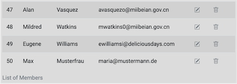

# Anbindung an das Backend

Wir haben jetzt ein Backend, das als REST-Server funngiert. Über die Endpunkte der REST-API können wir auf die einzelnen Funktionen des Backends zugreifen, um die Daten in der MySQL-Datenbank zu manipulieren (erzeugen, lesen, ändern und löschen - CRUD). Unser Frontend stellt zur Zeit nur einen Daten-Service zur Verfügung, der die Daten client-seitig verwaltet. Dies wollen wir jetzt ändern. Das Frontend soll mit dem Backend kommunizieren, um die Daten zu nutzen, die das Backend zur Verfügung stellt. 

Wir werden uns ein neues Frontend erstellen und dabei die einzelnen Schritte genauer untersuchen. Das hat folgende Vorteile:

- wir werden sicherer bei der Erstellung von Frontends mithilfe von Angular,
- wir müssen nicht auf bestehende Frontends aufsetzen, die evtl. bei einigen nicht richtig funktionieren,
- wir haben die Möglichkeit, tiefer in die Prinzipien von Angular einzutauchen und wesentliche Prinzipien ausführlicher zu diskutieren. 

Ich werde das Frontend, das ich hier erstelle, `frontend3` nennen. Der Name bleibt natürlich Ihnen überlassen. Wir erstellen uns also neben unserem alten Frontend, neben dem Backend usw. in unserem Repository mithilfe von 

```bash
ng new frontend3
```

ein neues Angular-Projekt und wählen **nicht** die strikte Typüberprüfung, **aber** Routing und CSS.

## Komponenten

Eine Angular-Anwendung besteht hauptsächlich aus Komponenten. Wann immer Sie eine neue "Unterseite" erstellen möchten oder sogar nur ein Menü, eine einzelne Tabelle o.ä., erstellen Sie sich eine neue Komponente. Jede Komponente besteht aus:

- einem HTML-*Template*, in dem mittels HTML bestimmt wird, was im Browser dargestellt werden soll (`*.component.html`), 
- einer TypeScript-Klasse, in der das *Verhalten* auf der Seite definiert werden kann (`*.component.ts`),
- einem CSS-Selektor, mit dem bestimmt werden kann, wie die die Komponente in die Webseite eingebunden werden kann (z.B. `<app-root></app-root>`),
- einer CSS-Datei, in der eigene Styles für die Komponente definiert werden können (`*.component.css`) und
- einer Datei, in der Tests speizifiziert werden können (`*.component.spec.ts`)

Die Erstellung von Komponenten erfolgt am einfachsten über das Terminal:

```bash
ng generate component nameDerKomponente
ng g c nameDerKomponente
```

Wir erstellen uns 4 Komponenten in unserer Anwendung:

```bash
ng g c members/create
ng g c members/read
ng g c members/update
ng g c members/delete
```

Diese 4 Komponenten `CreateComponent`, `ReadComponent`, `UpdateComponent` und `DeleteComponent` entstehen im Ordner `members`, der durch die erste Anweisung im `src/app`-Ordner erstellt wird. 

Man könnte die Komponenten nun mithilfe ihrer Selektoren (z.B. `<app-create></app-create>`) in die Seite einbinden. Wir wählen jedoch gleich das *Routing*, um die jeweiligen Komponenten anzusprechen. 

## Routing

In der `app-routing.module.ts` können wir *Routen* definieren, so dass wir unsere Komponenten über die URLs direkt erreichen können, z.B. `localhost:4200/read`, um z.B. alle Datensätze auszulesen oder `localhost:4200/read/11`, um den Datensatz mit der `id=11` auszulesen. Werden für die Komponenten Routen definiert, so wird je nach Route die jeweilige Komponente in den Selktor `<router-outlet></router-outlet>` eingesetzt. 

Wir definieren unserer Routen wie folgt:

=== "src/app/app-routing.module.ts"
	```javascript
	import { NgModule } from '@angular/core';
	import { Routes, RouterModule } from '@angular/router';
	import { CreateComponent } from './members/create/create.component';
	import { UpdateComponent } from './members/update/update.component';
	import { ReadComponent } from './members/read/read.component';
	import { DeleteComponent } from './members/delete/delete.component';

	const routes: Routes = [
	  { path: 'create', component: CreateComponent },
	  { path: 'update', component: UpdateComponent },
	  { path: 'update/:id', component: UpdateComponent },
	  { path: 'read', component: ReadComponent },
	  { path: 'read/:id', component: ReadComponent },
	  { path: 'delete', component: DeleteComponent },
	  { path: 'delete/:id', component: DeleteComponent },
	];

	@NgModule({
	  imports: [RouterModule.forRoot(routes)],
	  exports: [RouterModule]
	})
	export class AppRoutingModule { }
	```

Die Routen werden im `routes`-Array festgelegt. Bei Angabe der Komponenten, die über die jeweilige Route erreichbar sein soll, wird diese durch eine `import`-Anweisung importiert. Das Importieren sollten Sie durch Ihre IDE erledigen lassen. 

Wichtig ist, dass die entsprechenden Links zu den Routen (und damit Komponenten) nicht über das Attribut `href` im HTML definiert werden, sondern über `[routerLink]`. Die Verwendung von `href` führt zu einem neuen Request auf dem Webserver. Die `app.component.html` sollte z.B. so aussehen:

=== "src/app/app.component.html"
	```html
	<h1>This is app</h1>
	<ul>
	  <li><a [routerLink]="['/create']">Create</a></li>
	  <li><a [routerLink]="['/read']">Read</a></li>
	  <li><a [routerLink]="['/update']">Update</a></li>
	  <li><a [routerLink]="['/delete']">Delete</a></li>
	</ul>
	<router-outlet></router-outlet>
	```

In der `app.component.html` haben wir uns somit eine Liste erstellt und die einzelnen List-items sind Hyperlinks auf unsere Komponenten. Diese erreichen wir über die zuvor festgelegten Routen. Klicken wir nun auf einen Link, so wird die jeweilige Komponente in den `<router-outlet></router-outlet>`-Selektor unterhalb der Liste eingebunden. Nun erscheint die Liste von Links und wenn auf einen der Links geklickt wird, dann wird die entsprechende Komponente in den `<router-outlet></router-outlet>`-Selektor eingebunden. Da jedes der `*.component.html` ein `<p>`*component*`works!</p>` enthält, erscheint dieses dann unterhalb der Liste, so wie hier das Beispiel für die `UpdateComponent`:


Um Parameter aus den Routen auszulesen, z.B. die `id` aus `localhost:4200/update/11`, binden wir für genau dieses Beispiel (`UpdateComponent`) in die `update.component.ts` die Klasse `ActivatedRoute` ein und greifen dann darüber auf `snapshot.paramMap.get('id'))` zu. Die Datei sieht wie folgt aus:

=== "src/app/members/update.component.ts" 
	```javascript linenums="1"
	import { Component, OnInit } from '@angular/core';
	import { ActivatedRoute } from '@angular/router';

	@Component({
	  selector: 'app-update',
	  templateUrl: './update.component.html',
	  styleUrls: ['./update.component.css']
	})
	export class UpdateComponent implements OnInit {
	  selectedId: number;

	  constructor(private route: ActivatedRoute) { }

	  ngOnInit(): void {
	    this.selectedId = Number(this.route.snapshot.paramMap.get('id'));
	  }

	}
	```

In Zeile `12` binden wir `ActivatedRoute` per *dependency injection* (siehe z.B. [hier](https://angular.io/guide/dependency-injection#dependency-injection-in-angular)) in den Konstruktor ein. Die Eigenschaft `route` ist damit in der Klasse `UpdateComponent` verfügbar. Durch dieses Einbinden wird die Klasse `ActiveRoute` auch importiert (in Zeile `2`). In Zeile `10` wird eine Eigenschaft `selectedId` deklariert, die den Typ `number` hat. Dieser Eigenschaft wird in Zeile `15` ein Wert zugewiesen, der aus der URL ausgelesen wird. Da wir unsere Rout ein `app-routing.module.ts` mittels `{ path: 'update/:id', component: UpdateComponent },` parametrisiert hatten, kann nun über die `ActivatedRoute`-Klasse (hier bei handelt es sich genauer um einen *Service* - siehe z.B. [hier](https://angular.io/guide/router#activated-route)) der Wert von `id` ausgelesen werden. Dieser ist ein `string`, den wir mittels `Number` nach `number` konvertieren. 

Bei der `ngOnInit()`-Funktion handelt es sich um einen sogenannten *lifecycle-hook*. Jede Komponente durchläuft einen *Lifecycle*. Wir können einerseits auf Ereignisse durch die Nutzerin reagieren und andererseits auf Ereignisse, die durch den *Lifecycle*  einer Komponente ausgelöst werden. Bei `ngOnInit()` reagieren wir darauf, dass die Komponente initialisiert wird. Diese Funktion wird genau ein Mal aufgerufen (bei der Initialisierung der Komponente) - im Gegensatz z.B. zu `ngOnChanges()`. Diese Funktion wird bei jeder Änderung der Komponente aufgerufen, z.B. direkt vor `ngOnInit()`. Sie z.B. [hier](https://angular.io/guide/lifecycle-hooks#hooking-into-the-component-lifecycle).

## Interpolation

Mithilfe von *Interpolation* können wir (berechnete) Werte in unser HTML einfügen. Die Syntax von Interpolation sieht in Angular so aus:

> `{{ wert }}`

Der Wert wird also in doppelten geschweiften Klammern angegeben. Wir betrachten für unsere obige `UpdateComponent` ein einfaches Beispiel. In `update.component.ts` haben wir die Eigenschaft `selectedId` erstellt und dieser mithilfe der parametrisierten Route einen Wert zugewiesen. Diesen Wert können wir nun in `update.component.html` durch Interpolation einbinden:

=== "src/app/members/update.component.html" 
	```html linenums="1"
	<p>update works!</p>
	<p>id={{ selectedId }}</p>
	```

Wenn wir also die `update`-Komponente über z.B. die URL `localhost:4200/update/11` aufrufen, erscheint unterhalb des Absatzes `update works!` ein Absatz mit `id=11`.

## Service für HTTP

Ehe wir weitere Sprachkonzepte in Angular betrachten, erzeugen wir uns einen *Service*, um mit dem Backend per HTTP zu kommunizieren. Ein Service in Angular ist eine (TypeScript-)Klasse, die einem konkreten Zweck dient. Ein Service sollte möglichst genau eine Sache erledigen. Ein Service kann typischerweise von allen/vielen Komponenten verwendet werden. Wir erstellen unseren Service deswegen in einem Ordner `shared`. Wir nennen unseren Service `backend`:

```bash
ng g service shared/backend
```

Durch die Anweisung wird der `shared`-Ordner erstellt und darin eine `backend.service.ts`. Ein Service besteht nur aus einer `*.service.ts`-Datei (und einer `spec.ts` für Tests). Es gibt dafür keine `.html` und keine `.css`-Datei, da ein Service nur ein Verhalten beschreibt und keine Sicht. 

Als erstes fügen wir unserer `app.module.ts` das Modul `HttpClientModule` hinzu, um es zu importieren. Achten Sie darauf, dass das `HttpClientModule` in der Liste der Importe **nach** dem `BrowserModule` steht:

=== "src/app/app.module.ts (Ausschnitt)" 
	```javascript linenums="1" hl_lines="2 9"
	/* gekuerzt */
	import { HttpClientModule } from '@angular/common/http';

	@NgModule({
	  declarations: [  /* gekuerzt */ ],
	  imports: [
	    BrowserModule,
	    AppRoutingModule,
	    HttpClientModule,
	  ],
	  providers: [],
	  bootstrap: [AppComponent]
	})
	export class AppModule { }
	```


Nun implementieren wir unseren `BackendService`. Wir fügen zunächst den `HttpClient`-Service per * dependency injection*  hinzu:

=== "src/app/shared/backend.service.ts" 
	```javascript linenums="1" hl_lines="2 9"
	import { Injectable } from '@angular/core';
	import { HttpClient } from '@angular/common/http';

	@Injectable({
	  providedIn: 'root'
	})
	export class ConnService {

	  constructor(private http: HttpClient) { }
	}
	```

Mit dem `HttpClient`-Service sind wir in der Lage, Anfragen (*requests*) an das Backend zu senden und die Antworten (*responses*) zu empfangen und auszuwerten. Wir erinnern uns zunächst nochmal an die Endpunkte unserer [REST-API](../backend/#rest-api):

| Methode | URL | Bedeutung |
|---------|-----|-----------|
| GET     | /members | hole alle Datensätze |
| GET     | /members/11 | hole den Datensatz mit der id=11 |
| POST    | /members | füge einen neuen Datensatz hinzu |
| PUT     | /members/11 | ändere den Datensatz mit der id=11 |
| DELETE  | /members/11 | lösche den Datensatz mit der id=11 |
| DELETE  | /members | lösche alle Datensätze |

Wir beginnen damit, den `GET`-request für alle `members` auszuführen. Dazu erstellen wir uns zunächst im Client ein Interface für das Datenmodell:

### Datenmodell

Wir hatten uns früher bereits ein Datenmodell im Client erstellt. Wir wiederholen das hier nochmal schnell. Um das Mapping des Datenmodells von Backend und Frontend zunächst einfach zu halten, übernehmen wir das Datenmodell des Backends. Das Datenmodell in Angular ist ein *Interface*. Wir erstellen es ebenfalls im `shared`-Ordner:

```bash
ng generate interface shared/data 
```

Anstelle von `ng generate interface` hätten wir auch `ng g i` schreiben können. Unser Datenmodell sieht wie folgt aus:

=== "src/app/data.ts"
	```javascript
	export interface Data {
	  id: number;
	  firstname: string;
	  lastname: string;
	  email: string;
	}
	```

Mit einem *Interface* legen wir in TypeScript einen neuen Typ an, hier den Typ `Data`. Interfaces dienen somit der Typsicherheit. Wir werden diesen Typ `Data` im folgenden verwenden, um die Datensätze unserer *Mockup-Data* zu typisieren. Interfaces können in TypeScript Eigenschaften und Funktionen enthalten. Für die Beschreibung unserer Daten benötigen wir nur Eigenschaften. Ein Objekt kann jetzt vom Typ `Data` sein. Ein Interface hat aber keinen Konstruktor. 

### `get()`-Funktion von `HttpClient`

Wir erstellen nun die erste "Verknüpfung" mit dem Backend und implementieren ein `GET`-Request an das Backend, um alle `members` abzufragen. Dazu verwenden wir die `get()`-Funktion des `HttpClient`-Services. 

Die einfachste Form der Anwendung der `get()`-Funktion besteht darin, dieser Funktion die entsprechende URL des Backends zu übergeben. In unserem Fall also 

```javascript
http.get('http://localhost:3000/members');
```

Diese Funktion gibt ein sogenanntes *Observable* zurück. *Observables* implementieren das *Observer Pattern* - ein Design Pattern zur Kommunikation zwischen einem sogenannte *subject*, das einen oder mehrere *observers* beobachtet und das immer dann informiert wird, sobald sich der Zustand eines *observers* geändert hat. Eine typische Implementierung des *Observer Patterns* findet durch Ereignis-Listener statt. Jemand (das *subject*) meldet sich an einem *observer* an, z.B. einem Button (genauer gesagt, an das Click-Ereignis des Buttons) und wird informiert, sobald der Button gecklickt wurde. 

Die Grundidee bei *Observables* in TypeScript ist die, dass es eine Funktion gibt, die Werte ermittelt (z.B. `http.get()`), aber diese Funktion nur ausgeführt wird, wenn sie jemand `subscribe`d. `subscribe()` ist also wie eine Anmeldung an den zu beobachtenden Wert. 

Wir schauen uns dieses Prinzip mal mit der `get()`-Funktion des `HttpClient`s an:

=== "src/app/shared/backend.service.ts" 
	```javascript linenums="1" hl_lines="10 15"
	import { Injectable } from '@angular/core';
	import { HttpClient } from '@angular/common/http';
	import { Observable } from 'rxjs';
	import { Data } from './data';

	@Injectable({
	  providedIn: 'root'
	})
	export class BackendService {
	  baseUrl = 'http://localhost:3000/members';

	  constructor(private http: HttpClient) { }

	  getAll(): Observable<Data[]>{
	    return this.http.get<Data[]>(this.baseUrl);
	  }
	}
	```

Zunächst einmal sehen wir in Zeile `15` den Aufruf der `get()`-Funktion von `HttpClient`. Der `get()`-Funktion wird als Parameter die URL des Backends übergeben. Diese ist in der Eigenschaft `baseUrl` in Zeile `10` definiert. 

Die Rückgabe der `get()`-Funktion ist, wie gesagt, ein `Observable`. Wir erzeugen den Aufruf der `get()`-Funktion in einer von uns erstellten Funktion `getAll()`deren Rückgabetyp dieses `Obervable` ist (Zeile `14`). Dieses `Observable` ist sogar typisiert, nämlich mit unserem Datenmodell-Typ `Data`. Vielmehr bekommen wir ein Array von `Data`-Objekten zurück, deshalb `Observable<Data[]>` als Rückgabetyp der `getAll()`-Funktion. Da wir diesen Rückgabetyp so konkret angeben (und nicht einfach nur `Observable` oder `Observable<any>`, erfordert TypeScript auch, dass wir die `get()`-Funktion typisieren - deshalb `get<Data[]>()`.

Wir müssen sowohl `Observable` (aus `rxjs`) als auch `Data` (aus unserer `data.ts`) importieren (Zeilen `3` und `4`). Nun müssen wir uns noch an dieses `Observable` mittels `subscribe()` anmelden. Das machen wir in unserer `ReadComponent`.

### `subscribe()`

In unserer `ReadComponent` wollen wir die `getAll()`-Funktion unseres Backend-Services nutzen, um uns alle `members`-Datensätze vom Backend anbzufragen und anzeigen zu lassen. Wir öffnen dazu die `read.component.ts`:

=== "src/app/members/read.component.ts" 
	```javascript linenums="1" hl_lines="20-22"
	import { Component, OnInit } from '@angular/core';
	import { BackendService } from '../../shared/backend.service';
	import { Data } from '../../shared/data';

	@Component({
	  selector: 'app-read',
	  templateUrl: './read.component.html',
	  styleUrls: ['./read.component.css']
	})
	export class ReadComponent implements OnInit {
	  members: Data[];

	  constructor(private cs: BackendService) { }

	  ngOnInit(): void {
	    this.readAll();
	  }

	  readAll(): void {
	    this.cs.getAll().subscribe(
	            (response: Data[]) => this.members = response
	    );
	  }
	}
	```

Zunächst binden wir den `BackendService` mittels *dependency injection* in unsere Komponente ein (Zeile `13`). In einer eigenen Funktion `readAll()` rufen wir nun die `getAll()`-Funktion des `BackendService` auf (Zeile `20`). Wie in dem Abschnitt zuvor erläutert, wird diese Funktion nur durch ein `subscribe()` ausgeführt. Die `subscribe()`-Funktion "holt" das `Observer`-Objekt, welches drei sogenannte *callback*-Funktionen definiert: `next`, `error` und `complete`. [Callback-Funktionen](../javascript/#callback-funktionen) sind [hier](../javascript/#callback-funktionen) erläutert. Wir haben also drei Parameter in der `subscribe()`-Funktion, von denen jedoch nur einer (`next`) erforderlich ist. `error` und `complete` sind optional. Wir verwenden hier auch nur `next`. 

Unter `next` erhalten wir die `response` zurück, also das angefragte Objekt. Wir verwenden dafür eine *Arrow-Funktion* (siehe [Arrow-Funktionen](../javascript/#arrow-funktionen)). Wie wir diese Funktion nennen, bleibt uns überlassen. Hier heißt sie `response`. Wir haben diese Funktion auch mit `Data[]` typisiert, da sie uns ein `Data`-Array zurückgibt. Der Inhalt dieser Funktion ist die Zuweisung der `response` auf unsere Eigenschaft `members` vom Typ `Data[]` (definiert in Zeile `11`) und der Rückgabe der `response` (in Arrow-Funktionen kann aber auf das `return` verzichtet werden - siehe [hier](../javascript/#arrow-funktionen)). 

Hier vielleicht einmal zum Verständnis auch die Möglichkeit der Fehlerausgabe auf der Konsole:

```javascript
    this.cs.getAll().subscribe(
      (response: Data[]) => this.members = response,
      error => console.log(error)
    );
```

Damit wir testen können, ob unsere Backend-Anbindung funktioniert, fügen wir noch eine Konsolen-Ausgabe der `response` ein. Die Funktionskörper der `readAll()`-Funktion sieht dann so aus: 

```javascript
    this.cs.getAll().subscribe(
      (response: Data[]) => {
        console.log(response);
        return this.members = response;  },
      error => console.log(error)
    );
```

### Backend starten

Um die Anbindung an das Backend zu testen, dürfen wir nicht vergessen, es zu starten! Wechseln Sie im Terminal in Ihren Backend-Ordner und rufen dort

```bash
node server.js 
```

auf. Es erscheint im Terminal

```bash
Server is running on port 3000.
Successfully connected to the database.
```

### Frontend starten

Wir müssen unser Frontend compilieren `ng serve` und wenn wir dann im Browser `http://localhost:4200/read` eingeben, also die Route zu unserer `ReadComponent`, dann sollten wir in der **Konsole in den Entwicklertools** die Ausgabe der Response sehen (die `id`s und auch die Anzahl der Einträge können bei Ihnen anders sein):


Achtung! Man sieht nichts auf der Webseite, sondern wir geben die Datensätze derzeit nur in der Konsole der Entwicklertools aus!

!!! success
	Wir haben das Backend an das Frontend angebunden. Wir haben die erste Anfrage an das Backend im Frontend umgesetzt, nämlich `GET /members`, indem wir im Frontend die `get()`-Funktion des `HttpClient` implementiert und diese in der `ReadComponent`mittels `subscribe()` ausgeführt haben. Wir werden nun zunächst die Daten noch im HTML-Template darstellen und dann weitere Endpunkte unserer REST-API anbinden. 

### `read.component.html`

Die Werte der *Response* wollen wir nun in unserem HTML-Template der `ReadComponent` darstellen. Nach Aufruf der `ReadComponent` über die `/read`-Route befinden sich die Werte in der Eigenschaft `members` vom Typ `Data[]`. Dieses Array lesen wir nun aus. Für das Auslesen von Arrays bieten sich in Angular [Struktur-Direktiven](https://angular.io/guide/structural-directives) an, hier insbesondere die *Wiederholungsdirektive* `*ngFor`:

=== "src/app/members/read.component.html" 
	```html linenums="1"
	<p>read works!</p>

	<ul *ngFor="let member of members">
	  <li>{{member.firstname}} {{member.lastname}}</li>
	</ul>
	```

In Zeile `3` verwenden wir diese Direktive. Wir greifen auf `members` zu und laufen vollständig durch dieses Array. Dazu definieren wir uns eine Variable `member` (die können Sie nennen, wie Sie möchten). `member` zeigt dann jeweils auf einen Datensatz. Jeder Datensatz ist ein Objekt mit den Eigenschaften `id`, `firstname`, `lastname` und `email`. Mittels *Interpolation*  lesen wir die Werte von `member.firstname` und `member.lastname` aus und stellen sie in einer Liste dar. 

### Bootstrap einbinden

Wir können dieses Mal ja Bootstrap in unser Angular-Frontend einbinden. Dazu gehen wir wie folgt vor. Wir wechseln im Terminal in unseren Frontend-Ordner und geben dort

```bash
npm install bootstrap jquery popper.js --save
```

ein. Würden wir nur `npm install bootstrap` eingeben, würden wir aufgefordert, `jquery` (siehe [jQuery](https://jquery.com/)) und `popper.js` (siehe [Popper](https://popper.js.org/)) nachzuinstallieren. 

In dem `node_modules`-Ordner in unserem Projekt entstehen die Ordner `bootstrap`, `jquery` und `popper.js` - können Sie sich in Ihrer IDE ja mal anschauen. Damit ist Bootstrap aber noch nicht ganz eingebunden. Wir müssen es noch in unsere `angular.json` eintragen:

=== "angular.json (Ausschnitt)"
	```json linenums="25" hl_lines="4 7-8"
 			],
            "styles": [
              "src/styles.css",
              "./node_modules/bootstrap/dist/css/bootstrap.min.css"
            ],
            "scripts": [
              "./node_modules/jquery/dist/jquery.min.js",
              "./node_modules/bootstrap/dist/js/bootstrap.min.js"
            ]
    ```

Beachten Sie, dass Sie die Eintragungen gleich zwei Mal in der `angular.json` vornehmen. Einmal unter `architect --> build --> options` und auch noch unter `architect --> test --> options`. 

Testen Sie, ob Bootstrap eingebunden wurde, indem Sie für die Liste und die List-Items die Bootstrap-Klassen verwenden:

=== "src/app/members/read.component.html" 
	```html linenums="1"
	<p>read works!</p>

	<ul class="list-group" *ngFor="let member of members">
	  <li class="list-group-item">{{member.firstname}} {{member.lastname}}</li>
	</ul>
	```

Wir wollen noch eine weitere Struktur-Direktive betrachten, nämlich `*ngIf`. Bevor wir dies tun, installieren wir uns zunächst auch noch die Bootstrap-Icons.

#### Bootstrap Icons

Um die Bootstrap-Icons zu installieren, geben wir im Terminal in unserem Projektordner

```bash
npm i ngx-bootstrap-icons --save
```

ein. IN unserem `node_modules`-Ordner entsteht dadurch ein `ngx-bootstrap-icons`-Ordner. Diesen importieren wir folgt in die `app.modules.ts`:

=== "app.module.ts"
	```javascript linenums="1" hl_lines="11-12 14-16 30"
	import { BrowserModule } from '@angular/platform-browser';
	import { NgModule } from '@angular/core';

	import { AppRoutingModule } from './app-routing.module';
	import { AppComponent } from './app.component';
	import { ReadComponent } from './members/read/read.component';
	import { CreateComponent } from './members/create/create.component';
	import { UpdateComponent } from './members/update/update.component';
	import { DeleteComponent } from './members/delete/delete.component';
	import { HttpClientModule } from '@angular/common/http';
	import { NgxBootstrapIconsModule } from 'ngx-bootstrap-icons';
	import { PencilSquare } from 'ngx-bootstrap-icons';

	const icons = {
	  PencilSquare,
	};

	@NgModule({
	  declarations: [
	    AppComponent,
	    ReadComponent,
	    CreateComponent,
	    UpdateComponent,
	    DeleteComponent
	  ],
	  imports: [
	    BrowserModule,
	    AppRoutingModule,
	    HttpClientModule,
	    NgxBootstrapIconsModule.pick(icons)
	  ],
	  providers: [],
	  bootstrap: [AppComponent]
	})
	export class AppModule { }
	```

In Zeile `12` hätten wir auch alle verfügbaren Icons importieren können, dann mithilfe der Anweisung `import { allIcons } from 'ngx-bootstrap-icons';`. Dann hätten wir uns auch die Zeilen `14-16` sparen können, in denen wir explizit angeben, welche(s) Icon, wir verwenden können. Hätten wir alle Icons importiert, würde in Zeile `30` stehen `NgxBootstrapIconsModule.pick(allIcons)`. Nähere Informationen dazu finden Sie [hier](https://www.npmjs.com/package/ngx-bootstrap-icons).

Aus der [Liste](https://avmaisak.github.io/ngx-bootstrap-icons/) aller verfügbaren Icons haben wir (zunächst) nur das Icon `pencil-square` ausgewählt. Dieses Icon werden wir im folgenden verwenden. Die Verwendung des Icons innerhalb eines HTML-Templates sieht so aus:

```html
<i-bs
  name="pencil-square"
  class="text-primary"
  width="1em"
  height="1em">
</i-bs>
```

In `name` geben Sie den Namen des Icons an, mit dem `class`-Attribut können Sie die Farbe setzen (siehe dazu [Bootstrap-Colors](https://getbootstrap.com/docs/4.5/utilities/colors/)) und mit den `width`- und `height`-Attributen setzen Sie die größe des Icons (hier die doppelte Schriftgröße). Alle Bootstrap-Icons und deren jeweilige Verwendung finden Sie [hier](https://avmaisak.github.io/ngx-bootstrap-icons/). 

#### Tabelle statt Liste

Wir ersetzen die Liste in der `read.component.html` durch eine Tabelle:

=== "src/app/members/read.component.html" 
	```html linenums="1"
	<p>read works!</p>

	  <table class="table table-striped table-hover">
	    <caption>List of Members</caption>
	    <thead>
	      <tr>
	        <th>Nr.</th>
	        <th>Vorname</th>
	        <th>Nachname</th>
	        <th>E-Mail</th>
	        <th>Edit</th>
	      </tr>
	    </thead>
	  <tbody>
	    <tr *ngFor="let member of members; let i=index; trackBy: trackByData">
	      <td>{{ i+1 }}</td>
	      <td>{{member.firstname}}</td>
	      <td>{{member.lastname}}</td>
	      <td>{{member.email}}</td>
	      <td><a [routerLink]="['/read/', member.id]">
	      	<i-bs
	        name="pencil-square"
	        class="text-secondary"
	        width="1em"
	        height="1em">
	      </i-bs></a></td>
	    </tr>
	  </tbody>
	  </table>
	```


Beachten Sie, dass wir der `*ngFor`-Direktive noch einen `index` hinzugefügt haben (Zeile `15`). Damit wird jedem einzelnen Wert aus `members` (jedem Schleifendurchlauf) ein Index zugeordnet, beginnend bei `0`. In der ersten Spalte der Tablle (Zeile `16`) geben wir diesen jeweiligen Wert aus (erhöht um `1`, um bei `1` anstelle von `0` zu beginnen). Über den `index` für die `*ngFor`-Direktive finden Sie [hier](https://angular.io/guide/built-in-directives#ngfor-with-index) weitere Informationen. 

Beachten Sie außerdem, dass wir den Wert der `*ngFor`-Direktive um `trackBy: trackByData` erweitert haben. Dazu haben wir die Funktion in `app.component.ts` hinzugefügt: 

=== "src/app/members/read.component.ts (Auszug)" 
	```javascript linenums="25" hl_lines="3"
	  }

	  trackByData(index: number, data: Data): number { return data.id; }

	  readAll(): void {
	```

Dies erfolgt nur zur Performanzsteigerung. Haben wir lange Listen oder lange Tabellen, so wie hier, können geringfügige Veränderungen an Einträgen in diesen Listen oder Tabellen zu einer kompletten Neugestaltung des DOMs kommen - die gesamte Tabelle würde neu erstellt und dem DOM hinzugefügt werden. Um dies zu vermeiden, geben wir an, welche Einträge bereits enthalten - welche also bereits *getracked* werden. Wir geben dazu die Eigenschaft an, an der das Tracking identifiziert werden soll. Wir nutzen hier die `id`-Eigenschaft eines jeden `members`. Weitere Informationen zu `trackby` finden Sie [hier](https://angular.io/guide/built-in-directives#ngfor-with-trackby).

Wie Sie sehen, verwenden wir in der letzten Spalte der Tabelle das Bootstrap-Icon `pencil-square` (Zeilen `21`-`26`). Dieses Icon ist hier Inhalt eines `<a>`-Elementes, in dem ein `routerLink` angegeben wird. Dieser `routerLink` setzt sich aus der Route `/read/` und der `member.id` zusammen. Der Datensatz mit der `id=54` erzeugt dann z.B. die Route `/read/54`. Beachten Sie, dass wir in der `app-routing.module.ts` auch die parametrisierte Route `read/:id` definiert hatten und damit die `ReadComponent` aufrufen. 

#### Parametrisierte Route in `read.component.ts`

Wir wollen nun dafür sorgen, dass wir auch in der `ReadComponent` den `id`-Parameter aus der URL auslesen. Das haben wir für die `UpdateComponent` bereits gemacht und wiederholen hier exakt die Schritte. Wir öffnen dazu die `read.component.ts`:

=== "src/app/members/read.component.ts" 
	```javascript linenums="1" hl_lines="4 13 18 19 21-24"
	import { Component, OnInit } from '@angular/core';
	import {BackendService} from '../../shared/backend.service';
	import {Data} from '../../shared/data';
	import {ActivatedRoute} from '@angular/router';

	@Component({
	  selector: 'app-read',
	  templateUrl: './read.component.html',
	  styleUrls: ['./read.component.css']
	})
	export class ReadComponent implements OnInit {
	  members: Data[];
	  selectedId: number;

	  constructor(private cs: BackendService, private route: ActivatedRoute) { }

	  ngOnInit(): void {
	    this.selectedId = Number(this.route.snapshot.paramMap.get('id'));
	    if (this.selectedId === 0) {
	      this.readAll();
	    }
	    else {
	      console.log('id = ' + this.selectedId);
	    }
	  }

	  trackByData(index: number, data: Data): number { return data.id; }

	  readAll(): void {
	    this.cs.getAll().subscribe(
	      (response: Data[]) => this.members = response,
	      error => console.log(error)
	      );
	  }
	}
	```

Das heißt, wie binden per * dependency injection*  den `ActivatedRouted`-Service ein (Zeile `15`) und lesen in Zeile `18` den Wert des Parameters `id` aus der URL aus. Den Wert speichern wir in `selctedId`. Diese Eigenschaft haben wir in Zeile `13` der Klasse hinzugefügt. 

Nun überlegen wir uns noch Folgendes: wenn wir die Route **mit** einer `id` aufrufen, also z.B. `/read/ 11`, dann wollen wir den einzelnen Datensatz mit der `id=11` lesen. Nur, wenn wir die Route ohne `id` aufrufen, also nur `/read`, wollen wir **alle** Datensaätze lesen. Wird in der Route keine `id` angegeben, dann ist der Wert von `selectedId=0`. Wir wollen nur für diesen Fall die Funktion `readAll()` aufrufen, da wir nur für diesen Fall vom Backend alle Datensätze zur Verfügung gestellt bekommen möchten. In den Zielen `19-24` haben wir deshalb eine Selektion eingefügt, je nachdem, ob wir in der Route eine `id` angegeben haben (dann erfolgt eine Ausgabe auf der Konsole) oder nicht (dann rufen wir `readAll()` auf). 

Was wir bis jetzt noch nicht haben, was wir aber in Kürze hinzufügen werden, ist der Request an das Backend nach einem einzelnen Datensatz. Zunächst wollen wir aber auch in unserem HTML-Template die Unterscheidung treffen, ob wir eine Route mit `id` aufgerufen haben oder nicht. 

#### `*ngIf` in `read.component.html`

Wir mplementieren diese Fallunterscheidung in unserem HTML-Template. Was wir wissen ist, dass `selectedId` einen Wert größer als `0` hat , wenn wir eine Route `/read/xx` aufgerufen haben und `selectedId` hat den Wert `0`, wenn wir nur die Route `/read` aufgerufen haben. Diese Unterscheidung fügen wir in `read.component.html` ein: 

=== "src/app/members/read.component.html" 
	```html linenums="1" hl_lines="4"
	<p>read works!</p>

	<div *ngIf="selectedId == 0" class="container">
	  <table class="table table-striped table-hover">
	    <!-- hier den Inhalt der Tabelle - siehe oben -->
	  </table>
	</div>
	<div *ngIf="selectedId > 0" class="container">
	  <h1>{{ selectedId }}</h1>
	  <p><a [routerLink]="['/read']">Zurück zur Tabelle</a></p>
	</div>
	```

Wir fügen zwei `<div>`-Elemente hinzu. Das eine `<div>`-Element umschließt die Tablle. Das andere `<div>`-Element enthält eine Überschrift, deren Inhalt der Wert von `selectedId` ist, sowie einen `routerLink`, der uns zurück zu `/read` führt (dann also ohne eine `id`). 

Das erste `<div>`-Element wird nur dann angezeigt, wenn der Wert von `selectedId` gleich `0` ist. Das ergibt sich aus der Struktur-Direktive `*ngIf="selectedId == 0"`. Das zweite `<div>`-Element wird nur dann angezeigt, wenn der Wert von `selectedId` größer als `0` ist. Das ergibt sich aus der Struktur-Direktive `*ngIf="selectedId > 0"`. 

Wenn wir nun im Browser `http://localhost:4200/read` eingeben, erscheint folgende Ansicht: 


Wenn wir dann auf einen der Icons in der rechten Spalte klicken, z.B. auf den Eintrag mit der `id=55`, dann wird im Browser die URL `http://localhost:4200/read/55` aufgerufen und es erscheint diese Ansicht: 


Mit der `*ngIf`-Direktive können wir also HTML-Elemente unter bestimmten Bedingungen hinzufügen bzw. verschwinden lassen. Eine ausführliche Beschreibung von `*ngIf` finden Sie z.B. [hier](https://angular.io/api/common/NgIf).


### R - read one (z.B. 'GET /members/11') 

Wir haben den Zugriff auf das Backend für den Endpunkt `/members` unter Verwendung der `GET`-Methode implementiert. Jetzt wollen wir einen einzelnen Datensatz anfordern. Das Backend stellt diesen unter `GET /members/:id` zur Verfügung (siehe [R - read one](../backend/#r-read-one)). Wir ergänzen also zunächst unseren `BackendService` um eine `getDataById(dataId: number)`-Funktion, der wir die `id` eines Datensatzes übergeben. Auch diese Funktion gibt wieder ein `Observable` zurück. Im Gegensatz zur `getAll()`-Funktion wird dieses Mal das `Observable` aber mit `Data` typisiert, da wir nur einen Datensatz zurückbekommen. An die `baseUrl` hängen wir die `id`, nach der wir suchen, um im Backend eine `GET baseUrl/id`-Anfrage zu stellen. Die Funktion in `backend.service.ts` sieht so aus:

=== "backend.service.ts"
	```javascript linenums="1" hl_lines="19-22"
	import { Injectable } from '@angular/core';
	import { HttpClient } from '@angular/common/http';
	import { Observable } from 'rxjs';
	import { Data } from './data';

	@Injectable({
	  providedIn: 'root'
	})
	export class BackendService {
	  baseUrl = 'http://localhost:3000/members';

	  constructor(private http: HttpClient) { }

	  getAll(): Observable<Data[]>{
	    return this.http
	      .get<Data[]>(this.baseUrl);
	  }

	  getDataById(dataId: number): Observable<Data> {
	    return this.http
	      .get<Data>(this.baseUrl + '/' + dataId);
	  }
	}
	```

Diese Funktion können wir nun in unserer `read.component.ts` verwenden. Dort hatten wir ja bereits in der `ngOnInit()`-Funktion die Fallunterscheidung, ob die Route mit einem `id`-Parameter aufgerufen wird (dann hat `selectedId` einen Wert größer als `0`) oder ohne `id`-Parameter (also nur `/read` - dann rufen wir die `readAll()`-Funktion auf und geben die Tabelle aus).

Wir ergänzen die `read.component.ts` zunächst um eine `readOne(id: number)`-Funktion, die die `getDataById(id)` des `BackendService` *subscribed* und rufen diese dann für den Fall auf, dass die `/read`-Route parametrisiert ist:

=== "read.component.ts"
	```javascript linenums="1" hl_lines="13 25 38-43"
	import { Component, OnInit } from '@angular/core';
	import {BackendService} from '../../shared/backend.service';
	import {Data} from '../../shared/data';
	import {ActivatedRoute} from '@angular/router';

	@Component({
	  selector: 'app-read',
	  templateUrl: './read.component.html',
	  styleUrls: ['./read.component.css']
	})
	export class ReadComponent implements OnInit {
	  members: Data[];
	  member: Data;
	  selectedId: number;

	  constructor(private cs: BackendService, private route: ActivatedRoute) { }

	  ngOnInit(): void {
	    this.selectedId = Number(this.route.snapshot.paramMap.get('id'));
	    if (this.selectedId === 0) {
	      this.readAll();
	    }
	    else {
	      console.log('id = ' + this.selectedId);	// nur fuer debug
	      this.readOne(this.selectedId);
	    }
	  }

	  trackByData(index: number, data: Data): number { return data.id; }

	  readAll(): void {
	    this.cs.getAll().subscribe(
	      (response: Data[]) => this.members = response,
	      error => console.log(error)
	      );
	  }

	  readOne(id: number): void {
	    this.cs.getDataById(id).subscribe(
	      (response: Data) => this.member = response,
	      error => console.log(error)
	    );
	  }
	}
	```

In Zeile `25` wird die `readOne()`-Funktion aufgerufen für den Fall, dass `selectedId` ungleich `0` ist (also nicht die Tabelle aller Datensätze angezeigt werden soll). Dieser Funktion wird der Wert von `selectedId` übergeben (den wir aus der URL ausgelesen haben, also z.B. `http://localhost:4200/read/11`). 

In den Zeilen `38-43` sehen wir die Definition der `readOne()`-Funktion. Es wird die `getDataById()`-Funktion des `BackendService` `subscribe()` und die `response`(vom Typ `Data`) in die neu hinzugefügte (Zeile `13`) Eigenschaft `member` gespeichert. 

Im nächsten Schritt lassen wir die Werte von `member` in unserem HTML-Template mittels Interpolation ausgeben:

=== "read.component.html"
	```html linenums="1" hl_lines="10-13"
	<p>read works!</p>

	<div *ngIf="selectedId == 0" class="container">
	  <table class="table table-striped table-hover">
		<!-- hier kommt der Inhalt der Tabelle rein (gekuerzt) -->
	  </table>
	</div>
	<div *ngIf="selectedId > 0" class="container">
	  <h1>{{ selectedId }}</h1>
	  <p>{{ member.id }}</p>
	  <p>{{ member.firstname }}</p>
	  <p>{{ member.lastname }}</p>
	  <p>{{ member.email }}</p>
	  <p><a [routerLink]="['/read']">Zurück zur Tabelle</a></p>
	</div>
	```

In den Zeilen `10-13` lassen wir alle Werte von `member` auf der Seite in jeweils `<p>`-Elementen anzeigen. 

Wir probieren aus und rufen im Browser `http://localhost:4200/read` auf. Es erscheint die Tabelle aller Datensätze. Wir klicken auf eines der Icons in der `Edit`-Spalte der Tabelle. Die URL im Browser ist nun parametrisiert, z.B. `http://localhost:4200/read/56` und es erscheint:


Das sieht gut aus und alles scheint zu funktionieren! Wenn wir uns aber die Konsole in den Entwicklertools dabei anschauen, dann stellen wir fest, dass ein Fehler erscheint:


Das Problem ist, dass versucht wird, die Komponente darzustellen (zu *rendern*), noch bevor ("parallel" dazu) die `readOne()`-Funktion fertig ausgeführt ist und die `response` in `member` gespeichert hat. Das *Rendern* der Webseite erfolgt nebenläufig zur asynchronen Ausführung der `subscribe()`-Funktion in `readOne()`. Das ist einerseits ein sehr nützliches Feature, denn die Darstellung der Webseite wird nicht dadurch aufgehalten, dass eine Funktion noch ausgeführt wird. Der asynchrone Ansatz ist ausgesprochen nutzerfreundlich! Sobald der Wert existiert, wird er auch dargestellt - deshalb erscheint unsere Webseite auch fehlerfrei. 

#### Safe navigation operator

Um zu vermeiden, dass versucht wird, eine Wert über Interpolation darzustellen, der noch gar nicht existiert (`undefined` ist), kann der sogenannte *safe navigation operator* verwendet werden. Das Prinzip dieses Operators entspricht einer `*ngIf`-Direktive. Erst wenn der Wert ungleich `undefined` ist, wird er dargestellt. Die Syntax des *safe navigation operators*  ist ein `?`:

> `objekt?.eigenschaft`

Solange `objekt` noch `undefined` ist, wird nicht auf die (noch nicht existierende) `eigenschaft` zugegriffen. Wir fügen den *safe navigation operator* in die `read.component.html` ein:

=== "read.component.html (Auszug mit safe navigation oprator)"
	```html linenums="31" hl_lines="10-13"
	<div *ngIf="selectedId > 0" class="container">
	  <h1>{{ selectedId }}</h1>
	  <p>{{ member?.id }}</p>
	  <p>{{ member?.firstname }}</p>
	  <p>{{ member?.lastname }}</p>
	  <p>{{ member?.email }}</p>
	  <p><a [routerLink]="['/read']">Zurück zur Tabelle</a></p>
	</div>
	```

Jetzt haben wir auch in der Konsole keinen Fehler mehr, da der Zugriff auf `member.id` gar nicht versucht wird, solange `member === undefined`. 

#### Error - Datensatz existiert nicht

In der `readAll()`-Funktion haben wir uns um einen Fehlerfall nicht weiter gekümmert. Für den Fall eines Fehlers geben wir den Fehler einfach auf der Konsole aus. Die derzeitige Implementierung von `readOne()` ist ebenso. Allerdings kann es bei `readOne()` ja ohne Probleme vorkommen, dass wir keinen Datensatz zurückbekommen, sondern einen Fehler, nämlich dann, wenn der Datensatz mit der angegebenen `id` gar nicht existiert. Angenommen, wir rufen im Browser `http://localhost:4200/read/12345` auf, dann gibt es in der Datenbank keinen Datensatz mit der `id=12345`. Einen solchen "Fehler" sollten wir nun behandeln. 

Wir wiederholen nochmal die drei Parameter der `subscribe()`-Funktion:

- `next` gibt die Daten zurück, wenn es möglich ist (`response`)
- `error` gibt einen Fehler zurück, falls er auftritt
- `completed` bei erfolgreicher Response, nutzen wir nicht

Sowohl bei der `readAll()`- als auch bei der `readOne()`-Methode haben wir uns die `response` in einer eigenen Eigenschaft gespeichert (`members` bzw. `member`). Das wollen wir nun auch für einen Fehler machen. Wir fügen eine Eigenschaft `error` in unsere Klasse ein. Diese ist vom Typ `HttpErrorResponse`. Ein [`HttpErrorResponse`](https://angular.io/api/common/http/HttpErrorResponse)-Objekt hat zwei wesentliche Eigenschaften: `message` und `status`. Wir erweitern zunächst die `read.component.ts` und die Eigenschaft `error` und belegen diese im Fehlerfall mit dem `HttpErrorResponse`-Objekt:

=== "read.component.ts"
	```javascript linenums="1" hl_lines="16 43"
	import { Component, OnInit } from '@angular/core';
	import {BackendService} from '../../shared/backend.service';
	import {Data} from '../../shared/data';
	import {ActivatedRoute} from '@angular/router';
	import {HttpErrorResponse} from '@angular/common/http';

	@Component({
	  selector: 'app-read',
	  templateUrl: './read.component.html',
	  styleUrls: ['./read.component.css'],
	})
	export class ReadComponent implements OnInit {
	  members: Data[];
	  member: Data;
	  selectedId: number;
	  error: HttpErrorResponse;

	  constructor(private cs: BackendService, private route: ActivatedRoute) { }

	  ngOnInit(): void {
	    this.selectedId = Number(this.route.snapshot.paramMap.get('id'));
	    if (this.selectedId === 0) {
	      this.readAll();
	    }
	    else {
	      console.log('id = ' + this.selectedId);   // nur fuer debug
	      this.readOne(this.selectedId);
	    }
	  }

	  trackByData(index: number, data: Data): number { return data.id; }

	  readAll(): void {
	    this.cs.getAll().subscribe(
	      (response: Data[]) => this.members = response,
	      error => console.log(error)
	      );
	  }

	  readOne(id: number): void {
	    this.cs.getDataById(id).subscribe(
	      (response: Data) => this.member = response,
	      error => this.error = error,
	    );
	  }
	}
	```

Wir haben nur zwei Zeilen geändert. In Zeile `16` ist die Eigenschaft `error` hinzugefügt worden und in Zeile `43` erfolgt die Ausgabe des Fehlers nicht mehr auf der Konsole, sondern der Fehler (das `HttpErrorResponse`-Objekt) wird in `this.error` gespeichert. 

Wir passen nun auch noch die `read.component.html` an, um den Fehlerfall auszugeben. Dazu nutzen wir die `*ngIf`-Direktive:

=== "read.component.html (Auszug mit Fehlerbahndlung)"
	```html linenums="31" hl_lines="3-7 12"
	<div *ngIf="selectedId > 0" class="container">
	  <h1>{{ selectedId }}</h1>
	  <div *ngIf="error">
	    <p>{{ error?.message }}</p>
	    <p>{{ error?.status }}</p>
	  </div>
	  <div *ngIf="member">
	    <p>{{ member?.id }}</p>
	    <p>{{ member?.firstname }}</p>
	    <p>{{ member?.lastname }}</p>
	    <p>{{ member?.email }}</p>
	  </div>
	  <p><a [routerLink]="['/read']">Zurück zur Tabelle</a></p>
	</div>
	```

Für den Fall, dass ein Fehler aufgetreten ist (Zeile `33`), werden die `error.message` und der `error.status` ausgegeben. Für den Fall, dass es einen `member` gibt (also kein Fehler aufgetreten ist), werden die Eigenschaften von `member` ausgegeben. 

Wir testen die Ansicht durch Aufruf einer URL im Browser, die als `id` einen Wert verwendet, der nicht in der Datenbank enthalten ist. Bei mir z.B. `http://localhost:4200/read/11`. Das Ergebnis sieht dann so aus:


!!! success
	Wir haben jetzt auch die `GET /members/id`-Anfrage an das Backend umgesetzt, d.h. wir können uns jetzt einen einzelnen Datensatz vom Backend zurückgeben lassen und diesen verarbeiten. Wir haben außerdem den *safe navigation operator* kennengelernt, der es erlaubt, erst dann auf Eigenschaften eines Objektes zuzugreifen, wenn das Objekt vollständig geladen ist. Außerdem haben wir den Fehler behandelt, der auftreten kann, falls die angefragte `id` in der Datenbank gar nicht existiert und somit kein Datensatz zurückgeliefert wird. Nun kümmern wir uns um den Fall, dass vom Client Daten an das Backend gesendet werden, z.B. um ein Update eines Datensatzes durchzuführen (`PUT /members/id`). 


#### Formular für einen Datensatz

Bevor wir uns um das Update eines Datensatzes kümmern, machen wir unser Frontend noch ein bisschen schicker. Die Anzeige aller Datensätze in einer Tabelle ist bereits okay (man könnte hier noch Paginierung und Sortierung hinzufügen). Wenn wir in der Tablle auf ein `Edit`-Icon klicken, dann mit dem Ziel, diesen Datensatz zu ändern. Wir werden deshalb die `/read/id`-Ansicht so ändern, dass der Datensatz in ein Formular eingefügt wird. 

Formulare werden verwendet, um Nutzereingaben zu ermöglichen und die eingegebenen Daten zu verwalten, sie z.B. in einer Datenbank zu speichern. In Angular gibt es zwei verschiedene Ansätze, Forumlare zu erstellen:

- **reaktive Formulare** werden in der TypeScript-Klasse konzipiert und basieren auf einem unveränderlichen Datenmodell. Sie sind leichter zu skalieren als *Template-basierte Formulare* und besser wiederzuverwenden. Sie sind prinzipiell den *Template-basierten Formularen* vorzuziehen, außer dass Formular ist sehr einfach und besteht z.B. nur aus einem einzigen Eingabefeld.
- **Template-basierte Formulare** basieren auf Direktiven im HTML. Sie sind sehr einfach zu erstellen (direkt im HTML), können aber weniger einfach evaluiert und getestet werden und sind für strukturierte (verschachtelte) Datenmodelle ungeeignet. 

Für weitere Informationen zu Formularen in Angular siehe [hier](https://angular.io/guide/forms-overview#introduction-to-forms-in-angular). 

Die beiden wesentlichen TypeScript-Klassen bei Formularen sind

- `FormControl` für ein einzelnes Steuerelement (z.B. ein `input` oder ein `radio`Button) und
- `FormGroup` für eine zusammenhängende Menge von Steuerlementen (einem Formular). 

Damit unsere `ReadComponent` nicht zu überladen wird, erstellen wir für das Formular eine eigene Komponente. Diese Komponente wird eine *Kindkomponente* der `ReadComponent`. Wir erstellen die neue `FormComponent` deshalb in den Ordner der `ReadComponent`:

```bash
ng g c members/read/form 
```

In der `form.component.ts` erstellen wir zunächst mithilfe des [`FormBuilder`s](https://angular.io/api/forms/FormBuilder) das Formular:

=== "src/app/members/read/form.component.ts"
	```javascript linenums="1"
	import {Component, Input, OnInit } from '@angular/core';
	import {FormBuilder, FormGroup, Validators} from '@angular/forms';

	@Component({
	  selector: 'app-form',
	  templateUrl: './form.component.html',
	  styleUrls: ['./form.component.css']
	})
	export class FormComponent implements OnInit {
	  form: FormGroup;

	  constructor(private fb: FormBuilder, private location: Location) {
	    this.form = this.fb.group(
	      {
	        idControl: ['', Validators.required],
	        firstNameControl: ['', Validators.required],
	        lastNameControl: ['', Validators.required],
	        emailControl: ['', Validators.required],
	      }
	    );
	  }

	  ngOnInit(): void {
	  }
	}
	```

Wir nennen das Formular `form`. Es ist vom Typ [`FormGroup`](https://angular.io/api/forms/FormGroup) (Zeile `10`). Mithilfe der `group()`-Funktion des `FormBuilder` erstellen wir uns die vier `FormControl`-Elemente `idControl`, `firstNameControl`, `lastNameControl` und `emailControl` (Zeilen `13-21`). Sie haben zunächst keinen Wert (kein `value`, sind also zunächst leer) und die Eingabe in die jeweiligen Felder soll überprüft werden (`Validators.required`). Diese `FormGroup` wird in unsere Eigenschaft `form` gespeichert. `form` kann man als Name unseres Formulars auffassen. 

Das HTML-Template des Formulars könnte wie folgt aussehen (Verwendung von Boostrap-Klassen):

=== "src/app/members/read/form.component.html"
	```html linenums="1"
	<form [formGroup]="form">
	    <div class="form-group row">
	      <label for="staticId" class="col-sm-2 col-form-label">id</label>
	      <div class="col-sm-10">
	        <input type="number" class="form-control" formControlName="idControl" id="staticId" readonly>
	      </div>
	    </div>

	    <div class="form-group row">
	      <label for="inputFirstName" class="col-sm-2 col-form-label">First Name</label>
	      <div class="col-sm-10">
	        <input type="text" class="form-control" formControlName="firstNameControl" id="inputFirstName">
	      </div>
	    </div>

	    <div class="form-group row">
	      <label for="inputLastName" class="col-sm-2 col-form-label">Last Name</label>
	      <div class="col-sm-10">
	        <input type="text" class="form-control" formControlName="lastNameControl" id="inputLastName">
	      </div>
	    </div>

	    <div class="form-group row">
	      <label for="inputEmail" class="col-sm-2 col-form-label">E-Mail</label>
	      <div class="col-sm-10">
	        <input type="text" class="form-control" formControlName="emailControl" id="inputEmail">
	      </div>
	    </div>

	    <div class="form-group row">
	      <div class="col-sm-6">
	        <button type="submit" class="btn btn-primary btn-block" [disabled]="!form.valid">Update</button>
	      </div>
	      <div class="col-sm-6">
	        <button type="cancel" class="btn btn-secondary btn-block">Cancel</button>
	      </div>
	    </div>
	  </form>
	```

In Zeile `3` erfolgt durch `[formGroup]="form"` ein sogenantes *property binding*, d.h. eine Eigenschaft (ein Attribut) des `<form>`-Elementes wird an einen Wert aus der zugehörigen TypeScript-Klasse gebunden. Uns genügt es, das gesamte Forumlar `form` an die gesamte `FormGroup` zu binden. Falls Sie einzelne Werte aus den Formularen einzeln auswerten möchten, können Sie die einzelnen `FormControl`-Elemente auch in den einzelnen `<input>`-Elementen mittels z.B. `[formControl]="firstNameControl"` binden. Siehe dazu z.B. [hier](https://angular.io/guide/reactive-forms). 

##### Einbinden der `FormComponent` in die `ReadComponent`

Wir binden die `FormComponent` über den Komponentenselktor der `FormComponent` in die `ReadComponent` ein. Dies erfolgt für den Fall, dass die `selectedId` der `ReadComponent` größer als `0` ist (wir also nicht alle Datensätze in der Tabelle ausgeben, sondern nur genau einen Datensatz) und darin für den Fall, dass wir keinen `error` haben (also keinen entsprechenden Datensatz gefunden):

=== "src/app/members/read.component.html (Auszug)"
	```html linenums="37" hl_lines="6"
	  <div *ngIf="member">
	    <p>{{ member?.id }}</p>
	    <p>{{ member?.firstname }}</p>
	    <p>{{ member?.lastname }}</p>
	    <p>{{ member?.email }}</p>
	    <app-form></app-form>
	  </div>
	  <p><a [routerLink]="['/read']">Zurück zur Tabelle</a></p>
	```

Wir könnten die Liste der `<p>`-Elemente an dieser Stelle auch schon vollständig durch das Formular ersetzen. An die Stelle des Komponentenselektors `<app-form></form>app-form>` wird das Formular eingefügt. Es wird jetzt auch bereits angezeigt. Öffnen Sie dazu im Browser unter der URL `http://localhost:4200/read` und klicken Sie auf einen `Edit`-Icon in der rechten Spalte. 

##### Datenfluss von Eltern- nach Kindkomponente

In der Elternkomponente `ReadComponent` sind die Daten des Datensatzes, der im Formular angezeigt werden soll,  unter der Eigenschaft `member` verfügbar. Die Frage ist nun, wie diese Daten von der Eltern- auf die Kondkomponente übertragen werden können. Dazu werden zwei Konzepte verwendet:

1. In der Kindkomponente ( der `*.ts` der Kindkomponente) wird mithilfe des `@Input()`-*decorators* eine Eigenschaft der Kindkomponente festgelegt, in die die Daten der Elternkomponente aufgenommen werden sollen. Wir werden dazu die Anweisung `@Input() data: Data;` unserer Kindkomponente (der `FormComponent`) hinzufügen. 
2.  In der Elternkomponente (der `*.html` der Elternkomponente) werden mithilfe von *property binding* dem Komponentenselktor der Kindkomponente die Daten übergeben. Wir werden deshalb den Aufruf des Komponentenselektors in der `readComponent` erweitern um `<app-form [data]="member"></app-form>`, d.h. die Eigenschaft `data` der Kindkomponente bekommt den Wert der Eigenschaft `member` der Elternkomponente übergeben.

Die generelle Syntax der *property binding* an den Kindselektoren sieht so aus:

> `<app-child> [childProperty]="parentProperty" </app-child>`

wobei in der `child.component.ts` definiert sein muss:

> `@Input() childProperty: Typ;`


Wir erweitern also unsere `form.component.ts` (unsere Kindkomponente) um:

=== "src/app/members/read/form.component.ts"
	```javascript linenums="1" hl_lines="3 12"
	import {Component, Input, OnInit } from '@angular/core';
	import {FormBuilder, FormGroup, Validators} from '@angular/forms';
	import { Data } from '../../../shared/data';
	import { Location } from '@angular/common';

	@Component({
	  selector: 'app-form',
	  templateUrl: './form.component.html',
	  styleUrls: ['./form.component.css']
	})
	export class FormComponent implements OnInit {
	  @Input() data: Data;
	  form: FormGroup;

	  constructor(private fb: FormBuilder, private location: Location) {

	  /* und hier der Rest - gekuerzt */
	```

und die `read.component.html` um


=== "src/app/members/read.component.html (nur der Komponentenselektor)"
	```html linenums="42"
    <app-form [data]="member"></app-form>
    ```

Weitere Informationen zum Datenfluss von der Eltern- auf die Kindkomponente finden Sie [hier](https://angular.io/guide/inputs-outputs#sending-data-to-a-child-component). 


Nun können können wir die Werte in unser Formular einfügen. Um die Werte in das Formular einzutragen, bietet die Klasse `FormGroup` zwei Funktionen an:

- `setValue()` - setzt für **alle** `FormControl`-Elemente innerhalb der `FormGroup` einen Wert (`value`)
- `patchValue()` - kann allen oder **bestimmten** (einzelnen) `FormControl`-Elementen einen Wert (`value`) zuweisen. 

Wir verwenden `patchValue()`, Sie können aber auch `setValue()` ausprobieren:

=== "src/app/members/read/form.component.ts (Auszug)"
	```javascript linenums="26" 
	  ngOnInit(): void {
	    this.form.patchValue({
	      idControl: this.data?.id,
	      firstNameControl: this.data?.firstname,
	      lastNameControl: this.data?.lastname,
	      emailControl: this.data?.email
	    });
	  }
	```

Wenn Sie jetzt den Browser öffnen, sollten die entsprechenden Werte in das Formular eingetragen sein. 

##### Ereignisse zum Formular hinzufügen

Wir fügen dem Formular noch zwei Ereignisse hinzu. Das eine Ereignis (`submit`) wird ausgelöst, wenn das Formular versendet wird, also auf den `submit`-Button gedrückt wird. Das andere Ereignis hängen wir an den `cancel`-Button. Wir fügen die Ereignisse in der `form.component.html` hinzu:


=== "src/app/members/read/form.component.html (Auszug)"
	```html linenums="1" hl_lines="1 6"
		<form [formGroup]="form" (ngSubmit)="onSubmit()">
	    
	    <!-- gekuerzt - siehe oben -->

	      <div class="col-sm-6">
	        <button type="cancel" class="btn btn-secondary btn-block" (click)="cancel()">Cancel</button>
	      </div>
	    </div>
	  </form>
	```

Um sich an das `submit`-Ereignis anzumelden, wird für das `<form>`-Element `(ngSubmit)` hinzugefügt und als dessen Wert die Funktion, die aufgerufen werden soll, beim Absenden des Formulars - hier die Funktion `onSubmit()` (die wir gleich noch in `form.component.ts` einfügen werden). Für den `Cancel`-Button melden wir uns an das `click`-Ereignis mithilfe von `(click)` und der Angabe der Funktion, die ausgeführt werden soll (hier `cancel()`) an. 

Jetzt müssen noch die beiden Ereignisbehandlungsfunktionen in die `form.component.ts` eingefügt werden. In der Funktion `onSubmit()` geben wir zunächst nur alle Werte auf die Konsole aus, die in den `<input>`-Elementen beim Absenden des Formulars standen. Wir werden diese Funktion in den folgenden Abschnitten ausbauen. 

In der Funktion `cancel()` wollen wir zurück zur Tabelle wechseln (also alle Datensätze anzeigen) und das Formular nicht absenden. Dazu verwenden wir die Klasse `Location` und deren Funktion `back()`. Die Funktion `back()` wirkt genauso als würden wir im Browser in der Browserhistorie zurückblättern. Weitere Information zur Klasse `Location` finden Sie [hier](https://angular.io/api/common/Location).

=== "src/app/members/read/form.component.ts"
	```javascript linenums="1" hl_lines="4 35-38 40-42"
	import { Component, Input, OnInit } from '@angular/core';
	import { FormBuilder, FormGroup, Validators } from '@angular/forms';
	import { Data } from '../../../shared/data';
	import { Location } from '@angular/common';

	@Component({
	  selector: 'app-form',
	  templateUrl: './form.component.html',
	  styleUrls: ['./form.component.css']
	})
	export class FormComponent implements OnInit {
	  @Input() data: Data;
	  form: FormGroup;

	  constructor(private fb: FormBuilder, private location: Location) {
	    this.form = this.fb.group(
	      {
	        idControl: ['', Validators.required],
	        firstNameControl: ['', Validators.required],
	        lastNameControl: ['', Validators.required],
	        emailControl: ['', Validators.required],
	      }
	    );
	  }

	  ngOnInit(): void {
	    this.form.patchValue({
	      idControl: this.data?.id,
	      firstNameControl: this.data?.firstname,
	      lastNameControl: this.data?.lastname,
	      emailControl: this.data?.email
	    });
	  }

	  onSubmit(): void {
	    // TODO: Use EventEmitter with form value
	    console.warn(this.form.value);
	  }

	  cancel(): void {
	    this.location.back();
	  }
	}
	```

Wenn Sie nun auf den Button `Update` klicken, dann erscheinen alle Werte aus dem Formular als ein JSON auf der Konsole. Beachten Sie, dass alle Felder ausgefüllt sein müssen. Sobald ein `input`-Feld leer ist, ist der Button `Update` deaktiviert. Das `id`-Feld ist `readonly` und kann nicht verändert werden. Wenn Sie auf den `Cancel`-Button klicken, gelangen Sie zurück zur Tabelle. 

!!! success
	Wir haben uns ein reaktives Formular in einer Kindkomponente erstellt und haben Daten von der Eletern- auf die Kindkomponente fließen lassen. Außerdem haben wir dem Formular zwei Ereignisse hinzugefügt. Jetzt wäre es Zeit, die Anwendung ein wenig aufzuräumen und die Darstellung zu verbessern. Beispielsweise könnten Sie jetzt eine Navigations-Komponente hinzufügen (wie in Übung 6) und alle unnötigen Ausgaben aus den HTML-Templates herausnehmen. 

Die Anwendung könnte jetzt z.B. so aussehen (je nachdem, ob und wie Sie sie noch gestaltet haben):


Den vollständigen Code für diesen Abschnitt (bis hier her) finden Sie [hier](https://github.com/jfreiheit/frontend3).

## U - update

Wenn wir das Formular für einen einzelnen Datensatz angezeigt bekommen (z.B. `http://localhost:4200/read/54`):


, dann mit dem Ziel, Daten in diesem Datensatz zu ändern und die Änderungen zu speichern. Das heißt, wir wollen ein `update` durchführen. Siehe im Backend dazu [U - update](../webtech/backend/#u-update). Zuvor schauen wir uns aber noch das allgemeine Prinzip dafür an, Daten von der Kindkomponente an die Elternkoponente zurückzugeben, denn wir haben die Daten des Formulars ja in der `FormComponent`, die innerhalb der `ReadComponent` eingebunden wurde. Der Datenfluss von Eltern- auf Kindkomponente wurde bereits [hier](./#datenfluss-von-eltern-nach-kindkomponente) erläutert. Nun sollen die Daten andersherum fließen, also von der Kind- zur Elternkoponente. 

### Datenfluss von Kind- nach Elternkomponente

Die `form.component.ts` (also die TypeScript-Klasse der Kindkomponente) sieht bis jetzt so aus:

??? "src/app/members/read/form.component.ts"
	```javascript
	import {Component, Input, OnInit } from '@angular/core';
	import {FormBuilder, FormGroup, Validators} from '@angular/forms';
	import { Data } from '../../../shared/data';
	import { Location } from '@angular/common';

	@Component({
	  selector: 'app-form',
	  templateUrl: './form.component.html',
	  styleUrls: ['./form.component.css']
	})
	export class FormComponent implements OnInit {
	  @Input() data: Data;
	  form: FormGroup;

	  constructor(private fb: FormBuilder, private location: Location) {
	    this.form = this.fb.group(
	      {
	        idControl: ['', Validators.required],
	        firstNameControl: ['', Validators.required],
	        lastNameControl: ['', Validators.required],
	        emailControl: ['', Validators.required],
	      }
	    );
	  }

	  ngOnInit(): void {
	    this.form.patchValue({
	      idControl: this.data?.id,
	      firstNameControl: this.data?.firstname,
	      lastNameControl: this.data?.lastname,
	      emailControl: this.data?.email
	    });
	  }

	  onSubmit(): void {
	    // TODO: Use EventEmitter with form value
	    console.warn(this.form.value);
	  }

	  cancel(): void {
	    this.location.back();
	  }
	}
	```

Die `onSubmit()`-Funktion wird aufgerufen, wenn wir den `Update`-Button in unserem Formular klicken. Wir erweitern diese Klasse nun derart, dass die Daten aus dem Formular (`this.form.value`) an die Elternkomponente (`ReadComponent`) geleitet werden, damit sie von dort aus an das Backend für das `update` übertragen werden können. 

Dazu erweitern wir zunächst `form.component.ts`:

=== "src/app/members/read/form.component.ts"
	```javascript linenums="1" hl_lines="1 13 37-42"
	import {Component, Input, OnInit, Output, EventEmitter} from '@angular/core';
	import {FormBuilder, FormGroup, Validators} from '@angular/forms';
	import { Data } from '../../../shared/data';
	import { Location } from '@angular/common';

	@Component({
	  selector: 'app-form',
	  templateUrl: './form.component.html',
	  styleUrls: ['./form.component.css']
	})
	export class FormComponent implements OnInit {
	  @Input() data: Data;
	  @Output() updateEvent = new EventEmitter<Data>();
	  form: FormGroup;

	  constructor(private fb: FormBuilder, private location: Location) {
	    this.form = this.fb.group(
	      {
	        idControl: ['', Validators.required],
	        firstNameControl: ['', Validators.required],
	        lastNameControl: ['', Validators.required],
	        emailControl: ['', Validators.required],
	      }
	    );
	  }

	  ngOnInit(): void {
	    this.form.patchValue({
	      idControl: this.data?.id,
	      firstNameControl: this.data?.firstname,
	      lastNameControl: this.data?.lastname,
	      emailControl: this.data?.email
	    });
	  }

	  onSubmit(): void {
	  	const values = this.form.value;
	    this.data.id = values.idControl;
	    this.data.firstname = values.firstNameControl;
	    this.data.lastname = values.lastNameControl;
	    this.data.email = values.emailControl;
	    this.updateEvent.emit(this.data);
	  }

	  cancel(): void {
	    this.location.back();
	  }
	}
	```

In Zeile `1` importieren wir nun auch noch `Output` und `EventEmitter`. Außerdem fügen wir in Zeile `13` eine weitere Eigenschaft `updateEvent` vom Typ `EventEmitter` hinzu. Diese dekorieren wir mit `@Output` und geben damit an, dass der Wert dieser Eigenschaft von der Kind- an die Elternkomponente übertragen wird. In Zeile `42` verwenden wir den `EventEmitter` `updateEvent` und rufen dafür die `emit()`-Funktion auf. Damit wird das Ereignis `updateEvent` ausgelöst. Wir übergeben diesem Ereignis `data` vom Typ `Data`. Die einzelnen Werte von `data` werden in den Zeilen `38-41` aus den Werten aus dem Formular (`values = form.value`) gesetzt. Weitere Informationen zu `EventEmitter` finden Sie [hier](https://angular.io/api/core/EventEmitter).  

In der Elternkomponente, der `ReadComponent` fügen wir zwei Sachen hinzu:

- in der `read.component.ts` wird die Ereignisbehandlung des `updateEvents` hinzugefügt und
- in der `read.component.html` fügen wir ein *property bindung* zum Komponentenselektor der Kindkomponente hinzu

=== "src/app/members/read.component.ts"
	```javascript linenums="1" hl_lines="47-51"
	import { Component, OnInit } from '@angular/core';
	import {BackendService} from '../../shared/backend.service';
	import {Data} from '../../shared/data';
	import {ActivatedRoute, Router} from '@angular/router';
	import {HttpErrorResponse} from '@angular/common/http';

	@Component({
	  selector: 'app-read',
	  templateUrl: './read.component.html',
	  styleUrls: ['./read.component.css'],
	})
	export class ReadComponent implements OnInit {
	  members: Data[];
	  member: Data;
	  selectedId: number;
	  error: HttpErrorResponse;

	  constructor(private cs: BackendService, private route: ActivatedRoute, private router: Router) { }

	  ngOnInit(): void {
	    this.selectedId = Number(this.route.snapshot.paramMap.get('id'));
	    if (this.selectedId === 0) {
	      this.readAll();
	    }
	    else {
	      console.log('id = ' + this.selectedId);   // nur fuer debug
	      this.readOne(this.selectedId);
	    }
	  }

	  trackByData(index: number, data: Data): number { return data.id; }

	  readAll(): void {
	    this.cs.getAll().subscribe(
	      (response: Data[]) => this.members = response,
	      error => console.log(error)
	      );
	  }

	  readOne(id: number): void {
	    this.cs.getDataById(id).subscribe(
	      (response: Data) => this.member = response,
	      error => this.error = error,
	    );
	  }

	  update(data: Data): void {
	    this.member = data;
	    this.cs.update(this.member.id, this.member);
	    this.router.navigateByUrl('/read');
	  }
	}
	```
=== "src/app/members/read.component.html"
	```html linenums="1" hl_lines="38"
	<div *ngIf="selectedId == 0" class="container">
	  <h2>All members</h2>
	  <table class="table table-striped table-hover">
	    <caption>List of Members</caption>
	    <thead>
	      <tr>
	        <th>Nr.</th>
	        <th>Vorname</th>
	        <th>Nachname</th>
	        <th>E-Mail</th>
	        <th>Edit</th>
	      </tr>
	    </thead>
	  <tbody>
	    <tr *ngFor="let member of members; let i=index; trackBy: trackByData">
	      <td>{{ i+1 }}</td>
	      <td>{{member.firstname}}</td>
	      <td>{{member.lastname}}</td>
	      <td>{{member.email}}</td>
	      <td><a [routerLink]="['/read/', member.id]"><i-bs
	        name="pencil-square"
	        class="text-secondary"
	        width="1rem"
	        height="1rem">
	      </i-bs></a></td>
	    </tr>
	  </tbody>
	  </table>
	</div>
	<div *ngIf="selectedId > 0" class="container">
	  <div *ngIf="error">
	    <h1>{{ selectedId }}</h1>
	    <p>{{ error?.message }}</p>
	    <p>{{ error?.status }}</p>
	    <p><a [routerLink]="['/read']">Zurück zur Tabelle</a></p>
	  </div>
	  <div *ngIf="member">
	    <app-form [data]="member" (updateEvent)="update($event)"></app-form>
	  </div>
	</div>
	```

In der `read.component.ts` wurde in den Zeilen `47-51` also einfach eine `update`-Funktion hinzugefügt, welche somit eine weitere Eigenschaft der TypeScript-Klasse der `ReadComponent` ist. In dieser Funktion wird zunächst die `update`-Funktion des `BackendService` aufgerufen (erstellen wir gleich) und danach die Route `/read` - also das Anzeigen aller Datensätze in der Tabelle. In der `read.component.html` wurde der Komponentenselektor `<app-form></app-form>` um ein weiteres Attribut erweitert. Nachdem wir dort bereits mithilfe der *property binding* `[data]="member"` den Datenfluss von der Eltern- auf die Kindkomponente spezifiziert hatten, kommt nun ein Ereignis-Attribut hinzu. Wir binden das `updateEvent` der Kindklasse an das `update`-Event der Elternklasse. Die generelle Syntax sieht so aus: 
Die generelle Syntax der *property binding* an den Kindselektoren sieht so aus:

> `<app-child> (childEvent)="parentMethod($event)" </app-child>`

wobei in der `child.component.ts` definiert sein muss:

> `@Output() childEvent: EventEmitter;`

sowie die `parentMethod()` in der `parent.component.ts`. 

Mithilfe der *Banana-Syntax* `[()]` können `@Input` und `@Output` übrigens kombiniert werden. Siehe dazu [*two way binding*](https://angular.io/guide/two-way-binding#two-way-binding).

In der (Eltern-)Komponente `read.component.ts` kommen jetzt bei Klicken des Buttons `Update` die Werte aus dem Formular an. Diese werden nun verwendet, um die `update`-Funktion im Backend aufzurufen und den Datensatz zu aktualisieren. Dazu erweitern wir den `BackendService` um eine `update`-Funktion:

=== "src/app/shared/backend.service.ts"
	```javascript linenums="1" hl_lines="24-35"
	import { Injectable } from '@angular/core';
	import { HttpClient } from '@angular/common/http';
	import { Observable } from 'rxjs';
	import { Data } from './data';

	@Injectable({
	  providedIn: 'root'
	})
	export class BackendService {
	  baseUrl = 'http://localhost:3000/members';

	  constructor(private http: HttpClient) { }

	  getAll(): Observable<Data[]>{
	    return this.http
	      .get<Data[]>(this.baseUrl);
	  }

	  getDataById(dataId: number): Observable<Data> {
	    return this.http
	      .get<Data>(this.baseUrl + '/' + dataId);
	  }

	  update(dataId: number, data: Data): void {
	    this.http.put<Data>(this.baseUrl + '/' + dataId, data)
	      .subscribe(
	        response => {
	          console.log(response);
	          console.log(response.id);
	        },
	        error => {
	          console.log(error);
	        }
	      );
	  }

	}
	```

Die `put`-Funktion des `HttpClient` (siehe z.B. [hier](https://angular.io/api/common/http/HttpClient#put)) erzeugt ein `Observable`, das mithilfe der `subscribe()`-Funktion ausgeführt werden kann. `Subscribe()` hat zwei Parameter `next` und `error` und für beide kann eine [Callback](../javascript/#callback-funktionen)-Funktion definert werden. Die hier definierten Funktionen geben nur entweder die `response` oder den `error` auf die Konsole aus. 

Damit kann nun auch ein Datensatz geändert werden (`update`) - siehe [U - update](../backend/#u-update) im Backend. Beachten Sie, dass wir hier weder eine Meldung des erfolgreichen Updates implementiert haben, noch eine eventuelle Fehlermeldung. Für beides wäre die `UpdateComponent` geeignet. Wir leiten aber direkt nach dem Update an die Tabelle aller Datensätze weiter. 

## D - delete one

Um einen Datensatz zu löschen, bauen wir in unseren `BackendService` die Funktion `deleteOne(dataId: number)` ein, in der wir die `delete()`-Funktion des Backends aufrufen:


=== "src/app/shared/backend.service.ts"
	```javascript linenums="1" hl_lines="37-48"
	import { Injectable } from '@angular/core';
	import { HttpClient } from '@angular/common/http';
	import { Observable } from 'rxjs';
	import { Data } from './data';

	@Injectable({
	  providedIn: 'root'
	})
	export class BackendService {
	  baseUrl = 'http://localhost:3000/members';

	  constructor(private http: HttpClient) { }

	  getAll(): Observable<Data[]>{
	    return this.http
	      .get<Data[]>(this.baseUrl);
	  }

	  getDataById(dataId: number): Observable<Data> {
	    return this.http
	      .get<Data>(this.baseUrl + '/' + dataId);
	  }

	  update(dataId: number, data: Data): void {
	    this.http.put<Data>(this.baseUrl + '/' + dataId, data)
	      .subscribe(
	        response => {
	          console.log(response);
	          console.log(response.id);
	        },
	        error => {
	          console.log(error);
	        }
	      );
	  }

	  deleteOne(dataId: number): void {
	    this.http.delete<Data>(this.baseUrl + '/' + dataId)
	      .subscribe(
	        response => {
	          console.log(response);
	          console.log(response.id);
	        },
	        error => {
	          console.log(error);
	        }
	      );
	  }
	}
	```

Diese Funktion muss nun an geeigneter Stelle aufgerufen werden. Es bleibt Ihnen überlassen, wo und wie Sie diese Funktion aufrufen, um einen Datensatz zu löschen. Sie könnten z.B. die `DeleteComponent` verwenden, die Sie über die Route `/delte/:id` erreichen und dort den Datensatz mit der entsprechenden `id` löschen. Das wäre dann das gleiche Verfahren, wie wir das für das Aktualisiern/Ändern eines Datensatzes gemacht haben.

Wir machen das hier etwas anders, aber der Beginn ist sicherlich der gleiche. Wir fügen in der Übersicht aller Datensätze, also in der Tabelle unter der Route `/read` eine weitere Spalte mit einem entsprechenden Icon hinzufügen. Wir wählen aus den [Bootstrap-Icons](https://avmaisak.github.io/ngx-bootstrap-icons/) das `Trash`-Icon aus und fügen es der `app.module.ts` hinzu:

=== "Ausschnitt aus src/app/app.module.ts"
	```javascript linenums="25" hl_lines="4"
	/* siehe https://avmaisak.github.io/ngx-bootstrap-icons/ */
	const icons = {
	  PencilSquare,
	  Trash,
	};
	```

Unter Verwendung des Icons fügen wir in der Tablle der `ReadComponent` eine weitere Spalte hinzu:

=== "Ausschnitt aus src/app/members/read/read.component.html"
	```html linenums="3" hl_lines="10 25-31"
	  <table class="table table-striped table-hover">
	    <caption>List of Members</caption>
	    <thead>
	      <tr>
	        <th>Nr.</th>
	        <th>Vorname</th>
	        <th>Nachname</th>
	        <th>E-Mail</th>
	        <th>Edit</th>
	        <th>Delete</th>
	      </tr>
	    </thead>
	  <tbody>
	    <tr *ngFor="let member of members; let i=index; trackBy: trackByData">
	      <td>{{ i+1 }}</td>
	      <td>{{member.firstname}}</td>
	      <td>{{member.lastname}}</td>
	      <td>{{member.email}}</td>
	      <td><a [routerLink]="['/read/', member.id]"><i-bs
	        name="pencil-square"
	        class="text-secondary"
	        width="1em"
	        height="1em">
	      </i-bs></a></td>
	      <td><i-bs
	        name="trash"
	        class="text-secondary"
	        width="1em"
	        height="1em"
	        (click)="open(content, member.id)">
	      </i-bs></td>
	    </tr>
	  </tbody>
	  </table>
	```

Wie gesagt, Sie könnten hier auch wie für beim Update verfahren und anstelle des `click`-Ereignisses einen `<a [routerLink]="['/delete/', member.id]">` einfügen. Dann machen Sie Ihre `DeleteComponent` zu einer Kindkomponente der `ReadComponent` und gehen genau so vor, wie bei der `UpdateComponent`.  

Wir behandeln hier stattdessen das `click`-Ereignis, um einen [modalen Dialog](https://ng-bootstrap.github.io/#/components/modal/examples) zu öffnen. Dazu geben wir in unserem Projektordner zunächst 

```bash
ng add @ng-bootstrap/ng-bootstrap
```

ein. Gute modale Dialoge gibt es auch von [Material](https://material.angular.io/components/dialog/overview), wir wählen hier Bootstrap. Wir binden das neue Bootstrap-Modul in die `app.module.ts`, falls das nicht automatisch durch die `add`-Anweisung erfolgt ist:

=== "src/app/app.module.ts"
	```javascript linenums="1" hl_lines="23 55"
	import { BrowserModule } from '@angular/platform-browser';
	import { NgModule } from '@angular/core';

	import { AppRoutingModule } from './app-routing.module';
	import { AppComponent } from './app.component';
	import { ReadComponent } from './members/read/read.component';
	import { CreateComponent } from './members/create/create.component';
	import { UpdateComponent } from './members/update/update.component';
	import { DeleteComponent } from './members/delete/delete.component';
	import { HttpClientModule } from '@angular/common/http';
	import {NgxBootstrapIconsModule, PencilSquare, Trash} from 'ngx-bootstrap-icons';
	import { FormComponent } from './members/read/form/form.component';
	import {ReactiveFormsModule} from '@angular/forms';
	import { BrowserAnimationsModule } from '@angular/platform-browser/animations';
	import { NavComponent } from './nav/nav.component';
	import { LayoutModule } from '@angular/cdk/layout';
	import { MatToolbarModule } from '@angular/material/toolbar';
	import { MatButtonModule } from '@angular/material/button';
	import { MatSidenavModule } from '@angular/material/sidenav';
	import { MatIconModule } from '@angular/material/icon';
	import { MatListModule } from '@angular/material/list';
	import {CommonModule} from '@angular/common';
	import { NgbModule } from '@ng-bootstrap/ng-bootstrap';

	/* siehe https://avmaisak.github.io/ngx-bootstrap-icons/ */
	const icons = {
	  PencilSquare,
	  Trash,
	};

	@NgModule({
	  declarations: [
	    AppComponent,
	    ReadComponent,
	    CreateComponent,
	    UpdateComponent,
	    DeleteComponent,
	    FormComponent,
	    NavComponent
	  ],
	  imports: [
	    BrowserModule,
	    AppRoutingModule,
	    HttpClientModule,
	    NgxBootstrapIconsModule.pick(icons),
	    ReactiveFormsModule,
	    BrowserAnimationsModule,
	    LayoutModule,
	    MatToolbarModule,
	    MatButtonModule,
	    MatSidenavModule,
	    MatIconModule,
	    MatListModule,
	    CommonModule,
	    NgbModule
	  ],
	  providers: [],
	  bootstrap: [AppComponent]
	})
	export class AppModule { }
	```


Sowohl in der `read.component.ts` als auch in der `read.component.html` kommt jetzt eine ganze Menge hinzu. Hier wäre es eigentlich für die Übersichtlichkeit besser, eine eigene Komponente für den modalen Dialog zu erstellen. Dieser wäre eine Kindkomponente der `ReadComponent`. Die Daten von `member` würden wir an diese Kindkomponente "fließen" lassen und wir würden das Ereignis, das bestätigt, dass der Datensatz gelöscht werden soll, an die Elternkomponente über den `EventEmitter` zurücksenden. Das können Sie ja nochmal durchspielen. Wir packen hier alles (wie gesagt, fälschlicherweise) in die `ReadComponent`:

=== "src/app/members/read/read.component.ts"
	```javascript linenums="1" hl_lines="8 21 28-29 32-43 78-81 83-93"
	import {Component, OnInit} from '@angular/core';
	import {BackendService} from '../../shared/backend.service';
	import {Data} from '../../shared/data';
	import {ActivatedRoute, Router} from '@angular/router';
	import {HttpErrorResponse} from '@angular/common/http';
	import {FormBuilder, FormGroup, Validators} from '@angular/forms';
	import {Observable} from 'rxjs';
	import {NgbModal, NgbModalConfig} from '@ng-bootstrap/ng-bootstrap';

	@Component({
	  selector: 'app-read',
	  templateUrl: './read.component.html',
	  styleUrls: ['./read.component.css'],
	})
	export class ReadComponent implements OnInit {
	  members: Data[];
	  member: Data;
	  selectedId: number;
	  path: Observable<string>;
	  error: HttpErrorResponse;
	  closeResult = '';
	  form: FormGroup;

	  constructor(
	    private cs: BackendService,
	    private route: ActivatedRoute,
	    private router: Router,
	    config: NgbModalConfig,
	    private modalService: NgbModal,
	    private fb: FormBuilder,
	  ) {
	    // Konfiguration des modalen Dialogs
	    config.backdrop = 'static';   // schliesst nicht, wenn man in das Fenster dahinter klickt
	    config.keyboard = false;      // Modaler Dialog kann nicht durch ESC beendet werden
	    // Formular fuer delete
	    this.form = this.fb.group(
	      {
	        idControl: ['', Validators.required],
	        firstNameControl: ['', Validators.required],
	        lastNameControl: ['', Validators.required],
	        emailControl: ['', Validators.required],
	      }
	    );
	  }

	  ngOnInit(): void {
	    this.selectedId = Number(this.route.snapshot.paramMap.get('id'));
	    if (this.selectedId === 0) {
	        this.readAll();
	      } else {
	        console.log('id = ' + this.selectedId);   // nur fuer debug
	        this.readOne(this.selectedId);
	      }
	  }

	  trackByData(index: number, data: Data): number { return data.id; }

	  readAll(): void {
	    this.cs.getAll().subscribe(
	      (response: Data[]) => this.members = response,
	      error => console.log(error)
	      );
	  }

	  readOne(id: number): void {
	    this.cs.getDataById(id).subscribe(
	      (response: Data) => this.member = response,
	      error => this.error = error,
	    );
	  }

	  update(data: Data): void {
	    this.member = data;
	    this.cs.update(this.member.id, this.member);
	    this.router.navigateByUrl('/read');
	  }

	  deleteOne(id: number): void {
	    this.cs.deleteOne(id);
	    window.location.reload();
	  }

	  open(content, id: number): void {
	    this.readOne(id);
	    this.modalService.open(content, {ariaLabelledBy: 'modal-basic-title'}).result.then((result) => {
	      this.closeResult = `Closed with: ${result}`;
	      console.log(this.closeResult);
	      if (result === 'delete')
	      {
	        this.deleteOne(this.member?.id);
	      }
	    });
	  }
	}
	```

- In Zeile `8` importieren wir zunächst die für den [modalen Dialog](https://ng-bootstrap.github.io/#/components/modal/examples) benötigten Module (Sie können auch Zeilen `28` und `29` eingeben und den Import durch die IDE erledigen lassen) 
- In Zeile `21` definieren wir uns eine Eigenschaft, in die ausgelesen wird, wie wir den modalen Dialog verlassen haben (durch `Cancel`-Button oder durch `Delete`-Button oder durch Klicken des Schließen-Kreuzes rechts oben im Dialog)
- In den Zeilen `28-29` binden wir die für den modalen Dialog notwendigen Module ein. [`NgModalConfig`](https://ng-bootstrap.github.io/#/components/modal/api#NgbModalConfig) dient der Konfiguration, siehe Zeilen `33` und `34`
- In Zeile `33` konfigurieren wir, dass der modale Dialog nur durch ein Klick-Ereignis auf dem Dialog (Buttons oder Kreuz) verlassen werden kann, nicht jedoch, indem man einfach in das dahinterliegende Fenster klickt.
- In Zeile `34` konfigurieren wir, dass der modale Dialog auch nicht durch Drücken der `ESC`-Taste verlassen werden kann. 
- In den Zeilen `36-43` definieren wir das Menü, das in dem modalen Dialog erscheinen soll. Das Vorgehen kennen wir bereits aus `UpdateComponent`.
- In den Zeilen `78-81` definieren wir die Funktion, die die `deleteOne()`-Funktion des `BackendService` aufruft. Zeile `80` führt zu einem Reload der aktuellen Seite (die `ReadComponent` - die Tabelle- wird neu geladen, nachdem wir den modalen Dialog verlassen  und einen Datensatz gelöscht haben).
- In den Zeilen `83-93` ist die `open()`-Funktion zum Öffnen des modalen Dialogs definiert. Dieser Funktion wird die `id` des Datensatzes übergeben, den wir löschen wollen. Mithilfe dieser `id` lesen wir den Datensatz in unsere `member`-Eigenschaft ein (`this.readOne(id)`). Danach öffnen wir den Dialog mithilfe der `open()`-Funktion von [`NgbModal`](https://ng-bootstrap.github.io/#/components/modal/api#NgbModal). Die Zeilen `86` und `87` sind nur zum Debuggen. Sie können gelöscht werden - und dann auch Zeile `21`, wenn Sie möchten. In `result` steht nach dem Schließen des Dialogs, mit welchem Button wir den Dialog beendet haben. Wenn es der `Delete`-Button war, dann rufen wir die `deleteOne()`-Funktion auf, die dann den Datensatz tatsächlich löscht. 

In der `read.component.html` fügen wir das Template des modalen Dialogs hinzu:


=== "src/app/members/read/read.component.html"
	```html linenums="1" hl_lines="50-92"
	<div *ngIf="selectedId == 0" class="container">
	  <h2>All members</h2>
	  <table class="table table-striped table-hover">
	    <caption>List of Members</caption>
	    <thead>
	      <tr>
	        <th>Nr.</th>
	        <th>Vorname</th>
	        <th>Nachname</th>
	        <th>E-Mail</th>
	        <th>Edit</th>
	        <th>Delete</th>
	      </tr>
	    </thead>
	  <tbody>
	    <tr *ngFor="let member of members; let i=index; trackBy: trackByData">
	      <td>{{ i+1 }}</td>
	      <td>{{member.firstname}}</td>
	      <td>{{member.lastname}}</td>
	      <td>{{member.email}}</td>
	      <td><a [routerLink]="['/read/', member.id]"><i-bs
	        name="pencil-square"
	        class="text-secondary"
	        width="1em"
	        height="1em">
	      </i-bs></a></td>
	      <td><i-bs
	        name="trash"
	        class="text-secondary"
	        width="1em"
	        height="1em"
	        (click)="open(content, member.id)">
	      </i-bs></td>
	    </tr>
	  </tbody>
	  </table>
	</div>
	<div *ngIf="selectedId > 0" class="container">
	  <div *ngIf="error">
	    <h1>{{ selectedId }}</h1>
	    <p>{{ error?.message }}</p>
	    <p>{{ error?.status }}</p>
	    <p><a [routerLink]="['/read']">Zurück zur Tabelle</a></p>
	  </div>
	  <div *ngIf="member">
	    <app-form [data]="member" (updateEvent)="update($event)"></app-form>
	  </div>
	</div>

	<!-- modaler Dialog fuer das Loeschen -->

	<ng-template #content let-modal>
	  <div class="modal-header">
	    <h4 class="modal-title" id="modal-basic-title">Confirm delete</h4>
	    <button type="button" class="close" aria-label="Close" (click)="modal.dismiss('cancel')">
	      <span aria-hidden="true">&times;</span>
	    </button>
	  </div>
	  <div class="modal-body">
	    <h4 style="color: red">Do you really want to delete this data set?</h4>
	    <form [formGroup]="form">
	      <div class="form-group">
	        <label for="inpId">id</label>
	        <div class="input-group">
	          <input id="inpId" class="form-control" formControlName="idControl" value="{{ member?.id }}" readonly>
	        </div>
	      </div>
	      <div class="form-group">
	        <label for="inpFN">firstname</label>
	        <div class="input-group">
	          <input id="inpFN" class="form-control" formControlName="firstNameControl" value="{{ member?.firstname }}" readonly>
	        </div>
	      </div>
	      <div class="form-group">
	        <label for="inpLN">lastname</label>
	        <div class="input-group">
	          <input id="inpLN" class="form-control" formControlName="lastNameControl" value="{{ member?.lastname }}" readonly>
	        </div>
	      </div>
	      <div class="form-group">
	        <label for="inpEmail">email</label>
	        <div class="input-group">
	          <input id="inpEmail" class="form-control" formControlName="emailControl" value="{{ member?.email }}" readonly>
	        </div>
	      </div>
	    </form>
	  </div>
	  <div class="modal-footer">
	    <button type="button" class="btn btn-secondary" (click)="modal.close('cancel')">Cancel</button>
	    <button type="button" class="btn btn-primary" (click)="modal.close('delete')">Delete</button>
	  </div>
	</ng-template>
	```

Zu modalen Dialogen unter Verwendung von Bootstrap gibt es [hier](https://ng-bootstrap.github.io/#/components/modal/examples) ausführliche Beispiele. Wir haben hier in den modalen Dialog noch ein Formular integriert. Weitere Informationen über solche *Bootstrap-Widgets* dazu finden Sie auch [hier](https://www.npmjs.com/package/@ng-bootstrap/ng-bootstrap) und [hier](https://ng-bootstrap.github.io/#/home).

Der modale Dialog erscheint, sobald Sie in der Tabelle in der rechten Spalte auf ein `Trash`-icon klicken. Es sollte dann so aussehen:


Wenn Sie auf den `Delete`-Button klicken, wird der Datensatz tatsächlich gelöscht, wenn Sie `Cancel` klicken oder auf das Kreuz rechts oben, bleibt der Datensatz in der Datenbank. Nach dem Löschen des Datensatzes erfolgt ein Reload der Tabelle. 

### Refinement

Wie gesagt, es wäre besser gewesen, für den modalen Dialog eine eigene Komponente als Kindkomponente der `ReadComponent` zu erstellen. Die `member`-Daten würden [von der Eltern- an die Kindkomponente](./#datenfluss-von-eltern-nach-kindkomponente) weitergeleitet werden und das Klicken des `Delete`-Buttons als Ereignis [von der Kind- an die Elternkomponente](./#datenfluss-von-kind-nach-elternkomponente). 

Da wir die `DeleteComponent` nicht nutzen, kann sie gelöscht werden, dann auch aus der `app.module.ts` und auch die Routen dorthin (aus der `app-routing.module.ts`). 

Jetzt bleiben noch das Anlegen eines Datensatzes und, wenn Sie das überhaupt wollen, das Löschen aller Datensätze. 

## C - create

Für das Anlegen eines Datensatzes könnten wir einfach in unsere `CreateComponent` ein Formular erstellen, so wie beim Update oder dem Löschen eines Datensatzes. In der `backend.service.ts` fügen wir die `create()`-Funktion hinzu:

=== "Ausschnitt aus src/app/shared/backend.service.ts"
	```javascript linenums="50"
	  create(data: Data): void {
	    this.http.post<Data>(this.baseUrl, data)
	      .subscribe(
	        response => {
	          console.log(response);
	        },
	        error => {
	          console.log(error);
	        }
	      );
	  }
	```

Es wird die Methode `post` zum Senden des Datensatzes an das Backend gewählt. Die `data` enthalten `firstname`, `lastname` und `email`, aber keine `id`, da diese automatisch beim Einfügen des Datensatzes in die Datenbank erzeugt wird. Wir können trotzdem den Typ `Data` wählen und lassen `id` einfach weg. Das [`Backend`](../backend/#c-create) liest eh nur die drei genannten Eigenschaften aus. 

Die beiden Dateien der `CreateComponent` sehen dann so aus:

=== "src/app/members/create/create.component.ts"
	```javascript linenums="1"
	import { Component, OnInit } from '@angular/core';
	import {FormBuilder, FormGroup, Validators} from '@angular/forms';
	import {ActivatedRoute, Router} from '@angular/router';
	import {Data} from '../../shared/data';
	import {BackendService} from '../../shared/backend.service';

	@Component({
	  selector: 'app-create',
	  templateUrl: './create.component.html',
	  styleUrls: ['./create.component.css']
	})
	export class CreateComponent implements OnInit {
	  form: FormGroup;
	  data: Data;

	  constructor(
	    private cs: BackendService,
	    private fb: FormBuilder,
	    private route: ActivatedRoute,
	    private router: Router
	  ) {
	    this.form = this.fb.group(
	      {
	        firstNameControl: ['', Validators.required],
	        lastNameControl: ['', Validators.required],
	        emailControl: ['', Validators.required],
	      }
	    );
	    this.data = { id: 0, firstname: '', lastname: '', email: ''};
	  }

	  ngOnInit(): void {
	  }

	  onSubmit(): void {
	    console.warn(this.form.value);
	    const values = this.form.value;
	    this.data.firstname = values.firstNameControl;
	    this.data.lastname = values.lastNameControl;
	    this.data.email = values.emailControl;
	    console.log(this.data);
	    this.cs.create(this.data);
	    this.router.navigate(['/read']);
	  }

	  cancel(): void {
	    this.router.navigate(['/read']);
	  }
	}
	```

=== "src/app/members/create/create.component.html"
	```html linenums="1"
	<div class="container">
	  <form [formGroup]="form" (ngSubmit)="onSubmit()">
	    <div class="form-group row">
	      <label for="inputFirstName" class="col-sm-2 col-form-label">First Name</label>
	      <div class="col-sm-10">
	        <input type="text" class="form-control" formControlName="firstNameControl" id="inputFirstName">
	      </div>
	    </div>

	    <div class="form-group row">
	      <label for="inputLastName" class="col-sm-2 col-form-label">Last Name</label>
	      <div class="col-sm-10">
	        <input type="text" class="form-control" formControlName="lastNameControl" id="inputLastName">
	      </div>
	    </div>

	    <div class="form-group row">
	      <label for="inputEmail" class="col-sm-2 col-form-label">E-Mail</label>
	      <div class="col-sm-10">
	        <input type="text" class="form-control" formControlName="emailControl" id="inputEmail">
	      </div>
	    </div>

	    <div class="form-group row">
	      <div class="col-sm-6">
	        <button type="submit" class="btn btn-primary btn-block" [disabled]="!form.valid">Create</button>
	      </div>
	      <div class="col-sm-6">
	        <button type="cancel" class="btn btn-secondary btn-block" (click)="cancel()">Cancel</button>
	      </div>
	    </div>
	  </form>
	</div>
	```	

Sie enthalten nichts, was wir nicht schon kennen würden. Wenn wir jetzt in unserer Navigation auf `Create` klicken, also die Route `/create` auswählen, dann öffnet sich das Formular und wenn wir es befüllen und mit dem `Create`-Button absenden, dann öffnet sich die Tabelle mit allen Datensätzen und hinten in der Tabelle wurde der Datensatz angehängt.




!!! success
	Wir haben nun die vier CRUD-Funktionen im Frontend implementiert und dafür das Frontend an das Backend vollständig angebunden. Auf die letzte durch das Backend zur Verfügung gestellte Funktion `deleteAll()` verzichten wir. Der Entwicklungsstack MySQl <-> Backend <-> Frontend ist damit fertig und abgeschlossen. Wir haben nun alle Voraussetzungen besprochen, um die Semesteraufgabe zu erledigen. Im Januar werden wir uns noch mit [JSON Web Tokens (JWT)](https://jwt.io/) befassen, um das Rechtemanagment in einer Anwnedung zu implementieren. Eventuell werden wir dann auch noch Drittanbieter-APIs (wie z.B. Google-Maps-API oder Twitter-API) verwenden - mal sehen. Ansonsten wünsche ich allen ein frohes und gesundes Weihnachtsfest und einen guten Rutsch ins neue Jahr! Bleiben Sie gesund und viel Spaß und Erfolg mit der Semesteraufgabe und dem restlichen Studium!
