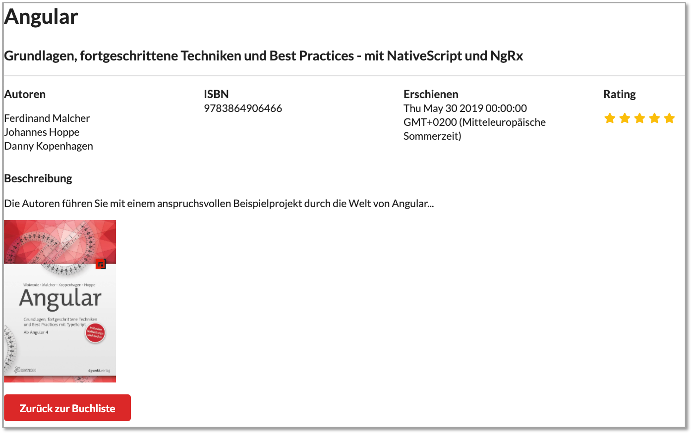

# Bücher-App

Das folgende Beispiel ist dem [Buch](https://angular-buch.com/)

> Ferdinand Malcher, Johannes Hoppe, Danny Koppenhagen:
> "Angular: Grundlagen, fortgeschrittene Themen und Best Practices"
> dpunkt.verlag, 2. Auflage, ISBN: 978-3-86490-646-6, 2019 [Link](https://books.google.de/books/about/Angular.html?id=d46gDwAAQBAJ&redir_esc=y)

entnommen (und nur unwesentlich geändert).


In der App soll eine Liste von Büchern angezeigt werden, für jedes einzelne Buch soll eine Detailansicht existieren und Bücher können hinzugefügt werden.

## Projekt anlegen

Wir gehen wie [in beschrieben](./angular.md/#erstes-projekt-erstellen) vor. Wir wollen unsere App `book-app` nennen.

```
ng new book-app
```

Wir werden gefragt, ob wir Routing verwenden möchten (Antwort: `y`) und welches StyleSheet-Format wir verwenden (Antwort: `CSS`):

```
? Would you like to add Angular routing? Yes
? Which stylesheet format would you like to use? CSS
```

Nachdem das Projekt erstellt wurde, wechseln wir im Terminal in das Verzeichnis `book-app`

```
cd book-app
```

und rufen darin

```
npm install
```

auf, um alle in `package.json` definierten Abhängigkeiten und Module einzubinden. Danach kann die Anwendung durch Eingabe von

```
ng serve
```

gestartet werden. Öffnen Sie den Browser und geben Sie als URL `http://localhost:4200/` ein. Es erscheint die Angular-Projekt-Startseite (siehe auch [Erstes Angular-Projekt erstellen](http://localhost:8000/angular/#erstes-projekt-erstellen)).

Öffnen Sie nun noch in Ihrer IDE (z.B. [IntelliJ IDEA](https://www.jetbrains.com/de-de/idea/)) das Projekt `book-app`, um Ihre Implementierungen durchzuführen. Zunächst kümmern wir uns allerdings erst noch um das Aussehen des Projektes - um moderne, einheitliche Styles. 

### CSS-Framework Semantic UI einbinden

Es ist üblich, eines der bekannten Style-Frameworks (z.B. [Bootstrap](https://getbootstrap.com/) oder [Material Design](https://materializecss.com/about.html)) einzubinden. Für die Bücher-App soll dafür [Semantic UI](https://semantic-ui.com/) verwendet werden. Geben Sie dazu im Terminal in dem `book-app`-Verzeichnis 

```
npm install semantic-ui-css
```

ein. Durch diese Anweisung werden die benötigten Style-Dateien geladen und unter dem Ordner `node_modules/semantic-ui-css` gespeichert. Diese müssen jetzt nur noch in das Projekt eingebunden werden. Öffnen Sie dazu in Ihrer IDE die Datei `angular.json`. Bei dieser Datei handelt es sich um eine [JSON](./javascript/#json)-Datei, die für die Konfiguration unserer Angular-Anwendung zuständig ist. In der `angular.json`-Datei ändern wir unter **"projects"-->"book-app"-->"architect"-->"build"-->"options"-->"styles"** den Eintrag von 

```json
"styles": [
              "src/styles.css"
            ],
```

auf 
```json
"styles": [
              "node_modules/semantic-ui-css/semantic.css"
            ],
```

Die gleiche Änderung führen wir in `angular.json` unter **"test"** (statt **"build"**) durch, um die Styles auch beim Testen einzubeziehen. Also unter **"projects"-->"book-app"-->"architect"-->"test"-->"options"-->"styles"** ebenfalls nach

```json
"styles": [
              "node_modules/semantic-ui-css/semantic.css"
            ],
```

ändern.

Um zu testen, ob das Einbinden der Semantic-UI-Styles geklappt hat, öffnen wir in der IDE die Datei `app.component.html` und löschen darin alles bis auf `<router-outlet></router-outlet>`. Stattdessen geben wir davor ein (Listing zeigt auch `<router-outlet></router-outlet>` - also die dann vollständige Datei `app.component.html`):

```html
<div class="ui active inverted dimmer">
  <div class="ui text loader large">Lade Bücher ...</div>
</div>
<router-outlet></router-outlet>
```

Wir gestalten also das Template unserer App-Komponente als ein `div` im `div`. Beiden `div`s werden CSS-Klassen aus dem Semantic-UI-Framework zugeordnet (siehe z.B. Klasse [loader](https://semantic-ui.com/elements/loader.html)). 

Unsere Webseite sollte nun so aussehen:


!!! success
    Der erste Teil unserer Bücher-App ist erstellt! Wir haben eine Anwendung erstellt und diese aufgerufen. Wir haben ein CSS-Framework eingebunden und erste Änderungen am HTML-Code vorgenommen. Unter `http://localhost:4200/` ist unsere Anwendung nun im Browser sichtbar und alle unseren zukünftigen Änderungen am Code werden automatisch (ohne erneuten Aufruf) der Seite dargestellt.

## Datenmodell und Daten

Wir wollen Details (Daten) über Bücher speichern und verwenden dazu die [JavaScript Object Notation (JSON)](https://www.ecma-international.org/publications/standards/Ecma-404.htm). Zunächst wird Angular jedoch das dazugehörige Datenmodell bekannt gemacht. Dies geschieht mithilfe eines [Interfaces](https://www.typescriptlang.org/docs/handbook/interfaces.html). Wir erstellen ein solches Interface mithilfe der [Angular CLI](https://angular.io/cli) im Terminal (Sie sind im `book-app`-Verzeichnis): 

```
ng g interface shared/book
```

Die obige Anweisung erstellt eine Datei `book.ts` im Ordner `src/app/shared`. Der `shared`- Ordner wird automatisch angelegt. In der obigen Anweisung steht `g` für `generate` ([hätte man auch schreiben können](https://angular.io/cli)).

In der IDE öffnen wir die Datei `book.ts`. Sie enthält nur die Interface-Deklaration ohne Inhalt:

```javascript
export interface Book {
}
```

Wir implementieren das Interface wie folgt:

```javascript
export interface Book {
  isbn: string;
  title: string;
  authors: string[];
  published: Date;
  subtitle?: string;
  rating?: number;
  thumbnails?: Thumbnail[];
  description?: string;
}

export interface Thumbnail {
  url: string;
  title?: string;
}
```

Das bedeutet, dass unser Datenmodell so aussieht, dass die Details über ein Buch folgende Daten beinhalten:  `isbn`, `title`, `authors`, `published`, `subtitle`, `rating`, `thumbnails`, `description`. Die Fragezeichen hinter den Bezeichnern geben an, dass die jeweilige Eigenschaft optional ist, d.h. dass ihr kein Wert zugeordnet werden muss. Die Eigenschaft `thumbnail` ist vom Typ `Thumbnail`-Array. Dieser Typ ist kein Standard-TypeScript-Typ, sondern von uns definiert. `Thumbnail` definieren wir ebenfalls als Interface, bestehend aus 2 Eigenschaften `url` und (optional) `title`. Die Definition dieses Interfaces erfolgt ebenfalls direkt in `book.ts`. Wir haben also 2 Interfaces diefiniert: `Book` und `Thumbnail`. Die Daten werden zunächst direkt in eine neu zu erstellende Komponente zum Anzeigen der Bücher-Liste eingebunden:

### Bücherliste erstellen

Zur Anzeige aller gespeicherten Bücher erstellen wir eine neue Komponente `book-list`. Siehe dazu auch [**Angular --> Eine neue Komponente erzeugen**](http://127.0.0.1:8000/angular/#eine-neue-komponente-erzeugen):

```
ng generate component book-list
```

Es ensteht ein neuer Ordner `src/app/book-list`, welcher die 4 Dateien:

- `book-list.component.css`
- `book-list.component.html`
- `book-list.component.spec.ts`
- `book-list.component.ts`

enthält. In der IDE öffnen wir zunächst die `book-list.component.html`. Sie sieht so aus:

```html
<p>book-list works!</p>
```

Wir ersetzen den Inhalt vollständig durch den folgenden HTML-Code:

```html
<div class="ui middle aligned selection divided list">
<a *ngFor="let book of books" class="item">
  
  <div class="content">
    <div class="header">{{ book.title }}</div>
    <div *ngIf="book.subtitle" class="description">{{ book.subtitle }}</div>
    <div class="metadata">
        <span *ngFor="let author of book.authors; last as l">{{ author }}
          <span *ngIf="!l">, </span>
        </span>
      <br />
      ISBN {{ book.isbn }}
    </div>
  </div>
</a>
</div>
```

Obiger Code enthält einige Strukturdirektiven (siehe [**Angular --> \*Strukturdirektiven**](../angular/#strukturdirektiven))). So läuft bspw. die `*ngFor`-Direktive in der zweiten Zeile durch die Liste `books` und erzeugt für jedes Buch aus der Liste `books` einen Hyperlink `<a>`. Diese existiert jedoch noch gar nicht, so dass unsere App sich derzeit nicht ausführen lässt. Die erste `*ngIf`-Direktive in der vierten Zeile prüft zunächst, ob das Array `book.thumbnails` überhaupt existiert und wenn ja, ob dieses Array einen ersten Eintrag hat `book.thumbnails[0]` und wenn das der Fall ist, ob dieser erste Eintrag auch eine `url` enthält (siehe Interfaces `Book` und `Thumbnail`). Wenn diese `url` existiert, wird durch ein **Property-Binding** (siehe [**Angular --> [Property Binding]**](../angular/#property-bindings)) dem `src`-Attribut von `<a>` der Wert zugeordnet, der unter `book.thumbnails[0].url` im JSON gespeichert ist.

Die Liste der Autoren eines Buches wird ebenfalls mithilfe der Strukturdirektive `*ngFor` durchlaufen. Außerdem findet die Hilfsvariable `last` dieser Strukturdirektive Anwendung (siehe [**Angular --> \*Strukturdirektiven**](../angular/#strukturdirektiven))). Alle Autoren werden durch Komma getrennt. Nur nach dem letzten Autor wird kein Komma hinzugefügt. Dies gelingt mithilfe der Strukturdirektive `*ngIf` und der Abfrage, ob es sich **nicht** um das letzte Element handelt - dann Komma.

Wir benötigen jetzt für unsere Komponente noch die Liste der Bücher - ein `Book`-Array. Dieses legen wir in der Datei `book-list.component.ts` an. Wir öffnen diese Datei - sie sieht wie folgt aus:

``` javascript
import { Component, OnInit } from '@angular/core';

@Component({
  selector: 'app-book-list',
  templateUrl: './book-list.component.html',
  styleUrls: ['./book-list.component.css']
})
export class BookListComponent implements OnInit {

  constructor() { }

  ngOnInit(): void {
  }

}
```

Die (TypeScript-)Klasse `BookListComponent` enthält zwei Methoden:

- den Konstruktor `constructor() { }`
- `ngOnInit(): void { }`

`ngOnInit()` ist eine Methode aus dem Interface `OnInit`. Dabei handelt es sich um einen sogenannten *Lifecycle-Hook* (siehe [**Angular --> Lifecycle-Hooks**](../angular/#lifecycle-hooks)). Die Methode `ngOnInit()` wird immer dann (automatisch) ausgeführt, wenn die Komponente geladen wird.

Wir ersetzen den bisherigen Code der Datei `book-list.component.ts` durch:

``` javascript
import { Component, OnInit } from '@angular/core';
import {Book} from '../shared/book';

@Component({
  selector: 'app-book-list',
  templateUrl: './book-list.component.html',
  styleUrls: ['./book-list.component.css']
})
export class BookListComponent implements OnInit {
  books: Book[];

  constructor() { }

  ngOnInit(): void {
    this.books = [
      {
        isbn: '9783864906466',
        title: 'Angular',
        authors: ['Ferdinand Malcher', 'Johannes Hoppe', 'Danny Kopenhagen'],
        published: new Date(2019, 4, 30),
        subtitle: 'Grundlagen, fortgeschrittene Techniken und Best Practices - mit NativeScript und NgRx',
        rating: 5,
        thumbnails: [{
          url: 'https://ng-buch.de/cover2.jpg',
          title: 'Buchcover'}],
        description: 'Die Autoren führen Sie mit einem anspruchsvollen Beispielprojekt durch die Welt von Angular...',
      },
      {
        isbn: '9783864903274',
        title: 'React',
        authors: ['Oliver Zeigermann', 'Nils Hartmann'],
        published: new Date(2016, 6, 17),
        subtitle: 'Die praktische Einführung in React, React Router und Redux',
        rating: 3,
        thumbnails: [{
          url: 'https://ng-buch.de/cover1.jpg',
          title: 'Buchcover'
        }],
        description: 'React ist ein JavaScript-Framework zur Entwicklung von Benutzeroberflächen ...',
      },
      {
        isbn: '978-3-86490-578-0',
        title: 'Effective Java',
        authors: ['Joshua Bloch'],
        published: new Date(2018, 9, 1),
        subtitle: 'Best Practices für die Java-Plattform',
        rating: 3,
        thumbnails: [{
          url: 'https://www.dpunkt.de/common/images/cover_masterid/300/13216.jpg',
          title: 'Buchcover'
        }],
        description: 'Seit der Vorauflage von \"Effective Java\" hat sich Java dramatisch verändert...',
      }
    ];
  }

}
```

Somit existiert die Eigenschaft `books` für die Komponente nun (siehe `books: Book[]`). Auf diese Eigenschaft kann innerhalb der Klasse mit `this.books` zugegriffen werden. Dies passiert auch in der `ngOnInit()`-Methode. Dort wird das Array mit Daten befüllt (mit zunächst 3 Büchern). Die Syntax entspricht der [JavaScript Object Notation (JSON)](../javascript/#json).

Damit unsere Komponente überhaupt sichtbar ist, binden wir sie noch in unsere Root-Komponente ein. Der Selektor unserer `book-list`-Komponente ist `app-book-list`. Wir binden diesen Selektor als HTML-Element in `app.component.html` ein. 


=== "app.component.html (alt)"
    ``` html
    <div class="ui active inverted dimmer">
      <div class="ui text loader large">Lade Bücher ...</div>
    </div>
    <router-outlet></router-outlet>
    ```
=== "app.component.html (neu)"
    ``` html
    <app-book-list></app-book-list>
    <router-outlet></router-outlet>
    ```

Die App ist nun ausführbar. Im Browser erscheint folgende Darstellung:


!!! success
	Der zeite Teil unserer Bücher-App ist erstellt! Wir haben zwei Interfaces (`Book` und `Thumbnail`) und eine neue Komponente (`book-list`) erstellt. Wir haben Direktiven verwendet (`*ngFor` und `*ngIf`), um durch Daten zu manövrieren und diese entsprechend darszustellen. Wir haben Daten im JSON-Format gespeichert.

## Datenfluss zwischen Komponenten

In diesem Abschnitt wird der Datenfluss von Eltern- auf Kindkomponenten und von Kind- auf Elternkomponenten betrachtet. Letzteres erreicht man über *event binding* (siehe [**Angular-->Event Binding**](../angular/#event-binding)). Wir betrachten zunächst den Datenfluss von Eltern- auf Kindkomponenten. Das grundlegende Prinzip dabei ist das *property binding* (siehe dazu [**Angular --> [Property Bindings]**](../Angular/#property-bindings)).

### Datenfluss von Eltern- auf Kindkomponenten

Wir legen uns dazu zunächst eine weitere Komponente in unserer Bücher-App an - die Komponente `book-list-item`. Sie ist dafür zuständig, die Informationen über ein einzelnes Buch im Detail anzuzeigen. Wir werden zu dieser Detailansicht gelangen, indem wir ausgehend von der Liste der Bücher auf ein einzelnes Buch klicken - dieses wird dann im Detail angezeigt.

Wechseln Sie im Terminal in den Ordner Ihrer Bücher-App `book-app` und geben dort zum Erzeugen der neuen Komponente ein:

```
ng g c book-list-item
```

Im Ordner `book-app/src/app` entsteht eine neue Komponente (ein neuer Ordner) `book-list-item` mit den Dateien `book-list-item.component.ts`, `book-list-item.component.html`, `book-list-item.component.css` und `book-list-item.component.spec.ts`.

Wir kopieren zunächst den Teil aus der `book-list.component.html` in die `book-list-item.component.html`, der die Details eines Buches anzeigt. Im folgenden Tab sind jeweils die `*.component.html`gemeint.

=== "book-list (alt)" 
    ``` html hl_lines="3-16"
    <div class="ui middle aligned selection divided list">
    <a *ngFor="let book of books" class="item">
      
      <div class="content">
        <div class="header">{{ book.title }}</div>
        <div *ngIf="book.subtitle" class="description">{{ book.subtitle }}</div>
        <div class="metadata">
            <span *ngFor="let author of book.authors; last as l">{{ author }}
              <span *ngIf="!l">, </span>
            </span>
          <br />
          ISBN {{ book.isbn }}
        </div>
      </div>
    </a>
    </div>
    ```
=== "book-list-item"
    ``` html
    
      <div class="content">
        <div class="header">{{ book.title }}</div>
        <div *ngIf="book.subtitle" class="description">{{ book.subtitle }}</div>
        <div class="metadata">
            <span *ngFor="let author of book.authors; last as l">{{ author }}
              <span *ngIf="!l">, </span>
            </span>
          <br />
          ISBN {{ book.isbn }}
        </div>
      </div>
    ```

=== "book-list (neu - zunächst)" 
    ``` html
    <div class="ui middle aligned selection divided list">
    <a *ngFor="let book of books" class="item">
      <!-- dieses Anchorelement (Hyperlink <a>) wird gleich geändert
           aber die Direktive *ngFor bleibt -->
    </a>
    </div>
    ```

Nachdem wir den oben gelb unterlegten Teil nach `book-list-item.component.html` geschoben haben, fällt auf, dass die Variable `book` in der Komponente `book-list-item` (noch) unbekannt ist. Dies wird nun geändert. Zunächst ändern das HTML-Element, das uns die Details eines Buches anzeigen soll von `<a>` nach `<app-book-list-item>` - das ist der Selektor unserer neuen Komponente. 

=== "book-list.component.html" 
    ``` html linenums="1"
    <div class="ui middle aligned selection divided list">
    <app-book-list-item class="item" 
        *ngFor="let b of books" 
        [book]="b">
    </app-book-list-item>
    </div>
    ```

In Zeile 2 erkennt man die Verwendung des Selektors `app-book-list-item`, hier erfolgt der "Aufruf" unserer neuen Komponente. In Zeile 3 wird die bereits bekannte Direktive `*ngFor` angewendet (siehe [**Angular-->\*Strukturdirektiven**](../angular/#strukturdirektiven)), mit der wir durch unser Array von Büchern (`Book[]`) laufen. In Zeile 4 findet nun das *property binding* statt (siehe [**Angular --> [Property Bindings]**](../Angular/#property-bindings))). Der Eigenschaft `book` wird jeweils der Wert der Variable `b` übergeben. 

Das bedeutet, dass wir in der Elternkomponente `book-list` die Kindkomponente `book-list-item` aufrufen und in der Elternkomponente einer Eigenschaft der Kindkomponente `book` einen Wert zuweisen. Es erfolgt also ein Datenfluss von der Elternkoponente zur Kindkomponente unter Verwendung von *property binding*. Es fehlt nur noch zwei Sachen: 

- die Eigenschaft `book` (vom Typ `Book`) muss noch als Eigenschaft (Objektvariable) der Komponente `book-list-tem` deklariert werden. 
- es muss mithilfe des *Decorators* `@Input()` aggeben werden, dass die Werte (Daten) für diese Eigenschaft "in die Komponente hineinfließen".

Beides erreichen wir durch Änderungen der Datei `book-list-item.component.ts` wie folgt:

=== "book-list-item.component.ts" 
    ``` javascript linenums="1"
    import {Component, Input, OnInit} from '@angular/core';
    import {Book} from '../shared/book';

    @Component({
      selector: 'app-book-list-item',
      templateUrl: './book-list-item.component.html',
      styleUrls: ['./book-list-item.component.css']
    })
    export class BookListItemComponent implements OnInit {
      @Input()  book: Book;

      constructor() { }

      ngOnInit(): void {
      }

    }
    ```

Wesentlich ist die Zeile 10. Dort sehen Sie die Deklaration der Eigenschaft `book: Book` und die Verwendung der Directive `@Input()`. Sowohl das Interface `Book` als auch die Directive `@Input` müssen noch eingebunden werden (Zeilen 1 und 2). Lassen Sie dies am besten Ihre IDE erledigen. Gehen Sie mit der Maus über die rot dargestellten Bezeichner (`Book` und `@Input()`) und wählen Sie jeweils den automatischen Korrekturvorschlag aus. 


!!! success
    Der dritte Teil unserer Bücher-App ist erstellt! Leider hat sich in der Ansicht nichts geändert. Zwar wissen wir jetzt, wie der Datenfluss von Eltern- auf Kindkomponenten erfolgt (nämlich mit *property binding* und der Deklaration der Eigenschaft (property) mithilfe des `@Input()`-Decorators). Aber der Wechsel der Ansicht ist noch nicht realisiert. Dieser soll durch ein Ereignis ausgelöst werden, nämlich wenn wir auf eines der Bücher aus der Liste klicken. Die Behandlung von Ereignissen (*event binding*) ist Thema des nächsten Abschnittes.

### Datenfluss von Kind- auf Elternkomponenten

Der Datenfluss von Kind- auf Elternkomponenten kann mithilfe von *event binding* organisiert werden (siehe dazu [**Angular-->Eigene Ereignisse**](../angular/#eigene-ereignisse)). 

Wir werden eine `BookDetailsComponent` erzeugen. Diese zeigt die Details eines Buches. In unserer `BookListComponent` definieren wir ein Ereignis, das diese Detail-Ansicht aufruft und dabei das entsprechende Buch übergibt. In der `BookDetailsComponent` definieren wir ein Ereignis, das die Listendarstellung aller Bücher wieder aufruft.

Wir erzeugen zunächst die `BookDetailsComponent`:

```
ng g c book-details
```

Wir planen folgende Kommunikation zwischen den Komponenten (Abbildung ebenfalls aus eingangs erwähntem [Buch](https://angular-buch.com/)):


Wir erweitern zunächst die Komponente `AppComponent` um zwei weitere Eigenschaften: `book` vom Typ `Book` (die Daten eines Buches sollen ja an die Komponente `BookDetailsComponent` mithilfe von *property binding* weitergegeben werden) und einen `viewState`, der zwischen den beiden Ansichten `BookList` und `BookDetails` umschalten soll. Dazu vereinbaren wir einen neuen Typ `ViewState`, der 2 verschiedene Werte annehmen kann `list` und `details`. Die neue `app.component.ts` sieht dann so aus:

=== "app.component.ts"
    ``` javascript linenums="1"
    import { Component } from '@angular/core';

    import { Book } from './shared/book';

    type ViewState = 'list' | 'details';

    @Component({
      selector: 'app-root',
      templateUrl: './app.component.html',
      styleUrls: ['./app.component.css']
    })
    export class AppComponent {
      book: Book;
      viewState: ViewState = 'list';

      showList() {
        this.viewState = 'list';
      }

      showDetails(book: Book) {
        this.book = book;
        this.viewState = 'details';
      }
    }
    ``` 

Neben den beiden Eigenschaften `book` und `viewState` (`viewState` ist vom Typ `ViewState` - dieser wurde in Zeile 5 erstellt) wurde auch zwei Methoden hinzugefügt: `showList()` und `showDetails(book: Book)`. `showList()` wird von der Kindkomponente `BookDetailsComponent` als Ereignis aufgerufen (*event binding*). `showDetails()` wird von der Kindkomponente `BookListComponent` als Ereignis aufgerufen und liefert als *payload* des Ereignisses die Informationen über das Buch mit, auf das innerhalb der Liste geklickt wurde (siehe auch [**Angular-->Eigene Ereignisse**](../angular/#eigene-ereignisse)). Die beiden Methoden schalten jeweils zwischen den `viewState`s um. 

Im Template der `AppComponent` wird mittels der `*ngIf`-Direktive zwischen den Ansichten der beiden Komponenten `BookDetailsComponent`und `BookListeComponent` umgeschaltet, je nachdem, welcher Wert `viewState` aufweist:

=== "app.component.html"
    ``` html linenums="1"
    <app-book-list
      *ngIf="viewState === 'list'"
      (showDetailsEvent)="showDetails($event)"></app-book-list>

    <app-book-details
      *ngIf="viewState === 'details'"
      (showListEvent)="showList()"
      [book]="book"></app-book-details>

    <router-outlet></router-outlet>
    ```

Die beiden Events `showDetailsEvent` und `showListEvent` der beiden Komponenten `BookListComponent` bzw. `BookDetailsComponent` sind noch nicht in den jeweiligen Komponenten angelegt, ebenso noch nicht die Eigenschaft `book` in der `BookDetailsComponent`. Das machen wir jetzt in beginnen mit der `BookListComponent`.

In der `BookListComponent` soll ein eigenes Event (`showDetailsEvent`) definiert werden. Wir gehen dazu vor, wie in [**Angular-->Eigene Ereignisse**](../angular/#eigene-ereignisse) beschrieben. Wichtig ist, dass wir einen *payload* des Events übergeben, nämlich das jeweilige Buch auf das geklickt wurde. Dieser *payload* wird in der Methode `showDetails($event)` der `AppComponent` verarbeitet. Wir öffnen die `book-list.component.ts` und *fügen hinzu*:

!!! caution
    Achten Sie darauf, dass Sie nur den Teil hinzufügen, der noch nicht in Ihrer `book-list.component.ts` enthalten ist. Diese Datei ist durch das JSON schon recht lang. Es kommen nur die Zeilen 8 und 14-16 hinzu und in der ersten Zeile werden `EventEmitter` und `Output` aus `@angular/core` importiert!

=== "book-list.component.ts"
    ``` javascript linenums="1"
    import {Component, EventEmitter, OnInit, Output} from '@angular/core';
    import {Book} from '../shared/book';

    @Component({ /* bleibt wie es ist */ })

    export class BookListComponent implements OnInit {
      books: Book[];
      @Output() showDetailsEvent = new EventEmitter<Book>();

      constructor() { }

      ngOnInit(): void { /* bleibt wie es ist */ }

      showDetails(book: Book) {
        this.showDetailsEvent.emit(book);
      }

    }
    ```

Im Template der `BookListComponent` kommt nur ein *event binding* hinzu. Wir binden das native DOM-Ereignis `click` an die Ereignisbehandlung `showDetails()` und übergeben dabei als *payload* das entsprechende Buch `b`. Das bedeutet, dass jetzt jedes einzelne `BookItem` (es gibt für jedes Buch eine eigens `BookItem` - siehe `*ngFor`) ein Click-Ereignis existiert. Klicken wir also auf einen Eintrag in unserer `BookList`, dann wird das `showDetails()`-Ereignis ausgelöst, das entsprechende Buch als *payload* übergeben und an die `AppComponent` weitergereicht, die dann auf die `BookDetails`-Ansicht umschaltet. Die um diese eine Zeile (Zeile 5) erweiterte `book-list.component.html` sieht nun so:

=== "book-list.component.html"
    ``` html linenums="1"
    <div class="ui middle aligned selection divided list">
    <app-book-list-item class="item"
        *ngFor="let b of books"
        [book]="b"
        (click)="showDetails(b)">
    </app-book-list-item>
    </div>
    ```

!!! note "Reflexion"
    Wir sehen in dem obigen kleinen Beispiel `book-list.component.html` sehr schön vier Konzepte: 1. die Komponente `BookListComponent` ruft die Komponente `BookListItemComponent` auf. Damit ist `BookListComponent` eine Elternkomponente der Kindkomponente `BookListItemComponent` (Zeile 2). 2. der Einsatz der Direktive `*ngFor`. Für jeden einzelnen Eintrag aus dem Array `books` wird ein neues HTML-Element `<app-book-list-item>` erzeugt. 3. Ein *property binding*, bei der der Ausdruck `"b"` and die Eigenschaft `book` gebunden wird und 4. ein *event binding*, bei der wir die Ereignisbehandlung `showDetails(b)` an das native DOM-Element `click` binden.

Jetzt kümmern wir uns noch um unsere neue Komponente `BookDetailsComponent`. Zwei Konzepte kennen wir bereits:

1. definieren wir uns eine Eigenschaft `book`, deren Wert wir als `@Input()` von der Elternkomponente `AppComponent` erhalten (siehe dazu [Datenfluss von Eltern- auf Kindkomponenten](./#datenfluss-von-eltern-auf-kindkomponenten)).
2. definieren wir uns ein eigenes Ereignis, welches an die Elternkomponente `AppComponent` weitergereicht wird (siehe dazu `book-list.component.ts` oben)

Es wird noch eine dritte Kleinigkeit eingefügt: eine Methode `getRating(number)`, die für eine gegebene Zahl ein Array der übergebenen Länge zurückgibt. Wir werden im Template sehen, was es damit auf sich hat. Die `book-details.component.ts` sieht dann wie folgt aus:

=== "book-details.component.ts"
    ``` javascript linenums="1"
    import {Component, EventEmitter, Input, OnInit, Output} from '@angular/core';
    import {Book} from '../shared/book';

    @Component({
      selector: 'app-book-details',
      templateUrl: './book-details.component.html',
      styleUrls: ['./book-details.component.css']
    })
    export class BookDetailsComponent implements OnInit {
      @Input() book: Book;
      @Output() showListEvent = new EventEmitter<any>();

      ngOnInit() {
      }

      getRating(num: number) {
        return new Array(num);
      }

      showBookList() {
        this.showListEvent.emit();
      }
    }
    ```

Das zugehörige Template ist recht umfangreich. Wir gehen auf einzelne Details ein, zeigen es aber zunächst:

=== "book-details.component.html"
    ``` html linenums="1"
    <div *ngIf="book">
      <h1>{{ book.title }}</h1>
      <h3 *ngIf="book.subtitle">{{ book.subtitle }}</h3>
      <div class="ui divider"></div>
      <div class="ui grid">
        <div class="four wide column">
          <h4>Autoren</h4>
          <ng-container *ngFor="let author of book.authors">
            {{ author }}<br>
          </ng-container>
        </div>
        <div class="four wide column">
          <h4>ISBN</h4>
          {{ book.isbn }}
        </div>
        <div class="four wide column">
          <h4>Erschienen</h4>
          {{ book.published }}
        </div>
        <div class="four wide column">
          <h4>Rating</h4>
          <i class="yellow star icon"
            *ngFor="let r of getRating(book.rating)"></i>
        </div>
      </div>
      <h4>Beschreibung</h4>
      <p>{{ book.description }}</p>
      <div class="ui small images">
        
      </div>
      <button class="ui red button"
              (click)="showBookList()">
        Zurück zur Buchliste
      </button>
    </div>
    ```

Die Detailansicht sollte dann etwa so aussehen:



!!! success
    Der vierte Teil unserer Bücher-App ist erstellt! Wir wissen jetzt, wie wir Ereignisse behandeln und sogar eigene Ereignisse erstellen können und wie wir mit diesen eigenen Ereignissen und *event bining* Daten an die Elternklasse übergeben können. Damit können wir jetzt sowohl von Eltern- nach Kindklassen als auch zurück Daten transferieren und durch Ereignisse zwischen verschiedenen Komponenten hin- und herwechseln. Für viele Komponenten und eine tiefe Verschachtelung ist die Komplexität jedoch mit diesen Konzepten zu hoch. Wir lernen zwei weitere Konzepte kennen, die uns helfen, diese Komplexität zu meistern: *Services* und *Routing*. 

## Service `BookStoreService` 

Derzeit ist die Liste (genauer: das Array) unserer Bücher statisch als JSON innerhalb der Komponente `BookListComponent` gespeichert (siehe in `ngOnInit()` `this.books = [ ... ]`). Die `BookListComponent` verwaltet somit die Bücher und stellt diese auch noch als Liste dar. Wir wollen die Darstellung unabhängig von der "Datenspeicherung" gestalten und die Datenverwaltung (Speicherung und Bereitstellung) in einen *Service* auslagern (siehe [**Angular-->Services**](../angular/#services)). 

Um einen Service mithilfe der CLI anzulegen (zu generieren), verwenden wir das Attribut `service` anstelle von `component`. Außerdem ist es guter Stil, Services in den `shared`-Ordner abzulegen, da ja alle Komponenten einen Service nutzen können. Wir erzeugen einen Service `BookStoreService`:

```
ng g service shared/book-store
```

Nach der Erzeugung sieht der Service zunächst so aus:

=== "book-store.service.ts"
    ```javascript
    import { Injectable } from '@angular/core';

    @Injectable({
      providedIn: 'root'
    })
    export class BookStoreService {

      constructor() { }
    }
    ```

Für Services gibt es keine Lifecycle-Hooks. Wir finden hier deshalb auch keine `ngOnInit()`-Methode. Während Komponenten den Decorator `@Component()` aufweisen, wird für Services der Decorator `@Injectable()` verwendet. Mit diesem Decorator geben wir an, dass der Service weitere Abhängigkeiten einbinden kann. Dies geschieht typischerweise über einen Parameter im Konstruktor - eine soganannte *dependency injection* (wenn über den Konstruktor, dann *constructor injection*). Auch wenn wir eine solche Abhängigkeit nicht einbinden, sollte der Decorator `@Injectable()` stets für einen Service angegeben werden. Dies liegt daran, dass wir diesen Decorator um die `providedIn`-Eigenschaft erweitern. Mit `providedIn: 'root'` geben wir an, dass der Service allen Komponenten (im gesamten Root-Modul) zur Verfügung steht, er also von allen Komponenten genutzt werden kann. 

In unseren Service integrieren wir nun folgende Eigenschaften:

- das `Book`-Array `books` aus der `BookListComponent` und
- die Methode `getAll()`, die dieses Array zurückgibt, also alle Bücher aus dem Array `books`.

=== "book-store.service.ts"
    ```javascript
    import { Injectable } from '@angular/core';
    import {Book} from './book';

    @Injectable({
      providedIn: 'root'
    })
    export class BookStoreService {
      books: Book[];

      constructor() { 
        this.books = [
        {
          isbn: '9783864906466',
          /*  das gesamte Array aus book-list.component.ts 
              hier her bewegen 
          */
        },
      }

      getAll(): Book[] {
        return this.books;
      }
    }
    ```
=== "book-list.component.ts"
    ```javascript
    import {Component, EventEmitter, OnInit, Output} from '@angular/core';
    import {Book} from '../shared/book';

    @Component({
      selector: 'app-book-list',
      templateUrl: './book-list.component.html',
      styleUrls: ['./book-list.component.css']
    })
    export class BookListComponent implements OnInit {
      books: Book[];
      @Output() showDetailsEvent = new EventEmitter<Book>();

      constructor() { }

      ngOnInit(): void { }

      showDetails(book: Book) {
        this.showDetailsEvent.emit(book);
      }
    }
    ```

Es wurde also die gesamte Wertebelegung für `this.books` mit dem JSON von der Datei `book-list.component.ts` (dort aus `ngOnInit()`) nach `book-store.service.ts` (hier in den Konstruktor `constructor()` - Liefecycle-hooks gibt es für Services ja nicht) verschoben.
Dazu wurde dem Service die Eigenschaft `books` hinzugefügt (Typ `Book[]` - das Interface `Book` muss dazu importiert werden). Außerdem wurde in dem Service die Methode `getAll()`implementiert.

Nun kann der Service in der `BookListComponent` verwendet werden. Dazu werden

- der `BookService` importiert, 
- der `BookService` mittels *dependency injection* (*constructor injection*) in die Komponente eingebunden und
- die Methode `getAll()` des Services aufgerufen, um die Eigenschaft `this.books` mit dem `Book`-Array zu initialisieren.

=== "book-list.component.ts"
    ```javascript
    import {Component, EventEmitter, OnInit, Output} from '@angular/core';
    import {Book} from '../shared/book';
    import {BookStoreService} from '../shared/book-store.service';

    @Component({
      selector: 'app-book-list',
      templateUrl: './book-list.component.html',
      styleUrls: ['./book-list.component.css']
    })
    export class BookListComponent implements OnInit {
      books: Book[];
      @Output() showDetailsEvent = new EventEmitter<Book>();

      constructor(private bs: BookStoreService) { }

      ngOnInit(): void {
        this.books = this.bs.getAll();
      }

      showDetails(book: Book) {
        this.showDetailsEvent.emit(book);
      }
    }
    ```

Beachten Sie, dass die *dependency injection* des Services dazu führt, dass `bs` eine Eigenschaft der `BookListComponent` ist, ohne dass diese Eigenschaft explizit deklariert wird. In `ngOnInit()` wird über `this.bs` auf den Service zugegriffen.

Die Anwendung sieht zwar genauso aus wie vorher, aber wir haben die `BookListComponent` davon entlastet, das Bücher-Array speichern zu müssen. Diesen Dienst haben wir in einen Service augelagert, der außerdem noch die Methode `getAll()` zur Verfügung stellt, mit dem das gesamte Bücher-Array zurückgegeben wird. 

!!! success
    Der fünfte Teil unserer Bücher-App ist erstellt! Die Anwendung sieht zwar genauso aus wie vorher, aber wir haben die `BookListComponent` davon entlastet, das Bücher-Array speichern zu müssen. Diesen Dienst haben wir in einen Service augelagert, der außerdem noch die Methode `getAll()` zur Verfügung stellt, mit dem das gesamte Bücher-Array zurückgegeben wird. Nun wollen wir mithilfe von *Routing* besser durch unsere Anwendung navigieren. 

## Routing

Derzeit hat unsere App zwei Sichten: einerseits die Listenansicht aller Bücher (Template der `BookListComponent`, wobei jede Zeile der Liste/jedes Buch durch das Template der `BookListItemComponent` dargestellt wird) und die Detailansicht eines Buches (Template der `BookDetailsComponent`). Zwischen diesen Sichten (*views*) wechseln wir durch Nutzereignisse hin- und her. Von der Listenansicht auf die Detailansicht kommen wir durch Anklicken einer Buchzeile und zurück kommen wir durch Klicken des Buttons "Zurück zur Buchliste". Unsere URL bleibt jedoch immer gleich, nämlich `localhost:4200`. Ein direkter Zugriff auf die Detailansicht eines Buches ist nicht möglich, sondern erfolgt immer über die Listenansicht. Dies soll im folgenden geändert werden. Zum Beispiel könnte die Detailansicht des Buches mit der ISBN 9783864906466 mithilfe der URL `localhost:4200/books/9783864906466` erfolgen. Eine solche URL hätte auch den Vorteil, dass man diese URL an andere versenden könnte, um auf ein konkretes Buch aufmerksam zu machen. Zur Erstellung solcher Pfade wird das Konzept des *Routings* in Angular verwendet (siehe [**Angular --> Routing**](../angular/#routing)).

Wir erweitern unsere Bücher-App zunächst um eine weitere Komponente `home`.

```
ng g c home
```

### Routen konfigurieren

In der `app-routing.module.ts` werden wir 4 Routen konfigurieren:

- `/home` zeigt die `HomeComponent`
- `/` wird auf die `/home`-Route umgeleitet, zeigt also ebenfalls auf die `HomeComponent`
- `/books` zeigt auf die `BookListComponent`
- `/books/:isbn` zeigt auf die `BooksDetailsComponent` für das entsprechende Buch mit der `isbn` des Parameterwertes

=== "app-routing.module.ts"
    ```javascript
    import { NgModule } from '@angular/core';
    import { Routes, RouterModule } from '@angular/router';
    import {HomeComponent} from './home/home.component';
    import {BookDetailsComponent} from './book-details/book-details.component';
    import {BookListComponent} from './book-list/book-list.component';

    const routes: Routes = [
      {
        path: '',
        redirectTo: 'home',
        pathMatch: 'full'
      },
      {
        path: 'home',
        component: HomeComponent
      },
      {
        path: 'books',
        component: BookListComponent
      },
      {
        path: 'books/:isbn',
        component: BookDetailsComponent
      },
    ];

    @NgModule({
      imports: [RouterModule.forRoot(routes)],
      exports: [RouterModule]
    })
    export class AppRoutingModule { }
    ```
=== "app.component.html"
    ```html
    <router-outlet></router-outlet>
    ```

Die `app.component.html` enthält nun nur noch das `<router-outlet></router-outlet>`-Element. Wenn wir nun `http://localhost:4200` aufrufen, werden wir zu `http://localhost:4200/home` umgeleitet und es erscheint die View der `HomeComponent` (`home works!`).

Wir können aber auch `http://localhost:4200/books` eingeben und es erscheint die View der `BookListComponent`, also die gesamte Liste unserer Bücher. 

### Parametrisierte Route auslesen

Wenn wir z.B. `http://localhost:4200/books/9783864906466` aufrufen, also eine ISBN übergeben, bleibt die angezeigte Seite der `BookDetailsComponent` leer. Das liegt daran, dass die in der URL übergebene ISBN noch nicht verwaltet wird, um das entsprechende Buch herauszusuchen und anzuzeigen. Dazu erweitern wir zunächst den `BookStoreService`: 

!!! caution
    Achten Sie darauf, dass Sie nur den Teil hinzufügen, der noch nicht in Ihrer `book-store.service.ts` enthalten ist. Diese Datei ist durch das JSON schon recht lang. Es kommen nur die Zeilen 18-20 hinzu!

=== "shared/book-store.service.ts"
    ```javascript linenums="1"
    import { Injectable } from '@angular/core';
    import {Book} from './book';

    @Injectable({
      providedIn: 'root'
    })
    export class BookStoreService {
      books: Book[];

      constructor() {
        this.books = [ /*  alle Einträge           */ ];
      }

      getAll(): Book[] {
        return this.books;
      }

      getSingle(isbn: string): Book {
        return this.books.find(book => (book.isbn === isbn));
      }
    }
    ```

Wir müssen nun noch die ISBN auslesen, die in der URL übergeben wird. Das Auslesen von Parameterwerten aus URLs ist in [**Angular --> Parameter an Routen**](../angular/#parameter-an-routen) beschrieben. Dazu wird `book-details.component.ts` wie folgt **erweitert**:

- `ActivatedRoute` wird importiert und dem Konstruktor injiziert, um mithilfe von `route.snapshot.paramMap` die aktuellen Werte der in der URL übergebenen Parameter abzufragen.
- Der `BookStoreService` wird importiert und dem Konstruktor injiziert, um auf das Array aller Bücher, insbesondere aber auf die `getSingle(isbn: string)`-Funktion zuzugreifen, die das Buch mit der übergebenen `isbn` zurückgibt.

Dafür **entfallen** einige Sachen aus der `book-details.component.ts`:

- Wir wechseln die Ansichten nicht mehr durch ein Ereignis, sondern überlassen dies dem Router. Deshalb entfernen wir die `@Output()`-Eigenschaft `showListEvent` und die Methode `showBookList()`.
- Das ausgewählte Buch gelangt nun nicht mehr über *property binding* in das Template, sondern über die Eigenschaft `this.book` (die ihren Wert von der Methode `getSingle()` des `BookStoreService` erhält). Wir können deshalb auch den `@Input()`-Decorator von `book: Book` entfernen.

=== "book-details.component.ts (neu)"
    ``` javascript
    import {Component, OnInit} from '@angular/core';
    import {Book} from '../shared/book';

    @Component({
      selector: 'app-book-details',
      templateUrl: './book-details.component.html',
      styleUrls: ['./book-details.component.css']
    })
    export class BookDetailsComponent implements OnInit {
      @Input() book: Book;
      @Output() showListEvent = new EventEmitter<any>();

      ngOnInit() {
      }

      getRating(num: number) {
        return new Array(num);
      }

      showBookList() {
        this.showListEvent.emit();
      }
    }
    ```
=== "book-details.component.ts (alt)"
    ``` javascript
    import {Component, EventEmitter, Input, OnInit, Output} from '@angular/core';
    import {Book} from '../shared/book';

    @Component({
      selector: 'app-book-details',
      templateUrl: './book-details.component.html',
      styleUrls: ['./book-details.component.css']
    })
    export class BookDetailsComponent implements OnInit {
      @Input() book: Book;
      @Output() showListEvent = new EventEmitter<any>();

      ngOnInit() {
      }

      getRating(num: number) {
        return new Array(num);
      }

      showBookList() {
        this.showListEvent.emit();
      }
    }
    ```

In der `book-details.component.html` wird der Button entfernt, also der folgende Teil gelöscht:

``` html
  <button class="ui red button"
          (click)="showBookList()">
    Zurück zur Buchliste
  </button>
```

!!! success
    Jetzt wird die Detail-Ansicht eines jeden Buches angezeigt, wenn Sie eine existierende `isbn` übergeben. Also z.B. `http://localhost:4200/books/9783864906466` (oder `http://localhost:4200/books/9783864903274` oder `http://localhost:4200/books/978-3-86490-578-0`). Bei einer nicht existierenden `isbn` (z.B. `http://localhost:4200/books/123`) bleibt die Seite leer.


### Routen verlinken

Derzeit müssen wir die Routen noch jeweils als URL in den Browser eingeben. Wir wollen uns nun ein Navigationsmenü erzeugen, in dem wir die jeweiligen Routen als Links hinterlegen und somit über Klicks die jeweiligen Komponenten aufrufen. Das prinzipielle Vorgehen ist in [**Angular --> Routen verlinken**](../angular/#routen-verlinken) beschrieben.

Unsere Navigationsleiste fügen wir am besten in die `AppComponent` ein, damit sie immer sichtbar bleibt. 

=== "app.component.html"
    ``` html
    <div class="ui menu">
      <a routerLink="home" class="item">Home</a>
      <a routerLink="books" class="item">Bücher</a>
    </div>

    <router-outlet></router-outlet>
    ```

Jetzt binden wir in unserer Listen-Ansicht aller Bücher noch die `isbn`-Eigenschaft an die `routerLink`-Property, um ein konkretes Buch mit der entsprechenden `isbn` auszuwählen. Wir passen dazu die `book-list.component.html` wie folgt an:

=== "book-list.component.html"
    ``` html linenums="1"
    <div class="ui middle aligned selection divided list">
    <app-book-list-item class="item"
        *ngFor="let b of books"
        [book]="b"
        [routerLink]="b.isbn">
    </app-book-list-item>
    </div>
    ```

Das `click`-Ereignis wird nun also nicht mehr benötigt und behandelt. Stattdessen binden wir mit *property binding* die `isbn`als Pfad an die Eigenschaft `routerLink`. Der Pfad ergibt sich somit aus der aktuellen Komponente (`/books`) und der `isbn` des Buches, auf das wir klicken. Daraus ergibt sich der Pfad `/books/isbn` (`isbn` wird durch den konkreten String ersetzt).

Wir erweitern noch das Template der `HomeComponent` um einen Button, mit dem wir zur Bücherliste kommen:

=== "home.component.html"
    ``` html linenums="1"
    <h1>Home</h1>
    <p>Herzlich willkommen zur Bücher-App!</p>
    <a routerLink="../books" class="ui red button">
      Bücherliste anzeigen
      <i class="right arrow icon"></i>
    </a>
    ```

Der Pfad `../books` ist releativ zur `HomeComponent`, also erst "raus" aus `/home` und dann nach `/books`.


### Aktive Links stylen und aufräumen

Den jeweils aktiven Menüpunkt werden wir nun noch farbig gestalten, damit wir am Menü erkennen, wo wir uns in unserer Anwendung gerade befinden. Wir gehen vor wie in [**Angular --> Styles für aktive Routen**](../angular/#styles-fur-aktive-routen) beschrieben und nutzen die CSS-Klasse [`active`](https://semantic-ui.com/collections/menu.html) des [Semantic-UI-CSS-Frameworks](https://semantic-ui.com/). Wir fügen also zwei Mal `routerLinkActive="active" ` in unsere `app.component.html` ein:

=== "app.component.html"
    ``` html linenums="1"
    <div class="ui menu">
      <a routerLink="home" routerLinkActive="active" class="item">Home</a>
      <a routerLink="books" routerLinkActive="active" class="item">Bücher</a>
    </div>
    <router-outlet></router-outlet>
    ```

In unserer Navigationsleiste ist nun das jeweilige Element grau hinterlegt, je nachdem, wo wir uns befinden.

Wir räumen in unseren Komponenten noch ein wenig auf:

- in `BookDetailsComponent` haben wir bereits `showListEvent`, `showBookList()`, `@Input()`-Decorator und die entsprechenden Importe (`Input`, `Output` und `EventEmitter`) gelöscht
- in `BookListComponent` löschen wir `showDetailsEvent`, `showDetails()` und die entsprechenden Importe (`Output` und `EventEmitter`)
- in `AppComponent` löschen wir `book`, `viewState`, `showList()`, `showDetails()` und den Typ `ViewState` sowie den Import für `Book`

=== "book-details.component.ts"
    ``` javascript
    import {Component, OnInit} from '@angular/core';
    import {Book} from '../shared/book';

    @Component({
      selector: 'app-book-details',
      templateUrl: './book-details.component.html',
      styleUrls: ['./book-details.component.css']
    })
    export class BookDetailsComponent implements OnInit {
      @Input() book: Book;
      @Output() showListEvent = new EventEmitter<any>();

      ngOnInit() {
      }

      getRating(num: number) {
        return new Array(num);
      }

      showBookList() {
        this.showListEvent.emit();
      }
    }
    ```
=== "book-list.component.ts"
    ``` javascript
    import {Component, OnInit} from '@angular/core';
    import {Book} from '../shared/book';
    import {BookStoreService} from '../shared/book-store.service';

    @Component({
      selector: 'app-book-list',
      templateUrl: './book-list.component.html',
      styleUrls: ['./book-list.component.css']
    })
    export class BookListComponent implements OnInit {
      books: Book[];

      constructor(private bs: BookStoreService) { }

      ngOnInit(): void {
        this.books = this.bs.getAll();
      }
    }
    ```
=== "app.component.ts"
    ``` javascript
    import { Component } from '@angular/core';

    @Component({
      selector: 'app-root',
      templateUrl: './app.component.html',
      styleUrls: ['./app.component.css']
    })
    export class AppComponent {

    }
    ```

!!! success
    Der sechste Teil unserer Bücher-App ist erstellt! Wir haben unsere Anwendung um ein *Routing* ergänzt. Wir können Routen konfigurieren, parametrisierte Routen auslesen, Routen verlinken und aktive Links stylen. Die Zustände unserer Anwendung werden nun über lesbare URL-Pfade abgebildet. `RouterOutlets` sind Platzhalter für die zu ladenden Komponenten. Kindkomponenten werden in das `RouterOutlet` der Elternkomponente geladen. Routen lassen sich so verschachteln.  