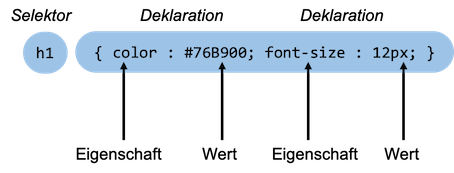

# CSS

<b>C</b>ascading <b>S</b>tyle <b>S</b>heets werden verwendet, um

- dem HTML-Dokument einen ansprechenden Stil (Font, Farben, ...) zuzuweisen,
- das Layout des HTML-Dokumentes zu definieren (3-Spalten-Layout, 2-Spalten-Layout, Kopf- und Fußzeile, ...)
- das Layout responsive zu gestalten, d.h. unterschiedliche Ansichten des HTML-Dokumentes zu definieren, je nach Bildschirmgröße (Mobile, Tablet, Desktop)

Generell gilt, dass wir mit HTML ausschließlich die Inhalte definieren, das Design jedoch mit CSS. Sehen wir uns dazu folgendes erstes Beispiel an:

<iframe width="100%" height="300" src="//jsfiddle.net/jfreiheit/4cvneb80/17/embedded/html,css,result/" allowfullscreen="allowfullscreen" allowpaymentrequest frameborder="0"></iframe>

In obigem Beispiel werden für die HTML-Elemente, die in unserem HTML-Doument verwendet werden, unterschiedliche CSS-Eigenschaften definiert. Die generelle Syntax für CSS-Eigenschaften ist:

```css
selektor {
	eigenschaft: wert;
}
```

So wird in obigem Beispiel für das HTML-Element `body` der Eigenschaft `font-family` der Wert `verdana` zugeordnet. Somit ist der gesamte Text in `<body>` in der Schriftart `Verdana`. Dies gilt auch für alle Elemente, die hierarchisch "unter" `<body>` angesiedelt sind, also alle `<h1>`-, `<h3>`-, `<p>`-, `<span>`- und `<a>`-Elemente. Die Eigenschaftsdefinitionen kaskadieren also nach unten - daher *cascading* style sheets. Da alle `<p>`-Elemente fett geschrieben werden, sind auch die darin enthaltenen Elemente fett, also `<a>` und `<span>`. 

*Begriffsbezeichnungen bei CSS-Definitionen:*



## Ort der CSS-Definitionen

Es gibt drei "Orte", an denen CSS-Eigenschaften für ein HTML-Dokument definiert werden können: 

1. in einer externen CSS-Datei. Diese endet typischerweise mit der Dateiendung `.css` und wird im `<head>` des HTML-Dokumentes mithilfe von `<link rel="stylesheet" href="mystyle.css">` (hier heißt die externe Datei `mystyle.css`) eingebunden (siehe unten),
2. innerhalb eines `<style>`-Elementes ebenfalls im `<head>` des HTML-Dokumentes (siehe unten),
3. als `style`-Attribut eines HTML-Elementes (siehe unten).

=== "3 Orte der CSS-Definitionen - HTML"
	```html
	<!DOCTYPE html>
	<html lang="de">
	<head>
	    <meta charset="UTF-8">
	    <!-- 1. Einbinden einer externen CSS-Datei -->
	    <link rel="stylesheet" href="mystyle.css">
	    <title>CSS-Einführung</title>
	    <!-- 2. Verwenden des <style>-Elementes -->
	    <style>
	        h1 {
	            color: red;
	        }
	    </style>
	</head>
	<body>
	<h1>Überschrift</h1>
	<!-- 3. style-Attribut eines HTML-Elementes -->
	<p style="border: 1px solid blue;">
	    Das ist ein Absatz.
	</p>
	</body>
	</html>
	```
=== "mystyle.css"
	```css
	body {
	    font-family: vardana;
	}
	```

Im obigen Beispiel wird in der externen CSS-Datei `mystyle.css` definiert, dass der im gesamten Dokument verwendete Font *Verdana* sein soll. Im `<style>`-Element wird als Schriftfarbe für `<h1>`-Überschriften *rot* festgelegt, das gilt für alle `<h1>`-Überschriften des Dokumentes. Das `style`-Attribut des HTML-Elementes `<p>` legt für **diesen** Absatz fest, dass er *blau umrandet* sein soll. Das gilt nicht für alle `<p>`-Elemente, sondern nur für das Element mit dem `style`-Attribut.

Eine recht gute Übersicht über alle existierenden CSS-Eigenschaften bietet [**W3Schhols**](https://www.w3schools.com/cssref/default.asp).

## Selektoren

Bis jetzt haben wir in unseren Beispielen "nur" HTML-Elemente als Selektoren verwendet. Es gibt eine Vielzahl anderer Möglichkeiten, bestimmten HTML-Elementen CSS-Eigenschaften zuzuweisen. Nochmal zur Wiederholung: der generelle Aufbau einer CSS-Definition ist

```css
selektor {
	eigenschaft: wert;
}
```

Wir werden nun die unterschiedlichen Möglichkeiten der Selektoren (und Operatoren über diese Selektoren) betrachten. Wir betrachten zunächst HTML-Elemente, IDs, Klassen und Attribute als Selektoren:

| Selektor | Beispiel | Erläuterung |
|----------|----------|-------------|
| `*` | `*` | alle HTML-Elemente ausgewählt (Wildcard)|
| `element` | `h1` | alle `<h1>`-Elemente ausgewählt |
| `element element` | `section h1` |  alle `<h1>`-Elemente **innnerhalb** eines `<section>`-Element ausgewählt (Nachfahren) |
| `element, element` | `section, h1` |  alle `<h1>`-Elemente **und** alle `<section>`-Elemente ausgewählt |
|  `element>element` | `section>h1` |  alle `<h1>`-Elemente deren direkte **Eltern** ein `<section>`-Element sind (Kinder) |
|  `element+element` | `section+h1` |  alle `<h1>`-Elemente, die direkt **nach** einem `<section>`-Element stehen |
|  `.class` | `.container` | alle Elemente mit `class="container"`, d.h. `container` muss eine zugeordnete Klasse sein |
|  `.class1.class2` | `.container.top` | alle Elemente mit `class="container top"`, d.h. `container` und `top` müssen zugeordnete Klassen sein|
|  `.class1 .class2` | `.container .top` | alle Elemente mit `class="top"`, welche **in** Elementen mit `class="container"` sind (Nachfahren)|
|  `#id` | `#main` | das Element mit `id="main"` (id eindeutig - nur einmal vergeben)|
|  `[attribute]` | `[src]` | alle Elemente mit einem `src`-Attribut|
|  `[attribute=value]` | `[target=_blank]` | alle Elemente, die ein `target`-Attribut besitzen und dessen Wert muss **genau** `_blank` sein |
|  `[attribute~=value]` | `[src~=localhost]` | alle Elemente, die ein `src`-Attribut besitzen und dessen Wert **enthält** das Wort `localhost`  |
|  `[attribute^=value]` | `[href^="https"]` | alle Elemente, die ein `href`-Attribut besitzen und dessen Wert **beginnt** mit dem Wort `https`  | 
|  `[attribute$=value]` |  `[href$="php"]` | alle Elemente, die ein `href`-Attribut besitzen und dessen Wert **endet** mit dem Wort `php`| 

Darüber hinaus gibt es auch sogenannte *Pseudo-Klassen* und *Pseudo-Elemente*, die wir als Selektoren verwenden können. Wir betrachten zum besseren Verständinis zunächst ein Beispiel, um eine Idee davon zu bekommen. Angenommen, wir haben in unserem HTML-Dokument einen Hyperlink (`#`refrenziert auf den Beginn derselben Seite):

```html
<a href="#">Neu laden</a>
```

So ein Hyperlink besitzt zusätzliche *Pseudo-Klassen* `link`, `visited`, `hover`, `active`. Diese Klassen sind für bestimmte Zustände des Elementes aktiv. Die Pseudoklasse `link` ist aktiv für noch nicht angeklickte Hyperlinks, `visited` bei bereits angeklickten, `hover` (gibt es für alle Elemente) sobald man die Maus über das Element hält und `active` für den Zeitpunkt, zu dem man gerade den Hyperlink anklickt. Pseudoklassen werden über `element:pseudoklasse` angesprochen. Ein CSS könnte also z.B. so aussehen:

```css
a { /* alle links */
    text-decoration:none;
}

a:link { /* noch nicht angeklickt */
    color:red;
}

a:visited { /* bereits angeklickt */
    color:darkgrey;
}

a:hover {   /* mouse over */
    color:limegreen;
}

a:active { /* wird gerade angeklickt */
    color:lightblue;
}
```

| Pseudo-Klasse | Beispiel | Erläuterung des Beispiels |
|-----------------|----------|---------------------------|
| `:link` | `a:link` | alle `<a>`-Elemente, die noch nicht besucht (geklickt) wurden  | 
| `:visited` | `a:visited` | alle `<a>`-Elemente, die bereits besucht (geklickt) wurden |
| `:hover` | `img:hover` | das ``-Element, über dem die Maus verweilt (mouse over) |
| `:active` | `a:active` | das `<a>`-Element, auf das gerade geklickt wird |
| `:empty` | `p:empty` | alle `<p>`-Elemente, die keine Kinder haben  |
| `:first-child` | `p:first-child` | alle `<p>`-Elemente, die das jeweils erste Kind ihres Elternelmentes sind | 
| `:first-of-type` | `p:first-of-type` | alle `<p>`-Elemente, die das jeweils erste `<p>`-Element ihres Elternelementes sind  |
| `:nth-child(n)` | `p:nth-child(2)` | alle `<p>`-Elemente, die das jeweils zweite Kind ihres Elternelmentes sind | 
| `:nth-of-type(n)` | `p:nth-of-type(2)` | alle `<p>`-Elemente, die das jeweils zweite `<p>`-Element ihres Elternelementes sind  |
| `:only-child` | `p:only-child` | alle `<p>`-Elemente, die das jeweils einzige Kind ihres Elternelementes sind |
| `:only-of-type` | `p:only-of-type` | alle `<p>`-Elemente, die das jeweils einzige `<p>`-Element ihres Elternelementes sind |

In den runden Klammern, in denen Zahlen angegeben werden können (`:nth-child(n)` und `:nth-of-type(n)`), können Sie anstelle der Zahl auch `odd` und `even` einsetzen. So lassen sich z.B. Tabellenzeilen abwechselnd in verschiedenen Hintergrundfarben anzeigen 

```css
/* unterschiedliche Spaltenfarben */
td:nth-child(even) {
  background-color: lightgrey;
}

td:nth-child(odd) {
  background-color: darkgrey;
}

/* unterschidliche Zeilenfarben */
tr:nth-child(even) {
  background-color: white;
}

tr:nth-child(odd) {
  background-color: grey;
}
```

Neben den oben genannten Pseudoklassen gibt es auch noch deren Pendants: `:last-child`, `:last-of-type`, `:nth-last-child(n)`, `:nth-last-of-type(n)`.

Für `<input>`-Elemente gibt es zusätzlich eine Reihe weiterer Pseudo-Klassen. Hier eine Auswahl an Pseudo-Klassen für `<input>`-Elemente:

| Pseudo-Klasse | Beispiel | Erläuterung des Beispiels |
|-----------------|----------|---------------------------|
| `:checked` | `input:checked` | alle checked `<input>`-Elemente | 
| `:disabled` | `input:disabled` | alle disabled `<input>`-Elemente |
| `:enabled` | `input:enabled` | alle disabled `<input>`-Elemente |
| `:focus` | `input:focus` | das `<input>`-Element, das Fokus hat |
| `:invalid` | `input:invalid` | alle `<input>`-Elemente mit einem ungültigen Wert |
| `:optional` | `input:optional` | alle `<input>`-Elemente, die nicht "required" sind | 
| `:read-only` | `input:read-only` | alle `<input>`-Elemente mit einem "readonly"-Attribut |
| `:read-write` | `input:read-write` | alle `<input>`-Elemente, die kein "readonly"-Attribut haben |
| `:required` | `input:required` | alle `<input>`-Elemente mit einem "required"-Attribut |
| `:valid` | `input:valid` | alle `<input>`-Elemente mit einem gültigen Wert |

Pseudo-Elemente sind so ähnlich wie Pseudo-Klassen, werden aber über `::` angesprochen anstelle `:` bei Pseudo-Klassen. Hier ein Beispiel für ein Pseudo-Element:

=== "HTML"
	```html
	<p>Lorem ipsum dolor sit amet, consetetur sadipscing elitr, sed diam nonumy eirmod tempor invidunt ut labore et dolore magna aliquyam erat, sed diam voluptua. At vero eos et accusam et justo duo dolores et ea rebum. Stet clita kasd gubergren, no sea takimata sanctus est Lorem ipsum dolor sit amet. Lorem ipsum dolor sit amet, consetetur sadipscing elitr, sed diam nonumy eirmod tempor invidunt ut labore et dolore magna aliquyam erat, sed diam voluptua. At vero eos et accusam et justo duo dolores et ea rebum. Stet clita kasd gubergren, no sea takimata sanctus est Lorem ipsum dolor sit amet.</p>
	```
=== "CSS mit Pseudo-Elementen"
	```css
	p::first-letter {
	    font-size:300%;
	}

	p::first-line {
	    font-weight: bold;
	}
	```

Das Ergebnis sieht dann so aus: 


Der erste Buchstabe in einem Absatz ist um das Dreifache größer als der Rest der Textes und die erste Zeile in diesem Absatz wird fettgedruckt. 

Auswahl an Pseudo-Elementen:

| Pseudo-Elemente | Beispiel | Erläuterung des Beispiels |
|-----------------|----------|---------------------------|
| `::after` | `p::after` | füge etwas hinter den Inhalt aller `<p>`-Elemente ein | 
| `::before` | `p::before` | füge etwas vor den Inhalt aller `<p>`-Elemente ein |
| `::first-letter` | `p::first-letter` | alle ersten Buchstaben aller `<p>`-Elemente |
| `::first-line` | `p::first-line` | alle ersten Zeilen aller `<p>`-Elemente |
| `::selection` | `p::selection` | alle vom Nutzer markierten (selektierten) Teile eines `<p>`-Elementes |


## Weitere Informationen über CSS

- [Folien CSS](./files/02_WT_CSS.pdf)

