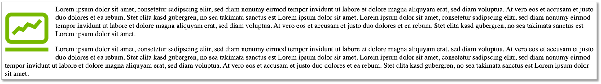

# CSS

<b>C</b>ascading <b>S</b>tyle <b>S</b>heets werden verwendet, um

- dem HTML-Dokument einen ansprechenden Stil (Font, Farben, ...) zuzuweisen,
- das Layout des HTML-Dokumentes zu definieren (3-Spalten-Layout, 2-Spalten-Layout, Kopf- und Fußzeile, ...)
- das Layout responsive zu gestalten, d.h. unterschiedliche Ansichten des HTML-Dokumentes zu definieren, je nach Bildschirmgröße (Mobile, Tablet, Desktop)

Generell gilt, dass wir mit HTML ausschließlich die Inhalte definieren, das Design jedoch mit CSS. Sehen wir uns dazu folgendes erstes Beispiel an:

<iframe width="100%" height="300" src="//jsfiddle.net/jfreiheit/4cvneb80/17/embedded/html,css,result/" allowfullscreen="allowfullscreen" allowpaymentrequest frameborder="0"></iframe>

In obigem Beispiel werden für die HTML-Elemente, die in unserem HTML-Doument verwendet werden, unterschiedliche CSS-Eigenschaften definiert. Die generelle Syntax für CSS-Eigenschaften ist:

```css
selektor {
	eigenschaft: wert;
}
```

So wird in obigem Beispiel für das HTML-Element `body` der Eigenschaft `font-family` der Wert `verdana` zugeordnet. Somit ist der gesamte Text in `<body>` in der Schriftart `Verdana`. Dies gilt auch für alle Elemente, die hierarchisch "unter" `<body>` angesiedelt sind, also alle `<h1>`-, `<h3>`-, `<p>`-, `<span>`- und `<a>`-Elemente. Die Eigenschaftsdefinitionen kaskadieren also nach unten - daher *cascading* style sheets. Da alle `<p>`-Elemente fett geschrieben werden, sind auch die darin enthaltenen Elemente fett, also `<a>` und `<span>`. 

*Begriffsbezeichnungen bei CSS-Definitionen:*


## Ort der CSS-Definitionen

Es gibt drei "Orte", an denen CSS-Eigenschaften für ein HTML-Dokument definiert werden können: 

1. in einer externen CSS-Datei. Diese endet typischerweise mit der Dateiendung `.css` und wird im `<head>` des HTML-Dokumentes mithilfe von `<link rel="stylesheet" href="mystyle.css">` (hier heißt die externe Datei `mystyle.css`) eingebunden (siehe unten),
2. innerhalb eines `<style>`-Elementes ebenfalls im `<head>` des HTML-Dokumentes (siehe unten),
3. als `style`-Attribut eines HTML-Elementes (siehe unten).

=== "3 Orte der CSS-Definitionen - HTML"
	```html
	<!DOCTYPE html>
	<html lang="de">
	<head>
	    <meta charset="UTF-8">
	    <!-- 1. Einbinden einer externen CSS-Datei -->
	    <link rel="stylesheet" href="mystyle.css">
	    <title>CSS-Einführung</title>
	    <!-- 2. Verwenden des <style>-Elementes -->
	    <style>
	        h1 {
	            color: red;
	        }
	    </style>
	</head>
	<body>
	<h1>Überschrift</h1>
	<!-- 3. style-Attribut eines HTML-Elementes -->
	<p style="border: 1px solid blue;">
	    Das ist ein Absatz.
	</p>
	</body>
	</html>
	```
=== "mystyle.css"
	```css
	body {
	    font-family: vardana;
	}
	```

Im obigen Beispiel wird in der externen CSS-Datei `mystyle.css` definiert, dass der im gesamten Dokument verwendete Font *Verdana* sein soll. Im `<style>`-Element wird als Schriftfarbe für `<h1>`-Überschriften *rot* festgelegt, das gilt für alle `<h1>`-Überschriften des Dokumentes. Das `style`-Attribut des HTML-Elementes `<p>` legt für **diesen** Absatz fest, dass er *blau umrandet* sein soll. Das gilt nicht für alle `<p>`-Elemente, sondern nur für das Element mit dem `style`-Attribut.

Eine recht gute Übersicht über alle existierenden CSS-Eigenschaften bietet [**W3Schhols**](https://www.w3schools.com/cssref/default.asp).

## Selektoren

Bis jetzt haben wir in unseren Beispielen "nur" HTML-Elemente als Selektoren verwendet. Es gibt eine Vielzahl anderer Möglichkeiten, bestimmten HTML-Elementen CSS-Eigenschaften zuzuweisen. Nochmal zur Wiederholung: der generelle Aufbau einer CSS-Definition ist

```css
selektor {
	eigenschaft: wert;
}
```

Wir werden nun die unterschiedlichen Möglichkeiten der Selektoren (und Operatoren über diese Selektoren) betrachten. Wir betrachten zunächst HTML-Elemente, IDs, Klassen und Attribute als Selektoren. Zu den IDs ist zu sagen, dass Sie jedem HTML-Element eine eindeutige `id` zuweisen können, z.B. `<div id="main">`. Jedes Element darf nur eine `id` besitzen und eine `id` darf in einem HTML-Dokument nur einmal vergeben - muss also *eindeutig* - sein. Klassen weisen Sie Elementen mit dem `class`-Attribut zu, also z.B. `<div class="smallFont blueColor yellowBackground">`. Klassennamen können Sie frei wählen (keine Leer- und Sonderzeichen!). Wenn Sie, wie im Beispiel, mehrere Klassen zuweisen, dann durch einen Leerschritt getrennt. Im Beispiel wurde dem `<div>` drei Klassen zugewiesen. Sie können einem Element beliebig viele Klassen zuweisen und eine Klasse kann beliebig vielen Elementen zugewiesen werden. In den CSS-Deklarationen wird mittels `#` auf die IDs zugegriffen und mittels `.` auf die jeweilige Klasse. Siehe die folgende Liste der möglichen Selektoren unter Verwendung von Elementnamen, IDs, Klassen und Attributen: 

| Selektor | Beispiel | Erläuterung |
|----------|----------|-------------|
| `*` | `*` | alle HTML-Elemente ausgewählt (Wildcard)|
| `element` | `h1` | alle `<h1>`-Elemente ausgewählt |
| `element element` | `section h1` |  alle `<h1>`-Elemente **innnerhalb** eines `<section>`-Element ausgewählt (Nachfahren) |
| `element, element` | `section, h1` |  alle `<h1>`-Elemente **und** alle `<section>`-Elemente ausgewählt |
|  `element>element` | `section>h1` |  alle `<h1>`-Elemente deren direkte **Eltern** ein `<section>`-Element sind (Kinder) |
|  `element+element` | `section+h1` |  alle `<h1>`-Elemente, die direkt **nach** einem `<section>`-Element stehen |
|  `.class` | `.container` | alle Elemente mit `class="container"`, d.h. `container` muss eine zugeordnete Klasse sein |
|  `.class1.class2` | `.container.top` | alle Elemente mit `class="container top"`, d.h. `container` und `top` müssen zugeordnete Klassen sein|
|  `.class1 .class2` | `.container .top` | alle Elemente mit `class="top"`, welche **in** Elementen mit `class="container"` sind (Nachfahren)|
|  `#id` | `#main` | das Element mit `id="main"` (id eindeutig - nur einmal vergeben)|
|  `[attribute]` | `[src]` | alle Elemente mit einem `src`-Attribut|
|  `[attribute=value]` | `[target=_blank]` | alle Elemente, die ein `target`-Attribut besitzen und dessen Wert muss **genau** `_blank` sein |
|  `[attribute*=value]` | `[src*="localhost"]` | alle Elemente, die ein `src`-Attribut besitzen und dessen Wert **enthält** das Wort `localhost`  |
|  `[attribute^=value]` | `[href^="https"]` | alle Elemente, die ein `href`-Attribut besitzen und dessen Wert **beginnt** mit dem Wort `https`  | 
|  `[attribute$=value]` |  `[href$="php"]` | alle Elemente, die ein `href`-Attribut besitzen und dessen Wert **endet** mit dem Wort `php`| 

Darüber hinaus gibt es auch sogenannte *Pseudo-Klassen* und *Pseudo-Elemente*, die wir als Selektoren verwenden können. Wir betrachten zum besseren Verständinis zunächst ein Beispiel, um eine Idee davon zu bekommen. Angenommen, wir haben in unserem HTML-Dokument einen Hyperlink (`#`refrenziert auf den Beginn derselben Seite):

```html
<a href="#">Neu laden</a>
```

So ein Hyperlink besitzt zusätzliche *Pseudo-Klassen* `link`, `visited`, `hover`, `active`. Diese Klassen sind für bestimmte Zustände des Elementes aktiv. Die Pseudoklasse `link` ist aktiv für noch nicht angeklickte Hyperlinks, `visited` bei bereits angeklickten, `hover` (gibt es für alle Elemente) sobald man die Maus über das Element hält und `active` für den Zeitpunkt, zu dem man gerade den Hyperlink anklickt. Pseudoklassen werden über `element:pseudoklasse` angesprochen. Ein CSS könnte also z.B. so aussehen:

```css
a { /* alle links */
    text-decoration:none;
}

a:link { /* noch nicht angeklickt */
    color:red;
}

a:visited { /* bereits angeklickt */
    color:darkgrey;
}

a:hover {   /* mouse over */
    color:limegreen;
}

a:active { /* wird gerade angeklickt */
    color:lightblue;
}
```

| Pseudo-Klasse | Beispiel | Erläuterung des Beispiels |
|-----------------|----------|---------------------------|
| `:link` | `a:link` | alle `<a>`-Elemente, die noch nicht besucht (geklickt) wurden  | 
| `:visited` | `a:visited` | alle `<a>`-Elemente, die bereits besucht (geklickt) wurden |
| `:hover` | `img:hover` | das ``-Element, über dem die Maus verweilt (mouse over) |
| `:active` | `a:active` | das `<a>`-Element, auf das gerade geklickt wird |
| `:empty` | `p:empty` | alle `<p>`-Elemente, die keine Kinder haben  |
| `:first-child` | `p:first-child` | alle `<p>`-Elemente, die das jeweils erste Kind ihres Elternelmentes sind | 
| `:first-of-type` | `p:first-of-type` | alle `<p>`-Elemente, die das jeweils erste `<p>`-Element ihres Elternelementes sind  |
| `:nth-child(n)` | `p:nth-child(2)` | alle `<p>`-Elemente, die das jeweils zweite Kind ihres Elternelmentes sind | 
| `:nth-of-type(n)` | `p:nth-of-type(2)` | alle `<p>`-Elemente, die das jeweils zweite `<p>`-Element ihres Elternelementes sind  |
| `:only-child` | `p:only-child` | alle `<p>`-Elemente, die das jeweils einzige Kind ihres Elternelementes sind |
| `:only-of-type` | `p:only-of-type` | alle `<p>`-Elemente, die das jeweils einzige `<p>`-Element ihres Elternelementes sind |

In den runden Klammern, in denen Zahlen angegeben werden können (`:nth-child(n)` und `:nth-of-type(n)`), können Sie anstelle der Zahl auch `odd` und `even` einsetzen. So lassen sich z.B. Tabellenzeilen abwechselnd in verschiedenen Hintergrundfarben anzeigen 

```css
/* unterschiedliche Spaltenfarben */
td:nth-child(even) {
  background-color: lightgrey;
}

td:nth-child(odd) {
  background-color: darkgrey;
}

/* unterschidliche Zeilenfarben */
tr:nth-child(even) {
  background-color: white;
}

tr:nth-child(odd) {
  background-color: grey;
}
```

Neben den oben genannten Pseudoklassen gibt es auch noch deren Pendants: `:last-child`, `:last-of-type`, `:nth-last-child(n)`, `:nth-last-of-type(n)`.

Für `<input>`-Elemente gibt es zusätzlich eine Reihe weiterer Pseudo-Klassen. Hier eine Auswahl an Pseudo-Klassen für `<input>`-Elemente:

| Pseudo-Klasse | Beispiel | Erläuterung des Beispiels |
|-----------------|----------|---------------------------|
| `:checked` | `input:checked` | alle checked `<input>`-Elemente | 
| `:disabled` | `input:disabled` | alle disabled `<input>`-Elemente |
| `:enabled` | `input:enabled` | alle disabled `<input>`-Elemente |
| `:focus` | `input:focus` | das `<input>`-Element, das Fokus hat |
| `:invalid` | `input:invalid` | alle `<input>`-Elemente mit einem ungültigen Wert |
| `:optional` | `input:optional` | alle `<input>`-Elemente, die nicht "required" sind | 
| `:read-only` | `input:read-only` | alle `<input>`-Elemente mit einem "readonly"-Attribut |
| `:read-write` | `input:read-write` | alle `<input>`-Elemente, die kein "readonly"-Attribut haben |
| `:required` | `input:required` | alle `<input>`-Elemente mit einem "required"-Attribut |
| `:valid` | `input:valid` | alle `<input>`-Elemente mit einem gültigen Wert |

Pseudo-Elemente sind so ähnlich wie Pseudo-Klassen, werden aber über `::` angesprochen anstelle `:` bei Pseudo-Klassen. Hier ein Beispiel für ein Pseudo-Element:

=== "HTML"
	```html
	<p>Lorem ipsum dolor sit amet, consetetur sadipscing elitr, sed diam nonumy eirmod tempor invidunt ut labore et dolore magna aliquyam erat, sed diam voluptua. At vero eos et accusam et justo duo dolores et ea rebum. Stet clita kasd gubergren, no sea takimata sanctus est Lorem ipsum dolor sit amet. Lorem ipsum dolor sit amet, consetetur sadipscing elitr, sed diam nonumy eirmod tempor invidunt ut labore et dolore magna aliquyam erat, sed diam voluptua. At vero eos et accusam et justo duo dolores et ea rebum. Stet clita kasd gubergren, no sea takimata sanctus est Lorem ipsum dolor sit amet.</p>
	```
=== "CSS mit Pseudo-Elementen"
	```css
	p::first-letter {
	    font-size:300%;
	}

	p::first-line {
	    font-weight: bold;
	}
	```

Das Ergebnis sieht dann so aus: 


Der erste Buchstabe in einem Absatz ist um das Dreifache größer als der Rest der Textes und die erste Zeile in diesem Absatz wird fettgedruckt. 

Auswahl an Pseudo-Elementen:

| Pseudo-Elemente | Beispiel | Erläuterung des Beispiels |
|-----------------|----------|---------------------------|
| `::after` | `p::after` | füge etwas hinter den Inhalt aller `<p>`-Elemente ein | 
| `::before` | `p::before` | füge etwas vor den Inhalt aller `<p>`-Elemente ein |
| `::first-letter` | `p::first-letter` | alle ersten Buchstaben aller `<p>`-Elemente |
| `::first-line` | `p::first-line` | alle ersten Zeilen aller `<p>`-Elemente |
| `::selection` | `p::selection` | alle vom Nutzer markierten (selektierten) Teile eines `<p>`-Elementes |

## Box Model

Wenn Sie die Breite und die Höhe eines Elementes mithilfe der `width`- und `height`-Eigenschaft von CSS angeben wollen, dann müssen Sie beachten, dass Sie damit "nur" die Höhe und Breite des *Inahltes* dieses Elementes angeben. Zur Gesamtbreite und -höhe eines Elementes zählen aber auch noch:

- `padding`: der Abstand des Inhaltes zum Rahmen (`border`) des Elementes,
- `border`: der Rahmen des Elementes (falls es einen gibt) und
- `margin`: der Abstand des Elementes zu den Nachbarelementen. 

Zusammen mit dem Inhalt des Elementes wird dieser Zusammenhang *Box Model* genannt. Folgende Darstellung zeigt das Box Model:


Das Box Model besagt, dass alle HTML-Elemente als eine rechteckige "Box" verstanden werden können und diese Box aus dem Inhalt, `padding`, `border` und `margin` besteht. 

=== "Beispiel Box Model - HTML"
	```html
	<body>
	<h3>Box Model</h3>
	
	<div>Das FIW-Logo hat eine Breite von 350px (width:350px).
	    Der Inhalt dieser Box hat eine Breite von 320px.
	    Dazu kommt padding von 10px (auf beiden Seiten)
	    und ein Rahmen mit der Breite von 5px. Macht zusammen
	    350px.
	</div>
	</body>
	```
=== "Beispiel Box Model - CSS"
	```css
    div {
        width: 320px;
        padding: 10px;
        border: 5px solid gray;
        margin: 0;
    }
	```

Das Bild hat eine Breite von `350px`(siehe `style`-Attribut von `img`). Der Inhalt des `div`-Containers hat eine Breite von `320px`. Der Abstand des Inhalts zum Rahmen ist links und rechts jeweils `10px` und der Rahmen ist links und rechts jeweils `5px` groß. Ergibt zusammen eine Breite von (`320`+`10`+`10`+`5`+`5` = `350`). Somit ist das `div` inklusive `padding` und `border` exakt so breit wie das Bild:


Das hier beschriebene Box Model entspricht der CSS-Definition `box-sizing: content-box;`. Dies ist der Standard (muss also nicht angegeben werden). Daneben gibt es auch noch die Möglichkeit, anstelle von `content-box` den Wert `border-box` zu verwenden. Dann ist in der Angabe von `width`und `height`sowohl `padding` als auch `border` integriert - erweitern Sie obige CSS-Definition um 

```css
* {
    box-sizing: border-box;
}
```

Dann wird der Unterschied sichtbar. `border-box` kann aber zu Problemen bei der Verwendung anderer Frameworks führen und sollte deshalb eher nicht verwendet werden. 

## Die `display`-Eigenschaft

Mithilfe der `display`-Eigenschaft können Block-Elemente als Inline-Elemente definiert werden und umgedreht. `display:block` definiert ein Element als Block-Element, `display: inline` definiert ein Element als Inline-Element. Außerdem gibt es noch die Möglichkeit, mithilfe von `display: none;` ein Element unsichtbar zu schalten. Dieses Element nimmt dann im *Viewport*, also dem sichtbaren Bereich der Webseite, keinen Platz ein (im Gegensatz zu einem Element, das mithilfe von `visibility: hidden;` auf unsichtbar gesetzt wird). Hier ein Beispiel zur Verwendung der `display`-Eigenschaft. Fahren Sie unter dem Reiter *Result* mit der Maus über das orange umrandete `div`.  

<iframe width="100%" height="300" src="//jsfiddle.net/jfreiheit/sfdztn0c/8/embedded/html,css,result/" allowfullscreen="allowfullscreen" allowpaymentrequest frameborder="0"></iframe>

Es gibt noch viele weitere Werte für `display`, auf die wir aber nicht näher eingehen wollen. Eine Übersicht finden Sie z.B. [**hier**](https://www.w3schools.com/cssref/pr_class_display.asp).

## Layout gestalten mithilfe von CSS

Wir werden für das Layout unserer Webseiten in Zukunft CSS-Frameworks, wie z.B. [**Bootstrap**](https://getbootstrap.com/) oder [**Materialize**](https://materializecss.com/) oder [**SemanticUI**](https://semantic-ui.com/) verwenden. Für das Layout stellen diese Frameworks insbesondere ein Grid-Konzept zur Verfügung, das recht einfach nutzbar ist und sogar für eine responsive Darstellung sorgt. Zunächst wollen wir jedoch die Prinzipien verstehen, auf denen diese Frameworks (und deren Grid-Konzept) basieren.

### Mehrspaltig mithilfe von float

Generell werden Container untereinander dargestellt, in der Reihenfolge ihres Auftretens im HTML. Betrachten wir ein einfaches Beispiel:

```html
<body>
<p id="p1"></p>
<p id="p2">Lorem ipsum dolor sit amet, consetetur sadipscing elitr, sed diam nonumy
    eirmod tempor invidunt ut labore et dolore magna aliquyam erat, sed diam
    voluptua. At vero eos et accusam et justo duo dolores et ea rebum. Stet
    clita kasd gubergren, no sea takimata sanctus est Lorem ipsum dolor sit
    amet. Lorem ipsum dolor sit amet, consetetur sadipscing elitr, sed diam
    nonumy eirmod tempor invidunt ut labore et dolore magna aliquyam erat,
    sed diam voluptua. At vero eos et accusam et justo duo dolores et ea
    rebum. Stet clita kasd gubergren, no sea takimata sanctus est Lorem
    ipsum dolor sit amet.</p>
<p id="p3">Lorem ipsum dolor sit amet, consetetur sadipscing elitr, sed diam nonumy
    eirmod tempor invidunt ut labore et dolore magna aliquyam erat, sed diam
    voluptua. At vero eos et accusam et justo duo dolores et ea rebum. Stet
    clita kasd gubergren, no sea takimata sanctus est Lorem ipsum dolor sit
    amet. Lorem ipsum dolor sit amet, consetetur sadipscing elitr, sed diam
    nonumy eirmod tempor invidunt ut labore et dolore magna aliquyam erat,
    sed diam voluptua. At vero eos et accusam et justo duo dolores et ea
    rebum. Stet clita kasd gubergren, no sea takimata sanctus est Lorem
    ipsum dolor sit amet.</p>
</body>
```

Untereinander definiert sind 3 Block-Elemente (`<p>`-Elemente), die jeweils eine eigene `id` besitzen. Der erste Absatz enthält ein Bild mit der Breite `100px`. Dies führt zu folgender Ansicht: 


Alle drei Block-Elemente sind also, wie erwartet, untereinander. 

#### Umfließen lassen: `float`

Angenommen, wir wollen nun, dass das Bild von Text umflossen wird, dass also der Absatz mit dem Bild **neben** den danach folgenden Absätzen erscheint. Dann kommt die CSS-Eigenschaft `float` ins Spiel. Wir können entscheiden, ob das Bild links sein soll und umflossen wird (`float: left;`) oder rechts sein und dort vom Text umflossen werden soll (`float: right;`). Wir fügen exemplarisch folgende Eigenschaft (für die id `p1`) hinzu:

```css
#p1 {
    float:left;
    margin-right:15px;
}
```

Damit legen wir fest, dass der erste Absatz umflossen werden soll (und links bleibt - `float: left;`). Mit der `margin-right`-Eigenschaft sorgen wir für einen Abstand zum unfließenden Text. Es entsteht folgende Ansicht: 



Das heißt, dass alle folgenden Absätze den ersten Absatz umfließen. 


#### Umfließen stoppen: `clear`

Das Umfließen kann auch wieder gestoppt werden. Dies geschieht mithilfe der `clear`-Eigenschaft. Um `float: left` zu stoppen, wird `clear: left` verwendet und um `float: right` zu stoppen, wird `clear: right` verwendet. Sollte es mehrere Elemente mit einer `float`-Eigenschaft geben, kann zum Stoppen `clear: both` verwendet werden. 

Wenn wir nun also für den dritten Absatz definieren: 

```css
#p3 {
    clear: left;
}
```


, dann beginnt der dritte Absatz wieder am Beginn einer neuen Zeile unterhalb der beiden Absätze `p1` und `p2`. 

#### mehr als 2 Spalten

Wenn wir nun alle 3 Absätze nebeneinander setzen wollen, dann definieren wir einfach für alle 3 Absätze `float:left;`. Damit alle 3 Absätze die gleiche Breite haben, geben wir noch für jeden Absatz an, dass er `33.33%` des Viewports einnimmt (`width: 31.33%` + `padding:1%` - links und rechts):

```css
#p1, #p2, #p3 {
    float:left;
    width: 31.33%;
    padding:1%;
}
```

Beachten Sie dazu noch folgende Änderung beim ``-Element. Wir ändern die Breite des Bildes von `100px` (feste Breite) auf `100%` (relative Breite - relativ zum Elternelement, das ist `<p id="p1">`). 

```html
<p id="p1"></p>
```	

Schöner - und üblicher, weil später auch so beim Grid-Konzept - ist es, den Elementen, die man nebeneinander anordnen möchte, eine CSS-Klasse zuzuweisen, z.B. `class="column"`und für diese Klasse dann die `float`-Eigenschaft mit zugehöriger relativer Breite zu definieren. Außerdem fügt man oft um die Spalten einen weiteren Container mit einer Klasse `class="row"` (Beispiel) und kann dann für diese Klasse (`.row:after` die `clear`-Eigenschaft definieren). Ein solches Beispiel nochmal hier:

<iframe width="100%" height="300" src="//jsfiddle.net/jfreiheit/sfdztn0c/12/embedded/html,css,result/" allowfullscreen="allowfullscreen" allowpaymentrequest frameborder="0"></iframe>

#### flexbox

Wir werden sehen, dass das Grid-Konzept, das wir zukünftig verwenden werden, auf der `float`-Eigenschaft (zusammen mit `width`) basiert. Ein Konzept, welches von der Komplexität "zwischen" `float` und dem Grid-Konzept liegt, ist `flexbox`. Mit `flexbox` ist das Nebeneinanderpositionieren von Containern recht einfach - insbesondere lassen sich auch recht leicht unterschiedliche Spaltenbreiten definieren- Wir gehen hier nicht weiter auf `flexbox` ein, sondern verweisen auf z.B. [**A Guide to Flexbox**](https://css-tricks.com/snippets/css/a-guide-to-flexbox). 

### Wertangaben in CSS

Numerische Werte können in CSS absolut oder relativ angegeben werden, je nach verwendeter Einheit. Folgende Tabelle gibt eine Übersicht über die unterschiedlichen Einheiten für numerische Werte. 

| Einheit | Angabetyp | Bedeutung |
|---------|-----------|-----------|
| `%` 	  | relativ  | relativ entweder zur elementeigenen Größe, zur Größe des Elternelements oder zum allegemeinen Kontext |
| `cm` 	  | absolut | Zentimenter |
| `em` | relativ | Schriftgröße des Elements (bei font-size aber Schriftgröße des Elternelements) | 
| `ex` | relativ | Höhe des Kleinbuchstabens `x` im Element (bei font-size aber die Schriftgröße von `x` im Elternelement) | 
| `in` | absolut | inch (1 inch = 2,54 cm) | 
| `mm` | absolut | Milimeter | 
| `pc` | absolut | pica (1 pc = 12 Punkt) | 
| `pt` | absolut | Punkt (1 Punkt = 1/72 inch) | 
| `px` | absolut und relativ | absolut auf ein und dasselbe Ausgabegerät bezogen und relativ von Ausgabegerät zu Ausgabegerät (Pixeldichte) | 

Sie sollten absolute Angaben nur in Ausnahmefällen verwenden. Wann immer es geht, ist eine relative Größenangabe vorzuziehen. Somit werden am häufigsten `%`-Angaben und am zweithäufigsten `px`-Angaben verwendet. `em` sieht man auch noch recht häufig. Von allen anderen Einheiten ist eher abzuraten.

### Custom Properties

Sie können sich eigene Variablen für die Verwendung in CSS-Definitionen erstellen. Es ist üblich, solche Variablen in einem "großen" Scope zu definieren, da sie auf den definierten Scope beschränkt sind. D.h., dass man solche Variablen typischerweise für `*` (also alle Elemente) oder `body` definiert. Die Variablen beginnen stets mit `--`, also z.B. `--variablenname`. Der Zugriff auf die Variablen erfolgt mit `var()`, also z.B. `var(--variablenname)`. Hier ein Beispiel für die Definition von HTW-Farben und -Font:

```css
* {
    --htw-gruen: #76B900;
    --htw-grau:#AFAFAF;
    --htw-orange:#FF5F00;
    --htw-blau:#0082D1;
    --htw-font:Verdana, Geneva, sans-serif;
}

body {
    font-family:var(--htw-font);
}
h1 {
    color: var(--htw-gruen);
}
li a:hover {
    background-color: var(--htw-orange);
}
.active {
    background-color: var(--htw-gruen);
}

``` 

### Gewichtung der Selektoren

Insbesondere, wenn Sie noch CSS-Frameworks einbinden und/oder viele CSS-Definitionen haben, stellt sich die Frage, welche der Definitionen überhaupt wirken. Eine große Hilfe sind hier die [**Entwicklertools der Browser**](./tools/#developer-tools). Im folgenden Screenshot sehen Sie die Developer tools von Chrome. Im rechten unteren Fenster sind die definierten Styles angezeigt. Die nicht wirksamen Styledefinitionen sind durchgestrichen. 


Um zu ermitteln, welche Definition Anwendung findet, gibt es eine *Gewichtung der Selektoren*. Wichtig ist zu wissen, dass die Reihenfolge der Definitionen, egal ob im `<style>`-Element oder in externen CSS-Dateien keine Rolle spielt! Wir betrachten folgendes Beispiel, um die *Gewichtung der Selektoren* zu bestimmen:

<iframe width="100%" height="300" src="//jsfiddle.net/jfreiheit/sfdztn0c/17/embedded/html,css,result/" allowfullscreen="allowfullscreen" allowpaymentrequest frameborder="0"></iframe>

Wenn Sie sich zunächst nur die CSS-Definitionen anschauen, dann sehen Sie, dass einem Link fünf verschiedene Farben zugewiesen werden. Die Links sind aber rot. Es muss also aus einem bestimmten Grund die Definition 

```css
#navigation a.link {
  color: red;
}
```

am stärksten wirken, d.h. der Selektor `#navigation a.link` hat in unserem Beispiel die stärkste Gewichtung. Um die *Gewichtung der Selektoren* zu ermitteln, werden diese kategorisiert:

- **Kategorie A**: erhält den Wert 1, wenn CSS-Definitionen direkt im style-Attribut eines HTML-Elementes notiert sind 
- **Kategorie B**: erhält den Wert 1 bei Selektoren für Elemente mit `id`-Attributen
- **Kategorie C**: Anzahl der von einem Selektor betroffenen Klassen und Pseudoklassen
- **Kategorie D**: Anzahl der von einem Selektor betroffenen Elementnamen und Pseudo-Elemente

Bei der Reihenfolge der Sortierung gilt: **A** > **B** > **C** > **D**, also z.B. *1 0 0 0* vor (größer als) *0 1 2 2*. 

Betrachten wir unser Beispiel:

- `a:link` : 	**0 0 1 1** (eine Pseudoklasse (link) und ein Element (a))
- `.link`  : 	**0 0 1 0** (eine Klasse)
- `#navigation a.link` :  **0 1 1 1** (Element mit `id`-Attribut, eine Klasse und eine Element)
- `li a` : 	**0 0 0 2** (zwei Elemente)
- `#navigation li a` :    **0 1 0 2** (Element mit `id`-Attribut, zwei Elemente)

Es gilt **0 1 1 1** > **0 1 0 2** > **0 0 1 1** > **0 0 1 0** > **0 0 0 2** und deshalb sind die Links rot. In unserem Beispiel kommt kein `style`-Attribut vor, deshalb ist bei keinem Selektor die Kategorie A besetzt. Wäre bei einem Link im HTML beispielsweise: 

```html
<li><a href="startseite.html" class="link" style="color: orange;">Startseite</a></li>
```

dann wäre dieser Link orange. 

## Weitere Informationen über CSS

- [Folien CSS](./files/02_WT_CSS.pdf)

