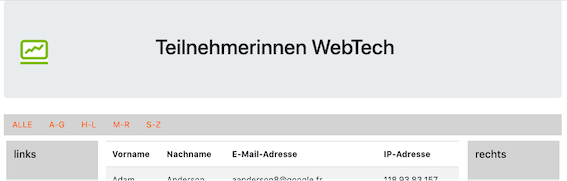

# Web-Technologien

Herzlich willkommen zur WebTech-Veranstaltung! 

### Grober Inhalt

In dieser Veranstaltung lernen Sie, was das World Wide Web ist und wie man eigene Webseiten und -anwendungen realisiert. Sie lernen die Protokolle und Sprachen ``http``, ``HTML``, ``CSS``und ``JavaScript`` kennen und machen sich mit ``Angular``, ``Node.js`` und ``REST`` vertraut.  

Nachfolgend der vorläufige Wochenplan (wird eventuell angepasst). Die Vorlesungsvideos finden Sie darunter für die einzelnen Wochen (unter [**Inhalte**](http://freiheit.f4.htw-berlin.de/webtech/#inhalte)).

| | Woche | Themen (Vorlesung) | Übung | Aufgabe (Stand) | Abgabe Übung bis | 
|-|-------|--------------------|-------|-----------------|------------------|
| 1. | 05.-09.10.2020 | Einführung und Organisatorisches | Übung 0 | - | - | 
| 2. | 12.-16.10.2020 | HTML | Übung 1 | Idee | 25.10.2020 | 
| 3. | 19.-23.10.2020 | CSS (Eigenschaften und Selektoren) | Übung 2 | - | 01.11.2020 | 
| 4. | 26.-30.10.2020 | RWD (Responsive Webdesign) | Übung 3 | Konzept | 08.11.2020 | 
| 5. | 02.-06.11.2020 | Angular (Einführung und Komponenten) | Übung 4 | - | 15.11.2020 | 
| 6. | 09.-13.11.2020 | Angular (Direktiven, data-, property-, event-binding) | Übung 5 | Datenmodell | 22.11.2020 | 
| 7. | 16.-20.11.2020 | Angular (Lifecycle-Hooks, Services, Routing) | Übung 6 | Schnittstelle | 29.11.2020 | 
| 8. | 23.-27.11.2020 | Angular (HTTP-Client), MySQL, REST | Übung 7 | Frontend (c+r)| 06.12.2020 | 
| 9. | 30.-04.12.2020 | Angular (Formulare) | Übung 8 | Frontend (u+d)| 13.12.2020 | 
| 10. | 07.-11.12.2020 | Node.js (Einführung, Webserver) | Übung 9 | Frontend fertig | 20.12.2020 | 
| 11. | 14.-18.12.2020 | Node.js (Express, Request, Response, URL) | Übung 10 | Backend ( c ) | 10.01.2020 | 
| 12. | 21.-25.12.2020 | Node.js (Model View Controller), JSON | - | Backend ( r ) | - |
| | | | | | | |
| 13. | 04.-08.01.2021 | Node.js (Datenbankanbindung, REST-Server) | - | Backend (u) | - |
| 14. | 11.-15.01.2021 | JSON Web Tokens | - | Backend (d + fertig)| - |
| 15. | 18.-22.01.2021 | Wiederholung | - | fertig stellen | - |
| 16. | 25.-29.01.2021 | - | Fragen | Abgabe 1.PZ 13.02.2021 | - |
|  |  |  |  | Abgabe 2.PZ 01.04.2021 | - |

### Organisatorisches 

Zur erfolgreichen Durchführung der Veranstaltung müssen die Übungen lösen und zu den jeweiligen Fristen per Git auf einen Server (GitHub oder GitLab) laden. Am Ende des Semesters ist eine Aufgabe abzugeben. Diese Aufgabe wird bewertet. Die Bewertung entspricht dann der Modulnote. 

Hier sind die Übungen beschrieben, die Sie in jeder Woche ausführen sollen. Damit Sie dies erfolgreich erledigen können, ist jeweils angegeben, welche Themen Sie dafür durcharbeiten müssen. Das Durcharbeiten der jeweiligen Themen entspricht jeweils einer Vorlesung. Diese wird also selbständig durchgeführt. 

Für die Kommunikation untereinander verwenden wir [**Slack**](https://slack.com/intl/de-de/). Dort können Sie alle inhaltlichen und organisatorischen Fragen stellen. Ich fände es gut, wenn ich dort möglichst wenig Fragen - zumindest die inhaltlichen - beantworten müsste, sondern eine Art internes Diskussionsforum entsteht. Es ist sehr gewünscht, dort Fragen zu stellen und noch mehr gewünscht, diese von Ihnen dort beantwortet zu sehen. Damit wäre allen geholfen und ich kann besser erkennen, wo noch Nachhol- bzw. Erläuterungsbedarf bei den meisten besteht.  

### Inhalte

??? question "Woche 1 - Einführung und Organisatorisches"
	- siehe **Übungsaufgabe 0**
	- <iframe src="https://mediathek.htw-berlin.de/media/embed?key=aa2dc92b4a4b18e89e85a195be581512&width=720&height=405&autoplay=false&autolightsoff=false&loop=false&chapters=false&related=false&responsive=false&t=0" data-src="" class="iframeLoaded" width="720" height="405" frameborder="0" allowfullscreen="allowfullscreen" allowtransparency="true" scrolling="no"></iframe>
	- die Notizen dazu finden Sie [**hier**](./files/01_WebTech_Einfuehrung.pdf)
	- <iframe src="https://mediathek.htw-berlin.de/media/embed?key=e4f7b04a1f1065daf8ecaeff5e99fd62&width=720&height=540&autoplay=false&autolightsoff=false&loop=false&chapters=false&related=false&responsive=false&t=0" data-src="" class="iframeLoaded" width="720" height="540" frameborder="0" allowfullscreen="allowfullscreen" allowtransparency="true" scrolling="no"></iframe>
	- die Notizen dazu finden Sie [**hier**](./files/02_Organisatorisches.pdf)

??? question "Woche 2 - Hypertext Markup Language (HTML)"
	- siehe [**HTML**](./html/#html)
	- siehe **Übungsaufgabe 1 (HTML)**
	- <iframe src="https://mediathek.htw-berlin.de/media/embed?key=6d5f322f330f0a9a46cd6d6b5486a51f&width=720&height=450&autoplay=false&autolightsoff=false&loop=false&chapters=false&related=false&responsive=false&t=0" data-src="" class="iframeLoaded" width="720" height="450" frameborder="0" allowfullscreen="allowfullscreen" allowtransparency="true" scrolling="no"></iframe>
	- hier die Bilder [**htw.jpg**](./files/htw.jpg) und [**fiw.jpg**](./files/fiw.jpg)

??? "index.html aus HTML-Vorlesung"
	```html
	<!DOCTYPE html>
	<html lang="de">
	<head>
	    <meta charset="UTF-8">
	    <title>HTML-Einführung</title>
	</head>
	<body>
	    <h1>große Überschrift</h1>
	    neuer Text
	    <p>ein erster Absatz</p>
	    <h3>kleinere Überschrift</h3>
	    <p> noch ein Absatz</p>

	    Vorteile von HTML:
	    <ul>
	        <li>Syntax und Semantic frei definierbar   </li>
	        <li>von Menschen lesbar</li>
	        <li>in Programmiersprachen einbettbar</li>
	        <li>offen für zukünftige Entwicklungen</li>
	    </ul>

	<!-- das ist ein Kommentar -->
	<p>das ist ein längerer Absatz <br/>
	das ist Text auf der nächsten Zeile </p>

	    

	<h3>Input-Elemente</h3>

	<input type="text" />
	<input type="radio" />
	<input type="checkbox" checked="checked" />
	<input type="datetime-local" />

	<h3>Hyperlinks</h3>

	das ist Text <a href="http://www.htw-berlin.de" target="_blank">
	    
	</a> das ist weiterer Text
	    <p>
	        <a href="./Unter/dok1.html">Dok 1</a>
	    </p>

	<h3>Container</h3>

	<section>
	    <header>ein Absatz</header>
	    <article>noch ein Absatz</article>
	    <footer>noch ein Absatz</footer>
	</section>
	<div>
	    <p>ein Absatz</p>
	    <p>noch ein Absatz</p>
	    <p>noch ein Absatz</p>
	</div>

	<h3>Formulare</h3>

	<form method="post">
	    <input type="text" name="user" placeholder="user"/>
	    <input type="password" name="pwd"/>
	    <button type="submit">Login</button>
	</form>

	<ul>
	    <li><a href="http://freiheit.f4.htw-berlin.de/webtech/html/#http-anfragemethoden" target="_blank">HTTP-Anfragemethoden</a> </li>
	    <li><a href="http://freiheit.f4.htw-berlin.de/webtech/html/#http-statusmeldungen" target="_blank">HTTP-Statusmeldungen</a> </li>
	    <li><a href="http://freiheit.f4.htw-berlin.de/webtech/html/#urls" target="_blank">URLs</a> </li>
	    <li><a href="http://freiheit.f4.htw-berlin.de/webtech/html/#domain-name-service-dns" target="_blank">Domain Name Service (DNS)</a> </li>
	</ul>
	</body>
	</html>
	```

??? question "Woche 3 - Cascading Style Sheets (CSS)"
	- siehe [**CSS**](./css/#css)
	- siehe **Übungsaufgabe 2 (CSS)**
	- <iframe src="https://mediathek.htw-berlin.de/media/embed?key=3aaeac8e5d171874bdd0933e776165c4&width=720&height=450&autoplay=false&autolightsoff=false&loop=false&chapters=false&related=false&responsive=false&t=0" data-src="" class="iframeLoaded" width="720" height="450" frameborder="0" allowfullscreen="allowfullscreen" allowtransparency="true" scrolling="no"></iframe>

??? "css.html aus CSS-Vorlesung"
	```html
	<!DOCTYPE html>
	<html lang="en">
	<head>
	    <meta charset="UTF-8">
	    <title>CSS</title>
	    <!-- 1. externe CSS-Datei -->
	    <link rel="stylesheet" href="./styles/mystyles.css">
	    <!-- 2. style-Element -->
	    <style>
	        h1 {
	            font-weight: normal;
	            color: red;
	        }

	        div > ul {
	            color: grey;
	        }

	        li {
	            display: inline;
	            padding: 10px;
	            margin: 5px;
	        }

	        span {
	            display: block;
	            color: red;
	        }

	    </style>
	</head>
	<body>
	    <h1>Cascading Style Sheets (CSS)</h1>
	    <div>living standard - weiterentwickelt von W3C. <span>Seit 2000 CSS3.</span>
	        Wichtig: Trennung zwischen Inhalten (HTML) und Aussehen (CSS).
	    </div>
	    <div> Wofür CSS?
	        <section>
	         <ul class="orangeBackground blackColor">
	             <li>ansprechender Stil (Font, Farben, Schriftgröße, Rahmen, ...)
	                 <a href="index.html">Link 2</a>
	             </li>
	             <li>Layout (2-spaltig, 3-spaltig, Kopf- und Fußzeilen, ...)
	                 <a href="index.html">Link 3</a>
	             </li>
	             <li>responsives Webdesign (unterschiedlich für Mobile, Tablets, Desktop, ...)
	                 <a href="index.html">Link 4</a>
	             </li>
	         </ul>
	        </section>
	    </div>
	    <ul class="orangeBackground">Inhalte heute:
	        <li>Orte für CSS-Definitionen
	            <a href="Unter/dok1.html">Link 5</a>
	        </li>
	        <li>Selektoren
	            <a href="Unter/dok1.html">Link 6</a>
	        </li>
	        <li>Box Model
	            <a href="Unter/dok1.html">Link 7</a>
	        </li>
	        <li>Layout (Prinzip, float)
	            <a href="Unter/dok1.html">Link 8</a>
	        </li>
	        <li>Gewichtung der Selektoren
	            <a href="Unter/dok1.html">Link 9</a>
	        </li>
	    </ul>
	</body>
	</html>
	```
??? "styles/mystyles.css aus CSS-Vorlesung"
	```css
	/*
	Kommentar in CSS

	selektor {
	    eigenschaft1: wert;
	    eigenschaft2: wert;
	   }
	*/

	body {
	    font-family: Verdana;
	    color: blue;
	}

	a {
	    text-decoration: none;
	    color: sandybrown;
	}
	```
??? "layout.html aus CSS-Vorlesung"
	```html
	<html lang="en">
	<head>
	    <meta charset="UTF-8">
	    <title>Layout mit float</title>
	    <style>
	        #p1, #p2, #p3 {
	            float: left;
	            width: 31.33%;
	            padding: 1%;
	        }
	    </style>
	</head>
	<body>
	    <p id="p1"></p>
	    <p id="p2">Lorem ipsum dolor sit amet, consetetur sadipscing elitr, sed diam nonumy
	        eirmod tempor invidunt ut labore et dolore magna aliquyam erat, sed diam
	        voluptua. At vero eos et accusam et justo duo dolores et ea rebum. Stet
	        clita kasd gubergren, no sea takimata sanctus est Lorem ipsum dolor sit
	        amet. Lorem ipsum dolor sit amet, consetetur sadipscing elitr, sed diam
	        nonumy eirmod tempor invidunt ut labore et dolore magna aliquyam erat,
	        sed diam voluptua. At vero eos et accusam et justo duo dolores et ea
	        rebum. Stet clita kasd gubergren, no sea takimata sanctus est Lorem
	        ipsum dolor sit amet.</p>
	    <p id="p3">Lorem ipsum dolor sit amet, consetetur sadipscing elitr, sed diam nonumy
	        eirmod tempor invidunt ut labore et dolore magna aliquyam erat, sed diam
	        voluptua. At vero eos et accusam et justo duo dolores et ea rebum. Stet
	        clita kasd gubergren, no sea takimata sanctus est Lorem ipsum dolor sit
	        amet. Lorem ipsum dolor sit amet, consetetur sadipscing elitr, sed diam
	        nonumy eirmod tempor invidunt ut labore et dolore magna aliquyam erat,
	        sed diam voluptua. At vero eos et accusam et justo duo dolores et ea
	        rebum. Stet clita kasd gubergren, no sea takimata sanctus est Lorem
	        ipsum dolor sit amet.</p>
	</body>
	</html>
	```
??? "gewichtung.html aus CSS-Vorlesung"
	```html
	<!DOCTYPE html>
	<html lang="en">
	<head>
	    <meta charset="UTF-8">
	    <title>Gewichtung der Selektoren</title>
	    <style>
	        a:link { /* B=0  C=1 D=1 */
	            color: blue;
	        }
	        li a {  /* B=0 C=0 D=2 */
	            color: magenta;
	        }
	        #navigation a.link { /* B=1 C=1 D=1 */
	            color: red;
	        }
	        #navigation li a { /* B=1 C=0 D=2 */
	            color: black;
	        }
	    </style>
	</head>
	<body>
	<ul id="navigation">
	    <li><a href="startseite.html" class="link">Startseite</a></li>
	    <li><a href="unterseite.html" class="link">Unterseite</a></li>
	    <li> Kategorie A: style-Attribut im html-Element (Beispiel 0)</li>
	    <li> Kategorie B: für id</li>
	    <li> Kategorie C: Anzahl Klassen und Pseudoklassen</li>
	    <li> Kategorie D: Anzahl der Elemente und Pseudoelemente</li>
	</ul>
	</body>
	</html>
	```

??? question "Woche 4 - Responsive Webdesign (RWD)"
	- siehe [**Responsive Webdesign**](./rwd/#responsive-web-design)
	- siehe **Übungsaufgabe 3 (RWD + Bootstrap)**
	- <iframe src="https://mediathek.htw-berlin.de/media/embed?key=f5fb8d51009c1106b925a2d42d42ddc1&width=720&height=450&autoplay=false&autolightsoff=false&loop=false&chapters=false&related=false&responsive=false&t=0" data-src="" class="iframeLoaded" width="720" height="450" frameborder="0" allowfullscreen="allowfullscreen" allowtransparency="true" scrolling="no"></iframe>

## Übungen

??? question "Übungsaufgabe 0"
    - wählen Sie eine [**IDE**](./tools/#integrated-development-environment-ide) aus und installieren Sie diese 
    - richten Sie sich ein Git-Repository ein (z.B. ``WebTech20``) und pushen Sie es auf einen zentralen Dienst ([**siehe**](./tools/#git))
    - laden Sie mich zu Ihrem Git-Dienst ein ([**siehe**](./tools/#git))
    - erstellen Sie in Ihrem Repostory eine Datei ``index.php`` mit folgendem Inhalt: ``<?php phpinfo(); ?>``
    - richten Sie Ihren Webserver so ein, dass ``WebTech20`` Ihr *DocumentRoot* ist ([**siehe**](./tools/#webserver))
    - commiten und pushen Sie Ihr Repository

??? question "Übungsaufgabe 1 (HTML)"
	- Erstellen Sie in einem `Uebung1`-Ordner eine Datei `uebung1.html`. Das `body`-Element soll ein `header`-Element, ein `nav`-Element, ein `section`-Element und ein `footer`-Element enthalten. 
	- Unter dieser Übungsaufgabe (siehe `mockupdata`) ist der HTML-Code einer Tabelle mit allen Teilnehmerinnen einer Veranstaltung. Kopieren Sie den Inhalt der Datei so in Ihren HTML-Code, dass folgende Seite erscheint:
	

	- Es sollen 4 Unterseiten erstellt werden. Bei Klick auf diese Seiten soll die Tabelle jeweils nur die Teilnehmerinnen enthalten, deren Nachname mit dem entsprechenden Anfangsbuchstaben beginnt (also in `ag.html` nur alle Nachnamen, die mit A bis G beginnen). Die Seiten `ag.html`, `hl.html`, `mr.html` und `sz.html` sollen im Ordner `NN` abgelegt werden, der Unterordner von `Uebung1` ist.
	- Achten Sie darauf, dass man von jeder Unterseite auf jede andere Unterseite und auch auf die Hauptseite (`uebung1.html`) wechseln können muss.
	- Das einzubindende Logo des Studiengangs liegt [hier](./files/fiw.jpg). Es soll in einen `images`-Ordner gespeichert werden, der in der Ordner-Hierarchie neben dem `Uebung1`-Ordner liegt. Um die Größe des Bildes festzulegen, können Sie mit Hilfe des `style`-Attributes die Höhe und die Breite bestimmen: `style="width:53px; height=48px;"` 
	- Nächste Woche wird Uebung1 um CSS erweitert. 

??? "mockupdata"
	```html
	<table>
		<thead>
			<tr>
				<th>Vorname</th>
				<th>Nachname</th>
				<th>E-Mail-Adresse</th>
				<th>IP-Adresse</th>
			</tr>
		</thead>
		<tbody>
			<tr>
				<td>Adam</td>
				<td>Anderson</td>
				<td>aanderson8@google.fr</td>
				<td>118.93.83.157</td>
			</tr>
			<tr>
				<td>Susan</td>
				<td>Andrews</td>
				<td>sandrewsn@google.co.jp</td>
				<td>228.214.9.251</td>
			</tr>
			<tr>
				<td>Catherine</td>
				<td>Andrews</td>
				<td>candrewsp@noaa.gov</td>
				<td>112.111.87.178</td>
			</tr>
			<tr>
				<td>Alan</td>
				<td>Bradley</td>
				<td>abradley1c@globo.com</td>
				<td>229.152.117.127</td>
			</tr>
			<tr>
				<td>Anne</td>
				<td>Brooks</td>
				<td>abrooks16@bravesites.com</td>
				<td>243.159.39.234</td>
			</tr>
			<tr>
				<td>Russell</td>
				<td>Brown</td>
				<td>rbrownq@nifty.com</td>
				<td>215.38.120.242</td>
			</tr>
			<tr>
				<td>Ryan</td>
				<td>Burton</td>
				<td>rburton18@foxnews.com</td>
				<td>159.60.107.14</td>
			</tr>
			<tr>
				<td>Roy</td>
				<td>Campbell</td>
				<td>rcampbell1@geocities.com</td>
				<td>237.232.34.20</td>
			</tr>
			<tr>
				<td>Russell</td>
				<td>Campbell</td>
				<td>rcampbell17@eventbrite.com</td>
				<td>251.2.92.63</td>
			</tr>
			<tr>
				<td>Bonnie</td>
				<td>Coleman</td>
				<td>bcoleman11@fc2.com</td>
				<td>109.150.122.102</td>
			</tr>
			<tr>
				<td>Ernest</td>
				<td>Coleman</td>
				<td>ecoleman15@businessweek.com</td>
				<td>213.173.4.7</td>
			</tr>
			<tr>
				<td>Richard</td>
				<td>Cruz</td>
				<td>rcruz7@unc.edu</td>
				<td>235.124.23.221</td>
			</tr>
			<tr>
				<td>Sean</td>
				<td>Cruz</td>
				<td>scruz10@answers.com</td>
				<td>92.255.49.227</td>
			</tr>
			<tr>
				<td>Rebecca</td>
				<td>Cunningham</td>
				<td>rcunninghamd@mac.com</td>
				<td>65.79.191.52</td>
			</tr>
			<tr>
				<td>Margaret</td>
				<td>Evans</td>
				<td>mevansh@pcworld.com</td>
				<td>162.10.86.196</td>
			</tr>
			<tr>
				<td>Jeffrey</td>
				<td>Ford</td>
				<td>jford14@cnet.com</td>
				<td>210.216.54.14</td>
			</tr>
			<tr>
				<td>Andrea</td>
				<td>Gardner</td>
				<td>agardnerv@woothemes.com</td>
				<td>179.91.0.30</td>
			</tr>
			<tr>
				<td>Deborah</td>
				<td>George</td>
				<td>dgeorge6@furl.net</td>
				<td>201.76.47.162</td>
			</tr>
			<tr>
				<td>Sean</td>
				<td>Gibson</td>
				<td>sgibsony@alexa.com</td>
				<td>48.114.103.55</td>
			</tr>
			<tr>
				<td>Virginia</td>
				<td>Graham</td>
				<td>vgrahamk@aol.com</td>
				<td>165.219.171.1</td>
			</tr>
			<tr>
				<td>Steven</td>
				<td>Hamilton</td>
				<td>shamiltonu@state.tx.us</td>
				<td>38.194.91.201</td>
			</tr>
			<tr>
				<td>Virginia</td>
				<td>Hawkins</td>
				<td>vhawkinsf@ehow.com</td>
				<td>93.120.46.203</td>
			</tr>
			<tr>
				<td>Edward</td>
				<td>Hicks</td>
				<td>ehicksc@pcworld.com</td>
				<td>199.153.27.1</td>
			</tr>
			<tr>
				<td>Mark</td>
				<td>Johnson</td>
				<td>mjohnsonj@hostgator.com</td>
				<td>73.87.135.206</td>
			</tr>
			<tr>
				<td>Ruth</td>
				<td>Jordan</td>
				<td>rjordan1a@smugmug.com</td>
				<td>193.140.80.64</td>
			</tr>
			<tr>
				<td>Antonio</td>
				<td>Kim</td>
				<td>akim4@odnoklassniki.ru</td>
				<td>168.244.191.78</td>
			</tr>
			<tr>
				<td>Jennifer</td>
				<td>Marshall</td>
				<td>jmarshallt@gnu.org</td>
				<td>104.191.49.94</td>
			</tr>
			<tr>
				<td>Eric</td>
				<td>Matthews</td>
				<td>ematthews5@independent.co.uk</td>
				<td>138.194.30.1</td>
			</tr>
			<tr>
				<td>Raymond</td>
				<td>Mcdonald</td>
				<td>rmcdonald2@ihg.com</td>
				<td>161.24.42.24</td>
			</tr>
			<tr>
				<td>Eric</td>
				<td>Miller</td>
				<td>emillere@creativecommons.org</td>
				<td>122.159.17.218</td>
			</tr>
			<tr>
				<td>Jonathan</td>
				<td>Morales</td>
				<td>jmoralesa@ovh.net</td>
				<td>97.65.110.105</td>
			</tr>
			<tr>
				<td>Marie</td>
				<td>Morgan</td>
				<td>mmorganb@cloudflare.com</td>
				<td>226.79.152.112</td>
			</tr>
			<tr>
				<td>Amanda</td>
				<td>Nelson</td>
				<td>anelson13@indiatimes.com</td>
				<td>161.185.121.245</td>
			</tr>
			<tr>
				<td>Lisa</td>
				<td>Olson</td>
				<td>lolsonr@telegraph.co.uk</td>
				<td>77.245.172.100</td>
			</tr>
			<tr>
				<td>Alice</td>
				<td>Ortiz</td>
				<td>aortizw@histats.com</td>
				<td>179.52.222.21</td>
			</tr>
			<tr>
				<td>Peter</td>
				<td>Phillips</td>
				<td>pphillipss@1688.com</td>
				<td>11.158.255.76</td>
			</tr>
			<tr>
				<td>Matthew</td>
				<td>Porter</td>
				<td>mporter9@europa.eu</td>
				<td>174.81.178.88</td>
			</tr>
			<tr>
				<td>Tammy</td>
				<td>Ray</td>
				<td>trayx@weather.com</td>
				<td>192.243.38.190</td>
			</tr>
			<tr>
				<td>Mark</td>
				<td>Richardson</td>
				<td>mrichardson1d@ihg.com</td>
				<td>209.217.14.154</td>
			</tr>
			<tr>
				<td>Joan</td>
				<td>Roberts</td>
				<td>jroberts12@alibaba.com</td>
				<td>4.91.143.62</td>
			</tr>
			<tr>
				<td>Kathleen</td>
				<td>Rose</td>
				<td>kroseg@pinterest.com</td>
				<td>222.172.140.56</td>
			</tr>
			<tr>
				<td>Steve</td>
				<td>Sanders</td>
				<td>ssanders1b@wikispaces.com</td>
				<td>91.61.109.245</td>
			</tr>
			<tr>
				<td>Shirley</td>
				<td>Scott</td>
				<td>sscottm@macromedia.com</td>
				<td>219.237.108.82</td>
			</tr>
			<tr>
				<td>Lillian</td>
				<td>Stephens</td>
				<td>lstephens19@hugedomains.com</td>
				<td>89.85.137.204</td>
			</tr>
			<tr>
				<td>Nicole</td>
				<td>Thompson</td>
				<td>nthompson3@admin.ch</td>
				<td>13.183.208.155</td>
			</tr>
			<tr>
				<td>Marie</td>
				<td>Thompson</td>
				<td>mthompsonz@yelp.com</td>
				<td>162.164.5.231</td>
			</tr>
			<tr>
				<td>Alan</td>
				<td>Vasquez</td>
				<td>avasquezo@miibeian.gov.cn</td>
				<td>178.109.86.172</td>
			</tr>
			<tr>
				<td>Mildred</td>
				<td>Watkins</td>
				<td>mwatkins0@miibeian.gov.cn</td>
				<td>150.67.132.64</td>
			</tr>
			<tr>
				<td>Eugene</td>
				<td>Williams</td>
				<td>ewilliamsi@deliciousdays.com</td>
				<td>67.208.26.182</td>
			</tr>
			<tr>
				<td>Catherine</td>
				<td>Williams</td>
				<td>cwilliamsl@360.cn</td>
				<td>154.87.204.51</td>
			</tr>
		</tbody>
	</table>
	```

??? question "Übungsaufgabe 2 (CSS)"
	- Erstellen Sie (falls noch nicht geschehen) eine `index.html`-Datei in Ihrem Repository-Ordner (also z.B. `DocumentRoot/Webtech20`) derart, dass diese direkte Links auf Ihre Lösungen der Übungen enthalten (z.B. in einer Tabelle oder einer Liste).
	- Kopieren Sie den Ordner `Uebung1` in den Ordner `Uebung2` (also inkl. Ordner `NN`). Ändern Sie darin die Datei `uebung1.html` zu `uebung2.html` (umbenennen). Ändern Sie entsprechend alle Links innerhalb der Datei, damit Sie z.B. auf den Ordner `Uebung2/NN` zugreifen und nicht mehr auf `Uebung1/NN`.
	- Legen Sie sich im `Uebung2`-Ordner einen Ordner `styles` an. Erstellen Sie in dem `styles`-Ordner eine Datei `mystyles.css`.
	- Fügen Sie im `<head>`-Bereich der `uebung2.html` eine logische Verknüpfung zur `mystyles.css`-Datei ein (`<link href="./styles/mystyles.css" rel="stylesheet">`). 
	- In `mystyles.css` definieren Sie (versuchen Sie mind. 6 der genannten 8 Punkte umzusetzen):
		- Verdana als Schriftart für das ganze Dokument
		- der `<header>` soll das HTW-Grau als Hintergrundfarbe, HTW-Orange als Schriftfarbe und der Text zentriert sein (siehe [**HTW Corporate Design**](http://corporatedesign.htw-berlin.de/schrift-farbe/markenfarben/)).
		- die Tabelle soll ungefähr wie dargestellt aussehen: 
		   
		- d.h. mit Rahmen, mit einem Schatten, die Spaltenüberschriften in weiß, mit HTW-grünem Hintergrund.   
		- Das `<nav>`-Feld hat einen Abstand nach oben und nach unten von jeweils `50px`.
		- `<a>`-Elemente in einem `<nav>`-Element haben einen grauen Rand, deren Ecken abgerundet sind. Die Hintergrundfarbe ist HTW-blau. Schriftart ist weiß und bold. `<a>`-Elemente in einem `<nav>`-Element sind nicht unterstrichen!
		- Fährt man mit der Maus über ein `<a>`-Element in einem `<nav>`-Element ändert sich die Hintergrundfarbe in HTW-grau und die Schriftfarbe in HTW-orange. 
			
		- Die Tabelle hat eine Breite von 80% des `<section>`-Elements. 
		- Der `<footer>` ist in HTW-Orange, die Schrift ist schwarz, der Text ist mittig und die Schrift ist kleiner. Die Höhe des footers entsteht dadurch, dass die Schrift einen Abstand nach oben und nach unten von jeweils `20px` hat.
	- Am Ende soll es *ungefähr* so aussehen:  
	   

??? question "Übungsaufgabe 3 (RWD + Bootstrap)"
	- Kopieren Sie `uebung2.html` aus Übung 2 in einen neuen `Uebung3`-Ordner und benennen Sie die Datei in `uebung3.html` um (der `NN`-Ordner muss nicht mehr mitkopiert werden). Achten Sie aber darauf, dass das FIW-Logo noch angezeigt wird
	- Binden Sie in Ihre `uebung3.html` Bootstrap ein (entweder per CDN oder als lokalen Zugriff – siehe [**Bootstrap**](./rwd/#bootstrap))
	- **Header**:
		- der `<header>` enthält das FIW-Logo und die Überschrift `<h1>Teilnehmerinnen WebTech</h1>`
		- weisen Sie dem `<header>` die Bootstrap-Klasse [**jumbotron**](https://getbootstrap.com/docs/4.5/components/jumbotron/) zu
		- definieren Sie eine CSS-Eigenschaft so, dass eine `h1`-Überschrift in einem `header` ein Inline-Element ist
		- definieren Sie eine `padding-left`-Eigenschaft für eine solche Überschrift so, dass die Überschrift ungefähr mittig ist (relative Größenangabe)
		- der header soll ungefähr so aussehen (Navigation und Anfang des Hauptteils sind auch schon zu sehen): 
	- **Navigation**: 
		- *interne Links* (Links innerhalb der Seite) funktionieren wie folgt: Sie weisen einem Element eine `id` zu, z.B. der Tabellenzeile, die den ersten Nachnamen enthält, der mit "H" beginnt: 
		```html
			<tr id="H">
    			<td>Steven</td>
    			<td>Hamilton</td>
    			<td>shamiltonu@state.tx.us</td>
    			<td>38.194.91.201</td>
			</tr>
		```
		- Jetzt können Sie in einem internen Link mithilfe des Doppelkreuzes (`#`) und des Bezeichners für die id (`H`) darauf verweisen, z.B.
		```html 
			<a class="nav-link" href="#H">H-L</a>
		```
		- Vergeben Sie entsprechend IDs für die entsprechenden Tabellenzeilen (A, H, M, S) und passen Sie Ihre Hyperlinks im Navigationsmenü entsprechend an
		- Weisen Sie Ihrem `<nav>`-Element einen lightgrey-Hintergrund zu
		- Erstellen Sie für die einzelnen Links eine `<ul>`, deren `<li>` jeweils ein `<a>`-Element mit den Referenzen auf die oben beschriebenen IDs enthalten
		- Informieren Sie sich unter [**Navs**](https://getbootstrap.com/docs/4.5/components/navs/) (oder wo Sie möchten) über „Navs“ und erstellen Sie Ihr Navigationsmenü so, wie oben in der Abbildung (siehe **Header**) gezeigt
		- Ändern Sie aber die Farbe der Links so, dass sie im HTW-Orange (`#FF5F00`) erscheinen und wenn man mit der Maus darüber fährt im HTW-Blau (`#0082D1`) (Definieren Sie sich gerne [**Custom Properties**](./css/#custom-properties) und wenden Sie diese an)
	- **Hauptteil**:
		- der Hauptteil soll aus drei Containern bestehen: einer, der nur das Wort (Überschrift) "links" enthält, einer, der die Tabelle enthält und ein dritter, der nur das Wort (Überschrift) "rechts" enthält
		- Weisen Sie Ihrem Hauptteil (z.B. `<main>`) die Klasse `row` zu und gestalten gestalten Sie die drei inneren Container (links, Tabelle, rechts) so, dass
			- sie ab einer Viewportbreite `>= 992px` (`lg`) nebeneinander sind, wobei die Tabelle 4x so breit ist wie die jeweiligen Container an der Seite
  			- unterhalb der Viewportbreite von `992px` sollen die drei Teile untereinander sein
			- Abbildung für Breite unter `992px`:  
			
			- Abbildung für Breite oberhalb `992px`:  
			
		-	Mithilfe eigener Media-Queries sollen Sie dafür sorgen, dass die beiden Container links und rechts 
			- einen orangenen Hintergrund und eine Höhe von `100px` haben, wenn der Viewport kleiner als `992px` ist und 
			- einen hellgrauen (`lightgrey`) Hintergrund und eine automatische Höhe (`height: auto;`), wenn der Viewport größer ist
		-	Tabelle: 
			- Erkundigen Sie sich unter [**Tables**](https://getbootstrap.com/docs/4.5/content/tables/) und gestalten Sie die Tabelle so, dass sie ungefähr so aussieht: 
			- Sie müssen mit einer eigenen CSS-Definition dafür sorgen, dass die Zeile, in der Sie mit der Maus sind, nicht mehr dunkelgrau, sondern in HTW-Grün erscheint


??? question "Übungsaufgabe 4 - wird aber noch geändert!"
    Arbeiten Sie im Abschnitt [**Angular**](./angular/#angular) die Abschnitte [**Erstes Projekt erstellen**](./angular/#erstes-projekt-erstellen) und [**Angular-Projektstruktur**](./angular/#angular-projektstruktur) durch. Sie müssen dazu [**Angular**](./tools/#angular) installieren, eine [**Integrierte Entwicklungsumgebung**](./tools/#integrated-development-environment-ide) und die passenden [**Developer Tools**](./tools/#developer-tools). 


## Semesteraufgabe

Am Ende des Kurses geben Sie eine Webanwendung ab. Diese wird bewertet und bildet die Modulnote für "WebTech" (es gibt also keine Klausur o.ä.). Überlegen Sie sich früh, was Sie implementieren wollen. Ihrer Kreativität sind keine Grenzen gesetzt. Es können 2 Studentinnen gemeinsam ein Projekt durchführen und abgeben. Sie erhalten dann (höchstwahrscheinlich) die gleiche Note. Es muss an den Commits erkennbar sein, welchen Anteil am Ergebnis jede der beiden Studentinnen hatte.

??? question "Mindestanforderungen"
	Folgende Anforderungen werden an Ihr Projekt gestellt:

	* das Frontend soll mit Angular entwickelt werden,
	* das Backend mit Node.js,
	* als Datenbank soll MySQL verwendet werden,
	* es soll CRUD implementiert sein, d.h. Sie benötigen 
	    * eine Komponente zur Erstellung und Speicherung eines Datenbankeintrages (<b>C</b>reate),
	    * eine Komponente zur Änderung eines Datenbankeintrages (<b>U</b>pdate),
	    * eine Komponente zur Anzeige *aller* Datenbankeinträge (<b>R</b>ead),
	    * eine Komponente zum Löschen eines Datenbankeintrages (<b>D</b>elete).

	Datenbankeinträge können Bücher, CDs, ToDos, Einkaufslisten, Vorlesungen, Kühlschrankinhalte usw. sein - wie gesagt, Ihrer Kreativität sind keine Grenzen gesetzt. 

	Die Anwendung soll in einem Git-Dienst (GitHub, GitLab, ...) verfügbar sein. Das README (oder eine andere Form der Projektbeschreibung) soll aussagekräftig sein.

	Verwenden Sie ein CSS-Framework, wie z.B. Materialize, Bootstrap o.ä.! Ihre Anwendung soll "modern" aussehen. 

	Nach Abgabe vereinbaren wir ein Online-Meeting, in dem Sie mir Ihre Anwendung nochmal zeigen können und ich Ihnen Fragen zu Ihrem Code stellen werde. Ist keine Prüfung, sondern eher ein fachliches Gespräch. 
