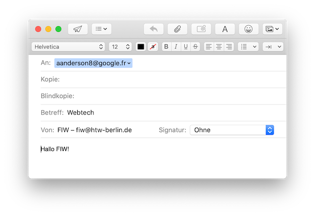

# JavaScript Object Notation (JSON)

Eine kurze Einführung zu Objekten in JavaScript haben wir bereits im [**JavaScript-Kapitel**](../javascript/#objekte) gegeben. Dort haben wir auch gesagt, dass wir auf die Notation solcher Objekte in JavaScript nochmal genauer eingehen wollen. Dies geschieht hier. *JavaScript Object Notation (JSON)* ist ein Datenaustauschformat, das einerseits einfach für Menschen zu lesen und zu schreiben ist und andererseits gut von Maschinen *geparst* (analysiert) und erzeugt werden kann. Ein Objekt in JSON beginnt mit einer geschweiften Klammer `{` und endet mit `}`. JSON besteht im wesentlichen aus Schlüssel-Werte-Paaren, die durch Komma getrennt sind. 

```bash
{
	"schlüssel1": wert1,
	"schlüssel2": wert2,
}
```

Die *Schlüssel* sind Strings in doppelten Hochkamma (`""`), dann folgt ein Doppelpunkt `:` und dann folgt der Wert. *Werte* können Strings, Zahlen, Wahrheitswerte, Arrays, Funktionen und Objekte (und `null`) sein. 

Hier ein Beispiel (erweitert [**aus**](https://wiki.selfhtml.org/wiki/JSON)):

```json linenums="1"
{
  "name": "Georg",
  "alter": 47,
  "verheiratet": false,
  "beruf": null,
  "kinder": [
    {
      "name": "Lukas",
      "alter": 19,
      "schulabschluss": "Gymnasium"
    },
    {
      "name": "Lisa",
      "alter": 14,
      "schulabschluss": null
    }
  ],
  "biografie": function() {
            return this.name + " ist " + this.alter + " und hat " + this.kinder.length + " Kinder.";
  },

}
```

- Der Wert zum Schlüssel `"name"` in Zeile `2` ist ein String (`string`). 
- Der Wert zum Schlüssel `"alter"` in Zeile `3` ist eine Zahl (`number`). 
- Der Wert zum Schlüssel `"verheiratet"` in Zeile `4` ist ein Wahrheitswert (`boolean`). 
- Der Wert zum Schlüssel `"kinder"` in Zeilen `6-17` ist Array. 
- Die Elemente in diesem Array sind selbst wieder Objekte in JavaScript Object Notation, bestehend aus jeweils drei Schlüssel-Werte-Paaren.
- Das `"kinder"`ist numerisch indiziert, d.h. wir können über den Index `0` auf das erste Kind (`"Lukas"`) und über den Index `1` auf das zweite Kind (`"Lisa"`) zugreifen

## Zugriff auf ein JSON

Der Zugriff auf die Werte eines JSON erfolgt mittels Punktnotation über den Schlüssel. Wir nehmen obiges Beispiel und speichern es in einer Variablen `georg`:

```javascript linenums="1"
let georg = {
			  "name": "Georg",
			  "alter": 47,
			  "verheiratet": false,
			  "beruf": null,
			  "kinder": [
			    {
			      "name": "Lukas",
			      "alter": 19,
			      "schulabschluss": "Gymnasium"
			    },
			    {
			      "name": "Lisa",
			      "alter": 14,
			      "schulabschluss": null
			    }
			  ],
			  "biografie": function() {
			            return this.name + " ist " + this.alter + " und hat " + this.kinder.length + " Kinder.";
			  },
			};
```

Dann können wir auf die einzelnen Werte wie folgt zugreifen:

```javascript
georg.name 		// "Georg"
georg.alter 	// 47
let kinder = georg.kinder; 	// Array aus 2 Objekten
kinder[0].name		// "Lukas"
kinder[1].name 		// "Lisa"
georg.biografie()	// "Georg ist 47 und hat 2 Kinder."
```

Man kann übrigens auch anstelle der Punktnotation ein JSON wie ein assoziatives Array auffassen und z.B. anstelle von `georg.name` über `georg['name']` auf den Wert `"Georg"` zugreifen. 

Es wäre auch möglich, das "Kinder"-Array in ein weiteres JSON umzuwandeln:

```javascript linenums="1" hl_lines="2 3 8 13 15 16 21 26"
// anstelle von:
  "kinder": [
    {
      "name": "Lukas",
      "alter": 19,
      "schulabschluss": "Gymnasium"
    },
    {
      "name": "Lisa",
      "alter": 14,
      "schulabschluss": null
    }
  ],
// ginge z.B. auch:
  "kinder": {
    "erstesKind" : {
      "name": "Lukas",
      "alter": 19,
      "schulabschluss": "Gymnasium"
    },
    "zweitesKind" : {
      "name": "Lisa",
      "alter": 14,
      "schulabschluss": null
    }
  },
```

Dann ist der Zugriff über den Index (also z.B. `georg.kinder[0]`) nicht mehr möglich. Stattdessen aber:

```javascript
georg.kinder.erstesKind.name
georg.kinder.zweitesKind.alter
```

### Viele Objekte im Array

Wenn Sie viele "gleiche" Objekte speichern, dann in einem Array. Die folgende Datei zeigt viele Objekte in JSON, die in einem Array abgelegt sind:

??? "data/members.json"
    ```json
    {
      "members": [
        {
          "forename": "Catherine",
          "surname": "Williams",
          "email": "cwilliamsl@360.cn"
        },
        {
          "forename": "Adam",
          "surname": "Anderson",
          "email": "aanderson8@google.fr"
        },
        {
          "forename": "Susan",
          "surname": "Andrews",
          "email": "sandrewsn@google.co.jp"
        },
        {
          "forename": "Catherine",
          "surname": "Andrews",
          "email": "candrewsp@noaa.gov"
        },
        {
          "forename": "Alan",
          "surname": "Bradley",
          "email": "abradley1c@globo.com"
        },
        {
          "forename": "Anne",
          "surname": "Brooks",
          "email": "abrooks16@bravesites.com"
        },
        {
          "forename": "Russell",
          "surname": "Brown",
          "email": "rbrownq@nifty.com"
        },
        {
          "forename": "Ryan",
          "surname": "Burton",
          "email": "rburton18@foxnews.com"
        },
        {
          "forename": "Roy",
          "surname": "Campbell",
          "email": "rcampbell1@geocities.com"
        },
        {
          "forename": "Russell",
          "surname": "Campbell",
          "email": "rcampbell17@eventbrite.com"
        },
        {
          "forename": "Bonnie",
          "surname": "Coleman",
          "email": "bcoleman11@fc2.com"
        },
        {
          "forename": "Ernest",
          "surname": "Coleman",
          "email": "ecoleman15@businessweek.com"
        },
        {
          "forename": "Richard",
          "surname": "Cruz",
          "email": "rcruz7@unc.edu"
        },
        {
          "forename": "Sean",
          "surname": "Cruz",
          "email": "scruz10@answers.com"
        },
        {
          "forename": "Rebecca",
          "surname": "Cunningham",
          "email": "rcunninghamd@mac.com"
        },
        {
          "forename": "Margaret",
          "surname": "Evans",
          "email": "mevansh@pcworld.com"
        },
        {
          "forename": "Jeffrey",
          "surname": "Ford",
          "email": "jford14@cnet.com"
        },
        {
          "forename": "Andrea",
          "surname": "Gardner",
          "email": "agardnerv@woothemes.com"
        },
        {
          "forename": "Deborah",
          "surname": "George",
          "email": "dgeorge6@furl.net"
        },
        {
          "forename": "Sean",
          "surname": "Gibson",
          "email": "sgibsony@alexa.com"
        },
        {
          "forename": "Virginia",
          "surname": "Graham",
          "email": "vgrahamk@aol.com"
        },
        {
          "forename": "Steven",
          "surname": "Hamilton",
          "email": "shamiltonu@state.tx.us"
        },
        {
          "forename": "Virginia",
          "surname": "Hawkins",
          "email": "vhawkinsf@ehow.com"
        },
        {
          "forename": "Edward",
          "surname": "Hicks",
          "email": "ehicksc@pcworld.com"
        },
        {
          "forename": "Mark",
          "surname": "Johnson",
          "email": "mjohnsonj@hostgator.com"
        },
        {
          "forename": "Ruth",
          "surname": "Jordan",
          "email": "rjordan1a@smugmug.com"
        },
        {
          "forename": "Antonio",
          "surname": "Kim",
          "email": "akim4@odnoklassniki.ru"
        },
        {
          "forename": "Jennifer",
          "surname": "Marshall",
          "email": "jmarshallt@gnu.org"
        },
        {
          "forename": "Eric",
          "surname": "Matthews",
          "email": "ematthews5@independent.co.uk"
        },
        {
          "forename": "Raymond",
          "surname": "Mcdonald",
          "email": "rmcdonald2@ihg.com"
        },
        {
          "forename": "Eric",
          "surname": "Miller",
          "email": "emillere@creativecommons.org"
        },
        {
          "forename": "Jonathan",
          "surname": "Morales",
          "email": "jmoralesa@ovh.net"
        },
        {
          "forename": "Marie",
          "surname": "Morgan",
          "email": "mmorganb@cloudflare.com"
        },
        {
          "forename": "Amanda",
          "surname": "Nelson",
          "email": "anelson13@indiatimes.com"
        },
        {
          "forename": "Lisa",
          "surname": "Olson",
          "email": "lolsonr@telegraph.co.uk"
        },
        {
          "forename": "Alice",
          "surname": "Ortiz",
          "email": "aortizw@histats.com"
        },
        {
          "forename": "Peter",
          "surname": "Phillips",
          "email": "pphillipss@1688.com"
        },
        {
          "forename": "Matthew",
          "surname": "Porter",
          "email": "mporter9@europa.eu"
        },
        {
          "forename": "Tammy",
          "surname": "Ray",
          "email": "trayx@weather.com"
        },
        {
          "forename": "Mark",
          "surname": "Richardson",
          "email": "mrichardson1d@ihg.com"
        },
        {
          "forename": "Joan",
          "surname": "Roberts",
          "email": "jroberts12@alibaba.com"
        },
        {
          "forename": "Kathleen",
          "surname": "Rose",
          "email": "kroseg@pinterest.com"
        },
        {
          "forename": "Steve",
          "surname": "Sanders",
          "email": "ssanders1b@wikispaces.com"
        },
        {
          "forename": "Shirley",
          "surname": "Scott",
          "email": "sscottm@macromedia.com"
        },
        {
          "forename": "Lillian",
          "surname": "Stephens",
          "email": "lstephens19@hugedomains.com"
        },
        {
          "forename": "Nicole",
          "surname": "Thompson",
          "email": "nthompson3@admin.ch"
        },
        {
          "forename": "Marie",
          "surname": "Thompson",
          "email": "mthompsonz@yelp.com"
        },
        {
          "forename": "Alan",
          "surname": "Vasquez",
          "email": "avasquezo@miibeian.gov.cn"
        },
        {
          "forename": "Mildred",
          "surname": "Watkins",
          "email": "mwatkins0@miibeian.gov.cn"
        },
        {
          "forename": "Eugene",
          "surname": "Williams",
          "email": "ewilliamsi@deliciousdays.com"
        }
      ]
    }
    ```

Ein Array ist stets numerisch indiziert, d.h. Sie können unter Verwendung des Index die einzelnen Objekte auslesen. Wir hatten das oben bereits für das `"kinder"`-Array gezeigt, geben hier aber noch ein Beispiel an:

```html linenums="1"
<!DOCTYPE html>
<html lang="en">
<head>
    <meta charset="UTF-8">
    <meta name="viewport" content="width=device-width, initial-scale=1">
    <link rel="stylesheet" href="https://cdn.jsdelivr.net/npm/bootstrap@4.5.3/dist/css/bootstrap.min.css" integrity="sha384-TX8t27EcRE3e/ihU7zmQxVncDAy5uIKz4rEkgIXeMed4M0jlfIDPvg6uqKI2xXr2" crossorigin="anonymous">
    <link rel="stylesheet" href="https://stackpath.bootstrapcdn.com/font-awesome/4.7.0/css/font-awesome.min.css">
    <title>JSON + Array</title>
</head>
<body onload="loadJSON()">
<main class="container m-5">
    <ul id="ul1" class="list-group">

    </ul>
</main>
<script>
    var members_obj;

    function loadJSON() {
            let xhttp = new XMLHttpRequest();
            xhttp.onreadystatechange = function() {
                if (this.readyState === 4 && this.status === 200)  {
                    members_obj = JSON.parse(this.responseText);
                    console.log(members_obj);
                    createList();
                }};
            xhttp.open("GET", "./data/members.json", true);
            xhttp.send();
    }

    function createList() {
        let members = members_obj.members;
        console.log(members_obj);
        console.log(members_obj.members);

        let ul = document.getElementById('ul1');
        for(let i=0; i<members.length; i++)
        {
            let li = document.createElement('li');
            li.classList.add('list-group-item');
            let a = document.createElement('a');
            a.href = 'mailto:' + members[i].email + '?subject=Webtech&body=Hallo%20FIW!';
            a.innerHTML = '<i class="fa fa-envelope"> ' + 'to: ' + members[i].forename + ' ' + members[i].surname;
            li.appendChild(a);
            ul.appendChild(li);
        }
    }
</script>
</body>
</html>
```

Es entsteht eine Liste aus Hyperlinks, wobei jeder Hyperlink in der Form zusammengesetzt ist: `mailto:email-adresse`. Es sind sogar noch `subject` (also Betreff) und `body` (als Nachrichteninhalt) angehängt, d.h. die Form ist `mailto:email-adresse?subject=Webtech&body=Hallo%20FIW!`. Beachten Sie, dass es sich dabei um eine URL handelt und diese deshalb *URL encoded* sein muss, d.h. dass z.B. Leerzeichen durch `%20` ersetzt werden. 

Die Seite sieht dann so aus:


Und wenn man auf einen Link klickt (z.B. `Adam Anderson`), öffnet sich das Mailprogramm:



## Ajax

*Ajax* steht für *Asynchronous JavaScript and XML*. Es wird verwendet, um Daten vom Server zu laden oder an den Server zu senden, ohne die Seite neu zu laden. Ajax ist somit die Basis für eine *Single Page Application*. Obwohl *XML* im Namen von Ajax vorkommt, wird hauptsächlich JSON als Datenaustauschformat für das Senden und Empfangen von Daten zwischen Client und Server verwendet. 

Der Begriff *asynchron* beschreibt, dass der Austausch nicht die Webseite blockiert, d.h. dass weitere Nutzerinteraktionen möglich sind während der Datenaustausch erfolgt. 

### XMLHttpRequest

Der Grundbaustein von Ajax ist ein `XMLHttpRequest`-Objekt. Ein solches Objekt stellt Methoden zur Verfügung, um

- eine Webseite (per JavaScript) aktualisieren zu können, ohne sie neu zu laden,
- Daten vom Server anzufordern nachdem die Seite geladen ist,
- Daten zu einem Server im Hintergrund zu senden. 

Angenommen, folgende JSON-Datei liegt auf unserem Server (*DocumentRoot* ist mein DocumentRoot-Ordner): 

=== "DocumentRoot/Webtech20/georg.json"
	```json
	{
	  "name": "Georg",
	  "alter": 47,
	  "verheiratet": false,
	  "beruf": null,
	  "kinder": {
	    "erstesKind": {
	      "name": "Lukas",
	      "alter": 19,
	      "schulabschluss": "Gymnasium"
	    },
	    "zweitesKind": {
	      "name": "Lisa",
	      "alter": 14,
	      "schulabschluss": null
	    }
	  }
	}
	```

Client-seitig besteht die Anfrage an einen Webeserver per `XMLHttpRequest` aus drei Schritten:

1. `XMLHttpRequest`-Objekt erzeugen
2. Anfrage (Request) an Server senden
3. Antwort (Response) verarbeiten/ausgeben

Wir schauen uns das an einem Beispiel an:

```html linenums="1"
<!DOCTYPE html>
<html lang="en">
<head>
    <meta charset="UTF-8">
    <title>Ajax</title>
</head>
<body>
<h2>AJAX wird nachfolgend Daten aus einer JSON-Datei einfügen</h2>
<div id="div1"></div>
<button type="button" onclick="loadJSON();">JSON lesen</button>
<script>
    function loadJSON() {
        let xhttp = new XMLHttpRequest();
        xhttp.onreadystatechange = function() {
            if (this.readyState === 4 && this.status === 200)  {
                createFormular(this);
            }};
        xhttp.open("GET", "http://localhost/Webtech20/georg.json", true);
        xhttp.send();
    }

    function createFormular(json) {
        let georg = JSON.parse(json.responseText);
        console.log(georg);
        console.log(georg.name);
        console.log(georg.kinder.erstesKind.name);
    }
</script>
</body>
</html>
```

- In Zeile `10` definieren wir uns einen Button, der an den EventListener für das `click`-Ereignis angemeldet ist. In der Ereignisbehandlung wird die Funktion `loadJSON()` aufgerufen.
- In Zeile `13` wird das `XMLHttpRequest`-Objekt erzeugt. Die Referenz darauf speichern wir in der Variablen `xhttp`.
- In Zeile `18` wird die Verbindung zum Webserver hergestellt und der Request konfiguriert. Die `open()`-Funktion des `XMLHttpRequest`-Objektes enthält drei Parameter:
    - der erste Parameter beschreibt die http-Methode, mit der angefragt werden soll (`"GET"` oder `"POST"`)
    - der zweite Parameter gibt die Zieladresse der angefragten Ressource auf dem Server an
    - der dritte Parameter gibt die Art der Kommunikation an (`true`: asynchron, `false: synchron)
- In Zeile `19` wird diese Anfrage (Request) gesendet
- In den Zeilen `14-17` wird für die `onreadystatechange`-Eigenschaft des `XMLHttpRequest`-Objektes eine Funktion definiert, die immer dann (automatisch) aufgerufen wird, wenn sich der `readyState` des `XMLHttpRequest`-Objektes ändert. `readyState` kann folgende Werte annehmen:
    - `0` (`UNSENT`): `open()` wurde noch nicht aufgerufen
    - `1` (`OPENED`): `send()` wurde noch nicht aufgerufen
    - `2` (`HEADERS_RECEIVED`): `send()` wurde aufgerufen und Headers sowie Status sind verfügbar
    - `3` (`LOADING`): Download ist im Gange; `responseText` enthält bereit sunvollständige Daten
    - `4` (`DONE`): Download-Vorgang abgeschlossen
- wenn `readyState` den Wert `4` hat und der http-Status `200` (`OK`) ist (Zeile `15`), dann ist der Download der angefragten Ressource fertig und die Ressource kann verwendet werden. Dazu wird in Zeile `16` die Funktion `createFormular(json)` aufgerufen dabei das `XMLHttpRequest`-Objekt übergeben
- in der Eigenschaft `responseText` des `XMLHttpRequest`-Objektes ist das heruntergeladene JSON enthalten. Dies wird in Zeile `23` in der Funktion `createFormular(json)` ausgelesen
- die JavaScript-Funktion `JSON.parse()` erzeugt aus einem JSON-formatierten Text ein entsprechendes Javascript-Objekt. Dies geschieht ebenfalls in Zeile `23`. Die referenz auf dieses JavaScript-Objekt wird in der Variablen `georg` gespeichert. 
- in den Zeilen `24-26` sind einige Zugriffe auf das Objekt exemplarisch implementiert. Die Ausgabe erfolgt auf die Konsole. **Wenn Sie das Beispiel also ausprobieren, dann schauen Sie auf die Konsole in Ihren DeveloperTools.**


### `fetch()`-API

In den letzten Jahren wurde eine sogenannte `fetch()`-API entwickelt, die leistungsfähigere und flexiblere Funktionen zur Verfügung stellt, als ein `XMLHttpRequest`-Objekt. Da wir näher auf [**Promises**](./javascript/#promises) eingehen müssten, erwähnen wir das Thema hier nur und geben ein Beispiel an, das dem oberen sehr ähnlich ist:

```javascript
function loadJSONmitFetch() {
    fetch('http://localhost/Webtech20/georg.json')
        .then(
            function(response) {
                if (response.status !== 200) {
                    console.log('Warning! Status Code: ' + response.status);
                    return;
                }

                // Lese json aus der response aus
                response.json()
                  .then(
                      function(data) {
                          console.log(data);
                      }
                );
            }
        )
        .catch(function(err) {
            console.log('Fetch Error :-S', err);
        });
}
```

