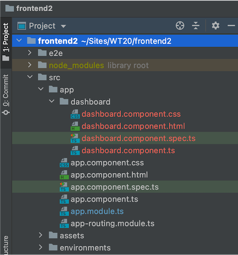
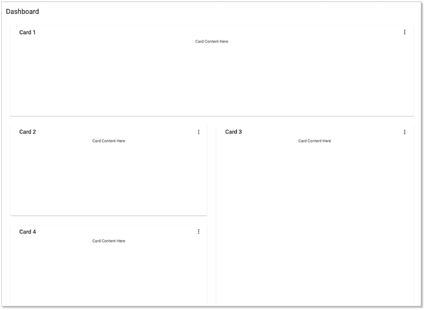
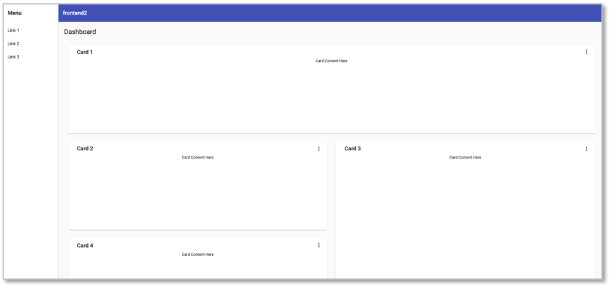

# Material für Angular

Wir haben für unser `frontend` in [Übung 6](../uebungen/#ubungen) bereits [Material](https://material.angular.io/) als CSS-Framework verwendet und wollen dieses hier näher untersuchen, um Angular unter Zuhilfenahme von Material besser kennenzulernen. Zunächst nochmal, wie man einer existierenden Anwendung Material hinzufügt:

```bash
ng add @angular/material
```

In der `angular.json` werden dann unter `"projects"-->"architect"-->"build"` und unter `"projects"-->"architect"-->"test"` die `"styles"` wie folgt konfiguriert:

```json
"styles": [
  "./node_modules/@angular/material/prebuilt-themes/indigo-pink.css",
  "src/styles.css"
],
```

Dabei hängt es jedoch davon ab, welches `prebuilt-theme` Sie gewählt haben. Es gibt diese vier vorgefertigten Themen:

- `deeppurple-amber.css`
- `indigo-pink.css`
- `pink-bluegrey.css`
- `purple-green.css`

Einen Überblick über die unterschiedlichen Komponenten, die Material bereitstellt, finden Sie [hier](https://material.angular.io/components/categories). Wir werden einige davon im folgenden verwenden. 

## Material Schematics

Ein großer Vorteil von Material ist, dass dieses Framework bereits sogenannte [*Schematics*](https://material.angular.io/guide/schematics) liefert, welche vorgefertigte Komponenten erstellen können. Wir werden hier drei davon näher beleuchten

- Navigation
- Dashboard
- Tabelle

Wir erstellen uns nachfolgend nochmal eine Anwendung mit diesen Schematics. Sie können sich mit diesem GitHub-Link das gesamte Projekt clonen und es hier miterstellen.

Wir erstellen uns ein neues Projekt `frontend2` mithilfe von
```bash
ng new frontend2
```

Wir wählen `stricter type checking`, `routing` und `CSS`. Dann wechseln wir in den `fromntend2`-Ordner und fügen `Material` hinzu.
```bash
cd frontend2
ng add @angular/material
```

Als `prebuilt theme` wählen wir `Indigo/Pink` und entscheiden uns für `Material typography styles` und `browser animations` (jeweils `y`). 

### Dashboard

Jetzt verwenden wir das erste Schema von Material, das `dashboard`-Schema und erstellen damit eine Komponente `dashboard`. 
```bash
ng generate @angular/material:dashboard dashboard
```

Unsere Komponente heißt also genauso wie das Schema (`:dashboard` ist das Schema, das letzte Argument der Name der Komponente).

Wir öffnen unsere IDE und sehen, dass die `dashboard`-Komponente angelegt wurde:


Jetzt binden wir die `dashboard`-Komponente in die `app`-Komponente ein. Dazu löschen wir alles aus `src/app/app.component.html` und fügen stattdessen den Komponenten-Selektor der `dashboard`-Komponente ein:

=== "src/app/app.component.html"
	```javascript
	<app-dashboard></app-dashboard>
	```
Unsere Seite (`http://localhost:4200/`) sieht dann so aus:


??? "typischer Fehler"
	Sollte in Ihrer IDE ein Fehler wie z.B. 
	```bash
	This likely means that the library (@angular/material/sidenav) which declares MatSidenavModule has not been processed correctly by ngcc, or is not compatible with Angular Ivy. Check if a newer version of the library is available, and update if so. Also consider checking with the library's authors to see if the library is expected to be compatible with Ivy.
    
    1 export declare class MatSidenavModule {
                           ~~~~~~~~~~~~~~~~
    node_modules/@angular/material/list/list-module.d.ts:8:22 - error NG6002: Appears in the NgModule.imports of AppModule, but could not be resolved to an NgModule class.
    
    This likely means that the library (@angular/material/list) which declares MatListModule has not been processed correctly by ngcc, or is not compatible with Angular Ivy. Check if a newer version of the library is available, and update if so. Also consider checking with the library's authors to see if the library is expected to be compatible with Ivy.
    
    8 export declare class MatListModule {
                           ~~~~~~~~~~~~~
    ```
    erscheinen, dann stoppen Sie einfach die Ausführung von `ng serve` (z.B. rotes Rechteck rechts oben in der IDE) und starten `ng serve` erneut.


Schauen wir uns die `dashboard.component.html` und die `dashboard.component.ts` einmal etwas genauer an: 

=== "src/app/dashboard/dashboard.component.html"
	```html linenums="1"
	<div class="grid-container">
	  <h1 class="mat-h1">Dashboard</h1>
	  <mat-grid-list cols="2" rowHeight="350px">
	    <mat-grid-tile *ngFor="let card of cards | async" [colspan]="card.cols" [rowspan]="card.rows">
	      <mat-card class="dashboard-card">
	        <mat-card-header>
	          <mat-card-title>
	            {{card.title}}
	            <button mat-icon-button class="more-button" [matMenuTriggerFor]="menu" aria-label="Toggle menu">
	              <mat-icon>more_vert</mat-icon>
	            </button>
	            <mat-menu #menu="matMenu" xPosition="before">
	              <button mat-menu-item>Expand</button>
	              <button mat-menu-item>Remove</button>
	            </mat-menu>
	          </mat-card-title>
	        </mat-card-header>
	        <mat-card-content class="dashboard-card-content">
	          <div>Card Content Here</div>
	        </mat-card-content>
	      </mat-card>
	    </mat-grid-tile>
	  </mat-grid-list>
	</div>
	```
=== "src/app/dashboard/dashboard.component.ts"
	```javascript linenums="1"
	import { Component } from '@angular/core';
	import { map } from 'rxjs/operators';
	import { Breakpoints, BreakpointObserver } from '@angular/cdk/layout';

	@Component({
	  selector: 'app-dashboard',
	  templateUrl: './dashboard.component.html',
	  styleUrls: ['./dashboard.component.css']
	})
	export class DashboardComponent {
	  /** Based on the screen size, switch from standard to one column per row */
	  cards = this.breakpointObserver.observe(Breakpoints.Handset).pipe(
	    map(({ matches }) => {
	      if (matches) {
	        return [
	          { title: 'Card 1', cols: 1, rows: 1 },
	          { title: 'Card 2', cols: 1, rows: 1 },
	          { title: 'Card 3', cols: 1, rows: 1 },
	          { title: 'Card 4', cols: 1, rows: 1 }
	        ];
	      }

	      return [
	        { title: 'Card 1', cols: 2, rows: 1 },
	        { title: 'Card 2', cols: 1, rows: 1 },
	        { title: 'Card 3', cols: 1, rows: 2 },
	        { title: 'Card 4', cols: 1, rows: 1 }
	      ];
	    })
	  );

	  constructor(private breakpointObserver: BreakpointObserver) {}
	}
	```

In Zeile `4` der `.html`-Datei wird durch das `cards`-Array gelaufen und alle darin enthaltenen `card`-Elemente dargestellt. Das `cards`-Array ist in der `.ts`-Datei definiert. Abhängig von der Breite des Viewports liefert das [`BreakpointObserver`](https://material.angular.io/cdk/layout/overview)-Objekt ein Array aus vier `cards` zurück. Angular Material CDK verwendet das [`layout`](https://material.angular.io/cdk/layout/overview)-Paket, um das responsive Grid zu stylen. Es sind dort verschiedene [*Breakpoints*](https://material.io/design/layout/responsive-layout-grid.html#breakpoints) für unterschiedliche Verhalten je nach Viewport-Breite definiert.

Wir wollen uns zunächst um diese `cards` kümmern und uns eine Komponente `card` erstellen, auf der alle andern `cards` basieren. Dazu geben wir innerhalb des `frontend2`-Ordners ein:
```bash
ng g c card -m app
```

Jetzt kopieren wir aus der `dashboard.component.html` das hervorgehobene Stück in die `card.component.html`. Beachten Sie, dass wir in `card.component.html` nun nicht mehr auf `card.title` zugreifen können, da `card` dort gar nicht existiert (Zeile `5`:
=== "src/app/card/card.component.html"
	```html linenums="1" hl_lines="5"
	<!-- aus dashboard.component.html kopiert -->
	<mat-card class="dashboard-card">
	  <mat-card-header>
	    <mat-card-title>
	      {{title}}
	      <button mat-icon-button class="more-button" [matMenuTriggerFor]="menu" aria-label="Toggle menu">
	        <mat-icon>more_vert</mat-icon>
	      </button>
	      <mat-menu #menu="matMenu" xPosition="before">
	        <button mat-menu-item>Expand</button>
	        <button mat-menu-item>Remove</button>
	      </mat-menu>
	    </mat-card-title>
	  </mat-card-header>
	  <mat-card-content class="dashboard-card-content">
	    <div>Card Content Here</div>
	  </mat-card-content>
	</mat-card>
	```
=== "src/app/dashboard/dashboard.component.html"
	```html linenums="1" hl_lines="5-7"
	<div class="grid-container">
	  <h1 class="mat-h1">Dashboard</h1>
	  <mat-grid-list cols="2" rowHeight="350px">
	    <mat-grid-tile *ngFor="let card of cards | async" [colspan]="card.cols" [rowspan]="card.rows">
	      <!-- hier herausgeschnitten und nach card.component.html kopiert -->

	      <!-- bis hier -->
	    </mat-grid-tile>
	  </mat-grid-list>
	</div>
	```

Die `title`-Eigenschaft für eine `card` muss aus `dashboard` importiert werden. Wir ändern deshalb die `card.component.ts`:


Mithilfe von `-m app` melden wir die neue Komponente gleich in `app.module.ts` an. Dann brauchen wir das nicht selbst zu tun. 

### Navigation

Jetzt verwenden wir ein weiteres Schema, das `navigation`-Schema von Material. In unserem Ordner `frontend2` rufen wir
```bash
ng generate @angular/material:navigation nav
```
auf, um eine `nav`-Komponente zu erstellen. Nun rufen wir die `dashboard`-Komponente nicht mehr in der `app`-Komponente auf, sondern in der `nav`-Komponente. Stattdessen wird die `nav`-Komponente in der `app`-Komponente aufgerufen:

=== "src/app/app.component.html"
	```javascript
	<app-nav></app-nav>
	```
=== "src/app/nav/nav.component.html"
	```javascript linenums="1" hl_lines="26"
	<mat-sidenav-container class="sidenav-container">
	  <mat-sidenav #drawer class="sidenav" fixedInViewport
	      [attr.role]="(isHandset$ | async) ? 'dialog' : 'navigation'"
	      [mode]="(isHandset$ | async) ? 'over' : 'side'"
	      [opened]="(isHandset$ | async) === false">
	    <mat-toolbar>Menu</mat-toolbar>
	    <mat-nav-list>
	      <a mat-list-item href="#">Link 1</a>
	      <a mat-list-item href="#">Link 2</a>
	      <a mat-list-item href="#">Link 3</a>
	    </mat-nav-list>
	  </mat-sidenav>
	  <mat-sidenav-content>
	    <mat-toolbar color="primary">
	      <button
	        type="button"
	        aria-label="Toggle sidenav"
	        mat-icon-button
	        (click)="drawer.toggle()"
	        *ngIf="isHandset$ | async">
	        <mat-icon aria-label="Side nav toggle icon">menu</mat-icon>
	      </button>
	      <span>frontend2</span>
	    </mat-toolbar>
	    <!-- Add Content Here -->
	    <app-dashboard></app-dashboard>
	  </mat-sidenav-content>
	</mat-sidenav-container>
	```
Unsere Seite (`http://localhost:4200/`) sieht dann so aus:


### Table

Ein weiteres Schema, das wir verwenden wollen, ist das `table`-Schema von Material. In unserem Ordner `frontend2` rufen wir
```bash
ng generate @angular/material:table table
```


[Angular Tabelle](https://blog.angular-university.io/angular-material-data-table/)

