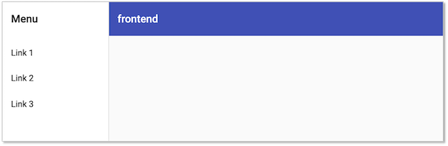
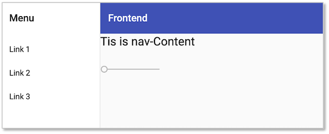
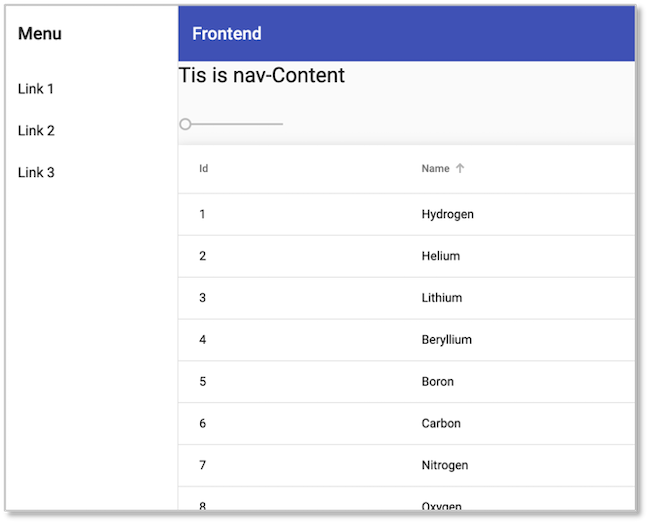
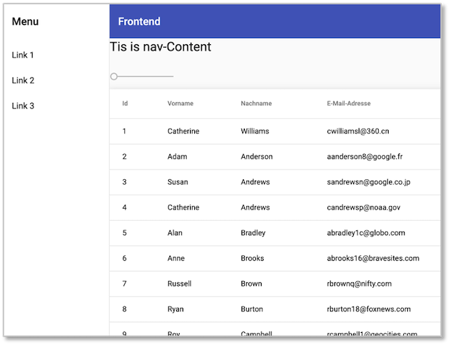
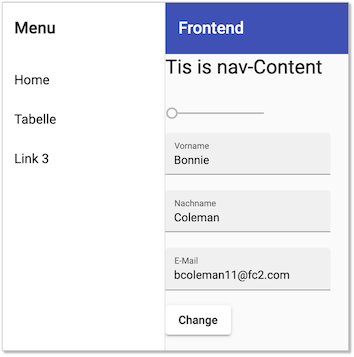

# Material für Angular

Wir haben für unser `frontend` in [Übung 6](../uebungen/#ubungen) bereits [Material](https://material.angular.io/) als CSS-Framework verwendet und wollen dieses hier näher untersuchen, um Angular unter Zuhilfenahme von Material besser kennenzulernen. Zunächst nochmal, wie man einer existierenden Anwendung Material hinzufügt:

```bash
ng add @angular/material
```

In der `angular.json` werden dann unter `"projects"-->"architect"-->"build"` und unter `"projects"-->"architect"-->"test"` die `"styles"` wie folgt konfiguriert:

```json
"styles": [
  "./node_modules/@angular/material/prebuilt-themes/indigo-pink.css",
  "src/styles.css"
],
```

Dabei hängt es jedoch davon ab, welches `prebuilt-theme` Sie gewählt haben. Es gibt diese vier vorgefertigten Themen:

- `deeppurple-amber.css`
- `indigo-pink.css`
- `pink-bluegrey.css`
- `purple-green.css`

Einen Überblick über die unterschiedlichen Komponenten, die Material bereitstellt, finden Sie [hier](https://material.angular.io/components/categories). Wir werden einige davon im folgenden verwenden. 

## Material Schematics

Ein großer Vorteil von Material ist, dass dieses Framework bereits sogenannte [*Schematics*](https://material.angular.io/guide/schematics) liefert, welche vorgefertigte Komponenten erstellen können. In Übung 6 haben wir bereits das Schema `navigation`verwendet. Wir setzen auf die [Lösung von Übung 6](https://github.com/jfreiheit/frontend2.git) auf. 

Wir betrachten zunächst nochmal den aktuellen Stand dieser Lösung. Die `app.component.html` sah so aus (je, nachdem, wie Sie Ihren Projekt-Prefix gewählt haben - hier `jf`):

=== "/src/app/app.component.html"
	```html
	<jf-nav></jf-nav>
	<h1>Tis is app</h1>
	<mat-slider min="1" max="100" step="1" value="1"></mat-slider>
	<router-outlet></router-outlet>
	```

Es wird also zunächst die Navigationskomponente eingebunden und dann kommen noch eine Überschrift und ein Slider. In der Anwendung sieht man aber diese Sachen nicht mehr:



Das liegt daran, dass wir unsere Inhalte nun in die Navigationskomponente einfügen müssen. Die App-Komponente enthält nur noch den Komponentenselektor für die Navigationskomponente:

=== "/src/app/app.component.html"
	```html
	<jf-nav></jf-nav>
	```
=== "/src/app/nav/nav.component.html"
	```html linenums="1" hl_lines="25-31"
	<mat-sidenav-container class="sidenav-container">
	  <mat-sidenav #drawer class="sidenav" fixedInViewport
	      [attr.role]="(isHandset$ | async) ? 'dialog' : 'navigation'"
	      [mode]="(isHandset$ | async) ? 'over' : 'side'"
	      [opened]="(isHandset$ | async) === false">
	    <mat-toolbar>Menu</mat-toolbar>
	    <mat-nav-list>
	      <a mat-list-item href="#">Link 1</a>
	      <a mat-list-item href="#">Link 2</a>
	      <a mat-list-item href="#">Link 3</a>
	    </mat-nav-list>
	  </mat-sidenav>
	  <mat-sidenav-content>
	    <mat-toolbar color="primary">
	      <button
	        type="button"
	        aria-label="Toggle sidenav"
	        mat-icon-button
	        (click)="drawer.toggle()"
	        *ngIf="isHandset$ | async">
	        <mat-icon aria-label="Side nav toggle icon">menu</mat-icon>
	      </button>
	      <span>Frontend</span>
	    </mat-toolbar>
	    <!-- Add Content Here -->

	    <h1>Tis is nav-Content</h1>
	    <mat-slider min="1" max="100" step="1" value="1"></mat-slider>
	    <router-outlet></router-outlet>

	    <!-- end of nav-Content -->
	  </mat-sidenav-content>
	</mat-sidenav-container>
	```

Das ist dann auch sichtbar:



Ehe wir uns mit dem Routing beschäftigen, erstellen wir zunächst noch zwei weitere Komponenten.


### Table

Ein weiteres Schema, das wir verwenden wollen, ist das `table`-Schema von Material. In unserem Ordner `frontend2` rufen wir
```bash
ng generate @angular/material:table table
```

Um diese Komponente zu testen, binden wir sie zunächst in unsere `nav`-Komponente ein (Beachten Sie, dass Ihr Prefix anders ist).

=== "/src/app/nav/nav.component.html"
	```html linenums="1" hl_lines="29"
	<mat-sidenav-container class="sidenav-container">
	  <mat-sidenav #drawer class="sidenav" fixedInViewport
	      [attr.role]="(isHandset$ | async) ? 'dialog' : 'navigation'"
	      [mode]="(isHandset$ | async) ? 'over' : 'side'"
	      [opened]="(isHandset$ | async) === false">
	    <mat-toolbar>Menu</mat-toolbar>
	    <mat-nav-list>
	      <a mat-list-item href="#">Link 1</a>
	      <a mat-list-item href="#">Link 2</a>
	      <a mat-list-item href="#">Link 3</a>
	    </mat-nav-list>
	  </mat-sidenav>
	  <mat-sidenav-content>
	    <mat-toolbar color="primary">
	      <button
	        type="button"
	        aria-label="Toggle sidenav"
	        mat-icon-button
	        (click)="drawer.toggle()"
	        *ngIf="isHandset$ | async">
	        <mat-icon aria-label="Side nav toggle icon">menu</mat-icon>
	      </button>
	      <span>Frontend</span>
	    </mat-toolbar>
	    <!-- Add Content Here -->

	    <h1>Tis is nav-Content</h1>
	    <mat-slider min="1" max="100" step="1" value="1"></mat-slider>
	    <jf-table></jf-table>
	    <router-outlet></router-outlet>

	    <!-- end of nav-Content -->
	  </mat-sidenav-content>
	</mat-sidenav-container>
	```

Die Tabelle erscheint so:



Wir ändern die Tabelle und fügen eigene Daten ein, um uns mit der Komponente vertraut zu machen. Wir öffnen `src/app/table/table-datasource.ts`. Je nach verwendeter Angular-Version sehen einige von Ihnen, dass diese Datei Fehler enthält. Die Funktionen sind rot unterstrichen. Das liegt daran, dass nun auch Funktionen typisiert werden müssen. Wir fügen die Rückgabetypen für die Funktionen deshalb zunächst ein:

=== "src/app/table/table-datasource.ts"
	```javascript linenums="1" hl_lines="74 80 89 106"
	import { DataSource } from '@angular/cdk/collections';
	import { MatPaginator } from '@angular/material/paginator';
	import { MatSort } from '@angular/material/sort';
	import { map } from 'rxjs/operators';
	import { Observable, of as observableOf, merge } from 'rxjs';

	// TODO: Replace this with your own data model type
	export interface TableItem {
	  name: string;
	  id: number;
	}

	// TODO: replace this with real data from your application
	const EXAMPLE_DATA: TableItem[] = [
	  {id: 1, name: 'Hydrogen'},
	  {id: 2, name: 'Helium'},
	  {id: 3, name: 'Lithium'},
	  {id: 4, name: 'Beryllium'},
	  {id: 5, name: 'Boron'},
	  {id: 6, name: 'Carbon'},
	  {id: 7, name: 'Nitrogen'},
	  {id: 8, name: 'Oxygen'},
	  {id: 9, name: 'Fluorine'},
	  {id: 10, name: 'Neon'},
	  {id: 11, name: 'Sodium'},
	  {id: 12, name: 'Magnesium'},
	  {id: 13, name: 'Aluminum'},
	  {id: 14, name: 'Silicon'},
	  {id: 15, name: 'Phosphorus'},
	  {id: 16, name: 'Sulfur'},
	  {id: 17, name: 'Chlorine'},
	  {id: 18, name: 'Argon'},
	  {id: 19, name: 'Potassium'},
	  {id: 20, name: 'Calcium'},
	];

	/**
	 * Data source for the Table view. This class should
	 * encapsulate all logic for fetching and manipulating the displayed data
	 * (including sorting, pagination, and filtering).
	 */
	export class TableDataSource extends DataSource<TableItem> {
	  data: TableItem[] = EXAMPLE_DATA;
	  paginator: MatPaginator;
	  sort: MatSort;

	  constructor() {
	    super();
	  }

	  /**
	   * Connect this data source to the table. The table will only update when
	   * the returned stream emits new items.
	   * @returns A stream of the items to be rendered.
	   */
	  connect(): Observable<TableItem[]> {
	    // Combine everything that affects the rendered data into one update
	    // stream for the data-table to consume.
	    const dataMutations = [
	      observableOf(this.data),
	      this.paginator.page,
	      this.sort.sortChange
	    ];

	    return merge(...dataMutations).pipe(map(() => {
	      return this.getPagedData(this.getSortedData([...this.data]));
	    }));
	  }

	  /**
	   *  Called when the table is being destroyed. Use this function, to clean up
	   * any open connections or free any held resources that were set up during connect.
	   */
	  disconnect(): void {}

	  /**
	   * Paginate the data (client-side). If you're using server-side pagination,
	   * this would be replaced by requesting the appropriate data from the server.
	   */
	  private getPagedData(data: TableItem[]): TableItem[] {
	    const startIndex = this.paginator.pageIndex * this.paginator.pageSize;
	    return data.splice(startIndex, this.paginator.pageSize);
	  }

	  /**
	   * Sort the data (client-side). If you're using server-side sorting,
	   * this would be replaced by requesting the appropriate data from the server.
	   */
	  private getSortedData(data: TableItem[]): TableItem[] {
	    if (!this.sort.active || this.sort.direction === '') {
	      return data;
	    }

	    return data.sort((a, b) => {
	      const isAsc = this.sort.direction === 'asc';
	      switch (this.sort.active) {
	        case 'name': return compare(a.name, b.name, isAsc);
	        case 'id': return compare(+a.id, +b.id, isAsc);
	        default: return 0;
	      }
	    });
	  }
	}

	/** Simple sort comparator for example ID/Name columns (for client-side sorting). */
	function compare(a: string | number, b: string | number, isAsc: boolean): number {
	  return (a < b ? -1 : 1) * (isAsc ? 1 : -1);
	}

	```

Wir werden die Komponente nun dahingehend ändern, dass unsere Mockup-Daten aus den vorherigen Übungen dargestellt werden, also diese hier:

??? "mockup-data aus den vorherigen Übungen"
	```json
	[
	  {
	    id: 1,
	    forename: 'Catherine',
	    surname: 'Williams',
	    email: 'cwilliamsl@360.cn'
	  },
	  {
	    id: 2,
	    forename: 'Adam',
	    surname: 'Anderson',
	    email: 'aanderson8@google.fr'
	  },
	  {
	    id: 3,
	    forename: 'Susan',
	    surname: 'Andrews',
	    email: 'sandrewsn@google.co.jp'
	  },
	  {
	    id: 4,
	    forename: 'Catherine',
	    surname: 'Andrews',
	    email: 'candrewsp@noaa.gov'
	  },
	  {
	    id: 5,
	    forename: 'Alan',
	    surname: 'Bradley',
	    email: 'abradley1c@globo.com'
	  },
	  {
	    id: 6,
	    forename: 'Anne',
	    surname: 'Brooks',
	    email: 'abrooks16@bravesites.com'
	  },
	  {
	    id: 7,
	    forename: 'Russell',
	    surname: 'Brown',
	    email: 'rbrownq@nifty.com'
	  },
	  {
	    id: 8,
	    forename: 'Ryan',
	    surname: 'Burton',
	    email: 'rburton18@foxnews.com'
	  },
	  {
	    id: 9,
	    forename: 'Roy',
	    surname: 'Campbell',
	    email: 'rcampbell1@geocities.com'
	  },
	  {
	    id: 10,
	    forename: 'Russell',
	    surname: 'Campbell',
	    email: 'rcampbell17@eventbrite.com'
	  },
	  {
	    id: 11,
	    forename: 'Bonnie',
	    surname: 'Coleman',
	    email: 'bcoleman11@fc2.com'
	  },
	  {
	    id: 12,
	    forename: 'Ernest',
	    surname: 'Coleman',
	    email: 'ecoleman15@businessweek.com'
	  },
	  {
	    id: 13,
	    forename: 'Richard',
	    surname: 'Cruz',
	    email: 'rcruz7@unc.edu'
	  },
	  {
	    id: 14,
	    forename: 'Sean',
	    surname: 'Cruz',
	    email: 'scruz10@answers.com'
	  },
	  {
	    id: 15,
	    forename: 'Rebecca',
	    surname: 'Cunningham',
	    email: 'rcunninghamd@mac.com'
	  },
	  {
	    id: 16,
	    forename: 'Margaret',
	    surname: 'Evans',
	    email: 'mevansh@pcworld.com'
	  },
	  {
	    id: 17,
	    forename: 'Jeffrey',
	    surname: 'Ford',
	    email: 'jford14@cnet.com'
	  },
	  {
	    id: 18,
	    forename: 'Andrea',
	    surname: 'Gardner',
	    email: 'agardnerv@woothemes.com'
	  },
	  {
	    id: 19,
	    forename: 'Deborah',
	    surname: 'George',
	    email: 'dgeorge6@furl.net'
	  },
	  {
	    id: 20,
	    forename: 'Sean',
	    surname: 'Gibson',
	    email: 'sgibsony@alexa.com'
	  },
	  {
	    id: 21,
	    forename: 'Virginia',
	    surname: 'Graham',
	    email: 'vgrahamk@aol.com'
	  },
	  {
	    id: 22,
	    forename: 'Steven',
	    surname: 'Hamilton',
	    email: 'shamiltonu@state.tx.us'
	  },
	  {
	    id: 23,
	    forename: 'Virginia',
	    surname: 'Hawkins',
	    email: 'vhawkinsf@ehow.com'
	  },
	  {
	    id: 24,
	    forename: 'Edward',
	    surname: 'Hicks',
	    email: 'ehicksc@pcworld.com'
	  },
	  {
	    id: 25,
	    forename: 'Mark',
	    surname: 'Johnson',
	    email: 'mjohnsonj@hostgator.com'
	  },
	  {
	    id: 26,
	    forename: 'Ruth',
	    surname: 'Jordan',
	    email: 'rjordan1a@smugmug.com'
	  },
	  {
	    id: 27,
	    forename: 'Antonio',
	    surname: 'Kim',
	    email: 'akim4@odnoklassniki.ru'
	  },
	  {
	    id: 28,
	    forename: 'Jennifer',
	    surname: 'Marshall',
	    email: 'jmarshallt@gnu.org'
	  },
	  {
	    id: 29,
	    forename: 'Eric',
	    surname: 'Matthews',
	    email: 'ematthews5@independent.co.uk'
	  },
	  {
	    id: 30,
	    forename: 'Raymond',
	    surname: 'Mcdonald',
	    email: 'rmcdonald2@ihg.com'
	  },
	  {
	    id: 31,
	    forename: 'Eric',
	    surname: 'Miller',
	    email: 'emillere@creativecommons.org'
	  },
	  {
	    id: 32,
	    forename: 'Jonathan',
	    surname: 'Morales',
	    email: 'jmoralesa@ovh.net'
	  },
	  {
	    id: 33,
	    forename: 'Marie',
	    surname: 'Morgan',
	    email: 'mmorganb@cloudflare.com'
	  },
	  {
	    id: 34,
	    forename: 'Amanda',
	    surname: 'Nelson',
	    email: 'anelson13@indiatimes.com'
	  },
	  {
	    id: 35,
	    forename: 'Lisa',
	    surname: 'Olson',
	    email: 'lolsonr@telegraph.co.uk'
	  },
	  {
	    id: 36,
	    forename: 'Alice',
	    surname: 'Ortiz',
	    email: 'aortizw@histats.com'
	  },
	  {
	    id: 37,
	    forename: 'Peter',
	    surname: 'Phillips',
	    email: 'pphillipss@1688.com'
	  },
	  {
	    id: 38,
	    forename: 'Matthew',
	    surname: 'Porter',
	    email: 'mporter9@europa.eu'
	  },
	  {
	    id: 39,
	    forename: 'Tammy',
	    surname: 'Ray',
	    email: 'trayx@weather.com'
	  },
	  {
	    id: 40,
	    forename: 'Mark',
	    surname: 'Richardson',
	    email: 'mrichardson1d@ihg.com'
	  },
	  {
	    id: 41,
	    forename: 'Joan',
	    surname: 'Roberts',
	    email: 'jroberts12@alibaba.com'
	  },
	  {
	    id: 42,
	    forename: 'Kathleen',
	    surname: 'Rose',
	    email: 'kroseg@pinterest.com'
	  },
	  {
	    id: 43,
	    forename: 'Steve',
	    surname: 'Sanders',
	    email: 'ssanders1b@wikispaces.com'
	  },
	  {
	    id: 44,
	    forename: 'Shirley',
	    surname: 'Scott',
	    email: 'sscottm@macromedia.com'
	  },
	  {
	    id: 45,
	    forename: 'Lillian',
	    surname: 'Stephens',
	    email: 'lstephens19@hugedomains.com'
	  },
	  {
	    id: 46,
	    forename: 'Nicole',
	    surname: 'Thompson',
	    email: 'nthompson3@admin.ch'
	  },
	  {
	    id: 47,
	    forename: 'Marie',
	    surname: 'Thompson',
	    email: 'mthompsonz@yelp.com'
	  },
	  {
	    id: 48,
	    forename: 'Alan',
	    surname: 'Vasquez',
	    email: 'avasquezo@miibeian.gov.cn'
	  },
	  {
	    id: 49,
	    forename: 'Mildred',
	    surname: 'Watkins',
	    email: 'mwatkins0@miibeian.gov.cn'
	  },
	  {
	    id: 50,
	    forename: 'Eugene',
	    surname: 'Williams',
	    email: 'ewilliamsi@deliciousdays.com'
	  }
	];
	```

Ersetzen Sie das `EXAMPLE_DATA`-Array in `table-datasource.ts` durch obiges Array. Das Ersetzen der Arrays führt zu vielen Fehlern in `table-datasource.ts`. Insbesondere sind z.B. die `forename`-Eigenschaften rot unterstrichen. Das liegt daran, dass das `interface TableItem` nicht mit dem Datenmodell der Mockup-Daten übereinstimmt. Wir müssen also das Interface wie folgt anpassen:

```javascript
// TODO: Replace this with your own data model type
export interface TableItem {
  id: number;
  forename: string;
  surname: string;
  email: string;
}
``` 

Jetzt stimmt die Sortiermethode `sort()` nicht mehr, da dort auf die Eigenschaft `name` zugegriffen wird, diese Eigenschaft aber nicht mehr existiert. Wir passen also die Sortierfunktion entsprechend an:

```javascript
  private getSortedData(data: TableItem[]): TableItem[] {
    if (!this.sort.active || this.sort.direction === '') {
      return data;
    }

    return data.sort((a, b) => {
      const isAsc = this.sort.direction === 'asc';
      switch (this.sort.active) {
        case 'forename': return compare(a.forename, b.forename, isAsc);
        case 'surname': return compare(a.surname, b.surname, isAsc);
        case 'email': return compare(a.email, b.email, isAsc);
        case 'id': return compare(+a.id, +b.id, isAsc);
        default: return 0;
      }
    });
  }
```

Die Datei `table-datasource.ts` sollte nun fehlerfrei sein. Nun passen wir noch die `table.component.html` an. In ihr sind derzeit zwei Spalten für die Tabelle definiert, die `id`-Spalte und die `name`-Spalte (jeweils unter den entsprechenden HTML-Kommentaren). Kopieren Sie die `name`-Spalte und fügern Sie sie zwei Mal in die `table.component.html` ein. Passen Sie die Einträge entsprechend an. Die `table.component.html` sollte dann so aussehen:

=== "src/app/table/table.component.html"
	```html linenums="1" hl_lines="9-13 15-19 21-25"
	<div class="mat-elevation-z8">
	  <table mat-table class="full-width-table" matSort aria-label="Elements">
	    <!-- Id Column -->
	    <ng-container matColumnDef="id">
	      <th mat-header-cell *matHeaderCellDef mat-sort-header>Id</th>
	      <td mat-cell *matCellDef="let row">{{row.id}}</td>
	    </ng-container>

	    <!-- forename Column -->
	    <ng-container matColumnDef="forename">
	      <th mat-header-cell *matHeaderCellDef mat-sort-header>Vorname</th>
	      <td mat-cell *matCellDef="let row">{{row.forename}}</td>
	    </ng-container>

	    <!-- surname Column -->
	    <ng-container matColumnDef="surname">
	      <th mat-header-cell *matHeaderCellDef mat-sort-header>Nachname</th>
	      <td mat-cell *matCellDef="let row">{{row.surname}}</td>
	    </ng-container>

	    <!-- email Column -->
	    <ng-container matColumnDef="email">
	      <th mat-header-cell *matHeaderCellDef mat-sort-header>E-Mail-Adresse</th>
	      <td mat-cell *matCellDef="let row">{{row.email}}</td>
	    </ng-container>

	    <tr mat-header-row *matHeaderRowDef="displayedColumns"></tr>
	    <tr mat-row *matRowDef="let row; columns: displayedColumns;"></tr>
	  </table>

	  <mat-paginator #paginator
	      [length]="dataSource?.data.length"
	      [pageIndex]="0"
	      [pageSize]="50"
	      [pageSizeOptions]="[25, 50, 100, 250]">
	  </mat-paginator>
	</div>
	```

Nun passen wir nur noch die `table.componen.ts` an. Dort müssen wir mitteilen, welche Eigenschaften unseres Datensatzes für die einzelnen Spalten der Tabelle verwendet und entsprechend dargestellt werden. 

```javascript
  /** Columns displayed in the table. Columns IDs can be added, removed, or reordered. */
  displayedColumns = ['id', 'forename', 'surname', 'email'];
``` 

Auch in der `table.component.ts` sollten wir die Methoden noch typisieren. Beide Methoden sind `void`-Methoden. Es handelt sich dabei um sogenannte *Lifecycle-Hooks*. Die `ngOnInit()`-Funktion wird aufgerufen, wenn die Komponente initialisiert wird. Die `ngAfterViewInit()`-Funktion wird aufgerufen, nachdem unsere `View`, also die Tabellenansicht, initialisisert wurde. Die `table.component.ts` sollte nun so aussehen:

=== "src/app/table/table.component.ts"
	```javascript linenums="1" hl_lines="19 21 25"
	import { AfterViewInit, Component, OnInit, ViewChild } from '@angular/core';
	import { MatPaginator } from '@angular/material/paginator';
	import { MatSort } from '@angular/material/sort';
	import { MatTable } from '@angular/material/table';
	import { TableDataSource, TableItem } from './table-datasource';

	@Component({
	  selector: 'jf-table',
	  templateUrl: './table.component.html',
	  styleUrls: ['./table.component.css']
	})
	export class TableComponent implements AfterViewInit, OnInit {
	  @ViewChild(MatPaginator) paginator: MatPaginator;
	  @ViewChild(MatSort) sort: MatSort;
	  @ViewChild(MatTable) table: MatTable<TableItem>;
	  dataSource: TableDataSource;

	  /** Columns displayed in the table. Columns IDs can be added, removed, or reordered. */
	  displayedColumns = ['id', 'forename', 'surname', 'email'];

	  ngOnInit(): void {
	    this.dataSource = new TableDataSource();
	  }

	  ngAfterViewInit(): void {
	    this.dataSource.sort = this.sort;
	    this.dataSource.paginator = this.paginator;
	    this.table.dataSource = this.dataSource;
	  }
	}
	``` 

Unsere Seite sieht jetzt so aus:



Beachten Sie, dass Sie die Tabellenzeilen sortieren können. Neben den Spaltenüberschriften erscheinen bei Mouseover jeweils kleine Pfeile. Wenn Sie darauf klicken, werden die Tabellenzeilen entsprechend der Spaltensortierung angezeigt. Beachten Sie auch das Paginieren. Rechts unterhalb der Tabelle können Sie die Anzahl der Tabellenseite auf einer Seite ändern (siehe in `table.component.html` die `[pageSizeOptions]="[25, 50, 100, 250]` für den `paginator`) und Sie können durch die Seiten blättern.


**Ausblick:** Wir haben die Daten hier clientseitig geladen, also nicht vom Server. Das werden wir später ändern. Zunächst schauen wir uns aber mal das *Routing* an. 

## Routing

Sie haben sich vielleicht schon gefragt, wozu der `<router-outlet></router-outlet>`-Selektor da ist, der bei uns in der `nav.component.html` enthalten ist. Wir wollen jetzt Komponenten über die URL ansprechen, also z.B. im Browser `localhost:4200/table` angeben und nur unter dieser URL soll unsere Tabelle erscheinen. In Vorbereitung darauf, entfernen wir zunächst den Komponentenselektor für die Tabellen-Komponente aus der `nav.component.html`:

=== "Ausschnitt aus nav.component.html"
	```html linenums="25" hl_lines="5"
    <!-- Add Content Here -->

    <h1>Tis is nav-Content</h1>
    <mat-slider min="1" max="100" step="1" value="1"></mat-slider>
    <!-- <jf-table></jf-table> geloescht -->
    <router-outlet></router-outlet>

    <!-- end of nav-Content -->
	```

Jetzt sieht man die Tabelle nicht mehr. Wir binden Sie aber gleich über den `<router-outlet></router-outlet>`-Selektor wieder ein, wenn wir nämlich die URL `localhost:4200/table` aufrufen. Dies wird *Routing*  genannt. Um eine solche Route anzulegen, öffnen wir die Datei `src/app/app-routing.module.ts`. 

=== "src/app/app-routing.module.ts"
	```javascript linenums="1" hl_lines="3 6"
	import { NgModule } from '@angular/core';
	import { Routes, RouterModule } from '@angular/router';
	import {TableComponent} from './table/table.component';

	const routes: Routes = [
	  { path: 'table', component: TableComponent }
	];

	@NgModule({
	  imports: [RouterModule.forRoot(routes)],
	  exports: [RouterModule]
	})
	export class AppRoutingModule { }
	```

Geben Sie Zeile `6` ein und lassen Sie den Import (Zeile `3`) durch Ihre IDE erledigen. Wir haben uns eine neue Route angelegt. Wenn wir nun im Browser an die URL `localhost:4200` noch `/table` anhängen, wird die Tabellen-Komponente über den `<router-outlet></router-outlet>`-Selektor eingebunden und angezeigt. 

Öffnen Sie die `nav.component.html`. Darin passen wir die Liste der Links (`<mat-nav-list>`) an. Für Routen verwenden wir nicht `href`, sondern `routerLinks`. Die Liste soll so aussehen:

=== "Ausschnitt aus nav.component.html"
	```javascript linenums="7" hl_lines="2 3"
	    <mat-nav-list>
      <a mat-list-item routerLink="/">Home</a>
      <a mat-list-item routerLink="/table">Tabelle</a>
      <a mat-list-item href="#">Link 3</a>
    </mat-nav-list>
    ```

Nun können wir die Navigations-komponente verwenden, um zwischen den Routen `/` und `/table` zu wechseln. 

## Service

Derzeit sind unsere MockUp-Daten statisch in der `table-datasource.ts` gespeichert. Wir wollen aber die Datenverwaltung (Speicherung und Bereitstellung) unabhängig von einer Komponente gestalten und allen Komponenten einen entsprechenden *Service* anbieten. Dazu erstellen wir uns einen solchen und legen diesen unter `shared` ab, da sich alle Komponenten diesen Service teilen (können).

```bash
ng g service shared/data
```

Es entsteht der `shared`-Ordner, der zwei Dateien enthält, die `data.service.ts` und die `data.service.spec.ts`. Letztere ist zum Testen und interessiert uns erstmal nicht. Schauen wir uns die `data.service.ts` einmal an:

=== "src/shared/data.service.ts"
	```javascript linenums="1"
	import { Injectable } from '@angular/core';

	@Injectable({
	  providedIn: 'root'
	})
	export class DataService {

	  constructor() { }
	}

    ```

Für Services gibt es keine Lifecycle-Hooks. Wir finden hier deshalb auch keine `ngOnInit()`-Methode. Während Komponenten den Decorator `@Component()` aufweisen, wird für Services der Decorator `@Injectable()` verwendet. Mit diesem Decorator geben wir an, dass der Service weitere Abhängigkeiten einbinden kann. Dies geschieht typischerweise über einen Parameter im Konstruktor - eine soganannte *dependency injection* (wenn über den Konstruktor, dann *constructor injection*). Auch wenn wir eine solche Abhängigkeit nicht einbinden, sollte der Decorator `@Injectable()` stets für einen Service angegeben werden. Dies liegt daran, dass wir diesen Decorator um die `providedIn`-Eigenschaft erweitern. Mit `providedIn: 'root'` geben wir an, dass der Service allen Komponenten (im gesamten Root-Modul) zur Verfügung steht, er also von allen Komponenten genutzt werden kann. Bevor wir uns weiter um diesen Service kümmern, erstellen wir uns erst noch ein Datenmodell, auf das alle Komponenten zugreifen können. 

## Datenmodell

Derzeit haben wir unser Datenmodell ebenfalls statisch in der `table-datasource.ts` als `interface TableItem` definiert. Wir wollen das Interface auslagern und ebenfalls allen Komponenten zur Verfügung stellen. Wir erstellen das Interface `Data` (der Name ist sehr generisch gehalten - für Ihr eigenes Datenmodell sollten Sie einen besseren Namen wählen):

```bash
ng g interface shared/data 
```

Wir ändern nun zunächst die `table-source.ts`. Kommentieren Sie dort am besten das gesamte `interface TableItem` aus, dann sehen Sie besser, an welchen Stellen Sie `TableItem` durch `Data` ersetzen müssen. Ersetzen Sie dann überall `TableItem` durch `Data`. Passen Sie beim Importieren des Interfaces auf, dass Sie das richtige importieren, Ihre IDE bietet Ihnen auch andere Importmöglichkeiten an (das liegt an dem generisch gewählten Namen). Die richtige `import`-Anweisung ist: `import { Data } from '../shared/data';`

In der `table.component.ts` muss an der Stelle `  @ViewChild(MatTable) table: MatTable<TableItem>;` ebenfalls `TableItem` durch `Data` ersetzt werden. In der Anweisung `import { TableDataSource, TableItem } from './table-datasource';` entfernen Sie `, TableItem` und fügen die Anweisung `import { Data } from '../shared/data';` hinzu. 

Unsere aktualisierten `table-datasource.ts` und `table.component.ts` sehen nun so aus:

??? "aktualisierte Dateien"
	 === "src/table/table-datasource.ts"
		```javascript linenums="1"
		import { DataSource } from '@angular/cdk/collections';
		import { MatPaginator } from '@angular/material/paginator';
		import { MatSort } from '@angular/material/sort';
		import { map } from 'rxjs/operators';
		import { Observable, of as observableOf, merge } from 'rxjs';
		import { Data } from '../shared/data';

		// TODO: replace this with real data from your application
		const EXAMPLE_DATA: Data[] = [
		  {
		    id: 1,
		    forename: 'Catherine',
		    surname: 'Williams',
		    email: 'cwilliamsl@360.cn'
		  },
		  {
		    id: 2,
		    forename: 'Adam',
		    surname: 'Anderson',
		    email: 'aanderson8@google.fr'
		  },
		  {
		    id: 3,
		    forename: 'Susan',
		    surname: 'Andrews',
		    email: 'sandrewsn@google.co.jp'
		  },
		  {
		    id: 4,
		    forename: 'Catherine',
		    surname: 'Andrews',
		    email: 'candrewsp@noaa.gov'
		  },
		  {
		    id: 5,
		    forename: 'Alan',
		    surname: 'Bradley',
		    email: 'abradley1c@globo.com'
		  },
		  {
		    id: 6,
		    forename: 'Anne',
		    surname: 'Brooks',
		    email: 'abrooks16@bravesites.com'
		  },
		  {
		    id: 7,
		    forename: 'Russell',
		    surname: 'Brown',
		    email: 'rbrownq@nifty.com'
		  },
		  {
		    id: 8,
		    forename: 'Ryan',
		    surname: 'Burton',
		    email: 'rburton18@foxnews.com'
		  },
		  {
		    id: 9,
		    forename: 'Roy',
		    surname: 'Campbell',
		    email: 'rcampbell1@geocities.com'
		  },
		  {
		    id: 10,
		    forename: 'Russell',
		    surname: 'Campbell',
		    email: 'rcampbell17@eventbrite.com'
		  },
		  {
		    id: 11,
		    forename: 'Bonnie',
		    surname: 'Coleman',
		    email: 'bcoleman11@fc2.com'
		  },
		  {
		    id: 12,
		    forename: 'Ernest',
		    surname: 'Coleman',
		    email: 'ecoleman15@businessweek.com'
		  },
		  {
		    id: 13,
		    forename: 'Richard',
		    surname: 'Cruz',
		    email: 'rcruz7@unc.edu'
		  },
		  {
		    id: 14,
		    forename: 'Sean',
		    surname: 'Cruz',
		    email: 'scruz10@answers.com'
		  },
		  {
		    id: 15,
		    forename: 'Rebecca',
		    surname: 'Cunningham',
		    email: 'rcunninghamd@mac.com'
		  },
		  {
		    id: 16,
		    forename: 'Margaret',
		    surname: 'Evans',
		    email: 'mevansh@pcworld.com'
		  },
		  {
		    id: 17,
		    forename: 'Jeffrey',
		    surname: 'Ford',
		    email: 'jford14@cnet.com'
		  },
		  {
		    id: 18,
		    forename: 'Andrea',
		    surname: 'Gardner',
		    email: 'agardnerv@woothemes.com'
		  },
		  {
		    id: 19,
		    forename: 'Deborah',
		    surname: 'George',
		    email: 'dgeorge6@furl.net'
		  },
		  {
		    id: 20,
		    forename: 'Sean',
		    surname: 'Gibson',
		    email: 'sgibsony@alexa.com'
		  },
		  {
		    id: 21,
		    forename: 'Virginia',
		    surname: 'Graham',
		    email: 'vgrahamk@aol.com'
		  },
		  {
		    id: 22,
		    forename: 'Steven',
		    surname: 'Hamilton',
		    email: 'shamiltonu@state.tx.us'
		  },
		  {
		    id: 23,
		    forename: 'Virginia',
		    surname: 'Hawkins',
		    email: 'vhawkinsf@ehow.com'
		  },
		  {
		    id: 24,
		    forename: 'Edward',
		    surname: 'Hicks',
		    email: 'ehicksc@pcworld.com'
		  },
		  {
		    id: 25,
		    forename: 'Mark',
		    surname: 'Johnson',
		    email: 'mjohnsonj@hostgator.com'
		  },
		  {
		    id: 26,
		    forename: 'Ruth',
		    surname: 'Jordan',
		    email: 'rjordan1a@smugmug.com'
		  },
		  {
		    id: 27,
		    forename: 'Antonio',
		    surname: 'Kim',
		    email: 'akim4@odnoklassniki.ru'
		  },
		  {
		    id: 28,
		    forename: 'Jennifer',
		    surname: 'Marshall',
		    email: 'jmarshallt@gnu.org'
		  },
		  {
		    id: 29,
		    forename: 'Eric',
		    surname: 'Matthews',
		    email: 'ematthews5@independent.co.uk'
		  },
		  {
		    id: 30,
		    forename: 'Raymond',
		    surname: 'Mcdonald',
		    email: 'rmcdonald2@ihg.com'
		  },
		  {
		    id: 31,
		    forename: 'Eric',
		    surname: 'Miller',
		    email: 'emillere@creativecommons.org'
		  },
		  {
		    id: 32,
		    forename: 'Jonathan',
		    surname: 'Morales',
		    email: 'jmoralesa@ovh.net'
		  },
		  {
		    id: 33,
		    forename: 'Marie',
		    surname: 'Morgan',
		    email: 'mmorganb@cloudflare.com'
		  },
		  {
		    id: 34,
		    forename: 'Amanda',
		    surname: 'Nelson',
		    email: 'anelson13@indiatimes.com'
		  },
		  {
		    id: 35,
		    forename: 'Lisa',
		    surname: 'Olson',
		    email: 'lolsonr@telegraph.co.uk'
		  },
		  {
		    id: 36,
		    forename: 'Alice',
		    surname: 'Ortiz',
		    email: 'aortizw@histats.com'
		  },
		  {
		    id: 37,
		    forename: 'Peter',
		    surname: 'Phillips',
		    email: 'pphillipss@1688.com'
		  },
		  {
		    id: 38,
		    forename: 'Matthew',
		    surname: 'Porter',
		    email: 'mporter9@europa.eu'
		  },
		  {
		    id: 39,
		    forename: 'Tammy',
		    surname: 'Ray',
		    email: 'trayx@weather.com'
		  },
		  {
		    id: 40,
		    forename: 'Mark',
		    surname: 'Richardson',
		    email: 'mrichardson1d@ihg.com'
		  },
		  {
		    id: 41,
		    forename: 'Joan',
		    surname: 'Roberts',
		    email: 'jroberts12@alibaba.com'
		  },
		  {
		    id: 42,
		    forename: 'Kathleen',
		    surname: 'Rose',
		    email: 'kroseg@pinterest.com'
		  },
		  {
		    id: 43,
		    forename: 'Steve',
		    surname: 'Sanders',
		    email: 'ssanders1b@wikispaces.com'
		  },
		  {
		    id: 44,
		    forename: 'Shirley',
		    surname: 'Scott',
		    email: 'sscottm@macromedia.com'
		  },
		  {
		    id: 45,
		    forename: 'Lillian',
		    surname: 'Stephens',
		    email: 'lstephens19@hugedomains.com'
		  },
		  {
		    id: 46,
		    forename: 'Nicole',
		    surname: 'Thompson',
		    email: 'nthompson3@admin.ch'
		  },
		  {
		    id: 47,
		    forename: 'Marie',
		    surname: 'Thompson',
		    email: 'mthompsonz@yelp.com'
		  },
		  {
		    id: 48,
		    forename: 'Alan',
		    surname: 'Vasquez',
		    email: 'avasquezo@miibeian.gov.cn'
		  },
		  {
		    id: 49,
		    forename: 'Mildred',
		    surname: 'Watkins',
		    email: 'mwatkins0@miibeian.gov.cn'
		  },
		  {
		    id: 50,
		    forename: 'Eugene',
		    surname: 'Williams',
		    email: 'ewilliamsi@deliciousdays.com'
		  }
		];

		/**
		 * Data source for the Table view. This class should
		 * encapsulate all logic for fetching and manipulating the displayed data
		 * (including sorting, pagination, and filtering).
		 */
		export class TableDataSource extends DataSource<Data> {
		  data: Data[] = EXAMPLE_DATA;
		  paginator: MatPaginator;
		  sort: MatSort;

		  constructor() {
		    super();
		  }

		  /**
		   * Connect this data source to the table. The table will only update when
		   * the returned stream emits new items.
		   * @returns A stream of the items to be rendered.
		   */
		  connect(): Observable<Data[]> {
		    // Combine everything that affects the rendered data into one update
		    // stream for the data-table to consume.
		    const dataMutations = [
		      observableOf(this.data),
		      this.paginator.page,
		      this.sort.sortChange
		    ];

		    return merge(...dataMutations).pipe(map(() => {
		      return this.getPagedData(this.getSortedData([...this.data]));
		    }));
		  }

		  /**
		   *  Called when the table is being destroyed. Use this function, to clean up
		   * any open connections or free any held resources that were set up during connect.
		   */
		  disconnect(): void {}

		  /**
		   * Paginate the data (client-side). If you're using server-side pagination,
		   * this would be replaced by requesting the appropriate data from the server.
		   */
		  private getPagedData(data: Data[]): Data[] {
		    const startIndex = this.paginator.pageIndex * this.paginator.pageSize;
		    return data.splice(startIndex, this.paginator.pageSize);
		  }

		  /**
		   * Sort the data (client-side). If you're using server-side sorting,
		   * this would be replaced by requesting the appropriate data from the server.
		   */
		  private getSortedData(data: Data[]): Data[] {
		    if (!this.sort.active || this.sort.direction === '') {
		      return data;
		    }

		    return data.sort((a, b) => {
		      const isAsc = this.sort.direction === 'asc';
		      switch (this.sort.active) {
		        case 'forename': return compare(a.forename, b.forename, isAsc);
		        case 'surname': return compare(a.surname, b.surname, isAsc);
		        case 'email': return compare(a.email, b.email, isAsc);
		        case 'id': return compare(+a.id, +b.id, isAsc);
		        default: return 0;
		      }
		    });
		  }
		}

		/** Simple sort comparator for example ID/Name columns (for client-side sorting). */
		function compare(a: string | number, b: string | number, isAsc: boolean): number {
		  return (a < b ? -1 : 1) * (isAsc ? 1 : -1);
		}

	    ```
	=== "src/table/table.component.ts"
		```javascript linenums="1"
		import { AfterViewInit, Component, OnInit, ViewChild } from '@angular/core';
		import { MatPaginator } from '@angular/material/paginator';
		import { MatSort } from '@angular/material/sort';
		import { MatTable } from '@angular/material/table';
		import { TableDataSource } from './table-datasource';
		import { Data } from '../shared/data';

		@Component({
		  selector: 'jf-table',
		  templateUrl: './table.component.html',
		  styleUrls: ['./table.component.css']
		})
		export class TableComponent implements AfterViewInit, OnInit {
		  @ViewChild(MatPaginator) paginator: MatPaginator;
		  @ViewChild(MatSort) sort: MatSort;
		  @ViewChild(MatTable) table: MatTable<Data>;
		  dataSource: TableDataSource;

		  /** Columns displayed in the table. Columns IDs can be added, removed, or reordered. */
		  displayedColumns = ['id', 'forename', 'surname', 'email'];

		  ngOnInit(): void {
		    this.dataSource = new TableDataSource();
		  }

		  ngAfterViewInit(): void {
		    this.dataSource.sort = this.sort;
		    this.dataSource.paginator = this.paginator;
		    this.table.dataSource = this.dataSource;
		  }

		  onRowClicked(row): void {
		    console.log('Row clicked: ', row);
		  }

		  highlight(event): void {
		    event.target.style.backgroundColor = 'green';
		  }
		}

		```

Jetzt funktioniert unsere Seite wieder. Unter `localhost:4200/table` wird die Tabelle wieder korrekt angezeigt. Das Datenmodell wurde als eigenständiges `interface` ausgelagert und kann von allen Komponenten verwendet werden. Wir werden nun unseren `data.service` erweitern. Dazu öffnen wir die Datei `data.service.ts`. Wir fügen eine Eigenschaft `data` vom Typ `Data[]` hinzu, also den `interface`-Typ als Array. Bei der Erstellung des Services (im Konstruktor) werden die Daten eingelesen und `data` initialisiert. Außerdem erstellen wir eine Funktion `getAll()`, die das `Data[]` zurückgibt. 

=== "data.service.ts"
	```javascript linenums="1" hl_lines="8 11-25 28-30"
	import { Injectable } from '@angular/core';
	import { Data } from './data';

	@Injectable({
	  providedIn: 'root'
	})
	export class DataService {
	  data: Data[];

	  constructor() {
	    this.data = [
	      {
	        id: 1,
	        forename: 'Catherine',
	        surname: 'Williams',
	        email: 'cwilliamsl@360.cn'
	      },
	      /* hier das gesamte Array einfügen! - an dieser Stelle gekürzt */
	      {
	        id: 50,
	        forename: 'Eugene',
	        surname: 'Williams',
	        email: 'ewilliamsi@deliciousdays.com'
	      }
	    ];
	  }

	  getAll(): Data[] {
	    return this.data;
	  }
	}

	``` 

Nun lassen wir die `table`-Komponente den Service nutzen. Dazu öffnen wir zunächst die `table-datasource.ts`. Darin löschen wir die komplette Deklaration und Initialsisierung der `const EXAMPLE_DATA: Data[]`, da wir die Daten ja jetzt über die `getAll()`-Funktion des Services holen wollen. Dazu binden wir den Service per * dependency injection* in den Konstruktor von `TableDatasource` ein und rufen in dem Konstruktor die `getAll()`-Funktion des `DataService` auf:

=== "table-datasource.ts"
	```javascript linenums="1" hl_lines="7 19 21"
	import { DataSource } from '@angular/cdk/collections';
	import { MatPaginator } from '@angular/material/paginator';
	import { MatSort } from '@angular/material/sort';
	import { map } from 'rxjs/operators';
	import { Observable, of as observableOf, merge } from 'rxjs';
	import { Data } from '../shared/data';
	import { DataService } from '../shared/data.service';

	/**
	 * Data source for the Table view. This class should
	 * encapsulate all logic for fetching and manipulating the displayed data
	 * (including sorting, pagination, and filtering).
	 */
	export class TableDataSource extends DataSource<Data> {
	  data: Data[];
	  paginator: MatPaginator;
	  sort: MatSort;

	  constructor(private ds: DataService) {
	    super();
	    this.data = this.ds.getAll();
	  }

	  /*
	   * hier noch der Rest der Klasse 
	   * connect(), disconnect(), sort(), usw.
	   */
	```

Jetzt muss in der `table.component.ts` nur noch der Aufruf des Konstruktors vom `DataService` als Parmeter der `TableDataSource()`-Konstruktors erfolgen:

=== "table.component.ts"
	```javascript linenums="23" hl_lines="2"
	ngOnInit(): void {
	   this.dataSource = new TableDataSource(new DataService());
	}
	```

Der `DataService` muss dazu in `table.component.ts` importiert werden. Lassen Sie das durch Ihre IDE erledigen. Nun werden die Daten über den Service bereitgestellt. 

!!! success
	Wir haben ein Datenmodell für unsere Daten erstellt und einen Service, der diese Daten über die `getAll()`-Funktion zur Verfügung stellt. Wir werden den Service um weitere Funktionen erweitern und weitere Routen zu unserer Anwendung hinzufügen. 

## Parametrisierte Routen

Bis jetzt zeigen wir alle Daten zugleich in einer Tabelle an. Nun wollen wir auf einzelne Datensätze zugreifen. Dies soll über die `id` aus unserem Datensatz geschehen. Wir wollen die einzelnen Datensätze über die URL `localhost:4200/table/id` erreichen, wobei `id` für eine Zahl steht. 

Dazu erzeugen wir uns zunächst eine neue Komponente `single`:

```bash
ng g c single
```

Diese Komponente soll ein Formular mit den Daten eines einzelnen Datensatzes aus unseren Mock-Up-Daten enthalten. Zunächst kümmern wir uns um die Route, über die die Single-Komponente erreichbar sein soll. Dazu öffnen wir die `app-routing.module.ts` und erweitern das `routes`-Array:

```javascript
const routes: Routes = [
  { path: 'table', component: TableComponent },
  { path: 'table/:id', component: SingleComponent }
];
``` 

Die `id` wird als Parameter für die Route vorgesehen, deshalb wird die Syntax `:id` verwendet. Damit der entsprechende Wert für `:id` aus der URL ausgelesen werden kann, benötigen wir in der Single-Komponente ein Objekt der Klasse `ActivatedRoute`. Dieses Objekt binden wir per *dependency injection* in den Konstruktor der Single-Komponente ein und fragen die URL in der `ngOnInit()`-Methode ab. Beachten Sie, wenn wir Objekte als `private` in den Konstruktor injizieren, dann wird daraus eine Eigenschaft der Klasse, d.h. wir können `route` und `ds` mithilfe von `this` in jeder Funktion der Klasse verwenden.:

=== "single.component.ts (Ausschnitt)"
	```javascript linenums="14"
	import {ActivatedRoute} from '@angular/router';
	import {DataService} from '../shared/data.service';
	import {Data} from '../shared/data';

	export class SingleComponent implements OnInit {
	  id: string;
	  data: Data;

	  constructor(private route: ActivatedRoute, private ds: DataService) {
	  }

	  ngOnInit(): void {
	    this.id = this.route.snapshot.paramMap.get('id');
	    this.data = this.ds.getSingleId(this.id);
	  }
	```

Wir lesen aus der URL den Parameter `id` aus und speichern den Wert in `this.id` (siehe Zeile `26`). Mit dem Wert rufen wir die `getSingleId()`-Funktion aus dem `DataService` auf. Diese Funktion gibt den Datensatz mit der entsprechenden `id` zurück:

=== "data.service.ts"
	```javascript linenums="1" hl_lines="18-20"
	import { Injectable } from '@angular/core';
	import { Data } from './data';

	@Injectable({
	  providedIn: 'root'
	})
	export class DataService {
	  data: Data[];

	  constructor() {
	    this.data = [ 	/* hier das gesamte Array */	    ];
	  }

	  getAll(): Data[] {
	    return this.data;
	  }

	  getSingleId(id: string): Data {
	    return this.data.find(data => (data.id.toString() === id));
	  }
	}
	```

Für *Arrow-Funktionen* siehe [hier](../javascript/#arrow-funktionen). Die `Single-Komponente` gestalten wir als Formular:

=== "single.component.html"
	```html linenums="1"
	<form [formGroup]="singleFormGroup" (ngSubmit)="onSubmit(singleFormGroup.value)">

	  <mat-form-field appearance="fill">
	    <mat-label>Vorname</mat-label>
	    <input matInput placeholder="Vorname" formControlName="forenameControl">
	  </mat-form-field>
	  <br/>

	  <mat-form-field appearance="fill">
	    <mat-label>Nachname</mat-label>
	    <input matInput placeholder="Nachname" formControlName="surnameControl">
	  </mat-form-field>
	  <br/>

	  <mat-form-field appearance="fill">
	    <mat-label>E-Mail</mat-label>
	    <input matInput placeholder="E-Mail" formControlName="emailControl">
	  </mat-form-field>
	  <br/>

	  <button mat-raised-button type="submit">Change</button>
	</form>
	```
=== "single.component.ts"
	```javascript linenums="1"
	import { Component, OnInit } from '@angular/core';
	import {FormBuilder, FormGroup, Validators} from '@angular/forms';
	import {ActivatedRoute} from '@angular/router';
	import {DataService} from '../shared/data.service';
	import {Data} from '../shared/data';

	@Component({
	  selector: 'jf-single',
	  templateUrl: './single.component.html',
	  styleUrls: ['./single.component.css']
	})

	export class SingleComponent implements OnInit {
	  singleFormGroup: FormGroup;
	  id: string;
	  data: Data;

	  constructor(private fb: FormBuilder, private route: ActivatedRoute, private ds: DataService) {

	  }

	  ngOnInit(): void {
	    this.id = this.route.snapshot.paramMap.get('id');
	    console.log(this.id);
	    this.data = this.ds.getSingleId(this.id);
	    this.singleFormGroup = this.createFormGroup();
	    this.singleFormGroup.setValue({
	      forenameControl: this.data.forename,
	      surnameControl: this.data.surname,
	      emailControl: this.data.email
	    });
	  }

	  createFormGroup(): FormGroup {
	    return this.fb.group({
	      forenameControl: ['', Validators.required],
	      surnameControl: ['', Validators.required],
	      emailControl: ['', Validators.required]
	      });
	  }

	  onSubmit(formData): void {
	    this.singleFormGroup.reset();
	    console.warn('Submitted: ', formData);
	  }

	}
	```

Das Formular ist als *reaktives* Formular definiert (im Gegensatz zu *Template-Formularen*). Wir verwenden den `FormBuilder` und dessen `group`-Funktion, um ein Formular zu erstellen. Das Formular selbst ist eine `FormGroup`. Es enthält drei `FormControl`-Elemente: `forenameControl`, `surnameControl` und `emailControl`. Mithilfe der `setValue()`-Funktion wird für diese Elemente ein `value` gesetzt. 

Unter dem Aufruf `http://localhost:4200/table/11` sieht das Frontend jetzt z.B. so aus (Sie können natürlich auch den Slider und die Überschrift entfernen):



!!! success
	Wir haben das Metrial-Schema für eine Tabelle ausprobiert, in der alle unsere Mockup-Daten angezeigt werden. In der Tablle kann nach allen Spalten sortiert werden. Außerdem ist die Tabelle paginiert. Wir haben Routing eingeführt, um über "sprechende" URLs auf unsere Komponenten zuzugreifen. Die Routen wurden auch mithife der IDs aus dem Datensatz parametrisiert. Wir haben ein Formular verwendet, um einen einzelnen Datensatz anzuzeigen. Die Verwaltung der Daten erfolgt über einen Service, der allen Komponenten zur Verfügung steht. Noch sind unsere Daten client-seitig gespeichert. Das soll in der nächsten Lektion geändert werden. 