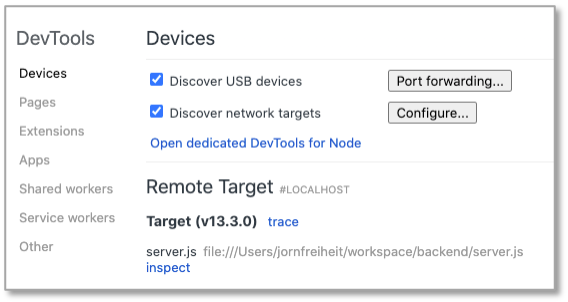
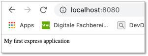
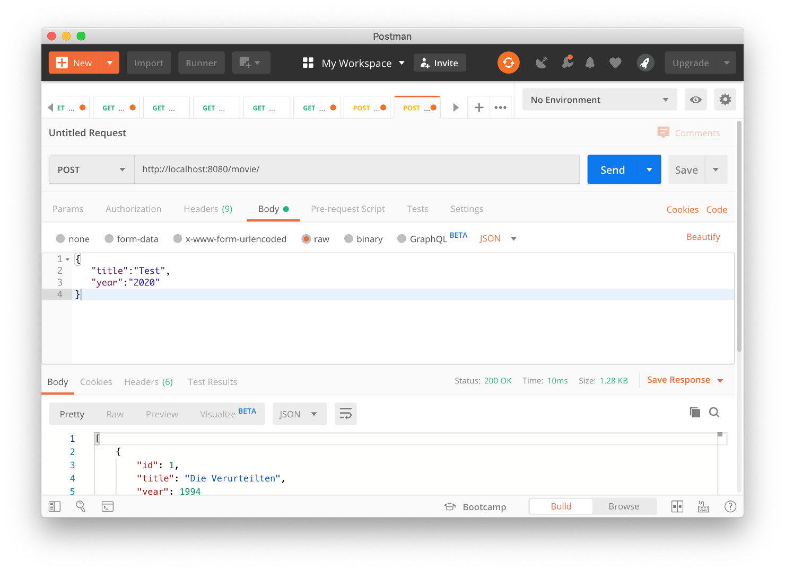
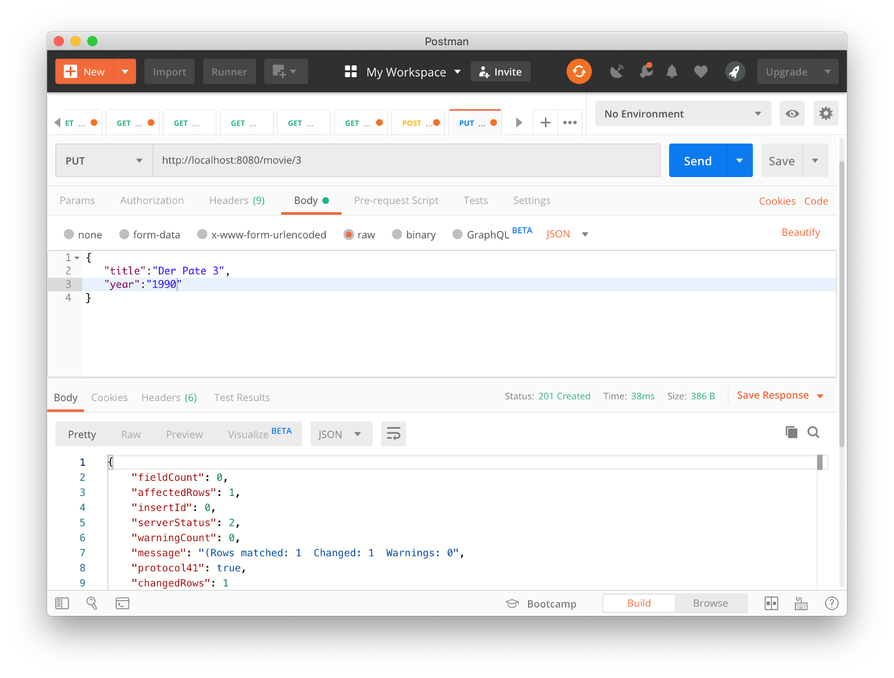
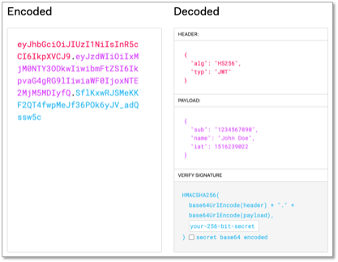

# Node.js

Viele der folgenden Beispiele sind dem [Buch](https://www.rheinwerk-verlag.de/nodejs_4630/)

> Sebastian Springer:
> "Node.js. Das umfassende Handbuch"
> 3., aktualisierte und erweiterte Auflage 2018, Rheinwerk Computing, ISBN 978-3-8362-6255-2 [Link](https://www.rheinwerk-verlag.de/nodejs_4630/)

entnommen (und nur unwesentlich geändert).


## Installation

Installationsanweisungen für Ihr Betriebssystem finden Sie auf der Node.js-Webseite [https://nodejs.org/](https://nodejs.org). Nach der Installation können Sie überprüfen, ob node erfolgreich installiert wurde. Geben Sie dazu im Terminal

```
node -v
```

ein. Es sollte die Versionsnummer erscheinen, z.B. `v13.3.0`.

Da es sich bei JavaScript um eine Skriptsprache handelt, kann jede Anweisung durch den Interpreter interpretiert und ausgeführt werden. Deshalb lässt sich Node.js auch als im interaktiven Modus auf der Kommandozeile testen. Geben Sie dazu im Terminal 

```
node 
```

ein. Es erscheint etwas in der Art

```
Welcome to Node.js v13.3.0.
Type ".help" for more information.
> 
```

Node.js befindet sich dann im *Read-Eval-Print-Loop (REPL)*. Die im Terminal eingegebenen Kommandos werden gelesen (*read*), evaluiert (*eval*), ausgegeben (*print*) und auf das nächste Kommando gewartet (*loop*). Geben Sie im Terminal 

```
console.log("Hello FIW!");
```

ein. Es erscheint

```
Hello FIW!
undefined
```

Sie verlassen REPL durch Eingabe von `.exit`.

!!! success
    Somit ist Node.js installiert.

## Der erste eigene Webserver

Wir verwenden Node.js, um einen Webserver zu implementieren. Insbesondere wird dieser Webserver Anfragen (*requests*) unserer Webanwendung (des Clients) empfangen und verarbeiten. Die Verarbeitung wird meistens ein Zugriff auf eine Datenbank sein. Als Antwort (*response*) wird der Webserver die angefragten Daten an unsere Anwendung zurücksenden. 

Wir werden nun unseren ersten einfachen Webserver mithilfe von Node.js implementieren. Erstellen Sie sich in Ihrem `workspace` ein Verzeichnis `backend` und darin eine Datei `server.js` (das kann natürlich alles auch anders heißen). Öffnen Sie die Datei mit Ihrer IDE und geben Sie folgendes ein:

=== "server.js"
    ```javascript linenums="1"
	const http = require('http');

	const server = http.createServer(function(request,response) {
		response.writeHead(200, { 'content-type': 'text/plain; charset=utf-8'});
		response.write('Hello ');
		response.end('FIW!\n');
	});

	server.listen(8080, function() {
		console.log('Server is listening to http://localhost:8080');
	});
    ``` 

Wechseln Sie im Terminal in Ihr `backend`-Verzeichnis. Darin befindet sich die `server.js`. Geben Sie ein:

```bash
node server.js
```

Sie erhalten die Ausgabe `Server is listening to http://localhost:8080`. 

!!! fail "Port bereits belegt"
	Sollten Sie den Fehler `Error: listen EADDRINUSE:::8080` erhalten, so ist der Port `8080` bei Ihnen bereits durch eine andere Anwendung belegt. Dann wählen Sie einen anderen Port, z.B. `8081`. 


!!! success
    Ihr Webserver läuft nun!

Dies können wir auf verschiedene Arten testen:

1. Geben Sie `http://localhost:8080` in Ihren Browser ein. Es erscheint `Hello FIW!` im Browser. 
2. Nutzen Sie [`curl`](../tools/#curl) und geben Sie im Terminal `curl http://localhost:8080` ein. Es erscheint `Hello FIW!` im Terminal. 
3. Nutzen Sie ['Postman'](../tools/#postman) und geben Sie in das Eingabefeld neben `GET` die URL `http://localhost:8080` ein und klicken auf `Send`. Es erscheint `Hello FIW!` im unteren Teil des Fensters (Reiter `Body`).

Der Webserver läuft nun so lange, bis wir ihn beenden. Wir betrachten das obige Listing im Detail. In Zeilennummer 1 wird das [`http`-Modul von Node.js](https://nodejs.org/api/http.html) geladen und der Variablen `http` zugewiesen. Das Laden von Modulen erfolgt in Node.js mithilfe der Funktion `require()`. In Zeilennummer 3 wird ein Webserver mithilfe des `http`-Moduls erzeugt (`createServer()`). Das `http`-Modul bietet auch die Möglichkeit, einen Client zu erzeugen - aber das machen wir nicht mit Node.js sondern mit Angular. In Zeile 9 geben wir an, dass der Webserver nun permanent am Port `8080` auf Anfragen *lauschen* soll. Als 2. Parameter der `listen()`-Funktion hätte auch ein `HOST` angegeben werden können, also die IP-Adresse des Webservers. Wird keine IP-Adresse angegeben, so wie hier, ist es in unserem Fall `localhost`. Dann folgt eine [*Callback*-Funktion](../javascript/#callback-funktionen), die einen String auf die Konsole ausgibt, sobald die Verbindung steht. In den Zeilen 4 bis 6 ist die Antwort (*response*) des Webservers auf eine Anfrage (*request*) des Clients definiert. Die Funktion, die diese Antwort erstellt, ist eine Callback-Funktion der `createServer`-Funktion (in Zeile 3). Diese Callback-Funktion besitzt die beiden Parameter `request` und `response`. In diesem ersten Beispiel wird nur eine Response definiert. Diese besteht aus einem *HTTP-Header* (`writeHead()`) und einem *HTTP-Body* (`write()` + `end()`). Die Funktion `writeHead()`, die den HTTP-Header erzeugt, besitzt 2 Parameter. Der erste Parameter ist der [HTTP-Status-Code](https://developer.mozilla.org/de/docs/Web/HTTP/Status). Der Status-Code `200` besagt, dass die Anfrage (*request*) vom Server empfangen wurde und die Antwort (*response*) in dieser Nachricht enthalten ist. Der eigentliche HTTP-Header wird mit dem zweiten Parameter übertragen. In diesem Fall übermittelt der Server dem Client die Informationen, dass es sich bei der Antwort um reinen Text handelt (`content-type:text-plain`) und dass der HTTP-Body unter Verwendung des Zeichensatzes [UTF-8](https://www.ionos.de/digitalguide/websites/webseiten-erstellen/utf-8-codierung-globaler-digitaler-kommunikation/) (`charset=utf-8`) kodiert ist. Der HTTP-Body wird mit der `write()`-Funktion übertragen und mit der `end()`-Funktion abgeschlossen. In diesem Fall besteht der Body aus der Zeichenkette `Hello FIW!`. 

## Eine Erweiterung der Antwort

Im obigen Beispiel bestand die Antwort aus reinem Text. Wir erweitern die Antwort nun und senden vom Webserver an den Client als Body eine vollständige HTML-Seite.

=== "server.js"
    ```javascript linenums="1"
	const http = require('http');

	const server = http.createServer(function(request,response) {
		response.writeHead(200, { 'content-type': 'text/html; charset=utf-8'});

		const body = `<!DOCTYPE html>
		  <html>
		    <head>
		      <meta charset="utf-8">
		      <title>WebTech - Node.js</title>
		    </head>
		    <body>
		      <h1 style="color:#76B900">Hello FIW!</h1>
		    </body>
		  </html>`;

		response.end(body);
	});

	server.listen(8080, function() {
		console.log('Server is listening to http://localhost:8080');
	});
    ``` 

Achten Sie darauf, dass der `content-type` nun `text/html` ist, nicht mehr `text/plain` (Zeile 4). Sollte Ihr Server aus dem vorherigen Beispiel noch laufen, so müssen Sie ihn zunächst beenden. Geben Sie im Termina zum Beenden des Prozesses `node server.js` einfach `Strg+C` (`Ctrl+C`) und sarten Sie den Server unter Eingabe von

```bash
node server.js
```

erneut. Rufen Sie im Browser `http://localhost:8080/` auf. Es erscheint


Sie können ja auch mal den `content-type` erneut auf `text/plain` setzen und den Server erneut starten (1. `Ctrl+C` und 2. `node server.js`), um zu sehen, welche Bedeutung die Angabe des `content-type` hat.

### Template-String

Im obigen Beispiel ist der String `body` in Backtick-Zeichen &#96; eingeschlossen. Das nennt man *Template-String* und ermöglicht mithilfe von `${}` Ausdrücke bzw. Variablen auszuwerten. Im Folgenden ist eine solche Verwendung einer Variable gezeigt. 

=== "Template-String"
    ```javascript linenums="1"
	const http = require('http');

	const server = http.createServer(function(request,response) {
		response.writeHead(200, { 'content-type': 'text/html; charset=utf-8'});

		const name = 'FIW!';
		const body = `<!DOCTYPE html>
		  <html>
		    <head>
		      <meta charset="utf-8">
		      <title>WebTech - Node.js</title>
		    </head>
		    <body>
		      <h1 style="color:#76B900">Hello ${ name }</h1>
		    </body>
		  </html>`;

		response.end(body);
	});

	server.listen(8080, function() {
		console.log('Server is listening to http://localhost:8080');
	});
    ```

In Zeile 6 wird eine Variable `name` definiert, der der String `FIW!` zugewiesen wird. In Zeile 14 wird mithilfe von `${ name }` der Wert der Variable `name` in das HTML eingebunden, so dass der Inhalt der Überschrift `<h1>` zu `Hello FIW!` ausgewertet wird.

### URLs auswerten

Eine URL kann um Schlüssel-Werte-Paare (*Parameter*) erweitert werden, um Daten mit der URL an den Webserver zu senden (siehe [**HTML --> URLs**](../html/#urls)). Ein Schlüssel-Werte-Paar wird immer durch ein `=` verbunden:

```bash
key=value
```

Das erste Schlüssel-Werte-Paar wird hinter ein `?` an die URL gehängt. Jedes weitere Paar wird mit einem `&` angebunden:

```bash
http://www.example.org/?key1=value1&key2=value2&key3=value3
```

Wir werden jetzt diese Parameter auswerten. Dazu laden wir einerseits ein weiteres Modul, nämlich das `url`-Modul und wir werten die Anfrage (*request*) dahingehend aus, dass wir die Parameter der URL auswerten. 

=== "server.js"
    ```javascript linenums="1"
	const http = require('http');
	const url  = require('url');

	const server = http.createServer(function(request,response) {
		response.writeHead(200, { 'content-type': 'text/html; charset=utf-8'});

		const parsedUrl = url.parse(request.url, true);
		const params = parsedUrl.query;

		const body = `<!DOCTYPE html>
			  <html>
		    <head>
		      <meta charset="utf-8">
		      <title>WebTech - Node.js</title>
		    </head>
		    <body>
		      <h1 style="color:#76B900">Hello ${ params.name } in ${ params.ort }</h1>
		    </body>
		  </html>`;

		response.end(body);
	});

	server.listen(8080, function() {
		console.log('Server is listening to http://localhost:8080');
	});
    ```

Nach dem restart des Webservers (1. `Ctrl+C` und 2. `node server.js`) und der Eingabe folgender URL: `http://localhost:8080/?name=FIW&ort=Berlin` wird im Browser Folgendes angezeigt:


### Chrome Developer Tools

Die [Chrome Developer Tools](../tools/#chrome) können auch zum Debuggen von Node.js-Anwendungen verwendet werden. Rufen Sie dafür Ihre Node.js-Anwendung im Terminal mit dem `--inspect`-Flag auf:

``` bash
node --inspect server.js
```

Im Terminal erscheint eine Ausgabe in der Form:

```bash
Debugger listening on ws://127.0.0.1:9229/dc995a6a-61eb-4143-af7e-ac8e4599dcd7
For help, see: https://nodejs.org/en/docs/inspector
Server is listening to http://localhost:8080
```

Im Chrome-Browser können Sie nun einerseits wie gewohnt die URL `http://localhost:8080/?name=FIW&ort=Berlin` eingeben, aber das Debuggen kann unter Eingabe der URL `chrome://inspect/` erfolgen. Es erscheint folgende Seite im Browser: 



Für weitere Informationen zum Debuggen siehe z.B. [https://nodejs.org/en/docs/guides/debugging-getting-started/](https://nodejs.org/en/docs/guides/debugging-getting-started/).

!!! success
    Wir haben mithilfe von Node.js einen ersten eigenen Webserver erstellt. Wir haben uns mit dem Konzept von Request und Response vertraut gemacht und eine eigene Response erstellt. Wir haben Argumente aus der URL ausgelesen und somit dynamisch unsere Response angepasst. Wir wollen nun zunächst ein Framework kennenlernen, das uns manche Arbeiten erleichtert: Express. 

## Express

[Express](https://expressjs.com/de/) ist ein Node.js-Framework, das einerseits recht einfach gehalten wurde, andererseits aber alle wesentlichen Funktionen für eine Web-Anwendung bereithält. So müssen wir uns beispielsweise bei der Verwendung von Express nicht mehr selbst um das Parsen der URL kümmern. Wir werden im Folgenden ein kleines Projekt zu Verwaltung von Filmen erstellen. Dies geschieht mithilfe von [`npm`](https://www.npmjs.com/). `npm` ist der *Node package manager*. Bisher enthält unser Ordner `backend` nur die Datei `server.js`. Das ist jedoch insofern noch kein wirkliches Node.js-Projekt, da es noch nicht vom Paketmanager, also `npm` verwaltet wird. Um dies zu tun wechseln wir in den Ordner `backend` und initialisieren dann unser Node.js-Projekt:


=== "im Ordner backend"
```bash 
npm init
```

Sie werden nun einige Sachen gefragt und können eigentlich immer jeweils mit `Enter` bestätigen. Es erfolgt also ungefähr ein solcher Dialog im Terminal:

```bash
% npm init
This utility will walk you through creating a package.json file.
It only covers the most common items, and tries to guess sensible defaults.

See `npm help init` for definitive documentation on these fields
and exactly what they do.

Use `npm install <pkg>` afterwards to install a package and
save it as a dependency in the package.json file.

Press ^C at any time to quit.
package name: (backend) backend
version: (1.0.0) 
description: Node.js-Backend
entry point: (server.js) 
test command: 
git repository: 
keywords: 
author: 
license: (ISC) 
About to write to /Users/jornfreiheit/workspace/backend/package.json:

{
  "name": "backend",
  "version": "1.0.0",
  "description": "Node.js-Backend",
  "main": "server.js",
  "scripts": {
    "test": "echo \"Error: no test specified\" && exit 1",
    "start": "node server.js"
  },
  "author": "",
  "license": "ISC"
}


Is this OK? (yes) 
```

Das wesentliche Ergebnis der Initialisierung ist die Erstellung der `package.json`-Datei. Darin können wir Paketabhängigkeiten definieren. Außerdem ist in dem Ordner `backend` ein Unterordner `node_modules` entstanden, der die Node.js-Module enthält, die wir benötigen. 

Als erstes installieren wir Express:

```bash
npm install express
```

Nun bauen wir uns eine kleine `index.js`-Datei, die unsere erste Express-Anwendung darstellt. 

```javascript linenums="1"
const express = require('express');
const app = express();

app.get('/', (req,res) => {
   res.send('My first express application');
});

app.listen(8080, () => {
   console.log('Server listening on port 8080');
});
```

In Zeile `1` wird das Express-Paket eingebunden. In Zeile `2` wird eine Express-App mit Basiskonfiguration erzeugt (hier ein `app`-Objekt). Die `get()`-Funktion des `app`-Objektes erzeugt eine Route, über die man sich mit dem Browser mit der App verbinden kann (Zeilen `4`-`6`). Als Response (`res`) wird einfach eine Zeichenkette gesendet (`send`). In den Zeilen `8`-`10` wird die App an den Port `8080` gebunden. Hier erfolgt intern die Erstellung eines Node.js-Servers mit `http`-Modul. Wenn Sie nun 

```bash
node index.js
``` 

innerhalb des `backend`-Ordners aufrufen, wird der Node.js-Server erstellt und Sie können im Browser unter der URL `localhost:8080` darauf zugreifen. Es erscheint:



Im obigen Beispiel erkennt man in Zeile `4` zwei Parameter der Routing-Callback-Funktion innerhalb der `app.get()`-Methode: das `Request`-Objekt `req` und das `Response`-Objekt `res`. Beide Objekte gehören zu den elementaren Elementen einer Applikation. 

### Request

Die Eigenschaften des `Request`-Objektes `req` sind in [https://expressjs.com/de/api.html#req](https://expressjs.com/de/api.html#req) erläutert. Hier folgt eine kurze unvollständige Auflistung:

| **Eigenschaft** | **Bedeutung**                                                         |
|-----------------|-----------------------------------------------------------------------|
| `method`        | HTTP-Methode, mit der die Anfrage gesendet wurde (z.B. GET oder POST) |
| `originalUrl`   | enthält die Anfrage-URL |
| `params`        | enthält die variablen Anteile der Anfrage-URL |
| `protocol`      | enthält das Protokoll der Anfrage (z.B. http oder https) |
| `query`         | ist ein Objekt, das alle Parameter der Anfrage-URL enthält |

### Response

Die Eigenschaften des `Response`-Objektes `res` sind in [https://expressjs.com/de/api.html#res](https://expressjs.com/de/api.html#res) erläutert. Hier folgt eine kurze unvollständige Auflistung:

| **Methode**                    | **Bedeutung**                                                         |
|--------------------------------|-----------------------------------------------------------------------|
| `get(field)`                   | gibt den Response-Header von `field` zurück (z.B. `get('Content-Type')`) |
| `set(field[,value])`           | setzt den Wert des angegebenen Header-Feldes |
| `json([body])`                 | sendet eine JSON-Response (`[body]` ist das JSON-Objekt) |
| `cookie(name,value[,options])` | setzt einen Cookie-Wert `name=value` |
| `redirect([status,]path)`      | Weiterleitung der Anfrage nach `path` |
| `status(code)`                 | setzt den Status der Antwort auf `code` |
| `send([body])`        		 | sendet die HTTP-Antwort |
| `end([data][,encoding])`       | beendet den Antwortprozess |

## Router

Wie man der [API-Dokumentation von Express](https://expressjs.com/de/api.html) entnehmen kann, sind die Grundelemente einer Express-Anwendung

- die [`express()`-Funktion](https://expressjs.com/de/api.html#express), die die Express-Anwendung erstellt,
- die [Eigenschaften und Methoden](https://expressjs.com/de/api.html#app), die dieser Anwendung zur Verfügung stehen,
- das [`Request`-Objekt](https://expressjs.com/de/api.html#req),
- das [`Response`-Objekt](https://expressjs.com/de/api.html#res) sowie
- der [`Router`](https://expressjs.com/de/api.html#router).

Mit Letzterem beschäftigen wir uns jetzt. Unser Projekt soll folgende Struktur aufweisen:

```
backend
+---- movie
|     +---- model.js
|     +---- view.js
|     +---- controller.js
|     +---- movierouter.js
+---- node_modules
+---- index.js
+---- package.json
```

`backend`, `movie` und `node_modules` sind jeweils Ordner. `node_modules` wurde automatisch erzeugt (durch `npm init` und enthält alle eingebundenen Node.js-Pakete). Wir erstellen zunächst die Datei `movie/movierouter.js`[^1] und "specken" die `index.js` etwas ab (die `get()`-Funktion wird gelöscht). 

[^1]:
    Die Bezeichnung `movierouter.js` für diese Datei ist hier noch verwirrend, da sie zunächst auch die Daten enthalten wird. Wir werden nach und nach die Funktionen so gestalten und auslagern, dass die Datei nur noch den Router enthält und für alles andere ein Model, eine View und ein Controller entstehen werden. 

=== "movie/movierouter.js"
    ``` javascript linenums="1"
    const express = require('express');
	const router = express.Router();

	const data = [ /* siehe Reiter "const data" */ 	];

	router.get('/', (req, res) => {
	    res.send(data);
	});

	module.exports = router;
    ```
=== "index.js"
    ``` javascript linenums="1"
	const express = require('express');

	const app = express();

	app.listen(8080, () => {
	   console.log('Server listening on port 8080');
	});
    ```
=== "const data"
    ``` javascript linenums="1"
    const data = [
	    { id: 1, title: 'Die Verurteilten', year: '1994' },
	    { id: 2, title: 'Der Pate', year: '1972' },
	    { id: 3, title: 'Der Pate 2', year: '1974' },
	    { id: 4, title: 'The Dark Knight', year: '2008' },
	    { id: 5, title: 'Die zwölf Geschworenen', year: '1957' },
	    { id: 6, title: 'Schindlers Liste', year: '1993' },
	    { id: 7, title: 'Der Herr der Ringe: Die Rückkehr des Königs', year: '2003' },
	    { id: 8, title: 'Pulp Fiction', year: '1994' },
	    { id: 9, title: 'Zwei glorreiche Halunken', year: '1966' },
	    { id: 10, title: 'Fight Club', year: '1999' },
	    { id: 11, title: 'Der Herr der Ringe: Die Gefährten', year: '2001' },
	    { id: 12, title: 'Forrest Gump', year: '1994' },
	    { id: 13, title: 'Inception', year: '2010' },
	    { id: 14, title: 'Das Imperium schlägt zurück', year: '1980' },
	    { id: 15, title: 'Der Herr der Ringe: Die zwei Türme', year: '2002' },
	    { id: 16, title: 'Matrix', year: '1999' },
	    { id: 17, title: 'GoodFellas – Drei Jahrzehnte in der Mafia', year: '1990' },
	    { id: 18, title: 'Einer flog über das Kuckucksnest', year: '1975' },
	    { id: 19, title: 'Joker', year: '2019' },
	    { id: 20, title: 'Die sieben Samurai', year: '1954' },
	];
    ```

Beachten Sie, dass in den obigen Listings aus Gründen der Übersichtlichkeit in der `movie/movierouter.js` das JSON-Objekt herausgelöscht und im Reiter "const data" zur Verfügung gestellt wurde (muss dann hineinkopiert werden).

In der `movie/movierouter.js` wird das `Router`-Objekt, das in Zeile `2` erzeugt wird, in Zeile `10` exportiert. Im Folgenden wird gezeigt, wie der `Router` nun in unsere Anwendung eingebunden wird. Dies passiert in der `index.js`. Die hinzugefügten Zeilen sind markiert. 

=== "index.js"
    ``` javascript linenums="1" hl_lines="2 6 8"
	const express = require('express');
	const movieRouter = require('./movie/movierouter');

	const app = express();

	app.get('/', (req, res) => res.redirect('/movie'));

	app.use('/movie', movieRouter);

	app.listen(8080, () => {
	   console.log('Server listening on port 8080');
	});
    ```

Beim Laden des Moduls wird die `.js`-Endung nicht mit angegeben. Das heißt, der Router wird aus der `movie/movierouter.js`-Datei mittels `require('./movie/movierouter')` geladen (siehe Zeile `2`). Wäre der Router sogar in einer Datei `movie/index.js`, müsste dieser Name nicht angegeben werden, es würde also genügen, den Router über den Pfad `/movie` zu laden (entspricht also `/movie/index`). Die `use()`-Methode in Zeile `8` gibt an, dass der `movieRouter` (aus `movie/index.js`) für das Routing des Pfades **url**`/movie` zuständig ist. Die `get()`-Methode aus Zeile `6` sorgt dafür, dass der Aufruf **url**`/` (also z.B. `localhost:8080`) nach **url**`/movie` (also z.B. `localhost:8080/movie`) weitergeleitet wird. 

Rufen Sie nun im `backend`-Ordner 

```bash
node index.js
```

auf und geben Sie im Browser `localhost:8080` ein. Beobachten Sie, dass auf die URL `localhost:8080/movie` weitergeleitet wird. Es erscheint im Browser (entweder `parsed` oder `raw` - Abhängig von Browser und Browser-Plugins):


### Model-View-Controller

Bis jetzt steckt alles im Router (`/movie/movierouter.js`). Wir werden im ersten Schritt die Daten (die eigentlich zum Model gehören) und eine Aktion (`listAction`) im Controller (`movie/controller.js`) definieren. 

=== "movie/controller.js"
    ``` javascript linenums="1"
	const data = [ /* siehe Reiter "const data" */	];

	function listAction(request, response) {
	    response.send(data);
	}

	module.exports = {
	    listAction,
	};
    ```
=== "movie/movierouter.js"
    ``` javascript linenums="1" hl_lines="4 6"
    const express = require('express');
	const router = express.Router();

	const { listAction } = require('./controller');

	router.get('/', listAction);

	module.exports = router;
    ```
=== "const data"
    ``` javascript linenums="1"
    const data = [
	    { id: 1, title: 'Die Verurteilten', year: '1994' },
	    { id: 2, title: 'Der Pate', year: '1972' },
	    { id: 3, title: 'Der Pate 2', year: '1974' },
	    { id: 4, title: 'The Dark Knight', year: '2008' },
	    { id: 5, title: 'Die zwölf Geschworenen', year: '1957' },
	    { id: 6, title: 'Schindlers Liste', year: '1993' },
	    { id: 7, title: 'Der Herr der Ringe: Die Rückkehr des Königs', year: '2003' },
	    { id: 8, title: 'Pulp Fiction', year: '1994' },
	    { id: 9, title: 'Zwei glorreiche Halunken', year: '1966' },
	    { id: 10, title: 'Fight Club', year: '1999' },
	    { id: 11, title: 'Der Herr der Ringe: Die Gefährten', year: '2001' },
	    { id: 12, title: 'Forrest Gump', year: '1994' },
	    { id: 13, title: 'Inception', year: '2010' },
	    { id: 14, title: 'Das Imperium schlägt zurück', year: '1980' },
	    { id: 15, title: 'Der Herr der Ringe: Die zwei Türme', year: '2002' },
	    { id: 16, title: 'Matrix', year: '1999' },
	    { id: 17, title: 'GoodFellas – Drei Jahrzehnte in der Mafia', year: '1990' },
	    { id: 18, title: 'Einer flog über das Kuckucksnest', year: '1975' },
	    { id: 19, title: 'Joker', year: '2019' },
	    { id: 20, title: 'Die sieben Samurai', year: '1954' },
	];
    ```

#### Controller

Der Controller verwaltet perspektivisch die View und das Model. Beides haben wir jetzt noch nicht. Zunächst wird im Controller eine Aktion `listAction` definiert, die alle Daten in einer Response (`response.send(data)`) sendet[^2]. Diese Aktion wird mittels `exports` anderen Modulen zur Verfügung gestellt.

[^2]:
     Beachten Sie auch hier wieder, dass aus Gründen der Übersichtlichkeit die Daten in den Reiter `const data` ausgelagert wurden. Die müssen Sie hineinkopieren.

Der Router (`movierouter.js`) wurde entsprechend angepasst. Einerseits haben wir die Daten aus dem Router entfernt, andererseits enthält die `get()`-Methode nun nicht mehr die direkte Implementierung (die ja in den Controller ausgelagert wurde), sondern ruft die Methode `listAction` des Controllers auf. Dazu muss sie eingebunden werden. Dies würde normalerweise wie folgt geschehen:

```javascript
const controller = require('./controller');
const listAction = controller.listAction;
```

Da ein solches Konstrukt häufig vorkommt, wurde ein sogenanntes *destructuring* eingeführt. Obiger Code wird mithilfe von *destructuring* durch 

```javascript
const { listAction } = require('./controller');
```

ersetzt und verzichtet somit auf die Hilfsvariable `controller`. Die Eigenschaft, die im Controller `listAction` heißt (und importiert wird), wird direkt geladen.

#### Model

Das Model (`movie/model.js`) verwaltet die Daten. Dazu werden wir zunächst die Daten aus dem Controller in das Model verschieben. Außerdem stellt das Model eine Funktion (`getAll()`) zum Auslesen aller Daten zur Verfügung:

=== "movie/model.js"
    ``` javascript linenums="1"
	const data = [ /* siehe Reiter "const data" */ ];

	module.exports = {
		getAll() {
			return data;
		},
	};
    ```
=== "movie/controller.js"
    ``` javascript linenums="1" hl_lines="4"
	const model = require('./model');

	function listAction(request, response) {
	    response.send(model.getAll());
	}

	module.exports = {
	    listAction,
	};
    ```
=== "const data"
    ``` javascript linenums="1"
    const data = [
	    { id: 1, title: 'Die Verurteilten', year: '1994' },
	    { id: 2, title: 'Der Pate', year: '1972' },
	    { id: 3, title: 'Der Pate 2', year: '1974' },
	    { id: 4, title: 'The Dark Knight', year: '2008' },
	    { id: 5, title: 'Die zwölf Geschworenen', year: '1957' },
	    { id: 6, title: 'Schindlers Liste', year: '1993' },
	    { id: 7, title: 'Der Herr der Ringe: Die Rückkehr des Königs', year: '2003' },
	    { id: 8, title: 'Pulp Fiction', year: '1994' },
	    { id: 9, title: 'Zwei glorreiche Halunken', year: '1966' },
	    { id: 10, title: 'Fight Club', year: '1999' },
	    { id: 11, title: 'Der Herr der Ringe: Die Gefährten', year: '2001' },
	    { id: 12, title: 'Forrest Gump', year: '1994' },
	    { id: 13, title: 'Inception', year: '2010' },
	    { id: 14, title: 'Das Imperium schlägt zurück', year: '1980' },
	    { id: 15, title: 'Der Herr der Ringe: Die zwei Türme', year: '2002' },
	    { id: 16, title: 'Matrix', year: '1999' },
	    { id: 17, title: 'GoodFellas – Drei Jahrzehnte in der Mafia', year: '1990' },
	    { id: 18, title: 'Einer flog über das Kuckucksnest', year: '1975' },
	    { id: 19, title: 'Joker', year: '2019' },
	    { id: 20, title: 'Die sieben Samurai', year: '1954' },
	];
    ```

Die Funktion `getAll()` im Model (`movie/model.js`) wird jetzt direkt dort implementiert, wo sie auch exportiert wird. Die Implementierung hätte man auch auf eine Variable legen können (wie `listAction` beim Controller) und dann exportieren.

Der Controller (`movie/controller.js`) liest das Model ein (Zeile `1`) und verwendet die `getAll()`-Funktion, um die Daten zu senden (Zeile `4`).

### View

Die View ist für die Darstellung verantwortlich. Später wird diese von uns in Angular umgesetzt. Hier wird es nur zur Verdeutlichung gezeigt. Wir verwenden JavaScript-Template-Strings (sozusagen eine Mischung aus JavaScript und HTML). Wer möchte, kann diesen Abschnitt auch überspringen, da wir später unsere Oberfläche viel aufwendiger mit Angular gestalten.

=== "movie/view.js"
    ``` javascript linenums="1"
	module.exports = function render(movies) {
	  return `
	  <!DOCTYPE html>
	  <html lang="de">
	    <head>
	        <meta charset="UTF-8">
	        <title>Movie-list</title>
	    </head>
	    <body>
	        <table>
	            <thead>
	                <tr>
	                    <th>Id</th>
	                    <th>Title</th>
	                </tr>
	            </thead>
	            <tbody>
	              ${movies.map(movie => `<tr><td>${movie.id}</td> <td>${movie.title}</td></tr>`).join('')}
	            </tbody>
	        </table>
	    </body>
	  </html>
	  `
	};
    ```
=== "movie/controller.js"
    ``` javascript linenums="1" hl_lines="2 5-7"
	const model = require('./model');
	const view = require('./view');

	function listAction(request, response) {
	    const movies = model.getAll();
	    const body = view(movies);
	    response.send(body);
	}

	module.exports = {
	    listAction,
	};
    ```

In der View (`movie/view.js`) wird also eine HTML-Tabelle (`<table>`) erzeugt. Der Funktion `render` werden die anzuzeigenden Daten als JSON-Array übergeben. Die JavaScript-Funktion `map()` durchläuft jeden einzelnen Eintrag des Arrays und speichert ihn jeweils in die Variable `movie`. Jeder `movie` wird in einer Tabllenzeile (`<tr>`) dargestellt und besteht aus einer `id` und einem `title` (siehe `const data` im Model). Auf diese Elemente wird zugegriffen und in einzelnen Dateneinträgen der Tabelle (`<td>`) dargestellt. Die JavaScript-Funktion `join()` verbindet diese Struktur zu einem String (Konkatenation mit `''`), so dass der Template-String tatsächlich ein String ist.

Im Controller (`movie/controller.js`) wird die View eingebunden (Zeile `2`) und dieser View die Movie-Daten übergeben, so dass `body` dann den durch `movie.render()` erzeugten String enthält (die HTML-Seite). Dieser wird als Response gesendet.

Nach einem Neustart der Anwendung (`node index.js` im Ordner `backend`) erscheint im Browser (`localhost:8080`) folgende Seite:


!!! success
    Wir haben mit Express das bekannteste Node.js-Framework verwendet, um die Verarbeitung von Daten im Rahmen des Model-View-Controller-Konzeptes umzusetzen. Im obigen Beispiel haben wir die Daten (die Filme) direkt im JSON-Format im Model gespeichert. Das ist natürlich nicht flexibel. Wir werden die Daten nun in eine Datenbank auslagern.

## Anbindung von Datenbanken

Wir wollen Node.js hauptsächlich dafür verwenden, im Backend mit einer Datenbank zu kommunizieren. Wir wollen dies hier exemplarisch mit MySQL (siehe [**Werkzeuge --> MySQL**](../tools/#mysql)) erläutern. Die Verwendung von z.B. PostgreSQL ist äquivelent - Sie benötigen nur einen anderen Datenbanktreiber. 

Wir werden zunächst das Node.js-Paket, das den `mysql`-Treiber enthält, installieren:

``` bash
npm install mysql
```

Danach ist in der `package.json` die Abhängigkeit vom `mysql`-Paket hinterlegt (siehe `"dependencies"`):

=== "package.json"
	``` javascript
	{
	  "name": "backend",
	  "version": "1.0.0",
	  "description": "Node.js-Backend for MySQL",
	  "main": "server.js",
	  "scripts": {
	    "test": "echo \"Error: no test specified\" && exit 1",
	    "start": "node server.js"
	  },
	  "author": "",
	  "license": "ISC",
	  "dependencies": {
	    "mysql": "^2.18.1"
	  }
	}
	```


### Eine Movie-Datenbank

Wir werden die Anbindung von Datenbanken exemplarisch an der `Movie`-Datenbank zeigen, die wir bereits im obigen [**Express**](./#express)-Abschnitt verwendet haben. Dazu erstellen wir uns eine Datenbank namens `movie-db` und befüllen diese mit einigen Filmen (Tabelle `Movie`). Sie können diese Datenbak auf verschiedenen Wegen erstellen. Am einfachsten ist es, wenn Sie [`phpMyadmin`](https://www.phpmyadmin.net/) verwenden. Dort können Sie folgende SQL-Anfrage im Reiter `SQL` eingeben (Sie können auch im Terminal `SQL`-Anfragen eingeben nachdem Sie sich dort per `mysql -u root -p` mit dem MySQL-Server verbunden haben):

```SQL
CREATE DATABASE `movie-db`;

USE `movie-db`;

CREATE TABLE `Movies` (
  `id` int(11) NOT NULL AUTO_INCREMENT,
  `title` varchar(255) DEFAULT NULL,
  `year` int(11) DEFAULT NULL,
  PRIMARY KEY (`id`)
) ENGINE=InnoDB DEFAULT CHARSET=utf8;

INSERT INTO `Movies` (`title`, `year`) VALUES 
('Die Verurteilten', '1994'),
('Der Pate', '1972'),
('Der Pate 2', '1974'),
('The Dark Knight', '2008'),
('Die zwölf Geschworenen', '1957'),
('Schindlers Liste', '1993'),
('Der Herr der Ringe: Die Rückkehr des Königs', '2003'),
('Pulp Fiction', '1994'),
('Zwei glorreiche Halunken', '1966'),
('Fight Club', '1999'),
('Der Herr der Ringe: Die Gefährten', '2001'),
('Forrest Gump', '1994'),
('Inception', '2010'),
('Das Imperium schlägt zurück', '1980'),
('Der Herr der Ringe: Die zwei Türme', '2002'),
('Matrix', '1999'),
('GoodFellas – Drei Jahrzehnte in der Mafia', '1990'),
('Einer flog über das Kuckucksnest', '1975'),
('Joker', '2019'),
('Die sieben Samurai', '1954');
```

Wir verwenden das Projekt, das wir bereits im obigen [**Express**](./#express)-Abschnitt verwendet haben, also die Dateien aus `backend`:

```
backend
+---- movie
|     +---- model.js
|     +---- view.js
|     +---- controller.js
|     +---- movierouter.js
+---- node_modules
+---- index.js
+---- package.json
```

Zunächst ändern wir die `movie/model.js`. Darin werden nun nicht mehr die Daten gehalten, sondern die Verbindung zur Datenbank aufgebaut. Außerdem sehen wir 4 Funktionen zur Datenverwaltung vor, wovon wir eine (`getAll()`) gleich implementieren[^3]:

[^3]: Achten Sie darauf, Ihr korrektes Passwort einzutragen. 

=== "movie/model.js"
    ```javascript
	const mysql = require('mysql');
	const connection = mysql.createConnection({
		host: 'localhost',
		user: 'root',
		password: 'password',	/* hier muss Ihr Passwort hin */
		database: 'movie-db',
	});

	connection.connect();

	function getAll() {
		return new Promise((resolve, reject) => {
			const query = 'SELECT * FROM Movies';
			connection.query(query, (error, results) => {
				if(error) reject(error);
				else	  resolve(results);
			})
		});
	}

	module.exports = {
		getAll,
	};
    ```
=== "movie/controller.js"
    ```javascript
	const model = require('./model');
	const view = require('./view');

	function listAction(request, response) {
	    model.getAll().then(
	        movies => {
	            response.send(view(movies));
	        },
	        error => response.send(error),

	    );
	}

	module.exports = {
	    listAction,
	};
    ```

Im Model (`/movie/model.js`) wird zunächst die Verbindung zur Datenbank aufgebaut (Zeilen `2-7` und `connection.connect()`). Die `getAll()`-Funktion stellt mithilfe von `connection.query()` eine Anfrage an die Datenbank (erster Parameter der `connection.query()`-Funktion). In unserem Beispiel ist die Anfrage die SQL-Query `SELECT * FROM Movies`.

Die `getAll()`-Funktion gibt ein `Promise`-Objekt zurück. Promises werden in [**JavaScript-->Promises**](../javascript/#promises) erläutert. 

Im Controller (`/movie/controller.js`) wird das `Promise`-Objekt in der `then`-Funktion ausgewertet. Wird in der Promise die `resolve`-Methode aufgerufen, werden die `results` übergeben, also das Ergebnis der Datenbankanfrage. Diese Werte werden in der ersten Callback-Funktion der `then`-Methode dem Parameter `movies` übergeben. Soll nur das JSON gesendet werden, wird die `view` nicht benötigt (statt `response.send(view(movies));` genügt dann `response.send(movies);`). Hier kapselt die `View` die Daten noch in einen HTML-Template-String. 

Im Falle eines Fehlers ruft die Promise die `reject`-Funktion auf und übergibt den Parameter `error`. Diese Funktion ruft dann in der `then`-Funktion die zweite Callback-Funktion für die Fehlerauswertung auf. 

!!! success
    Wir haben jetzt eine MySQL-datenbank angebunden und die Anbindung anhand einer `getAll()`-Funktion, die alle in der Datenbank gespeicherten Filme zurückgibt, gezeigt. Wir haben somit einen lesenden Zugriff auf alle Datenbankeinträge realisiert. Im folgenden werden wir auch weitere Zugriffe (create, update, delete) umsetzen. Allerdings haben wir bisher auch eine View mithilfe von Node.js erstellt und verwendet. Die Idee im folgenden ist, dass unser Backend nicht mehr für die Darstellung zuständig ist, sondern die Ergebnisse der Datenbankabfragen im JSON-Format zurückgibt. Unser mit Angular erstelltes Frontend soll für die Darstellung zuständig sein. Wir stellen unser Backend vollständig auf das REST-Konzept um. 


### Unser Backend als reiner REST-Server

*Representional State Transfer (REST)* ist ein Architekturkonzept und wird in vielen Webanwendungen verwendet. REST beschreibt die Schnittstelle zwischen Frontend und Backend und ist dabei sehr stark an HTTP angelehnt:

- jede Ressource wird über eine eindeutige URL aufgerufen (z.B. alle Filme über `localhost:8080/movies`, den Film mit der `id=3` über `localhost:8080/movie/3`)
- es wird definiert, mit welcher HTTP-Anfrage auf die Ressource zugegriffen wird (z.B. `get` zum Lesen, `post` zum Anlegen, `put` zum Ändern von Ressourcen)
- jede Anfrage ist zustandslos, d.h. eine Anfrage muss alle notwendigen Informationen beinhalten und frühere Anfragen (und deren Responses) werden nicht gespeichert

Wir werden unsere View im Backend von nun an also nicht mehr benötigen. Unser Projekt sieht derzeit so aus:

=== "index.js"
    ```javascript
	const express = require('express');
	const movieRouter = require('./movie/movierouter');

	const app = express();

	app.get('/', (req, res) => res.redirect('/movie'));

	app.use('/movie', movieRouter);

	app.listen(8080, () => {
	   console.log('Server listening on port 8080');
	});
    ```
=== "movie/model.js"
    ```javascript
	const mysql = require('mysql');
	const connection = mysql.createConnection({
		host: 'localhost',
		user: 'root',
		password: 'password',	/* hier muss Ihr Passwort hin */
		database: 'movie-db',
	});

	connection.connect();

	function getAll() {
		return new Promise((resolve, reject) => {
			const query = 'SELECT * FROM Movies';
			connection.query(query, (error, results) => {
				if(error) reject(error);
				else	  resolve(results);
			})
		});
	}

	module.exports = {
		getAll,
	};
    ```
=== "movie/controller.js"
    ```javascript
	const model = require('./model');

	function listAction(request, response) {
	    model.getAll().then(
	        movies => {
	            response.send(movies);
	        },
	        error => response.send(error),

	    );
	}

	module.exports = {
	    listAction,
	};
    ```
=== "movie/movierouter.js"
    ```javascript
	const express = require('express');
	const router = express.Router();
	const { listAction } = require('./controller');

	router.get('/', listAction);

	module.exports = router;
    ```

Geben wir also die die URL `localhost:8080` an, dann passiert folgendes:

- die Route wird weitergeleitet an `localhost:8080/movie` (siehe in `index.js` die Anweisung `app.get('/', (req, res) => res.redirect('/movie'));`)
- dadurch wird der `movie/movierouter.js` aufgerufen und dieser ruft die Funktion `listAction` auf
- `listAction` ruft die Promise auf, die in der Funktion `model.getAll()` definiert wird
- in `getAll()` erfolgt eine Anfrage an die Datenbank
- wird diese Anfrage erfolgreich ausgeführt, ruft die Promise die `resolve`-Funktion auf und übergibt alle Resultate der Anfrage
- in `listAction` werden diese Resultate als Resonse gesendet

Wir rufen Postman zum Testen dieser Anfrage auf und geben `localhost:8080` in das URL-Feld ein und senden die Anfrage mittels `GET`-Methode ab. Es erscheint:


Das gleiche Ergebnis bekommen wir, wenn wir als URL `localhost:8080/movie` eingeben (darauf wird ja eh umgeleitet). Wir können die Ausgabe auch mithilfe von `curl` testen:

``` bash
% curl http://localhost:8080/movie
[{"id":1,"title":"Die Verurteilten","year":1994},{"id":2,"title":"Der Pate","year":1972},{"id":3,"title":"Der Pate 2","year":1974},{"id":4,"title":"The Dark Knight","year":2008},{"id":5,"title":"Die zwölf Geschworenen","year":1957},{"id":6,"title":"Schindlers Liste","year":1993},{"id":7,"title":"Der Herr der Ringe: Die Rückkehr des Königs","year":2003},{"id":8,"title":"Pulp Fiction","year":1994},{"id":9,"title":"Zwei glorreiche Halunken","year":1966},{"id":10,"title":"Fight Club","year":1999},{"id":11,"title":"Der Herr der Ringe: Die Gefährten","year":2001},{"id":12,"title":"Forrest Gump","year":1994},{"id":13,"title":"Inception","year":2010},{"id":14,"title":"Das Imperium schlägt zurück","year":1980},{"id":15,"title":"Der Herr der Ringe: Die zwei Türme","year":2002},{"id":16,"title":"Matrix","year":1999},{"id":17,"title":"GoodFellas – Drei Jahrzehnte in der Mafia","year":1990},{"id":18,"title":"Einer flog über das Kuckucksnest","year":1975},{"id":19,"title":"Joker","year":2019},{"id":20,"title":"Die sieben Samurai","year":1954}]
``` 

Wir erweitern unsere Schnittstelle zunächst um die Ansicht eines einzelnen Films. Wir wollen nun mit der URL `http://localhost:8080/movie/3` den Film angezeigt bekommen, der die `id` 3 hat. Wir wollen also die URLs um die Angabe einer `id` erweitern und für diesen Endpunkt den entsprechenden Film zurückgesendet bekommen. 

Dazu erweitern wir (untem im Listing jeweils gelb markiert)

- die `movie/model.js` um eine Funktion `getOne(id)`; das Model stellt nach außen die Funktion `get(id)` zur Verfügung, die als Response den Film sendet, der die entsprechende `id` hat,
- die `movie/controller.js` um eine Funktion `detailAction()`, die den Parameter `id` aus der URL ausliest und die Funktion `model.get(id)` aufruft,
- den `movie/movierouter.js` um eine weitere Route, nämlich `router.get('/:id', detailAction);`, so dass eine `id` an die URL gehängt werden kann und für diesen Fall die `detailAction` aufgerufen wird

=== "movie/model.js"
    ```javascript linenums="1" hl_lines="21-29 33"
	const mysql = require('mysql');
	const connection = mysql.createConnection({
		host: 'localhost',
		user: 'root',
		password: 'password',	/* hier muss Ihr Passwort hin */
		database: 'movie-db',
	});

	connection.connect();

	function getAll() {
		return new Promise((resolve, reject) => {
			const query = 'SELECT * FROM Movies';
			connection.query(query, (error, results) => {
				if(error) reject(error);
				else	  resolve(results);
			})
		});
	}

	function getOne(id) {
		return new Promise((resolve, reject) => {
			const query = 'SELECT * FROM Movies WHERE id=?';
			connection.query(query, [id], (error, results) => {
				if (error) reject(error);
				else resolve(results[0]);
			});
		});
	}

	module.exports = {
		getAll,
		get(id) { return getOne(id)},
	};
    ```
=== "movie/controller.js"
    ```javascript linenums="1" hl_lines="13-18 22"
	const model = require('./model');

	function listAction(request, response) {
	    model.getAll().then(
	        movies => {
	            response.send(movies);
	        },
	        error => response.send(error),

	    );
	}

	function detailAction(request, response) {
	    model.get(request.params.id).then(
	        movie => response.send(movie),
	        error => response.send(error),
	    );
	}

	module.exports = {
	    listAction,
	    detailAction,
	};
    ```
=== "movie/movierouter.js"
    ```javascript linenums="1" hl_lines="3 6"
	const express = require('express');
	const router = express.Router();
	const { listAction, detailAction } = require('./controller');

	router.get('/', listAction);
	router.get('/:id', detailAction);

	module.exports = router;
    ```

#### Content-Type und Fehlerbehandlung

Zwar senden wir bereits die Resultate der Requests als JSON zurück, jedoch ist der `content-type` unserer Response noch `content-type:text/html`, da wir die Response mithilfe der `send()`-Funktion senden (`response.send()`). Wir ändern dies in `response.json()`. Dadurch teilen wir dem Client mit, dass der gesendetete `content-type` ein JSON ist (`content-type:application/json`).

Für eine erfolgreiche Bearbeitung eines Requests wird mit der Response der HTTP-Statuscode 200 gesendet. Für den Fehlerfall wollen wir nun dafür sorgen, dass der HTTP-Statuscode [500 - Internal Server Error](https://developer.mozilla.org/de/docs/Web/HTTP/Status/500#:~:text=Der%20HTTP%20500%20Internal%20Server,ist%20ein%20generisches%20%22Auffangbecken%22.) übertragen wird. Dies erreichen wir im Fehlerfall mit `error => response.status(500).json(error)`. Unser Controller sieht nun also so aus:

=== "movie/controller.js"
    ```javascript linenums="1" hl_lines="6 8 14 15"
	const model = require('./model');

	function listAction(request, response) {
	    model.getAll().then(
	        movies => {
	            response.json(movies);
	        },
	        error => response.status(500).json(error),
	    );
	}

	function detailAction(request, response) {
	    model.get(request.params.id).then(
	        movie => response.json(movie),
	        error => response.status(500).json(error),
	    );
	}

	module.exports = {
	    listAction,
	    detailAction,
	};
    ```

#### POST - einen neuen Datensatz anlegen

Um einen neuen Datensatz anzulegen, müssen wir zwei Dinge beachten:

- die HTTP-Anfrage ist `POST` (anstelle von `GET`, das wir zum Lesen verwenden)
- der Request übergibt im Body den neuen Datensatz (als JSON) --> dazu benötigen wir das Paket `body-parser` von Node.js und nutzen davon die `json()`-Funktion zum Einlesen des neuen Datensatzes im JSON-Format

Wir passen zunächst die `index.js` entsprechend an:

=== "index.js"
    ```javascript linenums="1" hl_lines="2 7"
	const express = require('express');
	const bodyParser = require('body-parser');
	const movieRouter = require('./movie/movierouter');

	const app = express();

	app.use(bodyParser.json());

	app.get('/', (req, res) => res.redirect('/movie'));

	app.use('/movie', movieRouter);

	app.listen(8080, () => {
	   console.log('Server listening on port 8080');
	});
    ```

Um nun einen neuen Datensatz in der Datenbank anzulegen, erweitern wir unser Projekt wie folgt:

- in `movie/model.js` wird eine `insert()`-Funktion definiert, welche durch eine `save()`-Funktion aufgerufen wird (`save()` wird nach außen zur Verfügung gestellt[^4]),
- in `movie/controller.js` wird eine `createAction()` definiert, die den neuen Datensatz aus dem `request,body` ausliest und die `model.save()` aufruft,
- in `movie/movierouter.js` wird der neue Endpunkt `router.post('/', createAction);` festgelegt

[^4]: 
	  Wir werden die `save()`-Funktion später noch erweitern. Beim Anlegen eines neuen Datensatzes werden zwar der Titel und das Entstehungsjahr des Films mitgesendet, nicht jedoch die `id`. Die `id` wird durch das Datenbanksystems vergeben. Für den Fall, dass der `save()`-Funktion auch die `id` des Films mitgegeben wird, gehen wir davon aus, dass der Film in der Datenbank aktualisiert (`update()`) wird, sich also ein Eintrag geändert hat.

=== "movie/model.js"
    ```javascript linenums="1" hl_lines="14-22 27-29"
	const mysql = require('mysql');
	const connection = mysql.createConnection({
		host: 'localhost',
		user: 'root',
		password: 'password',	/* hier muss Ihr Passwort hin */
		database: 'movie-db',
	});

	connection.connect();

	function getAll() { /* bleibt so */ }
	function getOne(id) { /* bleibt so */ }

	function insert(movie) {
		return new Promise((resolve, reject) => {
			const query = 'INSERT INTO Movies (title, year) VALUES (?, ?)';
			connection.query(query, [movie.title, movie.year], (error, results) => {
				if (error) reject(error);
				else resolve(results);
			});
		});
	}

	module.exports = {
		getAll,
		get(id) { return getOne(id)},
		save(movie) {
			if(!movie.id) return insert(movie);
		},
	};
    ```
=== "movie/controller.js"
    ```javascript linenums="1" hl_lines="6-16 21"
	const model = require('./model');

	function listAction(request, response) { /* bleibt so */ }  
	function detailAction(request, response) { /* bleibt so */ }  

	function createAction(request, response) {
	    const movie = {
	        id: request.body.id,
	        title: request.body.title,
	        year: request.body.year,
	    };
	    model.save(movie).then(
	        newMovie => response.status(201).json(newMovie),
	        error => response.status(500).json(error),
	    );
	}

	module.exports = {
	    listAction,
	    detailAction,
	    createAction,
	};
    ```
=== "movie/movierouter.js"
    ```javascript linenums="1" hl_lines="3 7"
	const express = require('express');
	const router = express.Router();
	const { listAction, detailAction, createAction } = require('./controller');

	router.get('/', listAction);
	router.get('/:id', detailAction);
	router.post('/', createAction);

	module.exports = router;
    ```

Die Funktionen im Model haben alle den gleichen Aufbau. Es wird eine Promise erzeugt und mithilfe von `connection.query()` eine Anfrage an die Datenbank gestellt. Im Erfolgsfall wird die `resolve()`-Funktion der Promise aufgerufen, im Fehlerfall die `reject()`-Funktion. Im Controller wird der `request` verarbeitet und eine `response` erzeugt. Im Router werden die Endpunkte und die dazugehörigen HTTP-Methoden (z.B. `get` oder `post`) definiert. 

Um die `createAction`-Funktion zu testen, rufen wir Postman auf und tragen in die URL `http://localhost:8080/movie/` ein. Wichtig: es muss nun `POST` ausgewählt werden. Mit dem Request übergeben wir im Body nun ein JSON, das einen neuen Film enthält, d.h. das JSON muss die Eigensc haften `title` und `year` enthalten (nicht `id`, denn diese wird automatisch durch das Datenbanksystem erzeugt). Die Anfrage sieht in Postman wie folgt aus:



Es kann auch mit `curl` getestet werden:

```bash
curl -X POST -H "Content-Type: application/json" -d '{"title": "Noch ein Test", "year": "2019"}' http://localhost:8080/movie 

{"fieldCount":0,"affectedRows":1,"insertId":23,"serverStatus":2,"warningCount":0,"message":"","protocol41":true,"changedRows":0}
```

#### PUT - einen Datensatz ändern

Das Ändern eines Datensatzes erfolgt in ähnlicher Weise wie das Anlegen eines Datensatzes. Es wird im Body der Anfrage das neue JSON gesendet und der `Content-Type` der Anfrage ist `application/json` (im Header gesetzt).

Zum Ändern eines Datensatzes wird die HTTP-Methode `put` verwendet. Um nun einen Datensatz in der Datenbank zu ändern, erweitern wir unser Projekt wie folgt:

- in `movie/model.js` wird eine `update()`-Funktion definiert, welche durch die `save()`-Funktion aufgerufen wird (`save()` wird nach außen zur Verfügung gestellt),
- in `movie/controller.js` wird eine `updateAction()` definiert, die genauso aussieht wie die `createAction()`, außer dass die `id` aus der URL ausgelesen wird und nicht aus dem Request-Body 
- in `movie/movierouter.js` wird der neue Endpunkt `router.put('/', updateActionAction);` festgelegt

=== "movie/model.js"
    ```javascript linenums="1" hl_lines="15-23 30"
	const mysql = require('mysql');
	const connection = mysql.createConnection({
		host: 'localhost',
		user: 'root',
		password: 'password',	/* hier muss Ihr Passwort hin */
		database: 'movie-db',
	});

	connection.connect();

	function getAll() { /* bleibt so */ }
	function getOne(id) { /* bleibt so */ }
	function insert(movie) {/* bleibt so */ }

	function update(movie) {
		return new Promise((resolve, reject) => {
			const query = 'UPDATE Movies SET title = ?, year = ? WHERE id = ?';
			connection.query(query, [movie.title, movie.year, movie.id], (error, results) => {
				if (error) reject(error);
				else resolve(results);
			});
		});
	}

	module.exports = {
		getAll,
		get(id) { return getOne(id)},
		save(movie) {
			if(!movie.id) return insert(movie);
			else return update(movie);
		},
	};
    ```
=== "movie/controller.js"
    ```javascript linenums="1" hl_lines="7-17 23"
	const model = require('./model');

	function listAction(request, response) { /* bleibt so */ }  
	function detailAction(request, response) { /* bleibt so */ }  
	function createAction(request, response) {/* bleibt so */ }  

	function updateAction(request, response) {
	    const movie = {
	        id: request.params.id,
	        title: request.body.title,
	        year: request.body.year,
	    };
	    model.save(movie).then(
	        movie => response.status(201).json(movie),
	        error => response.status(500).json(error),
	    );
	}

	module.exports = {
	    listAction,
	    detailAction,
	    createAction,
	    updateAction,
	};
    ```
=== "movie/movierouter.js"
    ```javascript linenums="1" hl_lines="3 8"
	const express = require('express');
	const router = express.Router();
	const { listAction, detailAction, createAction, updateAction } = require('./controller');

	router.get('/', listAction);
	router.get('/:id', detailAction);
	router.post('/', createAction);
	router.put('/:id', updateAction);

	module.exports = router;
    ```

Um die Update-Funktion in Postman auszuprobieren, geben Sie als URL z.B. `http://localhost:8080/movie/3` ein (um den Film mit der `id=3` zu ändern) und wählen als HTTP-Methode `PUT`. Im Request-Body geben Sie dann z.B.

```javascript
{
   "title":"Der Pate 3",
   "year":"1990"
}
```

ein. Sie erhalten:



Natürlich können Sie zum Testen auch `curl` verwenden. Die Anfrage ist ähnlich zur `POST`-Anfrage, nur mit `curl -X PUT`. 

#### DELETE - einen Datensatz ändern

Um einen Datensatz zu löschen, wählen wir die HTTP-Methode `DELETE`. Alles andere bleibt wie gehabt. Wir präsentieren gleich die Lösung:

=== "movie/model.js"
    ```javascript linenums="1" hl_lines="16-24 33"
	const mysql = require('mysql');
	const connection = mysql.createConnection({
		host: 'localhost',
		user: 'root',
		password: 'password',	/* hier muss Ihr Passwort hin */
		database: 'movie-db',
	});

	connection.connect();

	function getAll() { /* bleibt so */ }
	function getOne(id) { /* bleibt so */ }
	function insert(movie) { /* bleibt so */ }
	function update(movie) { /* bleibt so */ }

	function remove(id) {
		return new Promise((resolve, reject) => {
			const query = 'DELETE FROM Movies WHERE id = ?';
			connection.query(query, [id], (error, results) => {
				if (error) reject(error);
				else resolve(results[0]);
			});
		});
	}

	module.exports = {
		getAll,
		get(id) { return getOne(id)},
		save(movie) {
			if(!movie.id) return insert(movie);
			else return update(movie);
		},
		delete(id) { return remove(id)},
	};
    ```
=== "movie/controller.js"
    ```javascript linenums="1" hl_lines="7-17 23"
	const model = require('./model');

	function listAction(request, response) { /* bleibt so */ }  
	function detailAction(request, response) { /* bleibt so */ }  
	function createAction(request, response) { /* bleibt so */ }  
	function updateAction(request, response) {/* bleibt so */ }  

	function deleteAction(request, response) {
	    const id = parseInt(request.params.id, 10);
	    model
	        .delete(id)
	        .then(
	            () => response.status(204).send(),
	            error => response.status(500).json(error)
	        );
	}

	module.exports = {
	    listAction,
	    detailAction,
	    createAction,
	    updateAction,
	    deleteAction
	};
    ```
=== "movie/movierouter.js"
    ```javascript linenums="1" hl_lines="3 9"
	const express = require('express');
	const router = express.Router();
	const { listAction, detailAction, createAction, updateAction, deleteAction } = require('./controller');

	router.get('/', listAction);
	router.get('/:id', detailAction);
	router.post('/', createAction);
	router.put('/:id', updateAction);
	router.delete('/:id', deleteAction);

	module.exports = router;
    ```

!!! success
 	Wir haben nun eine vollständige REST-Schnittstelle des Backends implementiert. Es können alle Datensätze oder ein Datensatz gelesen (**read** mithilfe von `get`), ein Datensatz erzeugt (**create** mithilfe von `post`), ein Datensatz aktualisiert (**update** mithilfe von `put`) und ein Datensatz gelöscht (**delete** mithilfe von `delete`) werden. 

### JSON Web Tokens zur Authentifizierung

Unsere Backend-Schnittstelle ist bis jetzt offen für jeden, d.h. jeder, der die Endpunkte kennt, kann die Ressourcen abfragen und somit Daten auslesen, löschen, ändern usw. Das kann natürlich nicht richtig sein, insbesondere wenn mit sensiblen Daten gearbeitet wird. Wir können im Backend auch nicht ein Anmeldeformular vorsehen, da das Backend nur Services anbietet. Außerdem ist die Kommunikation mit der REST-Schnittstelle zustandslos, d.h. es kann gar nicht gespeichert werden, ob eine Nutzerin bereits angemeldet ist oder nicht. Eine Lösung für diese Probleme sind [*JSON Web Tokens (JWT)*](https://jwt.io/). 

Ein JWT ist eine codierte Zeichenkette, die einen Header enthält, einen Payload und eine Signatur. Hier ein Screenshot der jwt.io-Webseite mit einem Beispiel dafür:



#### Datenbank und Model

Wir erzeugen zunächst eine Tabelle in unserer Datenbank, um Nutzername und zugehöriges Passwort zu speichern.

#### Erzeugen eines JWT

Für die Erzeugung eines JWT verwenden wir das Nodes-Paket `jsonwebtoken`. Dieses installieren wir im Ordner `backend` mit dem Befehl 

```bash
npm install jsonwebtoken
```

Wir erstellen uns eine Route, über die die Benutzer ihre Anmeldedaten an das Backend schicken können


