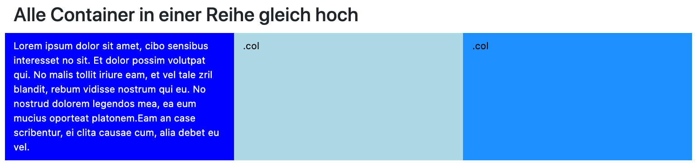

# Responsive Web Design

*Responsive* bedeutet *reagierend* und wenn wir von *Resonsive Web Design (RWD)* sprechen, dann meinen wir damit, dass wir das Layout der Webseite so gestalten, dass es auf die Größe des Ausgabegerätes "reagiert". Das heißt, dass wir für kleine (schmale) Ausgabegeräte (z.B. Mobiltelefone) ein anderes Layout (Design) wählen, als für breitere Ausgabegeräte (z.B. Tablets) und ein noch anderes Layout für sehr breite Ausgabegeräte (z.B. Monitore).

Responsive Web Design realisieren wir hauptsächlich mit CSS. Insofern hätte es auch gut in den Skript-Teil für CSS gepasst. Da dies jedoch schon so lang war, haben wir eine eigene Unterseite für *RWD* erstellt. 

Damit überhaupt auf unterschiedliche Ausgabegeräte reagiert werden kann, wurde sogenannte *Media Queries* in CSS eingeführt. Diese schauen wir uns deshalb zunächst genauer an. Zuvor noch ein wichtiger Tipp! Um unsere Webseite im responsiven Design zu gestalten, müssen wir dem Browser mitteilen, dass er die Größe des Viewports (also des Ausgabefensters) berücksichtigen soll und die Darstellung an die Größe des Gerätes anpassen muss. Dazu fügen wir im `<head>` unserer Webseite von nun an immer das *viewport meta tag* ein und geben damit an, dass einerseits die Ausgabe an die Gerätegröße angepasst werden soll und wir mit einem Zoom-Faktor von 1 starten:

```html
<!-- ab jetzt immer im <head> angeben! -->
<meta name="viewport" content="width=device-width, initial-scale=1">
```  

## Media Queries

Grob gesagt, definieren wir mithilfe von *Media Queries*, welche CSS-Eigenschaften für welche Bildschirmgröße gelten sollen. Das heißt, wir definieren unterschiedliche CSS-Eigenschaften für unterschiedliche Bildschirmgrößen. So können wir z.B. definieren, dass für Bildschirmbreiten unter `480px` ein einspaltiges Layout gewählt wird, für Bildschirmbreiten größer als `480px`, aber kleiner gleich `720px` ein 2-spaltiges Layout und für größer als `720px` ein 3-spaltiges Layout. 

Wir betrachten *Media Queries* zunächst von der syntaktischen Seite. Das ist für Sie vielleicht zunächst unspannend, aber wir überlegen dabei, was alles geht, um dann zu sagen, dass wir uns doch nur um Screens (also Minitore) und doch nur um deren Breiten kümmern - aber es ginge noch viel mehr ;-).

#### Syntax von Media Queries

*Media Queries* können zunächst einmal `true` oder `false` sein. Um diesen Wert zu ermitteln, wird für einen Medientyp (*media type*) ein Ausdruck (*expression*) ausgewertet. Die allgemeine Syntax für eine *Media Query* ist wie folgt:

```csss
@media [not|only] mediatype and (expressions) {
  CSS-Code;
}
```

Eine Media Query beginnt immer mit `@media`. Dann kann ein `not` oder ein `only` kommen, muss aber nicht und wir werden es auch nicht verwenden. Danach kommt der Medientyp (sollte kein Medientyp angegeben werden, ist `screen`, also Monitor gemeint). Medientypen können z.B. Drucker (`print`), Monitore (`screen`), Screenreader (`speech`) oder `all` sein. Wir werden uns (fast) ausschließlich mit Monitoren bzw Monitorgrößen und damit als Medientyp `screen` beschäftigen. Ein angegebener Medientyp wird mithilfe von `and` mit einem Ausdruck verknüpft. 

Ein Ausdruck besteht aus einem *media feature* und einem Wert. Ein *media feature* ist z.B. `width`, `min-width`, `max-width`, `height`, `min-height`, `max-height`, `device-width`, `min-device-width`, `max-device-width`, `device-height`, `min-device-height`, `max-device-height`, `orientation`, usw. Ausdrücke (*expressions*) ergeben sich dann aus *media feature* und Wert, z.B. `orientation: landscape`, `orientation: portrait`, `min-width: 480px`, `max-width: 480px`, `resolution: 150dpi`. 

### Beispiele von Media Queries

Wir betrachten zunächst einige Beispiele von Media Queries: 

```css
@media screen and (max-width: 800px) {
  /* hier die CSS-Eigenschaften, die gelten sollen, falls der Monitor (Viewport) höchstens 800px breit ist */
}
```

```css
@media only screen 
  and (min-width: 320px) 
  and (max-width: 480px)
  and (min-resolution: 150dpi) {
    /* 	hier die CSS-Eigenschaften, die gelten sollen, falls der Monitor (Viewport) mindestens 320px und 
    	höchstens 480px breit ist und mindestens eine Auflösung von 150dpi besitzt */
}
```

Seit Media Queries Level 4 kann man auch direkt schreiben:

```css
@media (320px <= width <= 480px) and (min-resolution: 150dpi){
    /* 	hier die CSS-Eigenschaften, die gelten sollen, falls der Monitor (Viewport) mindestens 320px und 
    	höchstens 480px breit ist und mindestens eine Auflösung von 150dpi besitzt  */
}
```

```css
@media (orientation: portrait) { /* hier die CSS-Eigenschaften für hochformatige Ausgabemedien */ }
@media (orientation: landscape) { /* hier die CSS-Eigenschaften für querformatige Ausgabemedien */ }
```

#### Erstes Beispiel

Wir versuchen, zunächst immer *mobile first* zu designen, d.h. wir geben zunächst die CSS-Eigenschaften an, die für mobile Geräte (schmaler Viewport) gelten und fügen dann Media Queries hinzu, die für größere Ausgabebreiten Anwendung finden soll. Hier ein erstes Beispiel:

```html
<!DOCTYPE html>
<html lang="en">
<head>
    <meta charset="UTF-8">
    <meta name="viewport" content="width=device-width, initial-scale=1">
    <title>Media Queries</title>
    <style>
        div {
            margin: auto;
            width: 100%;
            height: 100%;
            text-align: center;
            background-color: red;
            padding-top: 20%;
            padding-bottom: 20%;
            font-size: medium;
        }

        @media screen and (min-width: 800px) {
            div {
                background-color: green;
                color: yellow;
                font-size: large;;
            }
        }

        @media screen and (min-width: 1200px) {
            div {
                background-color: blue;
                color: white;
                font-size: xx-large;
            }
        }

        @media screen and (orientation: portrait) {
            div {
                writing-mode: vertical-rl;
                text-orientation: mixed;
                background-color: yellow;
                color: brown;
            }
        }
    </style>
</head>
<body>
    <div>Ändern Sie die Breite des Browsers, um den Effekt zu sehen.</div>
</body>
</html>
```

Der HTML-Code ist kurz: wir erstellen ein `<div>`, welches einen Text enthält. Im `<style>`-Element definieren wir für dieses `<div>`, dass der Text zentriert sein soll (vertikal, also von links nach rechts betrachtet) und dass nach oben und unten ein Abstand zum Rand von jeweils 20% der Viewport-Höhe eingehalten werden soll. Dadurch wird das `<div>` einigermaßen hoch (weil `<div>` ein Block-Element ist, geht es sowieso über die gesamte Breite). Außerdem legen wir fest, dass der Hintergrund rot und die Schriftgröße `medium` sein soll. 

Unsere erste Media Query definiert für eine Mindestbreite des Viewports von `800px`, dass der Hintergrund nun grün, die Schriftfarbe gelb und die Schriftgröße `large` sein soll.

Die zweite Media Query definiert für eine Mindestbreite des Viewports von `1200px`, dass der Hintergrund blau, die Schriftfarbe weiß und die Schriftgröße `xx-large` sein soll.

Wenn wir die Seite im Browser aufrufen, wird nun abhängig von der Größe des Viewports eine der drei folgenden Ansichten gezeigt: 


Ändern Sie die Größe der Browserbreite, um alle drei Ansichten zu sehen. Die dritte Media Query definiert eine eigene Ansicht für den Fall, dass die Höhe des Viewports größer ist als die Breite (`orientation: portrait`). Sie können diese Ansicht erreichen, indem Sie den Browser möglichst schmal machen oder Sie nutzen die Developer Tools Ihres Browsers und "drehen" Ihr Gerät. 

#### Zweites Beispiel

Wir wollen uns noch ein zweites Beispiel anschauen. Dieses Beispiel zeigt bereits das Prinzip, auf dem das sogenannte *Grid-Konzept* beruht, welches in CSS-Frameworks verwendet wird. 

```html
<!DOCTYPE html>
<html lang="en">
<head>
    <meta charset="UTF-8">
    <meta name="viewport" content="width=device-width, initial-scale=1">
    <title>Responsive Webdesign</title>
    <style>
        .small {
            float: left;
            width: 98%;
            padding: 1%;
        }

        @media screen and (min-width: 800px) {
            .medium {
                float: left;
                width: 48%;
                padding: 1%;
            }
        }

        @media screen and (min-width: 1200px) {
            .large {
                float: left;
                width: 23%;
                padding: 1%;
            }
        }
    </style>
</head>
<body>
<p class="small medium large">
    Lorem ipsum dolor sit amet, consetetur sadipscing elitr, sed diam nonumy eirmod
    tempor invidunt ut labore et dolore magna aliquyam erat, sed diam voluptua. At
    vero eos et accusam et justo duo dolores et ea rebum. Stet clita kasd gubergren,
    no sea takimata sanctus est Lorem ipsum dolor sit amet. Lorem ipsum dolor sit
    amet, consetetur sadipscing elitr, sed diam nonumy eirmod tempor invidunt ut
    labore et dolore magna aliquyam erat, sed diam voluptua. At vero eos et accusam
    et justo duo dolores et ea rebum. Stet clita kasd gubergren, no sea takimata
    sanctus est Lorem ipsum dolor sit amet. Lorem ipsum dolor sit amet, consetetur
    sadipscing elitr, sed diam nonumy eirmod tempor invidunt ut labore et dolore
    magna aliquyam erat, sed diam voluptua. At vero eos et accusam et justo duo
    dolores et ea rebum. Stet clita kasd gubergren, no sea takimata sanctus est
    Lorem ipsum dolor sit amet.

    Duis autem vel eum iriure dolor in hendrerit in vulputate velit esse molestie
    consequat, vel illum dolore eu feugiat nulla facilisis at vero eros et accumsan
    et iusto odio dignissim qui blandit praesent luptatum zzril delenit augue duis
    dolore te feugait nulla facilisi. Lorem ipsum dolor sit amet,
</p>
<p class="small medium large">
    Lorem ipsum dolor sit amet, consetetur sadipscing elitr, sed diam nonumy eirmod
    tempor invidunt ut labore et dolore magna aliquyam erat, sed diam voluptua. At
    vero eos et accusam et justo duo dolores et ea rebum. Stet clita kasd gubergren,
    no sea takimata sanctus est Lorem ipsum dolor sit amet. Lorem ipsum dolor sit
    amet, consetetur sadipscing elitr, sed diam nonumy eirmod tempor invidunt ut
    labore et dolore magna aliquyam erat, sed diam voluptua. At vero eos et accusam
    et justo duo dolores et ea rebum. Stet clita kasd gubergren, no sea takimata
    sanctus est Lorem ipsum dolor sit amet. Lorem ipsum dolor sit amet, consetetur
    sadipscing elitr, sed diam nonumy eirmod tempor invidunt ut labore et dolore
    magna aliquyam erat, sed diam voluptua. At vero eos et accusam et justo duo
    dolores et ea rebum. Stet clita kasd gubergren, no sea takimata sanctus est
    Lorem ipsum dolor sit amet.

    Duis autem vel eum iriure dolor in hendrerit in vulputate velit esse molestie
    consequat, vel illum dolore eu feugiat nulla facilisis at vero eros et accumsan
    et iusto odio dignissim qui blandit praesent luptatum zzril delenit augue duis
    dolore te feugait nulla facilisi. Lorem ipsum dolor sit amet,
</p>
<p class="small medium large">
    Lorem ipsum dolor sit amet, consetetur sadipscing elitr, sed diam nonumy eirmod
    tempor invidunt ut labore et dolore magna aliquyam erat, sed diam voluptua. At
    vero eos et accusam et justo duo dolores et ea rebum. Stet clita kasd gubergren,
    no sea takimata sanctus est Lorem ipsum dolor sit amet. Lorem ipsum dolor sit
    amet, consetetur sadipscing elitr, sed diam nonumy eirmod tempor invidunt ut
    labore et dolore magna aliquyam erat, sed diam voluptua. At vero eos et accusam
    et justo duo dolores et ea rebum. Stet clita kasd gubergren, no sea takimata
    sanctus est Lorem ipsum dolor sit amet. Lorem ipsum dolor sit amet, consetetur
    sadipscing elitr, sed diam nonumy eirmod tempor invidunt ut labore et dolore
    magna aliquyam erat, sed diam voluptua. At vero eos et accusam et justo duo
    dolores et ea rebum. Stet clita kasd gubergren, no sea takimata sanctus est
    Lorem ipsum dolor sit amet.

    Duis autem vel eum iriure dolor in hendrerit in vulputate velit esse molestie
    consequat, vel illum dolore eu feugiat nulla facilisis at vero eros et accumsan
    et iusto odio dignissim qui blandit praesent luptatum zzril delenit augue duis
    dolore te feugait nulla facilisi. Lorem ipsum dolor sit amet,
</p>
<p class="small medium large">
    Lorem ipsum dolor sit amet, consetetur sadipscing elitr, sed diam nonumy eirmod
    tempor invidunt ut labore et dolore magna aliquyam erat, sed diam voluptua. At
    vero eos et accusam et justo duo dolores et ea rebum. Stet clita kasd gubergren,
    no sea takimata sanctus est Lorem ipsum dolor sit amet. Lorem ipsum dolor sit
    amet, consetetur sadipscing elitr, sed diam nonumy eirmod tempor invidunt ut
    labore et dolore magna aliquyam erat, sed diam voluptua. At vero eos et accusam
    et justo duo dolores et ea rebum. Stet clita kasd gubergren, no sea takimata
    sanctus est Lorem ipsum dolor sit amet. Lorem ipsum dolor sit amet, consetetur
    sadipscing elitr, sed diam nonumy eirmod tempor invidunt ut labore et dolore
    magna aliquyam erat, sed diam voluptua. At vero eos et accusam et justo duo
    dolores et ea rebum. Stet clita kasd gubergren, no sea takimata sanctus est
    Lorem ipsum dolor sit amet.

    Duis autem vel eum iriure dolor in hendrerit in vulputate velit esse molestie
    consequat, vel illum dolore eu feugiat nulla facilisis at vero eros et accumsan
    et iusto odio dignissim qui blandit praesent luptatum zzril delenit augue duis
    dolore te feugait nulla facilisi. Lorem ipsum dolor sit amet,
</p>
</body>
</html>
```

Der HTML-Code ist wieder einfach gehalten. Wir haben vier `<p>`-Elemente, die einen Text enthalten und denen jeweils drei Klassen zugeordnet sind: `small`, `medium` und `large`. In den CSS-Definitionen (siehe `<style>`-Element) definieren wir zunächst Eigenschaften für die Klasse `small`. Wir geben dort zwar `float:left` an, das ist aber eigentlich unsinnig, da die Breite jedes einzelnen Absatzes `100%` der Breite des Viewports ist (`widt: 98% + 2x padding: 1%`). Es würde dort auch genügen, wenn wir einfach nur `padding: 1%` definieren würden. 

Wichtiger sind die Definitionen in den beiden Media Queries. Für eine Viewport-Breite zwischen `800px`und `1199px` definieren wir die Klasse `medium` so, dass jedes Element, dem diese Klasse zugeordnet ist (hier alle `<p>`-Elemente) umflossen werden kann (`float: left`) und eine Breite von `50%` des Viewports einnimmt. Das führt dazu, dass dann zwei Absätze nebeneinander passen. 

Für eine Viewport-Breite größer als `1199px` definieren wir die Klasse `large` so, dass jedes Element, dem diese Klasse zugeordnet ist (hier alle `<p>`-Elemente) umflossen werden kann (`float: left`) und eine Breite von `25%` des Viewports einnimmt. Das führt dazu, dass dann vier Absätze nebeneinander passen. 

Führen Sie das Beispiel aus und ändern Sie Ihre Browserbreite, dann werden Sie den Effekt sehen:

 

Eine Anmerkung noch: Sie stellen sich vielleicht die Frage, warum z.B. bei einer Viewportbreite von mehr als `1200px` die Definition der Klasse `large` wirkt, nicht jedoch die Definitionen der Klassen `small` und `medium`. Wenn wir uns an die [**Gewichtung der Selektoren**](../css/#gewichtung-der-selektoren) erinnern, dann sollten alle drei Definitionen gleichgewichtet sein, denn es ist jeweils eine Klasse betroffen. Es steht als jeweils in Kategorie A eine 0 (`style`-Attribut), in Kategorie B eine 0 (keine `id`), in Kategorei C eine 1 (eine Klasse) und in Kategorie D eine 0 (kein Element). Tatsächlich sind auch alle drei Definitionen gleichgewichtet. Hier entscheidet jetzt tatsächlich die Reihenfolge der Definitionen und da zuerst `small` definiert wird, dann `medium` und dann `large`, wirkt `large` am stärksten, wenn alle drei Klassen definiert sind. Das heißt auch, Sie dürfen nicht zuerst mit der Media Query für große Viewports beginnen, dann die Media Query für mittlere Viewports und erst dann die `small`-Definition, denn dann würde es nicht funktionieren. 

## CSS-Frameworks

Für größere Webanwendungen müssen wir keine eigenen CSS-Definitionen schreiben, sondern können auf CSS-Frameworks zurückgreifen, die ein einheitliches und mordernes Aussehen für Webanwendungen zur Verfügung stellen. In diesen Frameworks wurden viele Klassen definiert und wir können unter Verwendung eines solchen Frameworks unseren HTML-Elementen gezielt Klassen zuweisen, die dann das Aussehen dieses Elementes beeinflussen. Einige solcher Frameworks haben bereits eine hohe Verbreitung:

- [**Bootstrap**](https://getbootstrap.com/)
- [**SemanticUI**](https://semantic-ui.com/)
- [**Materialize CSS**](https://materializecss.com/)
- [**Foundation**](https://get.foundation/)

Einen Überblick über bekannte CSS-Frameworks finden Sie z.B. [**hier**](https://www.designerinaction.de/tipps-tricks/web-development/css-frameworks/) und [**hier**](https://dev.to/theme_selection/best-css-frameworks-in-2020-1jjh).

Wir erläutern hier die Verwendung eines solchen Frameworks anhand von Bootstrap. 

### Bootstrap

Um Bootstrap zu verwenden, haben Sie zunächst die Wahl zwischen 

- der Verwendung eines *Content Delivery Networks (CDN)* oder
- dem Download der externen Bootstrap-CSS-Datei. 

Wenn Sie ein **CDN** verwenden, dann werden die Quellen in dem Moment geladen, in dem Sie die Webseite aufrufen. Der `<head>` Ihrer HTML-Datei sieht dann so aus:

```html
<head>
    <meta charset="UTF-8">
    <meta name="viewport" content="width=device-width, initial-scale=1, shrink-to-fit=no">
    <link rel="stylesheet" href="https://cdn.jsdelivr.net/npm/bootstrap@4.5.3/dist/css/bootstrap.min.css" integrity="sha384-TX8t27EcRE3e/ihU7zmQxVncDAy5uIKz4rEkgIXeMed4M0jlfIDPvg6uqKI2xXr2" crossorigin="anonymous">
    <title>Title</title>
</head>
```

Den entsprechenden Link zum CDN finden Sie [**auf der Bootstrap-Webseite**](https://getbootstrap.com/docs/4.5/getting-started/introduction/). 

Sie können die CSS-Dateien aber auch herunterladen. Auf der [**Download Bootstrap-Webseite**](https://getbootstrap.com/docs/4.5/getting-started/download/) klicken Sie unter "Compiled CSS and JS" auf den "Download"-Button. Sie erhalten eine Datei `bootstrap-4.5.3-dist.zip`. Entpacken Sie diese Datei. Der entstehende Ordner enthält 2 Unterordner `css` und `js`. Letzterer enthält JavaScript-Dateien des Frameworks. Diese benötigen wir für unsere Zwecke hier (noch) nicht. Verschieben Sie den css-Ordner in Ihren Projekt-Ordner (z.B. `Webtech20`). Dann können Sie diese externen Dateien mit dem `<link>`-Tag wie bekannt einbinden. Der `<head>` sieht dann so aus:

```html
<head>
    <meta charset="UTF-8">
    <meta name="viewport" content="width=device-width, initial-scale=1, shrink-to-fit=no">
    <link rel="stylesheet" href="./css/bootstrap.min.css" >
    <title>Title</title>
</head>
```

Das `min` im Dateinamen `bootstrap.min.css` steht übrigens dafür, dass aus dieser CSS-Datei alle unnötigen Whitespaces (Leerzeichen und Tabs) entfernt wurden, um die Datei möglichst klein zu halten (sie ist immer noch 160 KB) groß - das muss bei jedem Abruf vom Webserver mitgeladen werden (wenn es nicht bereits im Cache ist). Mit den Whitespaces (`bootstrap.css`) ist die Datei sogar 198 KB groß. 

Wir erstellen mal eine erste Seite:

```html
<!DOCTYPE html>
<html lang="en">
<head>
    <meta charset="UTF-8">
    <meta name="viewport" content="width=device-width, initial-scale=1, shrink-to-fit=no">
    <link rel="stylesheet" href="./css/bootstrap.min.css" >
    <title>Bootstrap</title>
</head>
<body>
<div class="jumbotron">
    <div class="container">
        <h1 class="display-3">Jetzt mit Bootstrap!</h1>
        <p>Wir verwenden jetzt Bootstrap und schauen uns mal die Anwendung ein wenig genauer an. Das Grundprinzip besteht darin, 
            HTML-Elementen Klassen zuzuordnen. Dieser große graue Kasten hier nennt sich z.B. Jumbotron.</p>
        <p><a class="btn btn-primary btn-lg" href="https://getbootstrap.com/docs/4.5/examples/" role="button">Bootstrap Beispiele &raquo;</a></p>
    </div>
</div>
</body>
</html>
```

Wenn Sie Bootstrap richtig eingebunden haben, dann sieht die Seite so aus: 


In dem obigen Beispiel habe ich einen Link auf [**Beispiele**](https://getbootstrap.com/docs/4.5/examples/) hinterlegt, in denen Bootstrap verwendet wird. Es lohnt sich, diese Beispiel genauer unter die Lupe zu nehmen, um ein Gefühl dafür zu bekommen, wie die Klassen wirken und was alles so mit Bootstrap geht. Man muss keine dieser Klassen kennen, sondern sucht immer in bereits existierenden Beispielen, wie man ein Problem mithilfe von Bootstrap lösen kann. Neben der Bootstrap-Webseite selbst bietet auch [**w3schools**](https://www.w3schools.com/bootstrap4/bootstrap_forms.asp) eine gute Übersicht. 

Daraus auch noch eine weitere Ergänzung, nämlich ein Formular, bei dem überprüft wird, ob eine Eingabe überhaupt erfolgte. Der hinzugefügte Code ist gelb unterlegt.  

??? "Erweiterung des Beispiels um ein Formular"
	```html linenums="1" hl_lines="19-44"
	<!DOCTYPE html>
	<html lang="en">
	<head>
	    <meta charset="UTF-8">
	    <meta name="viewport" content="width=device-width, initial-scale=1, shrink-to-fit=no">
	    <link rel="stylesheet" href="./css/bootstrap.min.css" >
	    <title>Bootstrap</title>
	</head>
	<body>
	<main role="main">
	    <div class="jumbotron">
	        <div class="container">
	            <h1 class="display-3">Jetzt mit Bootstrap!</h1>
	            <p>Wir verwenden jetzt Bootstrap und schauen uns mal die Anwendung ein wenig genauer an. Das Grundprinzip besteht darin,
	                HTML-Elementen Klassen zuzuordnen. Dieser große graue Kasten hier nennt sich z.B. <code>Jumbotron</code>.</p>
	            <p><a class="btn btn-primary btn-lg" href="https://getbootstrap.com/docs/4.5/examples/" role="button">Bootstrap Beispiele &raquo;</a></p>
	        </div>
	    </div>
	    <div class="container">
	        <h2>Formular mit Validierung, ob Eingabe erfolgte (nur mit CSS - kein JavaScript!)</h2>
	        <p>Hier wird z.B. die Klasse <code>.was-validated</code> verwendet, um zu überprüfen, ob in den Textfeldern und der Checkbox eine Eingabe erfolgt ist.</p>
	        <form class="was-validated">
	            <div class="form-group">
	                <label for="uname">Username:</label>
	                <input type="text" class="form-control" id="uname" placeholder="Enter username" name="uname" required>
	                <div class="valid-feedback">Korrekt</div>
	                <div class="invalid-feedback">Feld bitte ausfüllen!</div>
	            </div>
	            <div class="form-group">
	                <label for="pwd">Password:</label>
	                <input type="password" class="form-control" id="pwd" placeholder="Enter password" name="pswd" required>
	                <div class="valid-feedback">Korrekt</div>
	                <div class="invalid-feedback">Feld bitte ausfüllen!</div>
	            </div>
	            <div class="form-group form-check">
	                <label class="form-check-label">
	                    <input class="form-check-input" type="checkbox" name="remember" required> Ich habe die Datenschutzerklärung gelesen und stimme ihr zu.
	                    <div class="valid-feedback">Korrekt</div>
	                    <div class="invalid-feedback">Hier bitte bestätigen!</div>
	                </label>
	            </div>
	            <button type="submit" class="btn btn-primary">Login</button>
	        </form>
	    </div>
	</main>
	</body>
	</html>
	```

Die Seite sieht dann so aus:


Wir wollen gar keine weiteren Beispiele hier aufführen. Wie gesagt, wenn Sie etwas benötigen, dann gucken Sie unter [**Bootstrap**](https://getbootstrap.com/docs/4.5/examples/) oder [**w3schools**](https://www.w3schools.com/bootstrap4/bootstrap_forms.asp) nach, ob es dort passende Beispiele gibt, die Sie kopieren und anpassen können. Uns geht es hauptsächlich um das Grid-Konzept, das im folgenden vorgestellt wird.

### Grid-Konzept

Alle CSS-Frameworks beruhen zur Gestaltung eines responiven Webdesigns auf einem sogenannten *Grid-Konzept*. Bei diesem Konzept wird der Viewport in Spalten (columns) aufgeteilt. Bei den meisten CSS-Frameworks, auch bei Bootstrap, in **12 Spalten**. Sie können einem Blockelement nun über die Zuweisung zu einer bestimmten Klasse mitteilen, wieviele solcher Spalten für dieses Element zur Verfügung stehen. 

#### Erstes Beispiel

Wir betrachten zunächst wieder ein einfaches Beispiel:

```html
<!DOCTYPE html>
<html lang="en">
<head>
    <meta charset="UTF-8">
    <meta name="viewport" content="width=device-width, initial-scale=1, shrink-to-fit=no">
    <link rel="stylesheet" href="./css/bootstrap.min.css" >
    <title>Grid</title>
    <style>
        div div {
            padding: 10px;
        }
    </style>
</head>
<body>
<main class="container pt-5 ">
    <h2>Wichtig ist, dass die Spaltenanzahl in einer Zeile 12 ergibt</h2>
    <div class="row">
        <div class="col-3" style="background-color: lightgrey;">
            <h3>col-3</h3>
            <p>Diesem &lt;div&gt; wurde die Klasse <code>col-3</code> zugewiesen</p>
        </div>
        <div class="col-4" style="background-color: darkgrey;">
            <h3>col-4</h3>
            <p>Diesem &lt;div&gt; wurde die Klasse <code>col-4</code> zugewiesen</p>
        </div>
        <div class="col-5" style="background-color: grey;">
            <h3>col-5</h3>
            <p>Diesem &lt;div&gt; wurde die Klasse <code>col-5</code> zugewiesen</p>
        </div>
    </div>
</main>
</body>
</html>
```

Wir haben drei `<div>`-Elemente in einem `<div>`, dem die Klasse `row` zugewiesen ist. Die drei `<div>`-Elemente innerhalb von `row` nehmen jeweils eine gewisse Anzahl von Spalten ein. das erste `<div>` ist 3 Spalten breit (`col-3`), das zweite `<div>` 4 Spalten  (`col-4`) und das dritte `<div>` ist 5 Spalten breit (`col-5`). Dadurch, dass die drei Container in einem Container mit der Klasse `row` und den drei Containern jeweils mit `col-*` eine Anzahl von Spalten zugewiesen wurden, erscheinen die drei Container nebeneinander und haben die Breite entsprechend der ihnen zugewiesenen Spaltenanzahl. Das erste `<div>` nimmt also 3/12 der Viewportbreite ein, das zweite `<div>` 4/12 und das dritte 5/12. Wichtig ist, dass die Summe der Spalten 12 ergibt (3+4+5), damit die drei Elemente auch nebeneinander passen (es darf zumindest nicht mehr sein). 

Folgende Abbildung zeigt die Möglichkeiten, wenn die jeweiligen Blockelemente jeweils gleichverteilt über die gesamten 12 Spalten würden. 


Aber wie Sie gesehen haben, können die Spaltenbreiten auch beliebig gemischt werden (z.B. `col-2`, `col-3`, `col-1`, `col-6`) - in Summe soll immer 12 herauskommen. 

Falls Sie mehrere Spalten gleichverteilen wollen (also gleiche Spaltenbreiten), können Sie auch einfach die Klasse `col` verwenden:

```html
<div class="row">
  <div class="col"></div>
  <div class="col"></div>
  <div class="col"></div>
  <div class="col"></div>
</div>
```

Hier nehmen die inneren `<div>` nun jeweils `25%` des Viewports ein und sind nebeneinander. 

#### Responsive

Blockelemente nebeneinander anzuordnen, geht nun also schonmal recht leicht. Die eigentlich gute Idee des Grid-Konzeptes ist jedoch, dass man genau so einfach die Anordnung der Elemente **responsiv** gestalten kann. Neben der Klasse `col` (automatisch gleichverteilen) gibt es, wie wir bereits gesehen haben, die Klassen `col-1`, `col-2`, ... , `col-12`. Damit können wir, wie im ersten Beispiel gezeigt, Blockelementen jeweils eine bestimmte Spaltenanzahl zuordnen. 

Jetzt kommt noch eine weitere Bedeutung dieser Klassen hinzu: man verwendet sie für extra schmale Ausgabegeräte (kleiner als `576px`). Daneben gibt es noch weitere Klassen (wir listen `col-` trotzdem nochmal mit auf):

- `col-` (xs-Geräte; Bildschirmbreite kleiner als 576px)
- `col-sm-` (sm-Geräte - Bildschirmbreite gleich oder größer als 576px)
- `col-md-` (md-Geräte - Bildschirmbreite gleich oder größer als 768px)
- `col-lg-` (lg-Geräte - Bildschirmbreite gleich oder größer als 992px)
- `col-xl-` (xl-Geräte - Bildschirmbreite als 1200px)

Hinter dem Strich steht bei allen Klassen eine Zahl `1` bis `12`. Die Klassen skalieren auch nach oben, d.h. wenn man nur die Klassen für xs-Geräte angibt und keine weiter (so wie in unserem ersten Beispiel oben), dann gilt diese Angabe für alle weiteren Bildschirmbreiten. Möchte man z.B., dass die Darstellung in md-Geräten und lg-Geräten genau so sein soll, wie in sm-Geräten, dann lässt man die Angabe für die md-Geräte und lg-Geräte einfach weg. 

Wir schauen uns das mal an:

```html
<!DOCTYPE html>
<html lang="en">
<head>
    <meta charset="UTF-8">
    <meta name="viewport" content="width=device-width, initial-scale=1, shrink-to-fit=no">
    <link rel="stylesheet" href="./css/bootstrap.min.css" >
    <title>Grid</title>
    <style>
        div div {
            padding: 10px;
            margin-top: 5px;
            margin-bottom: 5px;
        }
        .row div:nth-child(odd) {
            background-color: lightgrey;
            color: black;
        }
        .row div:nth-child(even) {
            background-color: grey;
            color: white;
        }
    </style>
</head>
<body>
<main class="container pt-5 ">
    <h2>Jetzt resonsiv - ändern Sie die Monitorbreite</h2>
    <div class="row">
        <div class="col-12 col-sm-6 col-md-4 col-lg-3 col-xl-2">
            <ul>
                <li>xs: <code>col-12</code> 1/1</li>
                <li>sm: <code>col-sm-6</code> 1/2</li>
                <li>md: <code>col-md-4</code> 1/3</li>
                <li>lg: <code>col-lg-3</code> 1/4</li>
                <li>xl: <code>col-xl-2</code> 1/6</li>
            </ul>
        </div>
        <div class="col-12 col-sm-6 col-md-4 col-lg-3 col-xl-2">
            <ul>
                <li>xs: <code>col-12</code> 1/1</li>
                <li>sm: <code>col-sm-6</code> 2/2</li>
                <li>md: <code>col-md-4</code> 2/3</li>
                <li>lg: <code>col-lg-3</code> 2/4</li>
                <li>xl: <code>col-xl-2</code> 2/6</li>
            </ul>
        </div>
        <div class="col-12 col-sm-6 col-md-4 col-lg-3 col-xl-2">
            <ul>
                <li>xs: <code>col-12</code> 1/1</li>
                <li>sm: <code>col-sm-6</code> 1/2</li>
                <li>md: <code>col-md-4</code> 3/3</li>
                <li>lg: <code>col-lg-3</code> 3/4</li>
                <li>xl: <code>col-xl-2</code> 3/6</li>
            </ul>
        </div>
        <div class="col-12 col-sm-6 col-md-4 col-lg-3 col-xl-2">
            <ul>
                <li>xs: <code>col-12</code> 1/1</li>
                <li>sm: <code>col-sm-6</code> 2/2</li>
                <li>md: <code>col-md-4</code> 1/3</li>
                <li>lg: <code>col-lg-3</code> 4/4</li>
                <li>xl: <code>col-xl-2</code> 4/6</li>
            </ul>
        </div>
        <div class="col-12 col-sm-6 col-md-4 col-lg-6 col-xl-2">
            <ul>
                <li>xs: <code>col-12</code> 1/1</li>
                <li>sm: <code>col-sm-6</code> 1/2</li>
                <li>md: <code>col-md-4</code> 2/3</li>
                <li>lg: <code>col-lg-6</code> 1/2</li>
                <li>xl: <code>col-xl-2</code> 5/6</li>
            </ul>
        </div>
        <div class="col-12 col-sm-6 col-md-4 col-lg-6 col-xl-2">
            <ul>
                <li>xs: <code>col-12</code> 1/1</li>
                <li>sm: <code>col-sm-6</code> 2/2</li>
                <li>md: <code>col-md-4</code> 3/3</li>
                <li>lg: <code>col-lg-6</code> 2/2</li>
                <li>xl: <code>col-xl-2</code> 6/6</li>
            </ul>
        </div>
    </div>
</main>
</body>
</html>
```

Die `<div>`-Elemente innerhalb der `row` sind alle gleich. Ihnen wurden jeweils folgende Klassen zugeordnet:

- `col-12` : bei Bildschirmbreiten unter 576px geht ein `div` über alle 12 Spalten, d.h. alle `<div>` sind untereinander (6 Zeilen)
- `col-sm-6` : bei Bildschirmbreiten größer als 576px und kleiner als 768px geht ein `div` über 6 Spalten, d.h. 2 `<div>` passen jeweils nebeneinander (3 Zeilen)
- - `col-md-4` : bei Bildschirmbreiten größer als 768px und kleiner als 992px geht ein `div` über 4 Spalten, d.h. 3 `<div>` passen jeweils nebeneinander (2 Zeilen)
- `col-xl-2` : bei Bildschirmbreiten über 1200px geht ein `div` über 2 Spalten, d.h. alle 6 `<div>` passen nebeneinander (1 Zeile)

Eine Abweichung gibt es für `col-lg-`. Den ersten 4 `<div>`-Elementen ist jeweils die Klasse `col-lg-3` zugeordnet. Damit passen diese 4 `<div>`-Elemente nebeneinander. Dann bleiben noch 2 `<div>`-Elemente übrig. Denen wurde die Klasse `col-lg-6` zugeordnet, so dass beide Elemente jeweils 6 Spalten breit sind und den Viewport zusammen vollständig ausfüllen. Die folgenden Screenshots zeigen die jeweiligen Ansichten:


Zusammenfassend lässt sich also sagen, dass Sie ein responsives Layout erhalten, wenn Sie 

- einem Container die Klasse `row` zurodnen und 
- den darin enthaltenen Containern die für Ihr Layout entsprechenden Klassen `col-*`, `col-sm-*`, `col-md-*`, `col-lg-*` und/oder  `col-xl-*`. 

Achten Sie darauf, dass die Spaltenbreite in einer Zeile insgesamt (höchstens) `12` ergibt und dass die Definitionen nach oben (zum breiteren) skalieren. Das bedeutet, dass wenn Sie beispielsweise keine Definitionen für `col-md-*` angeben, dann wirken die Definitionen für `col-sm-*`. Sollten auch diese nicht angegeben sein, dann `col-*`. 

Vielleicht noch 2 weitere Beispiele zur Festigung des Verständnisses. Erstens bestimmt die Höhe des "höchsten" inneren Containes die Höhe aller Container in einer Reihe: 

```html
    <h2>Alle Container in einer Reihe gleich hoch</h2>
    <div class="row">
        <div class="col" style="background-color: blue; color: white;">Lorem ipsum dolor sit amet, cibo sensibus interesset no sit. Et dolor possim volutpat qui. No malis tollit iriure eam, et vel tale zril blandit, rebum vidisse nostrum qui eu. No nostrud dolorem legendos mea, ea eum mucius oporteat platonem.Eam an case scribentur, ei clita causae cum, alia debet eu vel.</div>
        <div class="col" style="background-color: lightblue; color: black;">.col</div>
        <div class="col" style="background-color: dodgerblue; color: black;">.col</div>
    </div>
```

Das `style`-Attribut können Sie jeweils ignorieren, ist nur zur besseren Sichtbarkeit. Allen inneren Containern wurde die Klasse `col` zugeordnet, sie werden also innerhalb der Reihe gleichverteilt. Die Höhe des höchsten Containers (der erste mit dem längeren Text) bestimmt auch die Höhe der anderen Container in der Reihe. Es entsteht folgende Ansicht: 



Zweitens können Sie die Spalten auch verschachteln. Innerhalb eines Elternelementes soll die Spaltensumme wieder 12 sein. 

```html
<h2>Verschachtelte Spalten</h2>
    <div class="row">
        <div class="col-8" style="background-color: yellowgreen; color: black;">
            .col-8
            <div class="row">
                <div class="col-6" style="background-color: grey; color: white;">.col-6</div>
                <div class="col-6" style="background-color: dimgrey; color: white;">.col-6</div>
            </div>
        </div>
        <div class="col-4" style="background-color: green; color: black;">.col-4</div>
    </div>
```

Auch hier können Sie die `style`-Attribute wieder ignorieren. Es gibt eine "äußere" Reihe mit 2 inneren `<div>`-Elementen. Das erste `<div>`-Element geht über 8 Spalten und das zweite `<div>`-Element über 4 Spalten. Das erste `<div>`-Element ist selbst ein Elternelement für eine weitere Reihe. Diese enthält wiederum zwei `<div>`-Elemente, beide gehen über 12 Spalten. Der Bezug ist hier aber das Elternelement. Es entsteht folgende Ansicht: 


