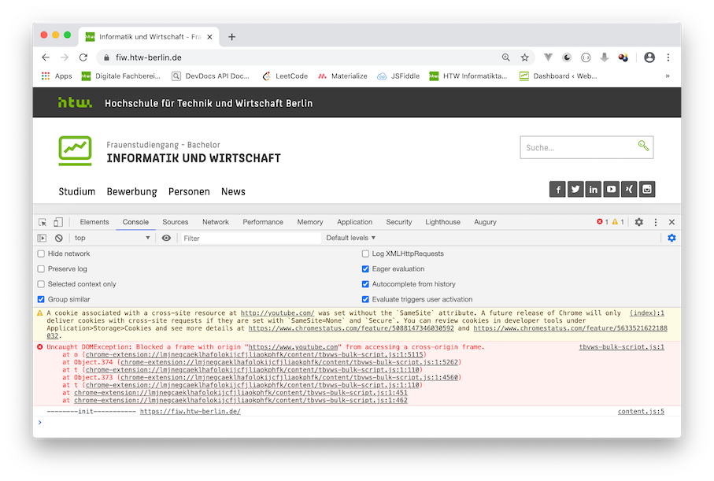
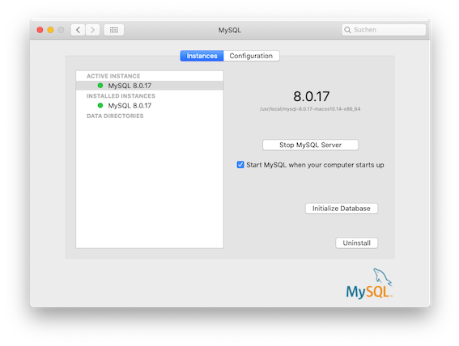

# Werkzeuge

## Angular

## Integrated Development Environment (IDE)

Für die Webentwicklung stehen Ihnen viele gute Entwicklungswerkzeuge zur Verfügung. Für welches Sie sich entscheiden, bleibt Ihnen überlassen. Hier eine Auswahl der aus meiner Sicht besten Entwicklungswerkzeuge:

- [IntelliJ IDEA](https://www.jetbrains.com/de-de/idea/)
- [PhpStorm](https://www.jetbrains.com/de-de/phpstorm/)
- [WebStorm](https://www.jetbrains.com/de-de/webstorm/)
- [Sublime Text](https://www.sublimetext.com/)
- [Atom](https://atom.io/)
- [Visual Studio Code](https://code.visualstudio.com/)

Für die Tools von Jetbrains benötigen Sie einen Account. Mit Ihrer HTW-E-Mail-Adresse bekommen Sie aber eine kostenlose Hochschullizenz und können so die Enterprise-Versionen kostenlos nutzen. Sublime Text ist Shareware und fragt regelmäßig, ob Sie spenden möchten.  

## Git

[**Git**](https://git-scm.com/) ist ein Werkzeug zur Versionskontrolle und zum gemeinsamen Entwickeln in Teams. Nach jeder Übung committen Sie Ihre Lösung und pushen Sie auf einen zentralen, netzbasierten Dienst, wie z.B.

- [GitHub](https://github.com/)
- [GitLab](https://about.gitlab.com/)
- [Bibucket](https://bitbucket.org/product/) 

Gewähren Sie mir Zugriff auf Ihr zentrales Repository. Auf GitHub finden Sie mich unter *jfreiheit* bzw. meiner E-Mail-Adresse *joern.freiheit@htw-berlin.de*.

## Developer Tools

Alle Browser sind mit Werkzeugen ausgestattet, die es Web-Entwicklerinnen ermöglichen, im Browser Informationen über die Webanwendung zu erhalten. Für einige Browser ist hier angegeben, wie Sie diese Entwicklerwerkzeuge einschalten.

### Chrome

In Chrome sind die Entwicklerwerkzeuge unter dem Menü neben der URL-Eingabezeile unter `Weitere Tools --> Entwicklertools` verfügbar (siehe folgendes Bild).


Die eingeschalteten Entwicklertools offenbaren Ihnen umfassende Informationen über die angezeigte Webseite. Besonders interessant ist der Reiter `Console`:



oder auch der Reiter `Elements`, der Ihnen sowohl den HTML- als auch den jeweiligen CSS-Code anzeigt:


Weiterführende Informationen erhalten Sie unter [https://developers.google.com/web/tools/chrome-devtools](https://developers.google.com/web/tools/chrome-devtools).

### Firefox

Zu den Entwicklertools von Firefox finden Sie Informationen auf 

- [https://developer.mozilla.org/de/docs/Tools](https://developer.mozilla.org/de/docs/Tools)
- [Firefox Browser Developer](https://www.mozilla.org/en-US/firefox/developer/?utm_source=firebug&utm_medium=lp&utm_campaign=switch&utm_content=landingpage) 

Die Entwicklertools lassen sich in Firefox öffnen unter `Web-Entwickler --> Inspektor`:


Sie haben die gleichen Möglichkeiten der Ananlyse wie bei Chrome, bei Safari und anderen Browsern:


### Safari

In Safari müssen Sie zunächst den Menüeintrag `Entwickler` aktivieren. Eine Anleitung dazu finden Sie z.B. [hier auf heise](https://www.heise.de/tipps-tricks/Mac-Entwicklertools-in-Safari-aktivieren-4050163.html) . Weitere Informationen zu den Entwicklertools erhalten Sie z.B. auf

- [Werkzeuge im Menü „Entwickler“](https://support.apple.com/de-de/guide/safari/sfri20948/mac)
- [Safari Developer Help](https://support.apple.com/de-de/guide/safari-developer/welcome/mac)
- [Web Development Tools](https://developer.apple.com/safari/tools/)


## Curl

[Curl](https://curl.haxx.se/) ist ein Open-Source-Kommandozeilenprogramm, um Daten mittels URL zu transferieren. Curl kann auf der Kommandozeile genutzt werden, um SMTP, HTTP, FTP usw. zu verwenden. Wir werden Curl insbesondere für die HTTP-Anfragemethoden GET und POST verwenden. 

Eine ausführliche Beschreibung von Curl ist im Buch [Everything curl - the book](https://curl.haxx.se/book.html) frei verfügbar. Die Installation von Curl erfolgt über die [Curl Download Seite](https://curl.haxx.se/download.html).

Zum Testen, ob Curl korrekt funktioniert, können Sie im Terminal z.B.

``` bash
curl freiheit.f4.htw-berlin.de/curl.html
```

eingeben. Es sollte folgende Ausgabe erscheinen:

```bash
<!DOCTYPE html>
<html>
  <head>
    <title>Curl-Test</title>
  </head>
  <body>
    <p>Hallo FIW!</p>
  </body>
</html>
```

Mit dem `-o`-Flag können Sie die Datei speichern (Sie können einen Dateinamen angeben - hier `curl.html`):

```bash
curl -o curl.html freiheit.f4.htw-berlin.de/curl.html
``` 

Da oben die lokale Datei genau so heißt wie die remote-Datei, hätte man auch 

```bash
curl -O freiheit.f4.htw-berlin.de/curl.html
``` 

angeben können, also großes `-O`. Mit dem `-d`-Flag können Parameter übergeben und die entsprechende Seite mit einer POST-Anfrage aufgerufen werden. Mit dem zusätzlichen `-G`-Flag erfolgt die Anfrage nicht als POST sondern als GET. Mit dem `-I`-Flag fragen Sie den Header der Anfrage ab, z.B.:

```bash
curl -I freiheit.f4.htw-berlin.de/curl.html
``` 

gibt etwas aus in der Art:

```bash
HTTP/1.1 200 OK
Date: Thu, 04 Jun 2020 13:59:43 GMT
Server: Apache/2.4.38 (Debian)
Last-Modified: Thu, 04 Jun 2020 13:01:59 GMT
ETag: "78-5a741c004bdb9"
Accept-Ranges: bytes
Content-Length: 120
Vary: Accept-Encoding
Content-Type: text/html

``` 

Für eine vollständige Übersicht aller Flags von Curl siehe [Curl manpage](https://curl.haxx.se/docs/manpage.html).

## Postman

Postman ist eine Anwendung, um Schnittstellen (*Application Programming Interface - API*), die das Backend bereitstellt, zu entwickeln und zu testen. Sie finden Postman unter [postman.com](https://www.postman.com/). Wir beschränken uns zunächst auf den [Postman API Client](https://www.postman.com/product/api-client/). Laden Sie das Tool herunter und installieren es. Rufen Sie Postman auf und geben in das Eingabefeld `https://postman-echo.com/get` ein. Lassen Sie die Auswahl links daneben auf `GET` und klicken auf den `Send`-Button. Es erscheint folgendes Bild:


Neben der `GET`-Anfrage sind folgende weitere Anfragen (siehe auch [**HTML --> HTTP**](./html/#http)) möglich:

- `POST` - sendet Daten zur Verarbeitung an den Webserver
- `PUT` - lädt existierende Daten (eine Datei) auf den Server
- `PATCH` - ändert Daten (eine Datei), ohne - wie bei `PUT` - diese vollständig zu ersetzen
- `DELETE` - löscht die angegebenen Daten auf dem Server

## Node.js

[Node.js](https://nodejs.org/en/) ist eine JavaScript-Laufzeitumgebung. Node.js reagiert auf Ereignisse und antwortet asynchron. Das bedeutet, dass die Ausführung einer Ereignisbearbeitung nicht zum Blockieren der Laufzeitumgebung führt, sondern nebenläufig weitere Ereignisse eintreffen können, die ebenfalls asynchron behandelt werden. Dies geschieht mithilfe des *Callback-Patterns*. Callbacks sind Funktionen, die anderen Funktionen als Parameter übergeben werden (siehe [**JavaScript --> Callback-Funktionen**](./javascript/#callback-funktionen)). 

## MySQL

[MySQL](https://www.mysql.com/de/) ist eine relationale Datenbank und gehört zu den am meisten verwendeten relationalen Datenbanken bei Webanwendungen. Wir hätten uns auch für [PostgreSQL](https://www.postgresql.org/) entscheiden können. Für einen kurzen Vergleich von MySQL und PostgreSQL siehe [hier](https://developer.okta.com/blog/2019/07/19/mysql-vs-postgres). Informationen zur Installation von MySQL finden Sie [hier](https://dev.mysql.com/doc/mysql-installation-excerpt/5.7/en/). Nach der Installation finden Sie z.B. auf dem Mac unter **Systemeinstellungen --> MySQL**:



## phpMyadmin

[`phpMyadmin`](https://www.phpmyadmin.net/) ist eine graphische Oberfläche zur Verwaltung Ihrer `MySQL`-Datenbanken. Nach erfolgreicher Installation rufen Sie im Browser `localhost/phpmyadmin` auf und haben Zugriff auf Ihre Datenbanken bzw. können diese erstellen, ändern und befüllen. 


## Weitere Hilfen

### Prozesse und Ports

Wenn Sie herausbekommen wollen, welche Ports bereits belegt sind und durch welchen Prozess, dann geben Sie im Terminal ein:

```
lsof -i -P | grep -i LISTEN
```

Eventuell müssen Sie ein `sudo` voranstellen. Sie erhalten eine Ausgabe in der Form (variiert natürlich stark):

```
rapportd   372 jornfreiheit    4u  IPv4 0x5cee55fd054bd73      0t0  TCP *:57124 (LISTEN)
rapportd   372 jornfreiheit    5u  IPv6 0x5cee55fab8990c3      0t0  TCP *:57124 (LISTEN)
phpstorm   456 jornfreiheit   55u  IPv4 0x5cee55faabf19b3      0t0  TCP localhost:6942 (LISTEN)
phpstorm   456 jornfreiheit  355u  IPv4 0x5cee55fb7f034f3      0t0  TCP localhost:63342 (LISTEN)
Dropbox   2638 jornfreiheit  129u  IPv6 0x5cee55fb262a223      0t0  TCP *:17500 (LISTEN)
Dropbox   2638 jornfreiheit  130u  IPv4 0x5cee55fb25ea393      0t0  TCP *:17500 (LISTEN)
Dropbox   2638 jornfreiheit  185u  IPv4 0x5cee55fb7f00393      0t0  TCP localhost:17600 (LISTEN)
Dropbox   2638 jornfreiheit  194u  IPv4 0x5cee55fb9e31753      0t0  TCP localhost:17603 (LISTEN)
node      9070 jornfreiheit   21u  IPv6 0x5cee55fb5913843      0t0  TCP *:8080 (LISTEN)
Python    9138 jornfreiheit    5u  IPv4 0x5cee55fcfdf7753      0t0  TCP localhost:8000 (LISTEN)
```

Wenn Sie nun z.B. einen bestimmten Prozess killen wollen, z.B. den Python-Prozess, der in `localhost` auf Port `8000` läuft, dann geben Sie 

```
kill -9 9138
```

im Terminal ein. `9138` ist die `PID` des entsprechenden Prozesses.