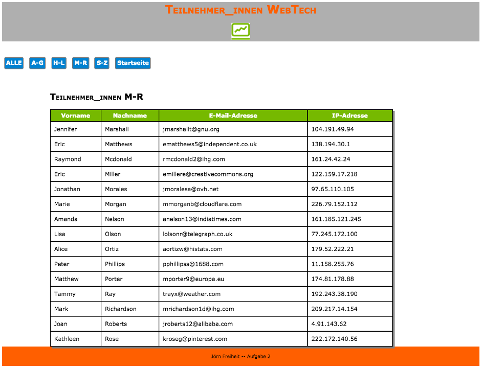
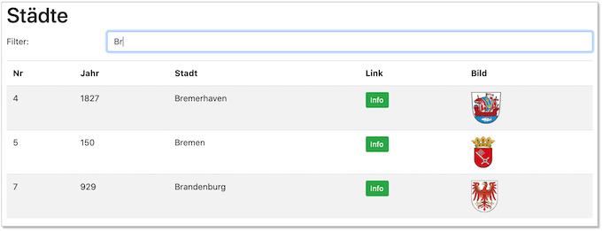

# Übungen

??? question "Übungsaufgabe 0"
    - wählen Sie eine [**IDE**](../tools/#integrated-development-environment-ide) aus und installieren Sie diese 
    - richten Sie sich ein Git-Repository ein (z.B. ``WebTech20``) und pushen Sie es auf einen zentralen Dienst ([**siehe**](../tools/#git))
    - laden Sie mich zu Ihrem Git-Dienst ein ([**siehe**](../tools/#git))
    - erstellen Sie in Ihrem Repostory eine Datei ``index.php`` mit folgendem Inhalt: ``<?php phpinfo(); ?>``
    - richten Sie Ihren Webserver so ein, dass ``WebTech20`` Ihr *DocumentRoot* ist ([**siehe**](../tools/#webserver))
    - commiten und pushen Sie Ihr Repository

??? question "Übungsaufgabe 1 (HTML)"
	- Erstellen Sie in einem `Uebung1`-Ordner eine Datei `uebung1.html`. Das `body`-Element soll ein `header`-Element, ein `nav`-Element, ein `section`-Element und ein `footer`-Element enthalten. 
	- Unter dieser Übungsaufgabe (siehe `mockupdata`) ist der HTML-Code einer Tabelle mit allen Teilnehmerinnen einer Veranstaltung. Kopieren Sie den Inhalt der Datei so in Ihren HTML-Code, dass folgende Seite erscheint:
	

	- Es sollen 4 Unterseiten erstellt werden. Bei Klick auf diese Seiten soll die Tabelle jeweils nur die Teilnehmerinnen enthalten, deren Nachname mit dem entsprechenden Anfangsbuchstaben beginnt (also in `ag.html` nur alle Nachnamen, die mit A bis G beginnen). Die Seiten `ag.html`, `hl.html`, `mr.html` und `sz.html` sollen im Ordner `NN` abgelegt werden, der Unterordner von `Uebung1` ist.
	- Achten Sie darauf, dass man von jeder Unterseite auf jede andere Unterseite und auch auf die Hauptseite (`uebung1.html`) wechseln können muss.
	- Das einzubindende Logo des Studiengangs liegt [hier](./files/fiw.jpg). Es soll in einen `images`-Ordner gespeichert werden, der in der Ordner-Hierarchie neben dem `Uebung1`-Ordner liegt. Um die Größe des Bildes festzulegen, können Sie mit Hilfe des `style`-Attributes die Höhe und die Breite bestimmen: `style="width:53px; height=48px;"` 
	- Nächste Woche wird Uebung1 um CSS erweitert. 

??? "mockupdata"
	```html
	<table>
		<thead>
			<tr>
				<th>Vorname</th>
				<th>Nachname</th>
				<th>E-Mail-Adresse</th>
				<th>IP-Adresse</th>
			</tr>
		</thead>
		<tbody>
			<tr>
				<td>Adam</td>
				<td>Anderson</td>
				<td>aanderson8@google.fr</td>
				<td>118.93.83.157</td>
			</tr>
			<tr>
				<td>Susan</td>
				<td>Andrews</td>
				<td>sandrewsn@google.co.jp</td>
				<td>228.214.9.251</td>
			</tr>
			<tr>
				<td>Catherine</td>
				<td>Andrews</td>
				<td>candrewsp@noaa.gov</td>
				<td>112.111.87.178</td>
			</tr>
			<tr>
				<td>Alan</td>
				<td>Bradley</td>
				<td>abradley1c@globo.com</td>
				<td>229.152.117.127</td>
			</tr>
			<tr>
				<td>Anne</td>
				<td>Brooks</td>
				<td>abrooks16@bravesites.com</td>
				<td>243.159.39.234</td>
			</tr>
			<tr>
				<td>Russell</td>
				<td>Brown</td>
				<td>rbrownq@nifty.com</td>
				<td>215.38.120.242</td>
			</tr>
			<tr>
				<td>Ryan</td>
				<td>Burton</td>
				<td>rburton18@foxnews.com</td>
				<td>159.60.107.14</td>
			</tr>
			<tr>
				<td>Roy</td>
				<td>Campbell</td>
				<td>rcampbell1@geocities.com</td>
				<td>237.232.34.20</td>
			</tr>
			<tr>
				<td>Russell</td>
				<td>Campbell</td>
				<td>rcampbell17@eventbrite.com</td>
				<td>251.2.92.63</td>
			</tr>
			<tr>
				<td>Bonnie</td>
				<td>Coleman</td>
				<td>bcoleman11@fc2.com</td>
				<td>109.150.122.102</td>
			</tr>
			<tr>
				<td>Ernest</td>
				<td>Coleman</td>
				<td>ecoleman15@businessweek.com</td>
				<td>213.173.4.7</td>
			</tr>
			<tr>
				<td>Richard</td>
				<td>Cruz</td>
				<td>rcruz7@unc.edu</td>
				<td>235.124.23.221</td>
			</tr>
			<tr>
				<td>Sean</td>
				<td>Cruz</td>
				<td>scruz10@answers.com</td>
				<td>92.255.49.227</td>
			</tr>
			<tr>
				<td>Rebecca</td>
				<td>Cunningham</td>
				<td>rcunninghamd@mac.com</td>
				<td>65.79.191.52</td>
			</tr>
			<tr>
				<td>Margaret</td>
				<td>Evans</td>
				<td>mevansh@pcworld.com</td>
				<td>162.10.86.196</td>
			</tr>
			<tr>
				<td>Jeffrey</td>
				<td>Ford</td>
				<td>jford14@cnet.com</td>
				<td>210.216.54.14</td>
			</tr>
			<tr>
				<td>Andrea</td>
				<td>Gardner</td>
				<td>agardnerv@woothemes.com</td>
				<td>179.91.0.30</td>
			</tr>
			<tr>
				<td>Deborah</td>
				<td>George</td>
				<td>dgeorge6@furl.net</td>
				<td>201.76.47.162</td>
			</tr>
			<tr>
				<td>Sean</td>
				<td>Gibson</td>
				<td>sgibsony@alexa.com</td>
				<td>48.114.103.55</td>
			</tr>
			<tr>
				<td>Virginia</td>
				<td>Graham</td>
				<td>vgrahamk@aol.com</td>
				<td>165.219.171.1</td>
			</tr>
			<tr>
				<td>Steven</td>
				<td>Hamilton</td>
				<td>shamiltonu@state.tx.us</td>
				<td>38.194.91.201</td>
			</tr>
			<tr>
				<td>Virginia</td>
				<td>Hawkins</td>
				<td>vhawkinsf@ehow.com</td>
				<td>93.120.46.203</td>
			</tr>
			<tr>
				<td>Edward</td>
				<td>Hicks</td>
				<td>ehicksc@pcworld.com</td>
				<td>199.153.27.1</td>
			</tr>
			<tr>
				<td>Mark</td>
				<td>Johnson</td>
				<td>mjohnsonj@hostgator.com</td>
				<td>73.87.135.206</td>
			</tr>
			<tr>
				<td>Ruth</td>
				<td>Jordan</td>
				<td>rjordan1a@smugmug.com</td>
				<td>193.140.80.64</td>
			</tr>
			<tr>
				<td>Antonio</td>
				<td>Kim</td>
				<td>akim4@odnoklassniki.ru</td>
				<td>168.244.191.78</td>
			</tr>
			<tr>
				<td>Jennifer</td>
				<td>Marshall</td>
				<td>jmarshallt@gnu.org</td>
				<td>104.191.49.94</td>
			</tr>
			<tr>
				<td>Eric</td>
				<td>Matthews</td>
				<td>ematthews5@independent.co.uk</td>
				<td>138.194.30.1</td>
			</tr>
			<tr>
				<td>Raymond</td>
				<td>Mcdonald</td>
				<td>rmcdonald2@ihg.com</td>
				<td>161.24.42.24</td>
			</tr>
			<tr>
				<td>Eric</td>
				<td>Miller</td>
				<td>emillere@creativecommons.org</td>
				<td>122.159.17.218</td>
			</tr>
			<tr>
				<td>Jonathan</td>
				<td>Morales</td>
				<td>jmoralesa@ovh.net</td>
				<td>97.65.110.105</td>
			</tr>
			<tr>
				<td>Marie</td>
				<td>Morgan</td>
				<td>mmorganb@cloudflare.com</td>
				<td>226.79.152.112</td>
			</tr>
			<tr>
				<td>Amanda</td>
				<td>Nelson</td>
				<td>anelson13@indiatimes.com</td>
				<td>161.185.121.245</td>
			</tr>
			<tr>
				<td>Lisa</td>
				<td>Olson</td>
				<td>lolsonr@telegraph.co.uk</td>
				<td>77.245.172.100</td>
			</tr>
			<tr>
				<td>Alice</td>
				<td>Ortiz</td>
				<td>aortizw@histats.com</td>
				<td>179.52.222.21</td>
			</tr>
			<tr>
				<td>Peter</td>
				<td>Phillips</td>
				<td>pphillipss@1688.com</td>
				<td>11.158.255.76</td>
			</tr>
			<tr>
				<td>Matthew</td>
				<td>Porter</td>
				<td>mporter9@europa.eu</td>
				<td>174.81.178.88</td>
			</tr>
			<tr>
				<td>Tammy</td>
				<td>Ray</td>
				<td>trayx@weather.com</td>
				<td>192.243.38.190</td>
			</tr>
			<tr>
				<td>Mark</td>
				<td>Richardson</td>
				<td>mrichardson1d@ihg.com</td>
				<td>209.217.14.154</td>
			</tr>
			<tr>
				<td>Joan</td>
				<td>Roberts</td>
				<td>jroberts12@alibaba.com</td>
				<td>4.91.143.62</td>
			</tr>
			<tr>
				<td>Kathleen</td>
				<td>Rose</td>
				<td>kroseg@pinterest.com</td>
				<td>222.172.140.56</td>
			</tr>
			<tr>
				<td>Steve</td>
				<td>Sanders</td>
				<td>ssanders1b@wikispaces.com</td>
				<td>91.61.109.245</td>
			</tr>
			<tr>
				<td>Shirley</td>
				<td>Scott</td>
				<td>sscottm@macromedia.com</td>
				<td>219.237.108.82</td>
			</tr>
			<tr>
				<td>Lillian</td>
				<td>Stephens</td>
				<td>lstephens19@hugedomains.com</td>
				<td>89.85.137.204</td>
			</tr>
			<tr>
				<td>Nicole</td>
				<td>Thompson</td>
				<td>nthompson3@admin.ch</td>
				<td>13.183.208.155</td>
			</tr>
			<tr>
				<td>Marie</td>
				<td>Thompson</td>
				<td>mthompsonz@yelp.com</td>
				<td>162.164.5.231</td>
			</tr>
			<tr>
				<td>Alan</td>
				<td>Vasquez</td>
				<td>avasquezo@miibeian.gov.cn</td>
				<td>178.109.86.172</td>
			</tr>
			<tr>
				<td>Mildred</td>
				<td>Watkins</td>
				<td>mwatkins0@miibeian.gov.cn</td>
				<td>150.67.132.64</td>
			</tr>
			<tr>
				<td>Eugene</td>
				<td>Williams</td>
				<td>ewilliamsi@deliciousdays.com</td>
				<td>67.208.26.182</td>
			</tr>
			<tr>
				<td>Catherine</td>
				<td>Williams</td>
				<td>cwilliamsl@360.cn</td>
				<td>154.87.204.51</td>
			</tr>
		</tbody>
	</table>
	```

??? note "Eine mögliche Lösung für Übung 1"
	```html
	<!DOCTYPE html>
	<html lang="en">
	<head>
	    <meta charset="UTF-8">
	    <title>Aufgabe 1</title>
	</head>
	<body>
	    <header>
	        <h1>Teilnehmerinnen WebTech</h1>
	        
	    </header>
	    <nav>
	        <a href="#">ALLE</a>
	        <a href="./NN/ag.html">A-G</a>
	        <a href="./NN/hl.html">H-L</a>
	        <a href="./NN/mr.html">M-R</a>
	        <a href="./NN/sz.html">S-Z</a>
	        <a href="../index.html">Startseite</a>
	    </nav>
	    <section>
	        <table>
	            <tr>
	                <th>Vorname</th>
	                <th>Nachname</th>
	                <th>E-Mail-Adresse</th>
	                <th>IP-Adresse</th>
	            </tr>
	            <tr>
	                <td>Adam</td>
	                <td>Anderson</td>
	                <td>aanderson8@google.fr</td>
	                <td>118.93.83.157</td>
	            </tr>
	            <tr>
	                <td>Susan</td>
	                <td>Andrews</td>
	                <td>sandrewsn@google.co.jp</td>
	                <td>228.214.9.251</td>
	            </tr>
	            <tr>
	                <td>Catherine</td>
	                <td>Andrews</td>
	                <td>candrewsp@noaa.gov</td>
	                <td>112.111.87.178</td>
	            </tr>
	            <tr>
	                <td>Alan</td>
	                <td>Bradley</td>
	                <td>abradley1c@globo.com</td>
	                <td>229.152.117.127</td>
	            </tr>
	            <tr>
	                <td>Anne</td>
	                <td>Brooks</td>
	                <td>abrooks16@bravesites.com</td>
	                <td>243.159.39.234</td>
	            </tr>
	            <tr>
	                <td>Russell</td>
	                <td>Brown</td>
	                <td>rbrownq@nifty.com</td>
	                <td>215.38.120.242</td>
	            </tr>
	            <tr>
	                <td>Ryan</td>
	                <td>Burton</td>
	                <td>rburton18@foxnews.com</td>
	                <td>159.60.107.14</td>
	            </tr>
	            <tr>
	                <td>Roy</td>
	                <td>Campbell</td>
	                <td>rcampbell1@geocities.com</td>
	                <td>237.232.34.20</td>
	            </tr>
	            <tr>
	                <td>Russell</td>
	                <td>Campbell</td>
	                <td>rcampbell17@eventbrite.com</td>
	                <td>251.2.92.63</td>
	            </tr>
	            <tr>
	                <td>Bonnie</td>
	                <td>Coleman</td>
	                <td>bcoleman11@fc2.com</td>
	                <td>109.150.122.102</td>
	            </tr>
	            <tr>
	                <td>Ernest</td>
	                <td>Coleman</td>
	                <td>ecoleman15@businessweek.com</td>
	                <td>213.173.4.7</td>
	            </tr>
	            <tr>
	                <td>Richard</td>
	                <td>Cruz</td>
	                <td>rcruz7@unc.edu</td>
	                <td>235.124.23.221</td>
	            </tr>
	            <tr>
	                <td>Sean</td>
	                <td>Cruz</td>
	                <td>scruz10@answers.com</td>
	                <td>92.255.49.227</td>
	            </tr>
	            <tr>
	                <td>Rebecca</td>
	                <td>Cunningham</td>
	                <td>rcunninghamd@mac.com</td>
	                <td>65.79.191.52</td>
	            </tr>
	            <tr>
	                <td>Margaret</td>
	                <td>Evans</td>
	                <td>mevansh@pcworld.com</td>
	                <td>162.10.86.196</td>
	            </tr>
	            <tr>
	                <td>Jeffrey</td>
	                <td>Ford</td>
	                <td>jford14@cnet.com</td>
	                <td>210.216.54.14</td>
	            </tr>
	            <tr>
	                <td>Andrea</td>
	                <td>Gardner</td>
	                <td>agardnerv@woothemes.com</td>
	                <td>179.91.0.30</td>
	            </tr>
	            <tr>
	                <td>Deborah</td>
	                <td>George</td>
	                <td>dgeorge6@furl.net</td>
	                <td>201.76.47.162</td>
	            </tr>
	            <tr>
	                <td>Sean</td>
	                <td>Gibson</td>
	                <td>sgibsony@alexa.com</td>
	                <td>48.114.103.55</td>
	            </tr>
	            <tr>
	                <td>Virginia</td>
	                <td>Graham</td>
	                <td>vgrahamk@aol.com</td>
	                <td>165.219.171.1</td>
	            </tr>
	            <tr>
	                <td>Steven</td>
	                <td>Hamilton</td>
	                <td>shamiltonu@state.tx.us</td>
	                <td>38.194.91.201</td>
	            </tr>
	            <tr>
	                <td>Virginia</td>
	                <td>Hawkins</td>
	                <td>vhawkinsf@ehow.com</td>
	                <td>93.120.46.203</td>
	            </tr>
	            <tr>
	                <td>Edward</td>
	                <td>Hicks</td>
	                <td>ehicksc@pcworld.com</td>
	                <td>199.153.27.1</td>
	            </tr>
	            <tr>
	                <td>Mark</td>
	                <td>Johnson</td>
	                <td>mjohnsonj@hostgator.com</td>
	                <td>73.87.135.206</td>
	            </tr>
	            <tr>
	                <td>Ruth</td>
	                <td>Jordan</td>
	                <td>rjordan1a@smugmug.com</td>
	                <td>193.140.80.64</td>
	            </tr>
	            <tr>
	                <td>Antonio</td>
	                <td>Kim</td>
	                <td>akim4@odnoklassniki.ru</td>
	                <td>168.244.191.78</td>
	            </tr>
	            <tr>
	                <td>Jennifer</td>
	                <td>Marshall</td>
	                <td>jmarshallt@gnu.org</td>
	                <td>104.191.49.94</td>
	            </tr>
	            <tr>
	                <td>Eric</td>
	                <td>Matthews</td>
	                <td>ematthews5@independent.co.uk</td>
	                <td>138.194.30.1</td>
	            </tr>
	            <tr>
	                <td>Raymond</td>
	                <td>Mcdonald</td>
	                <td>rmcdonald2@ihg.com</td>
	                <td>161.24.42.24</td>
	            </tr>
	            <tr>
	                <td>Eric</td>
	                <td>Miller</td>
	                <td>emillere@creativecommons.org</td>
	                <td>122.159.17.218</td>
	            </tr>
	            <tr>
	                <td>Jonathan</td>
	                <td>Morales</td>
	                <td>jmoralesa@ovh.net</td>
	                <td>97.65.110.105</td>
	            </tr>
	            <tr>
	                <td>Marie</td>
	                <td>Morgan</td>
	                <td>mmorganb@cloudflare.com</td>
	                <td>226.79.152.112</td>
	            </tr>
	            <tr>
	                <td>Amanda</td>
	                <td>Nelson</td>
	                <td>anelson13@indiatimes.com</td>
	                <td>161.185.121.245</td>
	            </tr>
	            <tr>
	                <td>Lisa</td>
	                <td>Olson</td>
	                <td>lolsonr@telegraph.co.uk</td>
	                <td>77.245.172.100</td>
	            </tr>
	            <tr>
	                <td>Alice</td>
	                <td>Ortiz</td>
	                <td>aortizw@histats.com</td>
	                <td>179.52.222.21</td>
	            </tr>
	            <tr>
	                <td>Peter</td>
	                <td>Phillips</td>
	                <td>pphillipss@1688.com</td>
	                <td>11.158.255.76</td>
	            </tr>
	            <tr>
	                <td>Matthew</td>
	                <td>Porter</td>
	                <td>mporter9@europa.eu</td>
	                <td>174.81.178.88</td>
	            </tr>
	            <tr>
	                <td>Tammy</td>
	                <td>Ray</td>
	                <td>trayx@weather.com</td>
	                <td>192.243.38.190</td>
	            </tr>
	            <tr>
	                <td>Mark</td>
	                <td>Richardson</td>
	                <td>mrichardson1d@ihg.com</td>
	                <td>209.217.14.154</td>
	            </tr>
	            <tr>
	                <td>Joan</td>
	                <td>Roberts</td>
	                <td>jroberts12@alibaba.com</td>
	                <td>4.91.143.62</td>
	            </tr>
	            <tr>
	                <td>Kathleen</td>
	                <td>Rose</td>
	                <td>kroseg@pinterest.com</td>
	                <td>222.172.140.56</td>
	            </tr>
	            <tr>
	                <td>Steve</td>
	                <td>Sanders</td>
	                <td>ssanders1b@wikispaces.com</td>
	                <td>91.61.109.245</td>
	            </tr>
	            <tr>
	                <td>Shirley</td>
	                <td>Scott</td>
	                <td>sscottm@macromedia.com</td>
	                <td>219.237.108.82</td>
	            </tr>
	            <tr>
	                <td>Lillian</td>
	                <td>Stephens</td>
	                <td>lstephens19@hugedomains.com</td>
	                <td>89.85.137.204</td>
	            </tr>
	            <tr>
	                <td>Nicole</td>
	                <td>Thompson</td>
	                <td>nthompson3@admin.ch</td>
	                <td>13.183.208.155</td>
	            </tr>
	            <tr>
	                <td>Marie</td>
	                <td>Thompson</td>
	                <td>mthompsonz@yelp.com</td>
	                <td>162.164.5.231</td>
	            </tr>
	            <tr>
	                <td>Alan</td>
	                <td>Vasquez</td>
	                <td>avasquezo@miibeian.gov.cn</td>
	                <td>178.109.86.172</td>
	            </tr>
	            <tr>
	                <td>Mildred</td>
	                <td>Watkins</td>
	                <td>mwatkins0@miibeian.gov.cn</td>
	                <td>150.67.132.64</td>
	            </tr>
	            <tr>
	                <td>Eugene</td>
	                <td>Williams</td>
	                <td>ewilliamsi@deliciousdays.com</td>
	                <td>67.208.26.182</td>
	            </tr>
	            <tr>
	                <td>Catherine</td>
	                <td>Williams</td>
	                <td>cwilliamsl@360.cn</td>
	                <td>154.87.204.51</td>
	            </tr>
	        </table>

	    </section>
	    <footer>
	      Übung 1 - Jörn Freiheit
	    </footer>
	</body>
	</html>
	```

??? question "Übungsaufgabe 2 (CSS)"
	- Erstellen Sie (falls noch nicht geschehen) eine `index.html`-Datei in Ihrem Repository-Ordner (also z.B. `DocumentRoot/Webtech20`) derart, dass diese direkte Links auf Ihre Lösungen der Übungen enthalten (z.B. in einer Tabelle oder einer Liste).
	- Kopieren Sie den Ordner `Uebung1` in den Ordner `Uebung2` (also inkl. Ordner `NN`). Ändern Sie darin die Datei `uebung1.html` zu `uebung2.html` (umbenennen). Ändern Sie entsprechend alle Links innerhalb der Datei, damit Sie z.B. auf den Ordner `Uebung2/NN` zugreifen und nicht mehr auf `Uebung1/NN`.
	- Legen Sie sich im `Uebung2`-Ordner einen Ordner `styles` an. Erstellen Sie in dem `styles`-Ordner eine Datei `mystyles.css`.
	- Fügen Sie im `<head>`-Bereich der `uebung2.html` eine logische Verknüpfung zur `mystyles.css`-Datei ein (`<link href="./styles/mystyles.css" rel="stylesheet">`). 
	- In `mystyles.css` definieren Sie (versuchen Sie mind. 6 der genannten 8 Punkte umzusetzen):
		- Verdana als Schriftart für das ganze Dokument
		- der `<header>` soll das HTW-Grau als Hintergrundfarbe, HTW-Orange als Schriftfarbe und der Text zentriert sein (siehe [**HTW Corporate Design**](http://corporatedesign.htw-berlin.de/schrift-farbe/markenfarben/)).
		- die Tabelle soll ungefähr wie dargestellt aussehen: 
		   
		- d.h. mit Rahmen, mit einem Schatten, die Spaltenüberschriften in weiß, mit HTW-grünem Hintergrund.   
		- Das `<nav>`-Feld hat einen Abstand nach oben und nach unten von jeweils `50px`.
		- `<a>`-Elemente in einem `<nav>`-Element haben einen grauen Rand, deren Ecken abgerundet sind. Die Hintergrundfarbe ist HTW-blau. Schriftart ist weiß und bold. `<a>`-Elemente in einem `<nav>`-Element sind nicht unterstrichen!
		- Fährt man mit der Maus über ein `<a>`-Element in einem `<nav>`-Element ändert sich die Hintergrundfarbe in HTW-grau und die Schriftfarbe in HTW-orange. 
			
		- Die Tabelle hat eine Breite von 80% des `<section>`-Elements. 
		- Der `<footer>` ist in HTW-Orange, die Schrift ist schwarz, der Text ist mittig und die Schrift ist kleiner. Die Höhe des footers entsteht dadurch, dass die Schrift einen Abstand nach oben und nach unten von jeweils `20px` hat.
	- Am Ende soll es *ungefähr* so aussehen:  
	   

??? note "Eine mögliche Lösung für Übung 2"
	=== "uebung2.html"
		```html
		<!DOCTYPE html>
		<html>
		<head>
		<meta charset="UTF-8">
		<link href="./styles/mystyles.css" rel="stylesheet" />
		<title>Aufgabe 2</title>
		</head>
		<body>
		<header>
		<h1>Teilnehmer_innen WebTech</h1>
		
		</header>
		<nav>
		<a href="">Alle</a>
		<a href="./NN/ag.html">A-G</a>
		<a href="./NN/hl.html">H-L</a>
		<a href="./NN/mr.html">M-R</a>
		<a href="./NN/sz.html">A-G</a>
		</nav>
		<section>
		<h1>Alle Teilnehmer_innen</h1>
		<table>
			<tr>
				<th>Vorname</th>
				<th>Nachname</th>
				<th>E-Mail-Adresse</th>
				<th>IP-Adresse</th>
			</tr>
			<tr>
				<td>Adam</td>
				<td>Anderson</td>
				<td>aanderson8@google.fr</td>
				<td>118.93.83.157</td>
			</tr>
			<tr>
				<td>Susan</td>
				<td>Andrews</td>
				<td>sandrewsn@google.co.jp</td>
				<td>228.214.9.251</td>
			</tr>
			<tr>
				<td>Catherine</td>
				<td>Andrews</td>
				<td>candrewsp@noaa.gov</td>
				<td>112.111.87.178</td>
			</tr>
			<tr>
				<td>Alan</td>
				<td>Bradley</td>
				<td>abradley1c@globo.com</td>
				<td>229.152.117.127</td>
			</tr>
			<tr>
				<td>Anne</td>
				<td>Brooks</td>
				<td>abrooks16@bravesites.com</td>
				<td>243.159.39.234</td>
			</tr>
			<tr>
				<td>Russell</td>
				<td>Brown</td>
				<td>rbrownq@nifty.com</td>
				<td>215.38.120.242</td>
			</tr>
			<tr>
				<td>Ryan</td>
				<td>Burton</td>
				<td>rburton18@foxnews.com</td>
				<td>159.60.107.14</td>
			</tr>
			<tr>
				<td>Roy</td>
				<td>Campbell</td>
				<td>rcampbell1@geocities.com</td>
				<td>237.232.34.20</td>
			</tr>
			<tr>
				<td>Russell</td>
				<td>Campbell</td>
				<td>rcampbell17@eventbrite.com</td>
				<td>251.2.92.63</td>
			</tr>
			<tr>
				<td>Bonnie</td>
				<td>Coleman</td>
				<td>bcoleman11@fc2.com</td>
				<td>109.150.122.102</td>
			</tr>
			<tr>
				<td>Ernest</td>
				<td>Coleman</td>
				<td>ecoleman15@businessweek.com</td>
				<td>213.173.4.7</td>
			</tr>
			<tr>
				<td>Richard</td>
				<td>Cruz</td>
				<td>rcruz7@unc.edu</td>
				<td>235.124.23.221</td>
			</tr>
			<tr>
				<td>Sean</td>
				<td>Cruz</td>
				<td>scruz10@answers.com</td>
				<td>92.255.49.227</td>
			</tr>
			<tr>
				<td>Rebecca</td>
				<td>Cunningham</td>
				<td>rcunninghamd@mac.com</td>
				<td>65.79.191.52</td>
			</tr>
			<tr>
				<td>Margaret</td>
				<td>Evans</td>
				<td>mevansh@pcworld.com</td>
				<td>162.10.86.196</td>
			</tr>
			<tr>
				<td>Jeffrey</td>
				<td>Ford</td>
				<td>jford14@cnet.com</td>
				<td>210.216.54.14</td>
			</tr>
			<tr>
				<td>Andrea</td>
				<td>Gardner</td>
				<td>agardnerv@woothemes.com</td>
				<td>179.91.0.30</td>
			</tr>
			<tr>
				<td>Deborah</td>
				<td>George</td>
				<td>dgeorge6@furl.net</td>
				<td>201.76.47.162</td>
			</tr>
			<tr>
				<td>Sean</td>
				<td>Gibson</td>
				<td>sgibsony@alexa.com</td>
				<td>48.114.103.55</td>
			</tr>
			<tr>
				<td>Virginia</td>
				<td>Graham</td>
				<td>vgrahamk@aol.com</td>
				<td>165.219.171.1</td>
			</tr>
			<tr>
				<td>Steven</td>
				<td>Hamilton</td>
				<td>shamiltonu@state.tx.us</td>
				<td>38.194.91.201</td>
			</tr>
			<tr>
				<td>Virginia</td>
				<td>Hawkins</td>
				<td>vhawkinsf@ehow.com</td>
				<td>93.120.46.203</td>
			</tr>
			<tr>
				<td>Edward</td>
				<td>Hicks</td>
				<td>ehicksc@pcworld.com</td>
				<td>199.153.27.1</td>
			</tr>
			<tr>
				<td>Mark</td>
				<td>Johnson</td>
				<td>mjohnsonj@hostgator.com</td>
				<td>73.87.135.206</td>
			</tr>
			<tr>
				<td>Ruth</td>
				<td>Jordan</td>
				<td>rjordan1a@smugmug.com</td>
				<td>193.140.80.64</td>
			</tr>
			<tr>
				<td>Antonio</td>
				<td>Kim</td>
				<td>akim4@odnoklassniki.ru</td>
				<td>168.244.191.78</td>
			</tr>
			<tr>
				<td>Jennifer</td>
				<td>Marshall</td>
				<td>jmarshallt@gnu.org</td>
				<td>104.191.49.94</td>
			</tr>
			<tr>
				<td>Eric</td>
				<td>Matthews</td>
				<td>ematthews5@independent.co.uk</td>
				<td>138.194.30.1</td>
			</tr>
			<tr>
				<td>Raymond</td>
				<td>Mcdonald</td>
				<td>rmcdonald2@ihg.com</td>
				<td>161.24.42.24</td>
			</tr>
			<tr>
				<td>Eric</td>
				<td>Miller</td>
				<td>emillere@creativecommons.org</td>
				<td>122.159.17.218</td>
			</tr>
			<tr>
				<td>Jonathan</td>
				<td>Morales</td>
				<td>jmoralesa@ovh.net</td>
				<td>97.65.110.105</td>
			</tr>
			<tr>
				<td>Marie</td>
				<td>Morgan</td>
				<td>mmorganb@cloudflare.com</td>
				<td>226.79.152.112</td>
			</tr>
			<tr>
				<td>Amanda</td>
				<td>Nelson</td>
				<td>anelson13@indiatimes.com</td>
				<td>161.185.121.245</td>
			</tr>
			<tr>
				<td>Lisa</td>
				<td>Olson</td>
				<td>lolsonr@telegraph.co.uk</td>
				<td>77.245.172.100</td>
			</tr>
			<tr>
				<td>Alice</td>
				<td>Ortiz</td>
				<td>aortizw@histats.com</td>
				<td>179.52.222.21</td>
			</tr>
			<tr>
				<td>Peter</td>
				<td>Phillips</td>
				<td>pphillipss@1688.com</td>
				<td>11.158.255.76</td>
			</tr>
			<tr>
				<td>Matthew</td>
				<td>Porter</td>
				<td>mporter9@europa.eu</td>
				<td>174.81.178.88</td>
			</tr>
			<tr>
				<td>Tammy</td>
				<td>Ray</td>
				<td>trayx@weather.com</td>
				<td>192.243.38.190</td>
			</tr>
			<tr>
				<td>Mark</td>
				<td>Richardson</td>
				<td>mrichardson1d@ihg.com</td>
				<td>209.217.14.154</td>
			</tr>
			<tr>
				<td>Joan</td>
				<td>Roberts</td>
				<td>jroberts12@alibaba.com</td>
				<td>4.91.143.62</td>
			</tr>
			<tr>
				<td>Kathleen</td>
				<td>Rose</td>
				<td>kroseg@pinterest.com</td>
				<td>222.172.140.56</td>
			</tr>
			<tr>
				<td>Steve</td>
				<td>Sanders</td>
				<td>ssanders1b@wikispaces.com</td>
				<td>91.61.109.245</td>
			</tr>
			<tr>
				<td>Shirley</td>
				<td>Scott</td>
				<td>sscottm@macromedia.com</td>
				<td>219.237.108.82</td>
			</tr>
			<tr>
				<td>Lillian</td>
				<td>Stephens</td>
				<td>lstephens19@hugedomains.com</td>
				<td>89.85.137.204</td>
			</tr>
			<tr>
				<td>Nicole</td>
				<td>Thompson</td>
				<td>nthompson3@admin.ch</td>
				<td>13.183.208.155</td>
			</tr>
			<tr>
				<td>Marie</td>
				<td>Thompson</td>
				<td>mthompsonz@yelp.com</td>
				<td>162.164.5.231</td>
			</tr>
			<tr>
				<td>Alan</td>
				<td>Vasquez</td>
				<td>avasquezo@miibeian.gov.cn</td>
				<td>178.109.86.172</td>
			</tr>
			<tr>
				<td>Mildred</td>
				<td>Watkins</td>
				<td>mwatkins0@miibeian.gov.cn</td>
				<td>150.67.132.64</td>
			</tr>
			<tr>
				<td>Eugene</td>
				<td>Williams</td>
				<td>ewilliamsi@deliciousdays.com</td>
				<td>67.208.26.182</td>
			</tr>
			<tr>
				<td>Catherine</td>
				<td>Williams</td>
				<td>cwilliamsl@360.cn</td>
				<td>154.87.204.51</td>
			</tr>
		</table>

		</section>
		<footer>
			Übung 2 - Jörn Freiheit
		</footer>
		</body>
		</html>
		```
	=== "mystyles.css"
		```css
		@charset "ISO-8859-1";
		body {
			font-family: Verdana, sans-serif;
			font-size:0.9em;
		}

		header {
			background-color:#AFAFAF;
			color: #FF5F00;
			text-align:center;
		}

		table {
			border-collapse:collapse;
			width:80%;
			box-shadow: 5px 5px 5px darkgray;
		}

		table, th, td {
			border:1px solid black;
			padding:5px;
		}

		th {
			background-color:#76B900;
			color:white;
		}

		h1 {
			font-variant:small-caps;
		}

		footer {
			background-color:#FF5F00;
			color: black;
			text-align:center;
			padding:5px;
			margin-top:10px;
			margin-bottom:10px;
		}

		nav {
			margin-top: 30px;
			margin-bottom: 10px;
		}

		nav a {
			text-decoration:none;
			background-color:#0082D1;
			color:white;
			padding:10px;
			border: 1px solid #0082D1;
			border-radius: 5px;
		}

		nav a:hover {
			background-color:#AFAFAF;
			color:#FF5F00;
		}
		``` 


??? question "Übungsaufgabe 3 (RWD + Bootstrap)"
	- Kopieren Sie `uebung2.html` aus Übung 2 in einen neuen `Uebung3`-Ordner und benennen Sie die Datei in `uebung3.html` um (der `NN`-Ordner muss nicht mehr mitkopiert werden). Achten Sie aber darauf, dass das FIW-Logo noch angezeigt wird
	- Binden Sie in Ihre `uebung3.html` Bootstrap ein (entweder per CDN oder als lokalen Zugriff – siehe [**Bootstrap**](../rwd/#bootstrap))
	- **Header**:
		- der `<header>` enthält das FIW-Logo und die Überschrift `<h1>Teilnehmerinnen WebTech</h1>`
		- weisen Sie dem `<header>` die Bootstrap-Klasse [**jumbotron**](https://getbootstrap.com/docs/4.5/components/jumbotron/) zu
		- definieren Sie eine CSS-Eigenschaft so, dass eine `h1`-Überschrift in einem `header` ein Inline-Element ist
		- definieren Sie eine `padding-left`-Eigenschaft für eine solche Überschrift so, dass die Überschrift ungefähr mittig ist (relative Größenangabe)
		- der header soll ungefähr so aussehen (Navigation und Anfang des Hauptteils sind auch schon zu sehen): 
	- **Navigation**: 
		- *interne Links* (Links innerhalb der Seite) funktionieren wie folgt: Sie weisen einem Element eine `id` zu, z.B. der Tabellenzeile, die den ersten Nachnamen enthält, der mit "H" beginnt: 
		```html
			<tr id="H">
    			<td>Steven</td>
    			<td>Hamilton</td>
    			<td>shamiltonu@state.tx.us</td>
    			<td>38.194.91.201</td>
			</tr>
		```
		- Jetzt können Sie in einem internen Link mithilfe des Doppelkreuzes (`#`) und des Bezeichners für die id (`H`) darauf verweisen, z.B.
		```html 
			<a class="nav-link" href="#H">H-L</a>
		```
		- Vergeben Sie entsprechend IDs für die entsprechenden Tabellenzeilen (A, H, M, S) und passen Sie Ihre Hyperlinks im Navigationsmenü entsprechend an
		- Weisen Sie Ihrem `<nav>`-Element einen lightgrey-Hintergrund zu
		- Erstellen Sie für die einzelnen Links eine `<ul>`, deren `<li>` jeweils ein `<a>`-Element mit den Referenzen auf die oben beschriebenen IDs enthalten
		- Informieren Sie sich unter [**Navs**](https://getbootstrap.com/docs/4.5/components/navs/) (oder wo Sie möchten) über „Navs“ und erstellen Sie Ihr Navigationsmenü so, wie oben in der Abbildung (siehe **Header**) gezeigt
		- Ändern Sie aber die Farbe der Links so, dass sie im HTW-Orange (`#FF5F00`) erscheinen und wenn man mit der Maus darüber fährt im HTW-Blau (`#0082D1`) (Definieren Sie sich gerne [**Custom Properties**](../css/#custom-properties) und wenden Sie diese an)
	- **Hauptteil**:
		- der Hauptteil (ein Container) soll aus drei Containern bestehen: einer, der nur das Wort (Überschrift) "links" enthält, einer, der die Tabelle enthält und ein dritter, der nur das Wort (Überschrift) "rechts" enthält
		- Weisen Sie diesem Hauptteil die Klasse `row` zu und gestalten gestalten Sie die drei inneren Container (links, Tabelle, rechts) so, dass
			- sie ab einer Viewportbreite `>= 992px` (`lg`) nebeneinander sind, wobei die Tabelle 4x so breit ist wie die jeweiligen Container an der Seite
  			- unterhalb der Viewportbreite von `992px` sollen die drei Teile untereinander sein
			- Abbildung für Breite unter `992px`:  
			
			- Abbildung für Breite oberhalb `992px`:  
			
		-	Mithilfe eigener Media-Queries sollen Sie dafür sorgen, dass die beiden Container links und rechts 
			- einen orangenen Hintergrund und eine Höhe von `100px` haben, wenn der Viewport kleiner als `992px` ist und 
			- einen hellgrauen (`lightgrey`) Hintergrund und eine automatische Höhe (`height: auto;`), wenn der Viewport größer ist
		-	Tabelle: 
			- Erkundigen Sie sich unter [**Tables**](https://getbootstrap.com/docs/4.5/content/tables/) und gestalten Sie die Tabelle so, dass sie ungefähr so aussieht: 
			- Sie müssen mit einer eigenen CSS-Definition dafür sorgen, dass die Zeile, in der Sie mit der Maus sind, nicht mehr dunkelgrau, sondern in HTW-Grün erscheint

	
??? note "Eine mögliche Lösung für Übung 3"
	```html linenums="1"
	<!DOCTYPE html>
	<html lang="en">
	<head>
	    <meta charset="UTF-8">
	    <meta name="viewport" content="width=device-width, initial-scale=1, shrink-to-fit=no">
	    <link rel="stylesheet" href="https://cdn.jsdelivr.net/npm/bootstrap@4.5.3/dist/css/bootstrap.min.css" integrity="sha384-TX8t27EcRE3e/ihU7zmQxVncDAy5uIKz4rEkgIXeMed4M0jlfIDPvg6uqKI2xXr2" crossorigin="anonymous">
	    <style>
	        .table tbody tr:hover {
	            background-color : #76B900;
	        }
	        nav {
	            background-color: lightgrey;
	        }
	        header h1 {
	            /*
	            display: inline;
	            padding-left: 20%;

	             */
	            text-align: center;
	        }
	        #links, #rechts  {
	            background-color: #FF5F00;
	            height: 100px;
	        }
	        main {
	            margin: 1%;
	        }
	        ul li a {
	            color: #FF5F00;
	        }
	        ul li a:hover {
	            color: #0082D1;
	        }
	        footer {
	            background-color: grey;
	            color: white;
	            text-align: center;
	            padding: 10px;
	        }
	        @media screen and (min-width: 992px) {
	            #links, #rechts {
	                background-color: lightgrey;
	                height: auto;
	            }
	        }
	    </style>
	    <title>Uebung 3</title>

	</head>
	<body>
	<div class="container-fluid">
	    <header class="jumbotron">
	        
	        <h1>Teilnehmerinnen WebTech</h1>
	    </header>
	    <nav>
	        <ul class="nav nav-pills nav-fills">
	            <li class="nav-item active">
	                <a class="nav-link" href="#">ALLE</a>
	            </li>
	            <li class="nav-item">
	                <a class="nav-link" href="#A">A-G</a>
	            </li>
	            <li class="nav-item">
	                <a class="nav-link" href="#H">H-L</a>
	            </li>
	            <li class="nav-item">
	                <a class="nav-link" href="#M">M-R</a>
	            </li>
	            <li class="nav-item">
	                <a class="nav-link" href="#S">S-Z</a>
	            </li>
	        </ul>
	    </nav>
	    <main class="row mx-1">
	        <aside id="links" class="col-12 col-lg-2"><h5 class="pt-3">links</h5></aside>
	        <section class="col-12 col-lg-8">
	            <table class="table table-striped table-responsive-md table-hover">
	                <thead>
	                    <tr>
	                        <th>Vorname</th>
	                        <th>Nachname</th>
	                        <th>E-Mail-Adresse</th>
	                        <th>IP-Adresse</th>
	                    </tr>
	                </thead>
	                <tbody>
	                    <tr id="A">
	                        <td>Adam</td>
	                        <td>Anderson</td>
	                        <td>aanderson8@google.fr</td>
	                        <td>118.93.83.157</td>
	                    </tr>
	                    <tr>
	                        <td>Susan</td>
	                        <td>Andrews</td>
	                        <td>sandrewsn@google.co.jp</td>
	                        <td>228.214.9.251</td>
	                    </tr>
	                    <tr>
	                        <td>Catherine</td>
	                        <td>Andrews</td>
	                        <td>candrewsp@noaa.gov</td>
	                        <td>112.111.87.178</td>
	                    </tr>
	                    <tr>
	                        <td>Alan</td>
	                        <td>Bradley</td>
	                        <td>abradley1c@globo.com</td>
	                        <td>229.152.117.127</td>
	                    </tr>
	                    <tr>
	                        <td>Anne</td>
	                        <td>Brooks</td>
	                        <td>abrooks16@bravesites.com</td>
	                        <td>243.159.39.234</td>
	                    </tr>
	                    <tr>
	                        <td>Russell</td>
	                        <td>Brown</td>
	                        <td>rbrownq@nifty.com</td>
	                        <td>215.38.120.242</td>
	                    </tr>
	                    <tr>
	                        <td>Ryan</td>
	                        <td>Burton</td>
	                        <td>rburton18@foxnews.com</td>
	                        <td>159.60.107.14</td>
	                    </tr>
	                    <tr>
	                        <td>Roy</td>
	                        <td>Campbell</td>
	                        <td>rcampbell1@geocities.com</td>
	                        <td>237.232.34.20</td>
	                    </tr>
	                    <tr>
	                        <td>Russell</td>
	                        <td>Campbell</td>
	                        <td>rcampbell17@eventbrite.com</td>
	                        <td>251.2.92.63</td>
	                    </tr>
	                    <tr>
	                        <td>Bonnie</td>
	                        <td>Coleman</td>
	                        <td>bcoleman11@fc2.com</td>
	                        <td>109.150.122.102</td>
	                    </tr>
	                    <tr>
	                        <td>Ernest</td>
	                        <td>Coleman</td>
	                        <td>ecoleman15@businessweek.com</td>
	                        <td>213.173.4.7</td>
	                    </tr>
	                    <tr>
	                        <td>Richard</td>
	                        <td>Cruz</td>
	                        <td>rcruz7@unc.edu</td>
	                        <td>235.124.23.221</td>
	                    </tr>
	                    <tr>
	                        <td>Sean</td>
	                        <td>Cruz</td>
	                        <td>scruz10@answers.com</td>
	                        <td>92.255.49.227</td>
	                    </tr>
	                    <tr>
	                        <td>Rebecca</td>
	                        <td>Cunningham</td>
	                        <td>rcunninghamd@mac.com</td>
	                        <td>65.79.191.52</td>
	                    </tr>
	                    <tr>
	                        <td>Margaret</td>
	                        <td>Evans</td>
	                        <td>mevansh@pcworld.com</td>
	                        <td>162.10.86.196</td>
	                    </tr>
	                    <tr>
	                        <td>Jeffrey</td>
	                        <td>Ford</td>
	                        <td>jford14@cnet.com</td>
	                        <td>210.216.54.14</td>
	                    </tr>
	                    <tr>
	                        <td>Andrea</td>
	                        <td>Gardner</td>
	                        <td>agardnerv@woothemes.com</td>
	                        <td>179.91.0.30</td>
	                    </tr>
	                    <tr>
	                        <td>Deborah</td>
	                        <td>George</td>
	                        <td>dgeorge6@furl.net</td>
	                        <td>201.76.47.162</td>
	                    </tr>
	                    <tr>
	                        <td>Sean</td>
	                        <td>Gibson</td>
	                        <td>sgibsony@alexa.com</td>
	                        <td>48.114.103.55</td>
	                    </tr>
	                    <tr>
	                        <td>Virginia</td>
	                        <td>Graham</td>
	                        <td>vgrahamk@aol.com</td>
	                        <td>165.219.171.1</td>
	                    </tr>
	                    <tr id="H">
	                        <td>Steven</td>
	                        <td>Hamilton</td>
	                        <td>shamiltonu@state.tx.us</td>
	                        <td>38.194.91.201</td>
	                    </tr>
	                    <tr>
	                        <td>Virginia</td>
	                        <td>Hawkins</td>
	                        <td>vhawkinsf@ehow.com</td>
	                        <td>93.120.46.203</td>
	                    </tr>
	                    <tr>
	                        <td>Edward</td>
	                        <td>Hicks</td>
	                        <td>ehicksc@pcworld.com</td>
	                        <td>199.153.27.1</td>
	                    </tr>
	                    <tr>
	                        <td>Mark</td>
	                        <td>Johnson</td>
	                        <td>mjohnsonj@hostgator.com</td>
	                        <td>73.87.135.206</td>
	                    </tr>
	                    <tr>
	                        <td>Ruth</td>
	                        <td>Jordan</td>
	                        <td>rjordan1a@smugmug.com</td>
	                        <td>193.140.80.64</td>
	                    </tr>
	                    <tr>
	                        <td>Antonio</td>
	                        <td>Kim</td>
	                        <td>akim4@odnoklassniki.ru</td>
	                        <td>168.244.191.78</td>
	                    </tr>
	                    <tr id="M">
	                        <td>Jennifer</td>
	                        <td>Marshall</td>
	                        <td>jmarshallt@gnu.org</td>
	                        <td>104.191.49.94</td>
	                    </tr>
	                    <tr>
	                        <td>Eric</td>
	                        <td>Matthews</td>
	                        <td>ematthews5@independent.co.uk</td>
	                        <td>138.194.30.1</td>
	                    </tr>
	                    <tr>
	                        <td>Raymond</td>
	                        <td>Mcdonald</td>
	                        <td>rmcdonald2@ihg.com</td>
	                        <td>161.24.42.24</td>
	                    </tr>
	                    <tr>
	                        <td>Eric</td>
	                        <td>Miller</td>
	                        <td>emillere@creativecommons.org</td>
	                        <td>122.159.17.218</td>
	                    </tr>
	                    <tr>
	                        <td>Jonathan</td>
	                        <td>Morales</td>
	                        <td>jmoralesa@ovh.net</td>
	                        <td>97.65.110.105</td>
	                    </tr>
	                    <tr>
	                        <td>Marie</td>
	                        <td>Morgan</td>
	                        <td>mmorganb@cloudflare.com</td>
	                        <td>226.79.152.112</td>
	                    </tr>
	                    <tr>
	                        <td>Amanda</td>
	                        <td>Nelson</td>
	                        <td>anelson13@indiatimes.com</td>
	                        <td>161.185.121.245</td>
	                    </tr>
	                    <tr>
	                        <td>Lisa</td>
	                        <td>Olson</td>
	                        <td>lolsonr@telegraph.co.uk</td>
	                        <td>77.245.172.100</td>
	                    </tr>
	                    <tr>
	                        <td>Alice</td>
	                        <td>Ortiz</td>
	                        <td>aortizw@histats.com</td>
	                        <td>179.52.222.21</td>
	                    </tr>
	                    <tr>
	                        <td>Peter</td>
	                        <td>Phillips</td>
	                        <td>pphillipss@1688.com</td>
	                        <td>11.158.255.76</td>
	                    </tr>
	                    <tr>
	                        <td>Matthew</td>
	                        <td>Porter</td>
	                        <td>mporter9@europa.eu</td>
	                        <td>174.81.178.88</td>
	                    </tr>
	                    <tr>
	                        <td>Tammy</td>
	                        <td>Ray</td>
	                        <td>trayx@weather.com</td>
	                        <td>192.243.38.190</td>
	                    </tr>
	                    <tr>
	                        <td>Mark</td>
	                        <td>Richardson</td>
	                        <td>mrichardson1d@ihg.com</td>
	                        <td>209.217.14.154</td>
	                    </tr>
	                    <tr>
	                        <td>Joan</td>
	                        <td>Roberts</td>
	                        <td>jroberts12@alibaba.com</td>
	                        <td>4.91.143.62</td>
	                    </tr>
	                    <tr>
	                        <td>Kathleen</td>
	                        <td>Rose</td>
	                        <td>kroseg@pinterest.com</td>
	                        <td>222.172.140.56</td>
	                    </tr>
	                    <tr id="S">
	                        <td>Steve</td>
	                        <td>Sanders</td>
	                        <td>ssanders1b@wikispaces.com</td>
	                        <td>91.61.109.245</td>
	                    </tr>
	                    <tr>
	                        <td>Shirley</td>
	                        <td>Scott</td>
	                        <td>sscottm@macromedia.com</td>
	                        <td>219.237.108.82</td>
	                    </tr>
	                    <tr>
	                        <td>Lillian</td>
	                        <td>Stephens</td>
	                        <td>lstephens19@hugedomains.com</td>
	                        <td>89.85.137.204</td>
	                    </tr>
	                    <tr>
	                        <td>Nicole</td>
	                        <td>Thompson</td>
	                        <td>nthompson3@admin.ch</td>
	                        <td>13.183.208.155</td>
	                    </tr>
	                    <tr>
	                        <td>Marie</td>
	                        <td>Thompson</td>
	                        <td>mthompsonz@yelp.com</td>
	                        <td>162.164.5.231</td>
	                    </tr>
	                    <tr>
	                        <td>Alan</td>
	                        <td>Vasquez</td>
	                        <td>avasquezo@miibeian.gov.cn</td>
	                        <td>178.109.86.172</td>
	                    </tr>
	                    <tr>
	                        <td>Mildred</td>
	                        <td>Watkins</td>
	                        <td>mwatkins0@miibeian.gov.cn</td>
	                        <td>150.67.132.64</td>
	                    </tr>
	                    <tr>
	                        <td>Eugene</td>
	                        <td>Williams</td>
	                        <td>ewilliamsi@deliciousdays.com</td>
	                        <td>67.208.26.182</td>
	                    </tr>
	                    <tr>
	                        <td>Catherine</td>
	                        <td>Williams</td>
	                        <td>cwilliamsl@360.cn</td>
	                        <td>154.87.204.51</td>
	                    </tr>
	                </tbody>
	            </table>

	        </section>
	        <section id="rechts" class="col-12 col-lg-2"><h5 class="pt-3">rechts</h5></section>
	    </main>
	    <footer>
	        Übung 3 - Jörn Freiheit
	    </footer>
	</div>
	</body>
	</html>
	```

??? question "Übungsaufgabe 4 (JavaScript, DOM)"
    - Kopieren Sie den `Uebung3`-Ordner in einen `Uebung4`-Ordner und benennen Sie die `uebung3.html` in `uebung4.html` um
    - Fügen Sie Ihrer Tabelle eine fünfte Spalte hinzu mit leerer Überschrift, also einfach ein weiteres `<th></th>`. Fügen Sie im Table-Body `<tbody>` auch in allen Zeilen ein fünftes `<td></td>` hinzu (nicht händisch! - *Find and Replace* der IDE nutzen!) 
    - Fügen Sie Ihrer Tablle nun in HTML eine weitere Zeile hinzu, die wie folgt aussehen soll:
      
    - Verwenden Sie für den Button das Attribut `onclick` und rufen Sie eine JavaScript-Funktion `checkAndAdd()` auf, die Sie selbst schreiben
    - in der `checkAndAdd()`-Funktion soll folgendes geschehen:
    	- sie prüfen, ob in jedem der vier `<input>`-Felder (Vorname, Nachname, E-Mail-Adresse, IP-Adresse) etwas eingegeben wurde
    	- wenn ja, dann werden diese Werte für eine neue Tabellenzeile (über der Eingabezeile) verwendet (in der folgenden Abbildung wurde `test1`, `test2`, `test3`, `test4` eingegeben):
    	
    	- wenn nicht, dann werden die Felder, in denen nichts eingegeben wurde, durch Bootstrap rot umrandet (`is-invalid` - siehe Tipps):
    	
    - **Tipps:**
    	- am einfachsten ist es sicherlich, wenn Sie für den `<tbody>`, die vier neuen `<input>`-Elemente und auch die Tabellenzeile `<tr>`, in der die `<input>`-Elemente sind, eine `id` vergeben, damit Sie in Ihrer Funktion `checkAndAdd()` jeweils mit `document.getElementById()` direkt darauf zugreifen können (siehe [**lokalisieren**](../javascript/#dom-funktionen-lokalisation-von-elementen))
    	- benutzen Sie für Ihre `<input>`-Elemente die Bootstrap-Klasse `form-control`, also z.B. `<input id="i1" type="text" class="form-control" placeholder="Vorname" />` (siehe [**Bootstrap Forms**](https://getbootstrap.com/docs/4.5/components/forms/))
    	- haben Sie ein `input`-Objekt lokalisiert, z.B. durch `let i1 = document.getElementById('i1')`, dann können Sie über `i1.value` auf den eingegeben Wert zugreifen (siehe Beispiele in [**HTML-Ereignisse**](../javascript/#html-ereignisse) und [**create**](../javascript/#create))
    	- Angenommen, Sie haben den `value` von `i1` in der Variablen `value_i1` gespeichert, dann können Sie mithilfe von `value_i1 === ""` prüfen, ob der eingegebene String leer ist, ob also nichts eingegeben wurde (`===` steht für identisch, d.h. Inhalt und Typ sind gleich - `==` würde auch gehen, dann muss der Typ nicht unbedingt gleich sein, der Inhalt aber schon - siehe z.B. [**Vergleichsoperatoren**](https://developer.mozilla.org/de/docs/Web/JavaScript/Reference/Operators/Vergleichsoperatoren))
    	- einem solchen `i1`-Objekt können Sie die CSS-Klasse `is-invalid` mit `i1.classList.add('is-invalid')` hinzufügen und mit `i1.classList.remove('is-invalid')` wieder entfernen (selbst, wenn dem Element die Klasse gar nicht zuegordnet ist, gibt es keinen Fehler - siehe z.B. [**hier**](../javascript/#beispiel-vollstandig-mit-javascript-erzeugt))
    	- für die neu entstehende Tabellenzeile müssen Sie fünf neue `td`-Obejkte kreieren und diese an ein neu kreiertes `tr`-Objekt anhängen. Die ersten vier `td`-Obejkte bekommen für ihr `innerHTML` den entsprechenden `value` des `input`-Objektes (siehe [**create**](../javascript/#create))
    	- fügen Sie das neue `tr`-Objekt in den `tbody` vor der Tabellenzeile mit den `input`-Feldern ein (siehe [**create**](../javascript/#create))
	- **Zusatz:** sehr beeindruckend wäre es, wenn Sie die neue Zeile nicht immer direkt vor die Eingabezeile einfügen, sondern alphabetisch korrekt nach dem Wert des Nachnamens. Sollte das jemand von Ihnen schaffen, schicken Sie mir bitte einen *Pull-Request*. Das wäre sehr cool!

??? note "Eine mögliche Lösung für Übung 4"
	```html linenums="1"
	<!DOCTYPE html>
	<html lang="en">
	<head>
	    <meta charset="UTF-8">
	    <meta name="viewport" content="width=device-width, initial-scale=1, shrink-to-fit=no">
	    <link rel="stylesheet" href="https://cdn.jsdelivr.net/npm/bootstrap@4.5.3/dist/css/bootstrap.min.css" integrity="sha384-TX8t27EcRE3e/ihU7zmQxVncDAy5uIKz4rEkgIXeMed4M0jlfIDPvg6uqKI2xXr2" crossorigin="anonymous">
	    <style>
	        .table tbody tr:hover {
	            background-color : #76B900;
	        }
	        nav {
	            background-color: lightgrey;
	        }
	        header h1 {
	            text-align: center;
	        }
	        #links, #rechts  {
	            background-color: #FF5F00;
	            height: 100px;
	        }
	        main {
	            margin: 1%;
	        }
	        ul li a {
	            color: #FF5F00;
	        }
	        ul li a:hover {
	            color: #0082D1;
	        }
	        footer {
	            background-color: grey;
	            color: white;
	            text-align: center;
	            padding: 10px;
	        }
	        @media screen and (min-width: 992px) {
	            #links, #rechts {
	                background-color: lightgrey;
	                height: auto;
	            }
	        }
	    </style>
	    <title>Uebung 4</title>
	</head>
	<body>
	<div class="container-fluid">
	    <header class="jumbotron">
	        
	        <h1>Teilnehmerinnen WebTech</h1>
	    </header>
	    <nav>
	        <ul class="nav nav-pills nav-fills">
	            <li class="nav-item active">
	                <a class="nav-link" href="#">ALLE</a>
	            </li>
	            <li class="nav-item">
	                <a class="nav-link" href="#A">A-G</a>
	            </li>
	            <li class="nav-item">
	                <a class="nav-link" href="#H">H-L</a>
	            </li>
	            <li class="nav-item">
	                <a class="nav-link" href="#M">M-R</a>
	            </li>
	            <li class="nav-item">
	                <a class="nav-link" href="#S">S-Z</a>
	            </li>
	        </ul>
	    </nav>
	    <main class="row mx-1">
	        <aside id="links" class="col-12 col-lg-2"><h5 class="pt-3">links</h5></aside>
	        <section class="col-12 col-lg-8">
	            <table class="table table-striped table-responsive-md table-hover">
	                <thead>
	                    <tr>
	                        <th>Vorname</th>
	                        <th>Nachname</th>
	                        <th>E-Mail-Adresse</th>
	                        <th>IP-Adresse</th>
	                        <th></th>
	                    </tr>
	                </thead>
	                <tbody id="tbody">
	                    <tr id="A">
	                        <td>Adam</td>
	                        <td>Anderson</td>
	                        <td>aanderson8@google.fr</td>
	                        <td>118.93.83.157</td>
	                        <td></td>
	                    </tr>
	                    <tr>
	                        <td>Susan</td>
	                        <td>Andrews</td>
	                        <td>sandrewsn@google.co.jp</td>
	                        <td>228.214.9.251</td>
	                        <td></td>
	                    </tr>
	                    <tr>
	                        <td>Catherine</td>
	                        <td>Andrews</td>
	                        <td>candrewsp@noaa.gov</td>
	                        <td>112.111.87.178</td>
	                        <td></td>
	                    </tr>
	                    <tr>
	                        <td>Alan</td>
	                        <td>Bradley</td>
	                        <td>abradley1c@globo.com</td>
	                        <td>229.152.117.127</td>
	                        <td></td>
	                    </tr>
	                    <tr>
	                        <td>Anne</td>
	                        <td>Brooks</td>
	                        <td>abrooks16@bravesites.com</td>
	                        <td>243.159.39.234</td>
	                        <td></td>
	                    </tr>
	                    <tr>
	                        <td>Russell</td>
	                        <td>Brown</td>
	                        <td>rbrownq@nifty.com</td>
	                        <td>215.38.120.242</td>
	                        <td></td>
	                    </tr>
	                    <tr>
	                        <td>Ryan</td>
	                        <td>Burton</td>
	                        <td>rburton18@foxnews.com</td>
	                        <td>159.60.107.14</td>
	                        <td></td>
	                    </tr>
	                    <tr>
	                        <td>Roy</td>
	                        <td>Campbell</td>
	                        <td>rcampbell1@geocities.com</td>
	                        <td>237.232.34.20</td>
	                        <td></td>
	                    </tr>
	                    <tr>
	                        <td>Russell</td>
	                        <td>Campbell</td>
	                        <td>rcampbell17@eventbrite.com</td>
	                        <td>251.2.92.63</td>
	                        <td></td>
	                    </tr>
	                    <tr>
	                        <td>Bonnie</td>
	                        <td>Coleman</td>
	                        <td>bcoleman11@fc2.com</td>
	                        <td>109.150.122.102</td>
	                        <td></td>
	                    </tr>
	                    <tr>
	                        <td>Ernest</td>
	                        <td>Coleman</td>
	                        <td>ecoleman15@businessweek.com</td>
	                        <td>213.173.4.7</td>
	                        <td></td>
	                    </tr>
	                    <tr>
	                        <td>Richard</td>
	                        <td>Cruz</td>
	                        <td>rcruz7@unc.edu</td>
	                        <td>235.124.23.221</td>
	                        <td></td>
	                    </tr>
	                    <tr>
	                        <td>Sean</td>
	                        <td>Cruz</td>
	                        <td>scruz10@answers.com</td>
	                        <td>92.255.49.227</td>
	                        <td></td>
	                    </tr>
	                    <tr>
	                        <td>Rebecca</td>
	                        <td>Cunningham</td>
	                        <td>rcunninghamd@mac.com</td>
	                        <td>65.79.191.52</td>
	                        <td></td>
	                    </tr>
	                    <tr>
	                        <td>Margaret</td>
	                        <td>Evans</td>
	                        <td>mevansh@pcworld.com</td>
	                        <td>162.10.86.196</td>
	                        <td></td>
	                    </tr>
	                    <tr>
	                        <td>Jeffrey</td>
	                        <td>Ford</td>
	                        <td>jford14@cnet.com</td>
	                        <td>210.216.54.14</td>
	                        <td></td>
	                    </tr>
	                    <tr>
	                        <td>Andrea</td>
	                        <td>Gardner</td>
	                        <td>agardnerv@woothemes.com</td>
	                        <td>179.91.0.30</td>
	                        <td></td>
	                    </tr>
	                    <tr>
	                        <td>Deborah</td>
	                        <td>George</td>
	                        <td>dgeorge6@furl.net</td>
	                        <td>201.76.47.162</td>
	                        <td></td>
	                    </tr>
	                    <tr>
	                        <td>Sean</td>
	                        <td>Gibson</td>
	                        <td>sgibsony@alexa.com</td>
	                        <td>48.114.103.55</td>
	                        <td></td>
	                    </tr>
	                    <tr>
	                        <td>Virginia</td>
	                        <td>Graham</td>
	                        <td>vgrahamk@aol.com</td>
	                        <td>165.219.171.1</td>
	                        <td></td>
	                    </tr>
	                    <tr id="H">
	                        <td>Steven</td>
	                        <td>Hamilton</td>
	                        <td>shamiltonu@state.tx.us</td>
	                        <td>38.194.91.201</td>
	                        <td></td>
	                    </tr>
	                    <tr>
	                        <td>Virginia</td>
	                        <td>Hawkins</td>
	                        <td>vhawkinsf@ehow.com</td>
	                        <td>93.120.46.203</td>
	                        <td></td>
	                    </tr>
	                    <tr>
	                        <td>Edward</td>
	                        <td>Hicks</td>
	                        <td>ehicksc@pcworld.com</td>
	                        <td>199.153.27.1</td>
	                        <td></td>
	                    </tr>
	                    <tr>
	                        <td>Mark</td>
	                        <td>Johnson</td>
	                        <td>mjohnsonj@hostgator.com</td>
	                        <td>73.87.135.206</td>
	                        <td></td>
	                    </tr>
	                    <tr>
	                        <td>Ruth</td>
	                        <td>Jordan</td>
	                        <td>rjordan1a@smugmug.com</td>
	                        <td>193.140.80.64</td>
	                        <td></td>
	                    </tr>
	                    <tr>
	                        <td>Antonio</td>
	                        <td>Kim</td>
	                        <td>akim4@odnoklassniki.ru</td>
	                        <td>168.244.191.78</td>
	                        <td></td>
	                    </tr>
	                    <tr id="M">
	                        <td>Jennifer</td>
	                        <td>Marshall</td>
	                        <td>jmarshallt@gnu.org</td>
	                        <td>104.191.49.94</td>
	                        <td></td>
	                    </tr>
	                    <tr>
	                        <td>Eric</td>
	                        <td>Matthews</td>
	                        <td>ematthews5@independent.co.uk</td>
	                        <td>138.194.30.1</td>
	                        <td></td>
	                    </tr>
	                    <tr>
	                        <td>Raymond</td>
	                        <td>Mcdonald</td>
	                        <td>rmcdonald2@ihg.com</td>
	                        <td>161.24.42.24</td>
	                        <td></td>
	                    </tr>
	                    <tr>
	                        <td>Eric</td>
	                        <td>Miller</td>
	                        <td>emillere@creativecommons.org</td>
	                        <td>122.159.17.218</td>
	                        <td></td>
	                    </tr>
	                    <tr>
	                        <td>Jonathan</td>
	                        <td>Morales</td>
	                        <td>jmoralesa@ovh.net</td>
	                        <td>97.65.110.105</td>
	                        <td></td>
	                    </tr>
	                    <tr>
	                        <td>Marie</td>
	                        <td>Morgan</td>
	                        <td>mmorganb@cloudflare.com</td>
	                        <td>226.79.152.112</td>
	                        <td></td>
	                    </tr>
	                    <tr>
	                        <td>Amanda</td>
	                        <td>Nelson</td>
	                        <td>anelson13@indiatimes.com</td>
	                        <td>161.185.121.245</td>
	                        <td></td>
	                    </tr>
	                    <tr>
	                        <td>Lisa</td>
	                        <td>Olson</td>
	                        <td>lolsonr@telegraph.co.uk</td>
	                        <td>77.245.172.100</td>
	                        <td></td>
	                    </tr>
	                    <tr>
	                        <td>Alice</td>
	                        <td>Ortiz</td>
	                        <td>aortizw@histats.com</td>
	                        <td>179.52.222.21</td>
	                        <td></td>
	                    </tr>
	                    <tr>
	                        <td>Peter</td>
	                        <td>Phillips</td>
	                        <td>pphillipss@1688.com</td>
	                        <td>11.158.255.76</td>
	                        <td></td>
	                    </tr>
	                    <tr>
	                        <td>Matthew</td>
	                        <td>Porter</td>
	                        <td>mporter9@europa.eu</td>
	                        <td>174.81.178.88</td>
	                        <td></td>
	                    </tr>
	                    <tr>
	                        <td>Tammy</td>
	                        <td>Ray</td>
	                        <td>trayx@weather.com</td>
	                        <td>192.243.38.190</td>
	                        <td></td>
	                    </tr>
	                    <tr>
	                        <td>Mark</td>
	                        <td>Richardson</td>
	                        <td>mrichardson1d@ihg.com</td>
	                        <td>209.217.14.154</td>
	                        <td></td>
	                    </tr>
	                    <tr>
	                        <td>Joan</td>
	                        <td>Roberts</td>
	                        <td>jroberts12@alibaba.com</td>
	                        <td>4.91.143.62</td>
	                        <td></td>
	                    </tr>
	                    <tr>
	                        <td>Kathleen</td>
	                        <td>Rose</td>
	                        <td>kroseg@pinterest.com</td>
	                        <td>222.172.140.56</td>
	                        <td></td>
	                    </tr>
	                    <tr id="S">
	                        <td>Steve</td>
	                        <td>Sanders</td>
	                        <td>ssanders1b@wikispaces.com</td>
	                        <td>91.61.109.245</td>
	                        <td></td>
	                    </tr>
	                    <tr>
	                        <td>Shirley</td>
	                        <td>Scott</td>
	                        <td>sscottm@macromedia.com</td>
	                        <td>219.237.108.82</td>
	                        <td></td>
	                    </tr>
	                    <tr>
	                        <td>Lillian</td>
	                        <td>Stephens</td>
	                        <td>lstephens19@hugedomains.com</td>
	                        <td>89.85.137.204</td>
	                        <td></td>
	                    </tr>
	                    <tr>
	                        <td>Nicole</td>
	                        <td>Thompson</td>
	                        <td>nthompson3@admin.ch</td>
	                        <td>13.183.208.155</td>
	                        <td></td>
	                    </tr>
	                    <tr>
	                        <td>Marie</td>
	                        <td>Thompson</td>
	                        <td>mthompsonz@yelp.com</td>
	                        <td>162.164.5.231</td>
	                        <td></td>
	                    </tr>
	                    <tr>
	                        <td>Alan</td>
	                        <td>Vasquez</td>
	                        <td>avasquezo@miibeian.gov.cn</td>
	                        <td>178.109.86.172</td>
	                        <td></td>
	                    </tr>
	                    <tr>
	                        <td>Mildred</td>
	                        <td>Watkins</td>
	                        <td>mwatkins0@miibeian.gov.cn</td>
	                        <td>150.67.132.64</td>
	                        <td></td>
	                    </tr>
	                    <tr>
	                        <td>Eugene</td>
	                        <td>Williams</td>
	                        <td>ewilliamsi@deliciousdays.com</td>
	                        <td>67.208.26.182</td>
	                        <td></td>
	                    </tr>
	                    <tr>
	                        <td>Catherine</td>
	                        <td>Williams</td>
	                        <td>cwilliamsl@360.cn</td>
	                        <td>154.87.204.51</td>
	                        <td></td>
	                    </tr>
	                <tr id="lasttr">
	                    <td><input id="i1" type="text" class="form-control" placeholder="Vorname" /></td>
	                    <td><input id="i2" type="text" class="form-control" placeholder="Nachname" /></td>
	                    <td><input id="i3" type="text" class="form-control" placeholder="E-Mail-Adresse" /></td>
	                    <td><input id="i4" type="text" class="form-control" placeholder="IP-Adresse" /></td>
	                    <td><button type="button" class="btn btn-secondary" onclick="checkAndAdd()">Add</button></td>
	                </tr>
	                </tbody>
	            </table>
	        </section>
	        <section id="rechts" class="col-12 col-lg-2"><h5 class="pt-3">rechts</h5></section>
	    </main>
	    <footer>
	        Übung 4 - Jörn Freiheit
	    </footer>
	</div>
	<script>
	    function checkAndAdd()
	    {
	        let inp1 = document.getElementById('i1');       // inputs[0] --> inp1
	        let inp1value = inp1.value;
	        console.log(inp1value);

	        let inputs = document.getElementsByTagName('input');
	        console.log(inputs);

	        let inputOk = true;
	        for(let i=0; i<inputs.length; i++)
	        {
	            if(inputs[i].value === "")
	            {
	                inputOk = false;
	                inputs[i].classList.add('is-invalid');
	            }
	            else
	            {
	                inputs[i].classList.remove('is-invalid');
	            }
	        }

	        if(inputOk)
	        {
	            let newTr = document.createElement('tr');
	            let td1 = document.createElement('td');
	            let td2 = document.createElement('td');
	            let td3 = document.createElement('td');
	            let td4 = document.createElement('td');
	            let td5 = document.createElement('td');
	            td1.innerHTML = inputs[0].value;
	            td2.innerHTML = inputs[1].value;
	            td3.innerHTML = inputs[2].value;
	            td4.innerHTML = inputs[3].value;
	            td5.innerHTML = "";
	            newTr.appendChild(td1);
	            newTr.appendChild(td2);
	            newTr.appendChild(td3);
	            newTr.appendChild(td4);
	            newTr.appendChild(td5);

	            let tbody = document.getElementById('tbody');
	            let lasttr = document.getElementById('lasttr');

	            let notFound = true;
	            let allTr = document.getElementById('tbody').getElementsByTagName('tr');
	            for(let i=0; i<allTr.length && notFound; i++) {
	                //console.log(allTr[i]);
	                let curRow = allTr[i];
	                let allTd = allTr[i].getElementsByTagName('td');
	                if(allTd[1].innerHTML > inputs[1].value) {
	                    console.log(allTd[1].innerHTML);
	                    tbody.insertBefore(newTr, curRow);
	                    notFound = false;
	                }
	            }

	            if(notFound) tbody.insertBefore(newTr, lasttr);

	            for(let i=0; i<inputs.length; i++) inputs[i].value = "";
	            inputs[0].focus();
	        }

	    }
	</script>
	</body>
	</html>

	```

??? note "Video zu Übung 4"
	- <iframe src="https://mediathek.htw-berlin.de/media/embed?key=aa0a426a1d261c17655bda66e57697de&width=720&height=405&autoplay=false&autolightsoff=false&loop=false&chapters=false&related=false&responsive=false&t=0" data-src="" class="iframeLoaded" width="720" height="405" frameborder="0" allowfullscreen="allowfullscreen" allowtransparency="true" scrolling="no"></iframe>

??? question "Übungsaufgabe 5 (JSON, Ajax)"
    - Laden Sie sich [hier](./files/Uebung5.zip) die Datei [Uebung5.zip](./files/Uebung5.zip) herunter und entpacken Sie sie. Es entsteht der Ordner `Uebung5`. Dieser enthält
    	- eine Datei `uebung5.html` (bereits ausführbar),
    	- eine Datei `staedte.json`, die ein JSON enthält, das ausgelesen werden soll
    	- einen Ordner `images`, der Bilder enthält; die Referenzen darauf stehen im JSON
	- Die Datei `staedte.json` enthält in JSON beschriebene Objekte der Form 
		```json
		{
	      "jahr": 1237,
	      "stadt": "Berlin",
	      "link": "http://de.wikipedia.org/wiki/Berlin",
	      "bild": "images/berlin.png"
	    }
		```
		Alle diese Objekte sind in einem Array. Die Aufgabe ist, die Datei `uebung5.html` so zu erweitern, dass eine Tabelle in der folgenden Form entsteht:
		 
	- Öffnen Sie die Datei `uebung5.html` in Ihrer IDE und starten Sie sie auch schonmal im Browser. Es sind bereits angelegt:
		- ein `input`-Element und
		- eine Tabelle mit Überschriften.
	  Dies geschieht in der Funktion `createTable()`. Diese Funktion wird in der Ereignisbehandlung des `load`-Events aufgerufen (siehe `<body>`). 
	- Sie sollen nun:
		1. eine Funktion schreiben, die die JSON-Datei mithilfe eines `XMLHttpRequest`-Objektes (oder mithilfe von `fetch()`) vom Server lädt --> siehe [**XMLHttpRequest**](../json/#xmlhttprequest)
		2. rufen Sie diese Funktion anstelle der `createTable()` als Ereignisbehandlung des `load`-Events auf
		3. speichern Sie in dieser Funktion das JSON in der globalen Variable `staedte_obj` (die Variable ist bereits deklariert, Sie können aber auch nochmal [**hier**](../javascript/#var-let-und-const) über globale Variablen nachlesen)
		4. rufen Sie in dieser Funktion die `createTable()`-Funktion auf
		5. in der `createTable()`-Funktion sollten Sie sich zunächst eine Variable `staedte` anlegen, die das Array referenziert (`staedte_obj` referenziert das Objekt, welches das Array enthält) --> siehe dazu z.B. [**hier**](../json/#zugriff-auf-ein-json) und [**hier**](../json/#viele-objekte-im-array)
		6. in der Funktion gibt es einen großen Blockkommentar. An dieser Stelle sollten Sie
			- jedes einzelne Element (Objekt) des `staedte`-Arrays (numerisch indiziert) auslesen
			- für jedes Element eine neue Tabellenzeile generieren
			- jede einzelne Eigenschaft eines Elementes entsprechend verwenden, um das Jahr, die Stadt, einen Link (als Button) und ein Bild (`img`) als eigenes `<td>`-Element in der Zeile zu erstellen
		7. **Filter :** in das `input`-Feld kann eine Zahl oder der Name einer Stadt eingegeben werden. Nach jedem eingegeben Zeichen wird überprüft, ob es eine entsprechende Stadt (oder mehrere) gibt. Die Liste der passenden Städte wird in der Tabelle angezeigt, z.B.: (alle Städte, die mit **Br** anfangen):
		
		oder alle Städte, deren Gründungsjahr mit **12** beginnt:
		
	- **Tipps:**
		- der im JSON gespeicherte Link für das Bild kann als Wert des `src`-Attributes eines ``-Elementes verwendet werden; das Bild wird dann geladen
		- definieren Sie für die Bilder ein `style`-Attribut für die Höhe; wählen Sie `height = '60px'`
		- für den Wert des `alt`-Attributes des Bildes wählen Sie erneut den Namen der Stadt
		- der Link ist ein `<a>`-Element. Wenn Sie ihm die (Bootstrap-)CSS-Klassen `btn`, `btn-sm` und `btn-success` zuweisen, sieht er aus wie der "Button" auf dem Bild
		- **Filter :** Eine Zahl (`number`) kann mithilfe der `toString()`-Methode in einen String umgewandelt werden (z.B. `staedte[i].jahr.toString()`) 
		- Die Länge eines Strings wird mithilfe von `length` ermittelt (z.B. `input.length`)
		- Ein Teilstring kann mithilfe der `substring(start,end)`-Methode erzeugt werden (z.B. `staedte[i].stadt.substring(0,input.length)`)
		- der Teilstring kann mit dem aktuellen Wert des `input`-Feldes verglichen werden
		- Vergessen Sie nicht, als Ereignisbehandlung für das `input`-Element die `createTable()`-Methode aufzurufen! Welches Ereignis soll darin beahndelt werden?
	- Viel Spaß und viel Erfolg!
	
??? note "Eine mögliche Lösung für Übung 5"
	```html
	<!DOCTYPE html>
	<html>
	<head>
		<meta charset="UTF-8">
		<title>Staedte</title>
		<meta name="viewport" content="width=device-width, initial-scale=1">
		<link rel="stylesheet" href="https://cdn.jsdelivr.net/npm/bootstrap@4.5.3/dist/css/bootstrap.min.css" integrity="sha384-TX8t27EcRE3e/ihU7zmQxVncDAy5uIKz4rEkgIXeMed4M0jlfIDPvg6uqKI2xXr2" crossorigin="anonymous">
	</head>
	<body onload='loadJSON(); document.getElementById("filter").focus();'>
	<div class="container">
		<h1>Städte</h1>

		<form class="form-horizontal" role="form">
			<div class="form-group row">
				<label for="filter" class="col-form-label col-2">Filter:</label>
				<div class="col-10">
					<input class="form-control" id="filter" type="text" placeholder="Stadt oder Gruendungsjahr" oninput="createTable()">
				</div>
			</div>
		</form>

		<div id="table" >
		</div>

		<div id="unten"></div>
	</div>
	<script>
		var staedte_obj;

		function loadJSON() {
			let xhttp = new XMLHttpRequest();
			xhttp.onreadystatechange = function() {
				if (this.readyState === 4 && this.status === 200)  {
					staedte_obj = JSON.parse(this.responseText);
					createTable();
				}};
			xhttp.open("GET", "http://localhost/Webtech20/Uebungen/Uebung5/staedte.json", true);
			xhttp.send();
		}

		function createTable()
		{
			let staedte = staedte_obj.staedte;

			let input = document.getElementById('filter').value;		// eingegbene Daten (Formular)

			let tableDiv = document.getElementById('table');
			if(tableDiv.firstChild) tableDiv.removeChild(tableDiv.firstChild);

			let table = document.createElement('TABLE');
			table.setAttribute('class', 'table table-striped');		// Bootstrap
			let thead = document.createElement('THEAD');
			let tr = document.createElement('TR');
			let th = document.createElement('TH');
			let tbody = document.createElement('TBODY');
			let td = document.createElement('TD');

			let _tr = tr.cloneNode(false);							// Variable für Clone von tr
			let _td = td.cloneNode(false);							// Variable für Clone von td

			// ab hier Spaltenüberschriften
			let _th = th.cloneNode(false);
			let _text = document.createTextNode('Nr');
			_th.appendChild(_text);
			tr.appendChild(_th);

			_th = th.cloneNode(false);
			_text = document.createTextNode('Jahr');
			_th.appendChild(_text);
			tr.appendChild(_th);

			_th = th.cloneNode(false);
			_text = document.createTextNode('Stadt');
			_th.appendChild(_text);
			tr.appendChild(_th);

			_th = th.cloneNode(false);
			_text = document.createTextNode('Link');
			_th.appendChild(_text);
			tr.appendChild(_th);

			_th = th.cloneNode(false);
			_text = document.createTextNode('Bild');
			_th.appendChild(_text);
			tr.appendChild(_th);

			thead.appendChild(tr);			// Spaltenueberschriften an thead haengen
			table.appendChild(thead);		// thead an die Tabelle haengen

			// hier muessen jetzt die einzelnen Zeilen in die Tabelle eingelesen werden
			// das JSON-Array muss ausgelesen werden (for(let i=0; i<staedte.length; i++))
			// Tipp: zunächst einfach alle anzeigen lassen und erst dann das Filtern einbauen
			// Filtern: die Eingabe mit dem jeweiligen Gründungsjahr bzw. der jeweiligen Stadt
			// vergleichen
			// wenn match, dann entsprechende Zeile einfügen

			for(let i=0; i<staedte.length; i++) {
				if (staedte[i].stadt.substring(0, input.length).toLowerCase() == input.toLowerCase() || staedte[i].jahr.toString().substring(0, input.length) == input) {
					console.log(input.toLowerCase() + " : " + staedte[i].stadt.substring(0, input.length).toLowerCase());
					_tr = tr.cloneNode(false);

					_td = td.cloneNode(false);
					_text = document.createTextNode(i + 1);
					_td.appendChild(_text);
					_tr.appendChild(_td);

					_td = td.cloneNode(false);
					_text = document.createTextNode(staedte[i].jahr);
					_td.appendChild(_text);
					_tr.appendChild(_td);

					_td = td.cloneNode(false);
					_text = document.createTextNode(staedte[i].stadt);
					_td.appendChild(_text);
					_tr.appendChild(_td);

					_td = td.cloneNode(false);
					let a = document.createElement('a');
					a.classList.add('btn', 'btn-sm', 'btn-success');
					a.href = staedte[i].link;
					a.innerHTML = "Info";
					a.setAttribute('target', '_blank');
					_td.appendChild(a);
					_tr.appendChild(_td);

					_td = td.cloneNode(false);
					let img = document.createElement('img');
					img.setAttribute('alt', staedte[i].stadt);
					img.src = staedte[i].bild;
					img.style.height = '60px';
					img.addEventListener('click', cloneImg.bind(this));			// ist zusaetzlich, war in der Azfgabe nicht gefordert
					_td.appendChild(img);
					_tr.appendChild(_td);

					tbody.appendChild(_tr);
				}
			}

			table.appendChild(thead);
			table.appendChild(tbody);
			tableDiv.appendChild(table);
		}

		// hier noch eine Funktion, die das Bild, auf das geklickt wurde, in
		// das Div "unten" clont  --> Zusatz (nicht gefordert in Aufgabe)
		function cloneImg(event)
		{
			let div = document.getElementById('unten');
			let bild = event.target.cloneNode(true);
			let name = bild.alt;
			console.log(name);
			//let bild = img.cloneNode(true);
			images = div.childNodes;
			console.log(images.length);
			inserted = false;
			for (let i = 0; i < images.length && !inserted; i++) {
				let img = images[i];
				console.log(img.alt);
				if (bild.alt.localeCompare(img.alt) < 0) {
					div.insertBefore(bild, img);
					inserted = true;
				}
			}
			if(images.length==0 || !inserted)
			{
				div.appendChild(bild);
			}
		}


	</script>
	</body>
	</html>

	```

??? note "Video zu Übung 5"
	- <iframe src="https://mediathek.htw-berlin.de/media/embed?key=87329a3f2e2664ee5e1207ec06123eac&width=720&height=450&autoplay=false&autolightsoff=false&loop=false&chapters=false&related=false&responsive=false&t=0" data-src="" class="iframeLoaded" width="720" height="450" frameborder="0" allowfullscreen="allowfullscreen" allowtransparency="true" scrolling="no"></iframe>

??? question "Übungsaufgabe 6"
    - Arbeiten Sie im Abschnitt [Angular](../angular/#angular) die Abschnitte [Erstes Projekt erstellen](../angular/#erstes-projekt-erstellen) und [Angular-Projektstruktur](../angular/#angular-projektstruktur) durch. 
    - Erstellen Sie in Ihrem Repository mithilfe von 
		```bash
		ng new frontend
		```
	  ein neues Angular-Projekt. Bei der Frage, ob "`enforce stricter type checking" können Sie mit `N` antworten. Antworten Sie bei "`Routing`" mit `y` und beim "`Stylesheet`" mit `Enter` (`CSS`.). Es entsteht ein Ordner `frontend`. 
	- Wenn Sie `frontend` in Ihrem Repository erzeugt haben, dann können Sie den `.git`-Ordner in `frontend` löschen:
		```bash
		cd frontend
		rm -rf .git
		```
	  Aber nicht die `.gitignore` löschen!
	- Ändern Sie Ihr Projektprefix von `app` auf Ihre Initialen (siehe [Angular-->Prefix ändern](../angular/#prefix-andern-optional))
	- Installieren Sie für Ihre Angular-Anwendung das CSS-Framework [Material](https://material.angular.io/). Geben Sie dazu in Ihrem `frontend`-Ordner im Terminal 
		```bash
		ng add @angular/material
		```
		ein. Wählen Sie ein `prebuilt theme` Ihrer Wahl (`Indigo/pink` ist ok) und beantworten Sie die Fragen nach den `typography styles` und den `browser animations` jeweils mit `y`. Öffnen Sie in Ihrer IDE die Datei `src/app/app.component.html` und löschen Sie allles außer `<router-outlet></router-outlet>` und geben Sie oberhalb des `router-outlet>`-Selektors die Zeile `<h1>This is app</h1>` und dann noch die Zeile `<mat-slider min="1" max="100" step="1" value="1"></mat-slider>` ein. Die Datei `app.component.html` sieht dann so aus:

		=== "src/app/app.component.html"
			```html linenums="1"
			<h1>This is app</h1>
			<mat-slider min="1" max="100" step="1" value="1"></mat-slider>
			<router-outlet></router-outlet>
			```

		Editieren Sie außerdem die Datei `src/app/app.module.ts` wie folgt (hinzugekommene Zeilen hervorgehoben - Es genügt, wenn Sie zunächst Zeile `17` eingeben und dann der IDE das Einfügen von Zeile `7` überlassen):

		=== "src/app/app.module.ts"
			```javascript linenums="1" hl_lines="7 17"
			import { BrowserModule } from '@angular/platform-browser';
			import { NgModule } from '@angular/core';

			import { AppRoutingModule } from './app-routing.module';
			import { AppComponent } from './app.component';
			import { BrowserAnimationsModule } from '@angular/platform-browser/animations';
			import { MatSliderModule } from '@angular/material/slider';

			@NgModule({
			  declarations: [
			    AppComponent
			  ],
			  imports: [
			    BrowserModule,
			    AppRoutingModule,
			    BrowserAnimationsModule,
			    MatSliderModule,
			  ],
			  providers: [],
			  bootstrap: [AppComponent]
			})
			export class AppModule { }
			```
		- Ihre Seite (`http://localhost:4200/`) sollte nun so aussehen: 
		- Geben Sie im Terminal im `frontend`-Ordner nun 
			```bash
			ng generate @angular/material:navigation nav
			```
			Damit erstellen Sie eine Komponente namens `nav`, die einer von [Material vorgefertigte Navigationskomponente](https://material.angular.io/guide/schematics) entspricht. 
			Ergänzen Sie in der `app.component.html` noch:

			=== "src/app/app.component.html"
				```html linenums="1" hl_lines="1"
				<jf-nav></jf-nav>
				<h1>This is app</h1>
				<mat-slider min="1" max="100" step="1" value="1"></mat-slider>
				<router-outlet></router-outlet><router-outlet></router-outlet>
				``` 
			**Achtung!** Ihr Komponentenselektor heißt anders (*Initialen*`-nav`) - siehe in `src/app/nav/nav.component.ts`:

			=== "src/app/nav/nav.component.ts"
				```typescript linenums="1" hl_lines="7"
				import { Component } from '@angular/core';
				import { BreakpointObserver, Breakpoints } from '@angular/cdk/layout';
				import { Observable } from 'rxjs';
				import { map, shareReplay } from 'rxjs/operators';

				@Component({
				  selector: 'jf-nav',
				  templateUrl: './nav.component.html',
				  styleUrls: ['./nav.component.css']
				})
				export class NavComponent {

				  isHandset$: Observable<boolean> = this.breakpointObserver.observe(Breakpoints.Handset)
				    .pipe(
				      map(result => result.matches),
				      shareReplay()
				    );

				  constructor(private breakpointObserver: BreakpointObserver) {}

				}

				``` 

				Ihre Seite sollte nun so aussehen:
				

				bzw. bei schmalerem Viewport:
				
		

